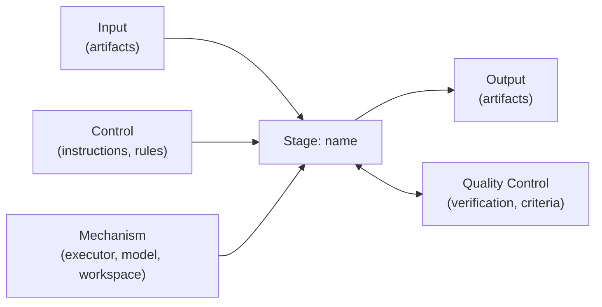

# Rule: pipeline stage description (IDEF0 + Quality Control)

Every pipeline stage of the factory is described using the IDEF0/ICOM model extended with a Quality Control loop (ISO 9001:2015 process approach). A stage is a box that transforms Input into Output, governed by Controls, performed by Mechanisms, and verified by Quality Control.

## Required sections

Every stage description must contain:

1. **Purpose** — what the stage transforms and why it exists (one paragraph)
2. **Input** — artifacts consumed; each with a verifiable precondition
3. **Output** — artifacts produced; each machine-verifiable
4. **Control** — instructions governing execution: prompts, rules, best practices, hooks
5. **Mechanism** — executor type (`api` / `agent-cli`), model and settings, workspace requirements
6. **Quality Control** — the ordered `verify` check list from the stage manifest. Four check types:
   - **built-in declarative** — engine-implemented checks (`files_exist`, schema validation, ...)
   - **`command`** — any executable (any language), contract: exit code 0 = pass; optional structured findings (JSON) for tracker reports
   - **`external`** — asynchronous third-party verification: submit (or rely on the branch push trigger) + poll with interval and timeout; e.g. CI checks on the task branch via the tracker/SCM port, SonarQube quality gate. No webhooks — the factory has no inbound HTTP; results are polled
   - **`judge`** — LLM-as-judge via the `JudgeVoter` port: acceptance-criteria file + model settings, structured verdict (`passed`, `findings[]`); acceptance criteria must be concrete and checkable; use multiple votes for critical stages
   Order cheap deterministic checks first (fail fast), `judge` last; any failure fails the stage verification
7. **Failure & Escalation** — attempt limit and the two failure classes:
   - **Quality failure** (an explicit non-pass verdict: red tests, failed quality gate, judge findings) — collect the check's findings and re-run the stage with them as feedback context (same working copy for `agent-cli`, findings appended for `api`), attempt +1; when attempts are exhausted, escalate with the full findings history of all attempts
   - **Infrastructure failure** (a verdict cannot be obtained: network errors, 5xx, service unavailable) — retry the check itself (Resilience4j), no stage attempt is burned; if the service stays down, escalate with a "cannot verify: check X unavailable" report instead of a quality report
   - An `external` poll timeout counts as a quality failure by default (configurable per check)
8. **Advancement** — `auto` (default: proceed to the next stage after verification passes) or `manual` (debug checkpoint: commit artifacts and state, set the task to a waiting status in the tracker with a stage summary, resume when a human returns the task to work — same protocol as escalation, any instance may resume)

## Diagram template

Every stage description includes a Mermaid diagram following this shape:

## Rules

- Input and Output must be **machine-verifiable**: "good code" is not verifiable, "all `verify` checks pass" is; a `judge` acceptance criterion counts as verifiable only if it is concrete enough to grade consistently
- A stage must be resumable: given its Input artifacts and the task state file, any factory instance can execute it
- Controls are data (markdown prompts, rule files), not code inside the engine
- Only quality failures burn stage attempts; infrastructure failures of the checks themselves never do
- Every attempt — including failed ones — is committed to the task branch with an updated state file, so any instance can resume mid-retry
- Quality Control failures count against the stage attempt limit; exceeding it triggers escalation
- When splitting a stage, each new stage gets a full description — no implicit contracts between halves
