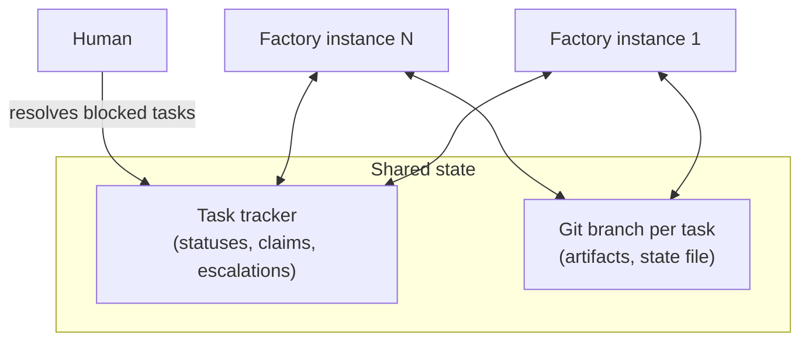
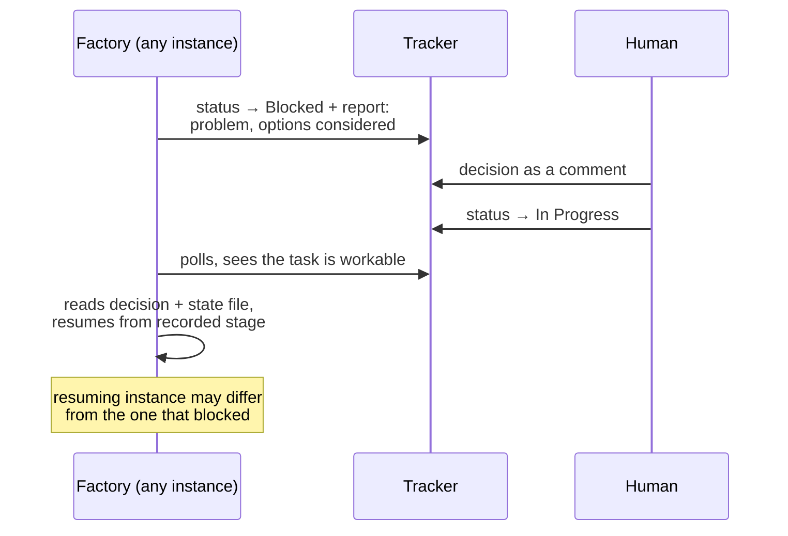

# Gnomish Factory


An external orchestrator where AI agents — the gnomes — pick tasks from a task tracker and drive them through a development pipeline autonomously. Humans are exception handlers, not participants: they step in only when a task is blocked or the gnomes cannot choose between alternatives.

> **Status: walking skeleton.** Requirements and architecture are shaped through [OpenSpec](openspec); the build, quality gates, and a minimal bootable application exist (see [Building](#building)). The domain core is in place — `.gnomish/` pipeline-config loading and the stage engine (a pure, reentrant orchestrator of the QC loop, driven entirely through ports). Its first non-fake adapters have landed as a CLI: [`gnomish run`](#running-a-task) drives a single task through the whole quality-control cycle, with real `agent-cli` and judge adapters by default and a git-backed task workflow — task branch, dedicated worktree, resume — as the normal mode. The tracker and non-CLI AI-provider adapters are not built yet.

## How it works

Factory instances are **stateless**. Several independent instances can serve the same project concurrently — everything they need lives in two shared systems:

- the **task tracker** holds coordination state: task statuses, claims, escalation reports, human decisions;
- the **task's git branch** holds working state: stage artifacts and a state file (pipeline position, attempt counters).



The factory core is a generic engine built on **ports and adapters**:

| Port        | Purpose                                                    | Adapters                                                                                        |
|-------------|------------------------------------------------------------|-------------------------------------------------------------------------------------------------|
| Tracker     | claim tasks, update statuses, post reports                 | GitHub, Jira, ...                                                                               |
| AI provider | call models from different vendors with per-stage settings | Claude, OpenAI, Gemini, Ollama, ...                                                             |
| Executor    | perform a stage                                            | `api` (direct model call), `agent-cli` (coding agent as subprocess in an isolated working copy) |

## Pipeline stages

A task travels through a pipeline of stages. Stages are **declarative** and live in the target project's repository under `.gnomish/` — adding or splitting a stage is a configuration change, not a factory release:

```
.gnomish/
  config.yaml          # schemaVersion + default autonomy limit (attempt limit; budgets are a later change)
  pipeline.yaml        # stage order — an explicit list of stage names
  stages/<name>/
    stage.yaml         # manifest: purpose, inputs, outputs, executor (type + model + settings), verify checks, advancement
    instructions.md    # prompts, rules, best practices (referenced by the manifest)
    acceptance.md      # acceptance criteria for an LLM-judge check, referenced by path per check (when the stage uses them)
```

Every stage follows the IDEF0/ICOM model extended with a Quality Control loop (ISO 9001:2015 process approach) — and every element is machine-verifiable:


Stage verification is an ordered list of checks in the manifest — engine built-ins (file/schema checks), `command` (any executable, exit-code contract), `external` (asynchronous third-party verification polled with a timeout: CI checks on the task branch, SonarQube quality gate), and `judge` (LLM-as-judge grading against acceptance criteria, returning a structured verdict). Cheap deterministic checks run first; any failure fails the stage. A **quality failure** (a non-pass verdict) feeds the check's findings back into a re-run of the stage — the gnome gets told what to fix — until the attempt limit is reached, at which point the task escalates with the findings history of all attempts. An **infrastructure failure** (the check itself cannot produce a verdict) is retried at the check level without burning attempts. Every attempt, including failed ones, is committed to the task branch, so any instance can resume mid-retry.

Every stage also declares an **advancement mode**: `auto` (proceed to the next stage once verification passes) or `manual` — a debug checkpoint where the factory commits the stage artifacts, pauses the task via a tracker status, and resumes when a human returns the task to work (the same protocol as escalation, so any instance can pick it up).

Full artifacts (specs, code, test reports, state) stay in the git branch; the tracker receives short human-readable progress summaries with links.

## Escalation

The factory never waits for a human in-band. When a stage exhausts its attempt limit or hits an undecidable choice, it escalates and moves on to other tasks:



## Running a task

`gnomish run` is the first way to drive the engine for real. It executes **one task through one pipeline**. By default it is manifest-driven: real `agent-cli` and judge adapters run each stage, with no AI provider outside them (see [Manifest-driven run and `--interactive` overrides](#manifest-driven-run-and---interactive-overrides) below). Passing `--interactive` swaps in a human standing in for the gnome instead: you read each stage briefing and press Enter to complete it, answer the verify checks, and resolve escalations at the prompt. It doubles as the pipeline author's dry-run tool for a project's `.gnomish/`, and as the harness that proves the engine's port shapes survive contact with real adapters.

There is no launcher script yet; run it through the boot jar (or `bootRun`) and pass the task flags. With **no** run flag present the application keeps its plain boot-and-exit behavior. `run` is the implicit default subcommand — `gnomish --task=... --dir=...` and `gnomish run --task=... --dir=...` are equivalent — so existing invocations keep working; see [Inspecting tasks](#inspecting-tasks) for the other subcommands.

```bash
# via the boot jar (./gradlew build produces it under build/libs/)
java -jar build/libs/*.jar --task="fix the flaky login spec" --dir=/path/to/target-repo

# or straight from Gradle
./gradlew bootRun --args='--task="fix the flaky login spec" --dir=/path/to/target-repo'
```

Flags use Spring's `--key=value` form (quote values with spaces):

| Flag                        | Required             | Default            | Meaning                                                                                          |
|------------------------------|-----------------------|---------------------|---------------------------------------------------------------------------------------------------|
| `--dir=<path>`               | no                    | `.` (cwd)           | project clone directory **and** the `.gnomish/` pipeline location (renamed from `--project`)      |
| `--task="<text>"`            | one of these two\*    | —                   | task description inline (first line → title, rest → body); mutually exclusive with `--task-file` |
| `--task-file=<path>`         | one of these two\*    | —                   | task description read from a file                                                                 |
| `--task-id=<id>`             | no                    | auto-generated      | override the generated id (`[A-Za-z0-9_-]+`); makes logs and JSON stable                          |
| `--from-stage=<name>`        | no                    | first stage         | start partway through the pipeline, skipping earlier stages' checks                               |
| `--mode=git\|in-place`       | no                    | `git`               | task workflow mode — see [Git mode vs. in-place mode](#git-mode-vs-in-place-mode)                 |
| `--base=<ref>`                | no                    | current clone state | git mode only; override the branch base                                                           |
| `--resume=<task>`            | no                    | —                   | git mode only; resume a task by id instead of starting a new one — see [Resuming a task](#resuming-a-task) |
| `--discard-work`             | no                    | `false`             | git mode only; requires `--resume`; discards the interrupted round instead of salvaging it        |
| `--interactive[=executor\|judge]` | no               | —                   | human plays a role instead of the real adapter — see below                                        |

\* Exactly one of `--task`/`--task-file` is required unless `--resume` is given, in which case none of `--task`/`--task-file`/`--task-id`/`--from-stage` may be used. `--base`, `--resume`, and `--discard-work` are rejected together with `--mode=in-place` (exit code 2, usage error).

At **any** prompt you can type `status` or `status --json` to print the live task report, and **Ctrl-D** is always a safe exit. After every attempt the operator gets a one-line summary; a full report prints at the end. The runner writes nothing inside the project clone — logs, findings, and (in git mode) the task workspace all live outside it.

### Git mode vs. in-place mode

**Git mode (`--mode=git`, the default)** treats `--dir` as the project clone and never mutates it directly. It creates a task branch `gnomish/<sanitized-task-id>`, checks it out into a dedicated worktree, and commits the state file and stage artifacts after every round, pushing best-effort as it goes. The branch name and worktree path print upfront so you can inspect progress with plain `git` commands while the run is in flight. This is what makes a task **resumable**: a died process, a returned escalation, or a paused checkpoint can all be picked up later — by the same machine or another one — from the last committed round.

Worktrees live outside the clone, under `~/.gnomish/worktrees/<project-name>/<sanitized-task-id>/`, where `<project-name>` is the clone directory's own name (from `--dir`) — so one factory instance can serve several projects without collisions. `git worktree prune` runs at every start. Cleanup depends on how the task ends: **completed** tasks have their worktree removed (the branch stays for history); **escalated** or **paused** tasks keep the worktree for a fast resume; **aborted** tasks always keep it, since it may hold the only copy of unsaved work.

**In-place mode (`--mode=in-place`)** is the preserved legacy behavior: no git, no worktree, in-memory state only, no resume — if the process dies, the task's progress is lost. It remains useful as a pipeline author's dry-run of a project's `.gnomish/` config in a scratch directory, where you don't want branches or worktrees created at all.

### Resuming a task

`gnomish run --dir <dir> --resume <task>` locates the task branch — checking the local repo first, then a remote-tracking branch, then falling back to a narrow fetch of exactly `gnomish/<task>` — and continues from its recorded state:

- **escalated** → re-opens the decision dialog;
- **paused** (manual checkpoint) → asks for confirmation before proceeding;
- **no recorded outcome** (the process died mid-round) → continues from the recorded position; any uncommitted work from the interrupted round is salvaged into a service commit by default, or discarded and the round replayed if `--discard-work` is given;
- **completed** → reports the outcome and exits without further work.

If the local branch and its remote counterpart have diverged, resume needs a human: equal state continues normally, a local branch behind origin fast-forwards (discarding any uncommitted leftovers), and a local branch ahead of origin continues from local — but a true divergence is a hard stop (exit code 5, `DivergedBranchException`) rather than an automatic merge.

### Exit codes

The process exit code reports the outcome — anything `>= 10` means the engine reached a legitimate terminal state:

| Code | Meaning                                                   |
|------|------------------------------------------------------------|
| 0    | completed                                                   |
| 1    | internal error                                              |
| 2    | usage error                                                 |
| 3    | pipeline load failure                                       |
| 4    | stdin exhausted mid-stage (Ctrl-D at an ordinary prompt)    |
| 5    | diverged branch on resume — needs a human to reconcile      |
| 6    | task not found (`status`/`usage` only — no `gnomish/<task>` branch) |
| 10   | escalated (attempts exhausted / undecidable)                |
| 11   | paused at a manual checkpoint                               |
| 12   | aborted                                                     |

### Merging a gnome's task branch

On completion, the factory strips `.gnomish-task/` from the branch tip in a final cleanup commit, but every round leading up to it stays reachable in the branch history as an audit trail — that's what makes resume and escalation reviewable. That history is internal bookkeeping, not something a target project wants in its permanent log. **Squash-merge** gnome PRs into the target project's mainline so only the final clean diff lands there and the round-by-round journal stays behind on the (eventually discarded) task branch.

### Inspecting tasks

Two read-only subcommands complement `run`: `gnomish status` reports a task's current state from its branch, and `gnomish usage` reports its resource/cost usage. Both work without a tracker, reading directly from the git branch the same way `--resume` does — via `git show`/git history only, never a worktree checkout or a local branch creation (the one exception is a narrow fetch fallback, described below). Neither ever mutates the clone. Unlike `run`, `--dir=<path>` has **no default** for either subcommand — omitting it is a usage error (exit code 2).

#### `gnomish status`

```bash
gnomish status --dir=<clone-dir> [<task>] [--json]
```

- **List mode** (`<task>` omitted): prints a table over all `gnomish/*` branches, local and remote-tracking alike, deduplicated per task (the local tip wins when both exist).

  | Column   | Meaning                        |
  |----------|---------------------------------|
  | task     | task id                         |
  | stage    | current pipeline stage          |
  | attempts | attempts recorded so far        |
  | outcome  | last recorded outcome           |

- **Single-task mode** (`<task>` given): reads `.gnomish-task/` straight off `gnomish/<task>` via `git show` — no worktree is materialized, no checkout happens, no local branch is created. If the branch isn't already known locally or as a remote-tracking ref, `status` falls back to a narrow fetch of exactly `gnomish/<task>`. Output is the same StatusReport `"version": 1` contract used by the live in-process `status`/`status --json` prompt commands (see [Running a task](#running-a-task) above), plus the task's worktree path if one currently exists.
- **Task not found**: if no `gnomish/<task>` branch exists — typically because its PR was already squash-merged and the branch deleted, see [Merging a gnome's task branch](#merging-a-gnomes-task-branch) — `status` prints `task not found: <task>` and exits with code 6. This is a normal, expected outcome of a task's lifecycle, not an error to investigate.

#### `gnomish usage`

```bash
gnomish usage --dir=<clone-dir> <task> [--json]
```

Unlike `status`, `<task>` is mandatory here — there is no list mode.

`usage` reconstructs per-stage/per-round resource usage by walking the git history of `.gnomish-task/state.json` on the task branch, chronologically from oldest to newest — not by parsing commit messages. A commit counts as a "round record" when its `state.json` shows a new attempt (the attempts list grew, or the pipeline position advanced to a new stage visit); salvage, `task.json`, and cleanup commits are naturally skipped since they don't add a new attempt record. `usage` only makes sense in git mode — a `--mode=in-place` run has no branch or history to reconstruct from.

**Text output** (default) is a stage/round table plus totals (wall time, tokens).

**JSON output** (`--json`) exposes full granularity under its own `"version": 1` mini-contract — a separate schema from the `status` StatusReport, not reused:

```json
{
  "version": 1,
  "taskId": "<string>",
  "rows": [
    {
      "stage": "<name>",
      "round": 1,
      "result": "<string>",
      "startedAt": "<ISO-8601 UTC>",
      "checks": [ "..." ],
      "executorUsage": {
        "wallMillis": 0,
        "tokensByModel": {
          "<model>": { "input": 0, "output": 0, "cacheCreation": 0, "cacheRead": 0 }
        },
        "byTool": [ "..." ]
      },
      "judgeUsage": { "perVote": [ "..." ] }
    }
  ],
  "totals": {
    "wallMillis": 0,
    "tokensByModel": {
      "<model>": { "input": 0, "output": 0, "cacheCreation": 0, "cacheRead": 0 }
    },
    "byTool": []
  }
}
```

`totals.byTool` is always empty — totals aggregate executor usage only, not a per-tool breakdown.

**Task not found**: same as `status` — `usage` prints `task not found: <task>` and exits with code 6 when the branch is gone, which is normal after a squash-merged PR (see [Merging a gnome's task branch](#merging-a-gnomes-task-branch)), not a bug.

### Manifest-driven run and `--interactive` overrides

By default `gnomish run` is **manifest-driven, not interactive**: it reads the target project's `.gnomish/` pipeline and wires each stage's real adapter straight from the manifest — an `agent-cli` stage executor gets the CLI executor (a real `claude -p` subprocess per round), and every `judge` verify check gets the CLI judge, regardless of the stage's own executor type. This is the normal, paid mode, and starting a real agent round requires **no confirmation gate** by design — that is the tool's purpose, and the operator is present. `api` stages aren't supported yet and are rejected at startup (exit 3, before any dialog), naming the offending stage.

`--interactive` overrides the wiring, entirely or per role:

| Flag                     | Effect                                                                                                            |
|--------------------------|-------------------------------------------------------------------------------------------------------------------|
| *(absent)*               | manifest-driven: real CLI executor + real CLI judge (default, paid)                                               |
| `--interactive`          | full add-manual-run behavior: human plays both executor and judge                                                 |
| `--interactive=executor` | human plays the executor; judge stays the real CLI judge — verdict calibration                                    |
| `--interactive=judge`    | human plays the judge; executor stays the real CLI agent — judge-prompt debugging without paying for agent rounds |

`--interactive` may be given only once. External checks are always interactive regardless of this flag.

### Manifest settings vs. installation properties

A stage's `executor.settings` (and a `judge` check's own `settings`) accept exactly four keys — `allowedTools`, `disallowedTools`, `maxTurns`, `roundTimeout` — validated at startup before any dialog; an unrecognized key or malformed value is a startup error naming the stage/check and the key. These are portable, repo-level settings that travel with the pipeline definition.

Installation-level configuration — things that are true of *this machine*, not the repo — lives in `factory.*` application properties instead, never the manifest:

| Property                            | Meaning                                                              |
|-------------------------------------|----------------------------------------------------------------------|
| `factory.agent-cli-binary`          | path or name of the agent CLI binary (default: `claude` on `PATH`)   |
| `factory.agent-cli-env-passthrough` | environment variable names passed through to the spawned CLI process |

### Ollama E2E prerequisite

`./gradlew ollamaE2eTest` runs a local E2E suite that points the real `claude` CLI at a locally running Ollama instance (native Anthropic-compatible API since Ollama v0.14, via `ANTHROPIC_BASE_URL`) and drives a trivial stage through `gnomish run` end to end. It's excluded from `check`/`test`/`build` and is a native dev-machine prerequisite, not a Testcontainers layer — dockerized Ollama has no Metal access on macOS and is too slow. Individual specs skip cleanly with a clear message when Ollama or `claude` isn't available, so it's safe to run without any setup.

## Tech stack

Java 25 LTS on virtual threads, built with Gradle 9.x. Minimal Spring Boot (`spring-boot-starter` only) provides dependency injection, configuration binding, and Logback logging — no web server, no database. Tracker and AI provider calls go through the async `java.net.http.HttpClient` guarded by Resilience4j; agent CLIs and `git` run as subprocesses. Tests are written in Spock 2 with WireMock for API contracts, JaCoCo + PIT for coverage and mutation testing, and Testcontainers for the E2E layer. Compile-time quality is enforced by Error Prone + NullAway (JSpecify nullness, unused-code checks as errors), the dependency-analysis plugin, and a Spotless format gate. CI additionally runs CodeQL, OSV-Scanner, and Gitleaks for security scanning. Full rationale: [docs/adr/0001-tech-stack.md](docs/adr/0001-tech-stack.md).

## Building

<!-- implements UX1 of add-project-skeleton -->

The only prerequisite is a JDK capable of running the Gradle wrapper. Gradle itself (9.6.1) comes from the wrapper, and the Java 25 toolchain is auto-provisioned by the foojay resolver on first build — no local JDK 25 installation is needed. Docker is **not** required yet; it becomes a prerequisite when the Testcontainers E2E layer arrives (see ADR 0001).

One command answers "is my change OK?":

```bash
./gradlew check
```

It compiles with Error Prone + NullAway, runs the Spock suite, generates JaCoCo coverage reports, enforces the PIT mutation gate (100%), verifies Spotless formatting, and runs the dependency-analysis `buildHealth` check. Reports land in `build/reports/jacoco/test/html/index.html` and `build/reports/pitest/index.html`. `./gradlew build` additionally produces the boot jar.

Formatting is applied automatically: a Claude Code hook formats files as the agent edits them, and a git pre-commit hook (installed into `.git/hooks/` by any `./gradlew check` run) formats staged files as a safety net. Manual fallback: `./gradlew spotlessApply`.

Dependency locking is active — after changing dependencies, run `./gradlew check --write-locks` and commit the updated lockfiles (they keep builds reproducible and feed OSV-Scanner).

CI (GitHub Actions) runs `check`, CodeQL, OSV-Scanner, and Gitleaks on every push and pull request once the GitHub remote exists. After creating the remote, enable **Secret scanning** and **Push protection** in the repository settings.

## Development process

The project itself is developed AI-first with [OpenSpec](openspec): `/opsx:propose → /opsx:apply → /opsx:archive`, with `/opsx:explore` for complex topics. Process rules — traceability, proposal format, stage description format, diagram conventions — live in [.claude/rules](.claude/rules).

Documentation language is English. Diagrams are Mermaid.
