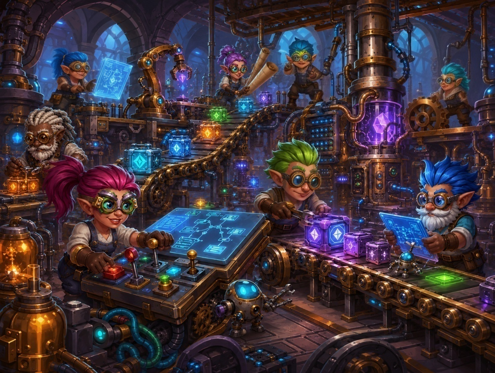
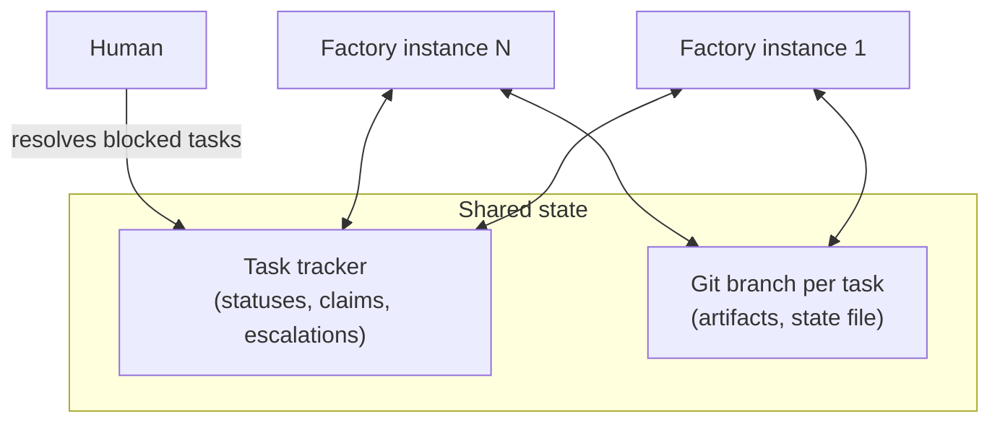
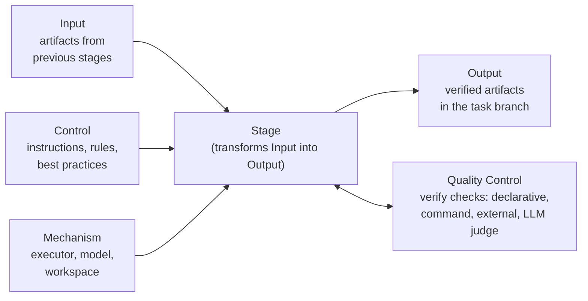
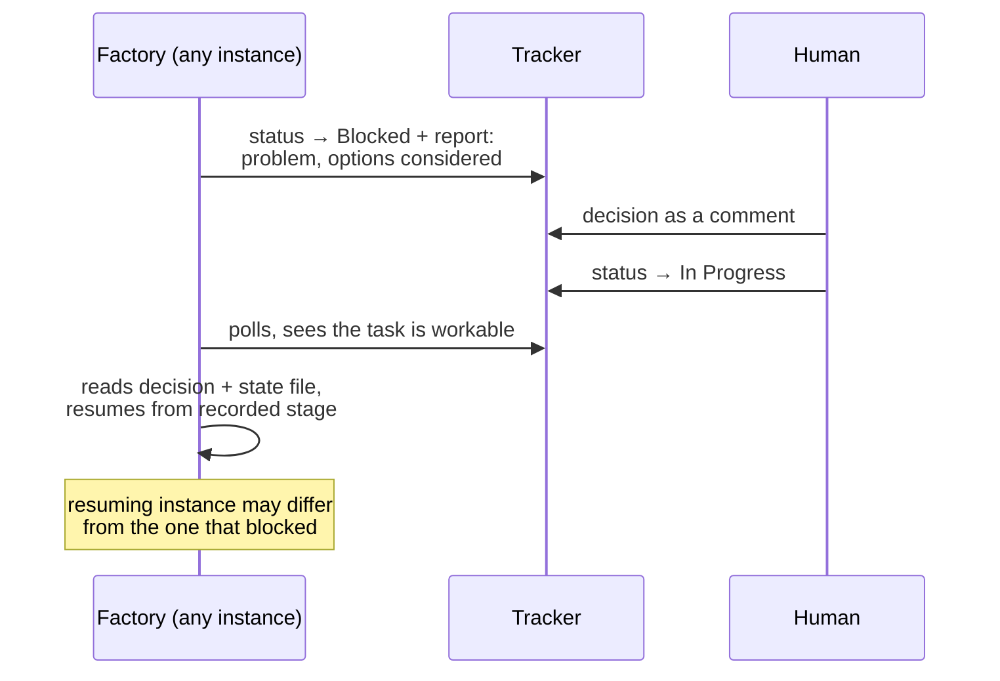

# Gnomish Factory



An external orchestrator where AI agents — the gnomes — pick tasks from a task tracker and drive them through a development pipeline autonomously. Humans are exception handlers, not participants: they step in only when a task is blocked or the gnomes cannot choose between alternatives.

> **Status: walking skeleton.** Requirements and architecture are shaped through [OpenSpec](openspec); the build, quality gates, and a minimal bootable application exist (see [Building](#building)). The domain core is taking shape — `.gnomish/` pipeline-config loading and the stage engine (a pure, reentrant orchestrator of the QC loop, driven entirely through ports and exercised in-memory with fakes) are in place; the real adapters (tracker, executors, git) are not built yet.

## How it works

Factory instances are **stateless**. Several independent instances can serve the same project concurrently — everything they need lives in two shared systems:

- the **task tracker** holds coordination state: task statuses, claims, escalation reports, human decisions;
- the **task's git branch** holds working state: stage artifacts and a state file (pipeline position, attempt counters).



The factory core is a generic engine built on **ports and adapters**:

| Port        | Purpose                                                    | Adapters                                                                                        |
|-------------|------------------------------------------------------------|-------------------------------------------------------------------------------------------------|
| Tracker     | claim tasks, update statuses, post reports                 | GitHub, Jira, ...                                                                               |
| AI provider | call models from different vendors with per-stage settings | Claude, OpenAI, Gemini, Ollama, ...                                                             |
| Executor    | perform a stage                                            | `api` (direct model call), `agent-cli` (coding agent as subprocess in an isolated working copy) |

## Pipeline stages

A task travels through a pipeline of stages. Stages are **declarative** and live in the target project's repository under `.gnomish/` — adding or splitting a stage is a configuration change, not a factory release:

```
.gnomish/
  config.yaml          # schemaVersion + default autonomy limit (attempt limit; budgets are a later change)
  pipeline.yaml        # stage order — an explicit list of stage names
  stages/<name>/
    stage.yaml         # manifest: purpose, inputs, outputs, executor (type + model + settings), verify checks, advancement
    instructions.md    # prompts, rules, best practices (referenced by the manifest)
    acceptance.md      # acceptance criteria for an LLM-judge check, referenced by path per check (when the stage uses them)
```

Every stage follows the IDEF0/ICOM model extended with a Quality Control loop (ISO 9001:2015 process approach) — and every element is machine-verifiable:



Stage verification is an ordered list of checks in the manifest — engine built-ins (file/schema checks), `command` (any executable, exit-code contract), `external` (asynchronous third-party verification polled with a timeout: CI checks on the task branch, SonarQube quality gate), and `judge` (LLM-as-judge grading against acceptance criteria, returning a structured verdict). Cheap deterministic checks run first; any failure fails the stage. A **quality failure** (a non-pass verdict) feeds the check's findings back into a re-run of the stage — the gnome gets told what to fix — until the attempt limit is reached, at which point the task escalates with the findings history of all attempts. An **infrastructure failure** (the check itself cannot produce a verdict) is retried at the check level without burning attempts. Every attempt, including failed ones, is committed to the task branch, so any instance can resume mid-retry.

Every stage also declares an **advancement mode**: `auto` (proceed to the next stage once verification passes) or `manual` — a debug checkpoint where the factory commits the stage artifacts, pauses the task via a tracker status, and resumes when a human returns the task to work (the same protocol as escalation, so any instance can pick it up).

Full artifacts (specs, code, test reports, state) stay in the git branch; the tracker receives short human-readable progress summaries with links.

## Escalation

The factory never waits for a human in-band. When a stage exhausts its attempt limit or hits an undecidable choice, it escalates and moves on to other tasks:



## Tech stack

Java 25 LTS on virtual threads, built with Gradle 9.x. Minimal Spring Boot (`spring-boot-starter` only) provides dependency injection, configuration binding, and Logback logging — no web server, no database. Tracker and AI provider calls go through the async `java.net.http.HttpClient` guarded by Resilience4j; agent CLIs and `git` run as subprocesses. Tests are written in Spock 2 with WireMock for API contracts, JaCoCo + PIT for coverage and mutation testing, and Testcontainers for the E2E layer. Compile-time quality is enforced by Error Prone + NullAway (JSpecify nullness, unused-code checks as errors), the dependency-analysis plugin, and a Spotless format gate. CI additionally runs CodeQL, OSV-Scanner, and Gitleaks for security scanning. Full rationale: [docs/adr/0001-tech-stack.md](docs/adr/0001-tech-stack.md).

## Building

<!-- implements UX1 of add-project-skeleton -->

The only prerequisite is a JDK capable of running the Gradle wrapper. Gradle itself (9.6.1) comes from the wrapper, and the Java 25 toolchain is auto-provisioned by the foojay resolver on first build — no local JDK 25 installation is needed. Docker is **not** required yet; it becomes a prerequisite when the Testcontainers E2E layer arrives (see ADR 0001).

One command answers "is my change OK?":

```bash
./gradlew check
```

It compiles with Error Prone + NullAway, runs the Spock suite, generates JaCoCo coverage reports, enforces the PIT mutation gate (100%), verifies Spotless formatting, and runs the dependency-analysis `buildHealth` check. Reports land in `build/reports/jacoco/test/html/index.html` and `build/reports/pitest/index.html`. `./gradlew build` additionally produces the boot jar.

Formatting is applied automatically: a Claude Code hook formats files as the agent edits them, and a git pre-commit hook (installed into `.git/hooks/` by any `./gradlew check` run) formats staged files as a safety net. Manual fallback: `./gradlew spotlessApply`.

Dependency locking is active — after changing dependencies, run `./gradlew check --write-locks` and commit the updated lockfiles (they keep builds reproducible and feed OSV-Scanner).

CI (GitHub Actions) runs `check`, CodeQL, OSV-Scanner, and Gitleaks on every push and pull request once the GitHub remote exists. After creating the remote, enable **Secret scanning** and **Push protection** in the repository settings.

## Development process

The project itself is developed AI-first with [OpenSpec](openspec): `/opsx:propose → /opsx:apply → /opsx:archive`, with `/opsx:explore` for complex topics. Process rules — traceability, proposal format, stage description format, diagram conventions — live in [.claude/rules](.claude/rules).

Documentation language is English. Diagrams are Mermaid.
