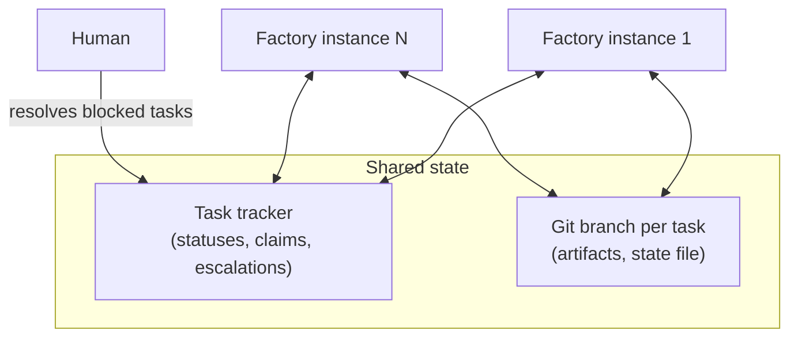
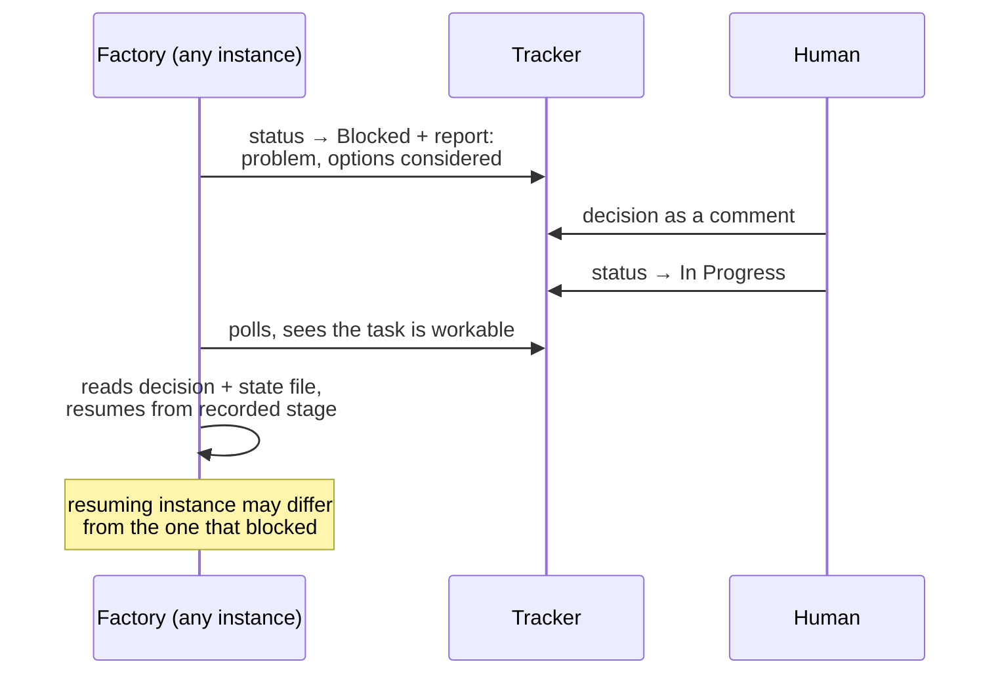

# Gnomish Factory


Gnomish Factory is an external, stateless **AI agent orchestrator** designed for **autonomous software development**. AI coding agents — the gnomes — autonomously pick tasks from a tracker (GitHub, Jira) and drive them through a multi-stage development pipeline. Humans function strictly as exception handlers, not active participants: they step in only when a task is blocked or the agents hit an undecidable choice.

Built on a pure ports-and-adapters architecture (Java 25), the factory provides a framework for **multi-agent engineering**. It combines declarative pipeline stages, self-correcting quality control loops (**LLM-as-a-judge**), and deterministic verification gates inside an isolated container sandbox, making **autonomous agentic workflows** safe, verifiable, and fully resumable.

> **Status: runs end to end and feeds itself from the tracker, but is not feature-complete yet.** Requirements and architecture are shaped through [OpenSpec](openspec); the build, quality gates, and a minimal bootable application exist (see [Building](#building)). What works today:
>
> - **Domain core** — `.gnomish/` pipeline-config loading and the stage engine: a pure, reentrant orchestrator of the QC loop, driven entirely through ports.
> - **Unattended CLI** — [`gnomish run`](#using-the-factory) drives a single task through the whole quality-control cycle with real `agent-cli` and judge adapters and a git-backed task workflow: task branch, dedicated worktree, resume.
> - **Tracker workflow** — `gnomish take` layers a tracker-driven workflow on top, with a GitHub adapter (plus an in-memory reference used for tests); the task lifecycle is enforced one-way (`Ready → Working → Finished`; a reopened finished task is declined, never re-claimed).
> - **Autonomous daemon** — `gnomish serve` feeds itself from the ready queue under a WIP-bounded, N-slot scheduler.
> - **Container sandbox** — gnome processes execute in an ephemeral container box by default; host mode is the opt-in legacy.
> - **Multi-instance safety** — several instances share one project: claim leases with heartbeats, a reaper for dead claims, takeover, zombie fencing.
> - **Read-only surfaces** — `status`, `usage`, a tracker `board` view, and an HTML `dashboard`.
>
> Not built yet: non-CLI AI-provider adapters (the `api` executor).

## Contents

- [How it works](#how-it-works)
- [Pipeline stages](#pipeline-stages)
- [Escalation](#escalation)
- [Using the factory](#using-the-factory)
- [Tech stack](#tech-stack)
- [Project structure](#project-structure)
- [Building](#building)
- [Documentation](#documentation)
- [Development process](#development-process)

## How it works

Factory instances are **stateless**. Several independent instances can serve the same project concurrently — everything they need lives in two shared systems:

- the **task tracker** holds coordination state: task statuses, claims, escalation reports, human decisions;
- the **task's git branch** holds working state: stage artifacts and a state file (pipeline position, attempt counters).


```mermaid
flowchart TB
    subgraph shared["Shared state"]
        Tracker["Task tracker<br/>(statuses, claims, escalations)"]
        Git["Git branch per task<br/>(artifacts, state file)"]
    end

    F1["Factory instance 1"] <--> Tracker
    F2["Factory instance N"] <--> Tracker
    F1 <--> Git
    F2 <--> Git

    Human["Human"] -->|resolves blocked tasks| Tracker
```

The factory core is a generic engine built on **ports and adapters**:

| Port        | Purpose                                                    | Adapters                                                                                        |
|-------------|------------------------------------------------------------|-------------------------------------------------------------------------------------------------|
| Tracker     | claim tasks, update statuses, post reports                 | GitHub (plus an in-memory reference adapter for tests); Jira and others are future work         |
| AI provider | call models from different vendors with per-stage settings | Claude, OpenAI, Gemini, Ollama, ...                                                             |
| Executor    | perform a stage                                            | `api` (direct model call), `agent-cli` (coding agent as subprocess in an isolated working copy) |

## Pipeline stages

A task travels through a pipeline of stages. Stages are **declarative** and live in the target project's repository under `.gnomish/` — adding or splitting a stage is a configuration change, not a factory release:

```
.gnomish/
  config.yaml          # schemaVersion + default autonomy limit (attempt limit) + tracker section (for take/serve)
  pipeline.yaml        # stage order — an explicit list of stage names
  stages/<name>/
    stage.yaml         # manifest: purpose, inputs, outputs, executor (type + model + settings), verify checks, advancement
    instructions.md    # prompts, rules, best practices (referenced by the manifest)
    acceptance.md      # acceptance criteria for an LLM-judge check, referenced by path per check (when the stage uses them)
```

Every stage follows the IDEF0/ICOM model extended with a Quality Control loop (ISO 9001:2015 process approach) — and every element is machine-verifiable:


Stage verification is an ordered list of checks in the manifest — engine built-ins (file/schema checks), `command` (any executable, exit-code contract), `external` (asynchronous third-party verification polled with a timeout: CI checks on the task branch, SonarQube quality gate), and `judge` (LLM-as-judge grading against acceptance criteria, returning a structured verdict). Cheap deterministic checks run first; any failure fails the stage. A **quality failure** (a non-pass verdict) feeds the check's findings back into a re-run of the stage — the gnome gets told what to fix — until the attempt limit is reached, at which point the task escalates with the findings history of all attempts. An **infrastructure failure** (the check itself cannot produce a verdict) is retried at the check level without burning attempts. Every attempt, including failed ones, is committed to the task branch, so any instance can resume mid-retry.

Every stage also declares an **advancement mode**: `auto` (proceed to the next stage once verification passes) or `manual` — a debug checkpoint where the factory commits the stage artifacts, pauses the task via a tracker status, and resumes when a human returns the task to work (the same protocol as escalation, so any instance can pick it up).

Full artifacts (specs, code, test reports, state) stay in the git branch; the tracker receives short human-readable progress summaries with links.

## Escalation

The factory never waits for a human in-band. When a stage exhausts its attempt limit or hits an undecidable choice, it escalates and moves on to other tasks:


```mermaid
sequenceDiagram
    participant F as Factory (any instance)
    participant T as Tracker
    participant H as Human

    F->>T: status → Blocked + report:<br/>problem, options considered
    H->>T: decision as a comment
    H->>T: status → In Progress
    F->>T: polls, sees the task is workable
    F->>F: reads decision + state file,<br/>resumes from recorded stage
    Note over F: resuming instance may differ<br/>from the one that blocked
```

## Using the factory

The CLI is one boot jar with seven subcommands; `run` is the implicit default when only flags are given. Each has its own reference guide:

| Command                    | What it does                                                                         | Reference                                                                            |
|----------------------------|--------------------------------------------------------------------------------------|--------------------------------------------------------------------------------------|
| `gnomish run`              | drive one ad-hoc task through the pipeline, no tracker                               | [`docs/guides/operator-guide-run.md`](docs/guides/operator-guide-run.md)             |
| `gnomish take`             | claim the head of the tracker's ready queue (or act on one issue by ref) and work it | [`docs/guides/operator-guide.md`](docs/guides/operator-guide.md)                     |
| `gnomish serve`            | autonomous daemon: feed from the ready queue under a WIP-bounded scheduler           | [`docs/guides/operator-guide-serve.md`](docs/guides/operator-guide-serve.md)         |
| `gnomish status` / `usage` | read-only task state and resource/cost usage, straight from the task branch          | [`docs/guides/operator-guide-inspect.md`](docs/guides/operator-guide-inspect.md)     |
| `gnomish board`            | Kanban view over the tracker's task states                                           | [`docs/guides/operator-guide.md`](docs/guides/operator-guide.md)                     |
| `gnomish dashboard`        | self-contained HTML page over the daemon snapshot, ledger, and board                 | [`docs/guides/operator-guide-dashboard.md`](docs/guides/operator-guide-dashboard.md) |

```bash
# one ad-hoc task, no tracker (git mode by default: task branch + worktree + resume)
java -jar build/libs/*.jar --task="fix the flaky login spec" --dir=/path/to/target-repo

# tracker-driven: claim the head of the ready queue, process one task, exit
java -jar build/libs/*.jar take --dir=/path/to/target-repo
```

**`run`** executes one task through one pipeline. By default it is manifest-driven — real `agent-cli` and judge adapters, no confirmation gate; `--interactive` swaps a human into either role (pipeline dry-runs, judge-prompt debugging). Git mode is the default and makes the task resumable from its branch by any instance; exit codes `>= 10` are legitimate terminal states. Squash-merge a completed task's PR so the round-by-round journal stays behind on the task branch.

**`take`** gets the task from a GitHub issue labeled `gnomish:ready` instead of a flag, and reports back on the issue thread — claim, progress, decisions, and outcome as comments and label transitions. It requires a `tracker` section in the target project's `.gnomish/config.yaml` plus a `GNOMISH_GITHUB_TOKEN` environment variable on the factory machine — never in yaml, never visible to the gnome. The lifecycle is one-way (`Ready → Working → Finished`); a reopened finished task is declined with a pointer to file a new one. Batch mode (`take <ref> <ref> ...`), `--takeover` for a stuck claim, and the full flag/exit-code reference live in the guides.

**Where gnomes execute**: by default each task runs in an ephemeral container box with an egress allowlist; host execution is the opt-in legacy mode. Configuration, image contract, and the threat model: [`docs/guides/operator-guide-sandbox.md`](docs/guides/operator-guide-sandbox.md) and [`docs/sandbox-threat-registry.md`](docs/sandbox-threat-registry.md). The security implications of autonomous runs — who may set the `ready` label — are in [`docs/guides/operator-guide-autonomy-gate.md`](docs/guides/operator-guide-autonomy-gate.md); monitoring an unattended daemon is [`docs/guides/operator-guide-observability.md`](docs/guides/operator-guide-observability.md).

Adapter authors implementing a new tracker should start from [`docs/guides/adapter-author-guide.md`](docs/guides/adapter-author-guide.md); the published plugin contract is [`gnomish-plugin-api`](gnomish-plugin-api/README.md). The project's ubiquitous language is defined in [`docs/glossary.md`](docs/glossary.md).

## Tech stack

Java 25 LTS on virtual threads, built with Gradle 9.x. Minimal Spring Boot (`spring-boot-starter` only) provides dependency injection, configuration binding, and Logback logging — no web server, no database. Tracker and AI provider calls go through the async `java.net.http.HttpClient` guarded by Resilience4j; agent CLIs and `git` run as subprocesses. Tests are written in Spock 2 with WireMock for API contracts, JaCoCo + PIT for coverage and mutation testing, and Testcontainers for the E2E layer. Compile-time quality is enforced by Error Prone + NullAway (JSpecify nullness, unused-code checks as errors), the dependency-analysis plugin, and a Spotless format gate. CI additionally runs CodeQL, OSV-Scanner, and Gitleaks for security scanning. Full rationale: [docs/adr/0001-tech-stack.md](docs/adr/0001-tech-stack.md).

## Project structure

The build is a layered Gradle module tree with a one-way dependency direction: `:domain` (the pure stage engine) at the bottom, `:application` (use cases + ports) above it, adapter modules realizing the ports, and `:bootstrap` as the composition root — the only module that knows which realization is bound to which port. The direction is enforced, not documented: `verifyModuleLayering`, the dependency-analysis plugin, and ArchUnit rules all fail `./gradlew check` naming the offending edge. The module map and diagram: [`docs/guides/developer-guide.md`](docs/guides/developer-guide.md#module-structure).

## Building

<!-- implements UX1 of add-project-skeleton -->

The only prerequisite is a JDK capable of running the Gradle wrapper. Gradle itself comes from the wrapper (its version is pinned there), and the Java 25 toolchain is auto-provisioned by the foojay resolver on first build — no local JDK 25 installation is needed. Docker is a prerequisite only for the sandbox and the Testcontainers E2E layer (see ADR 0001).

One command answers "is my change OK?":

```bash
./gradlew check
```

It compiles with Error Prone + NullAway, runs the Spock suite, generates JaCoCo coverage reports, enforces the PIT mutation gate (100%), verifies Spotless formatting, and runs the dependency-analysis `buildHealth` check. `./gradlew build` additionally produces the boot jar.

Everything beyond the one command — per-module verification and mutation scoping, dependency locking and verification (`--write-locks --write-verification-metadata sha256`), the Dependabot flow, the supply-chain threat model, and reproducing the OSV vulnerability gate locally — is in [`docs/guides/developer-guide.md`](docs/guides/developer-guide.md).

## Documentation

The full map of the project's documentation, by the question it answers:

| Document                                                                                                   | Read it when you want to...                                                                       |
|------------------------------------------------------------------------------------------------------------|---------------------------------------------------------------------------------------------------|
| [`docs/glossary.md`](docs/glossary.md)                                                                     | learn the project's terms — the normative dictionary every doc and class name follows; start here |
| [`docs/guides/operator-guide-run.md`](docs/guides/operator-guide-run.md)                                   | run one ad-hoc task through a pipeline (`gnomish run`): flags, git mode, resume, exit codes       |
| [`docs/guides/operator-guide.md`](docs/guides/operator-guide.md)                                           | run the factory against a tracker (`take`, `board`): labels, escalations, recovery                |
| [`docs/guides/operator-guide-serve.md`](docs/guides/operator-guide-serve.md)                               | run the autonomous daemon (`serve`): slots, write budget, cron operation                          |
| [`docs/guides/operator-guide-inspect.md`](docs/guides/operator-guide-inspect.md)                           | inspect a task from its branch (`status`, `usage`) and their JSON contracts                       |
| [`docs/guides/operator-guide-dashboard.md`](docs/guides/operator-guide-dashboard.md)                       | put the factory's state on a wall display (`dashboard`)                                           |
| [`docs/guides/operator-guide-observability.md`](docs/guides/operator-guide-observability.md)               | monitor an unattended daemon: snapshot, ledger, dead-man's-switch alerting                        |
| [`docs/guides/operator-guide-sandbox.md`](docs/guides/operator-guide-sandbox.md)                           | configure where gnome processes execute: container box, egress allowlist, host mode               |
| [`docs/guides/operator-guide-autonomy-gate.md`](docs/guides/operator-guide-autonomy-gate.md)               | understand who may mark a task ready — the security gate on autonomous execution                  |
| [`docs/guides/operator-guide-github-actions-check.md`](docs/guides/operator-guide-github-actions-check.md) | wire a stage's `external` check to GitHub Actions                                                 |
| [`docs/guides/developer-guide.md`](docs/guides/developer-guide.md)                                         | work on the factory itself: module map, build gates, dependency verification, OSV                 |
| [`docs/guides/adapter-author-guide.md`](docs/guides/adapter-author-guide.md)                               | implement a new tracker adapter against the plugin contract                                       |
| [`gnomish-plugin-api/README.md`](gnomish-plugin-api/README.md)                                             | see what the published plugin contract contains and how it is versioned                           |
| [`docs/adr/`](docs/adr)                                                                                    | read the recorded architecture decisions (tech stack, claim-lease protocol)                       |
| [`docs/sandbox-threat-registry.md`](docs/sandbox-threat-registry.md)                                       | consult the sandbox threat model, threat by numbered threat                                       |
| [`docs/examples/`](docs/examples)                                                                          | copy reference material: the board-bridge workflow, the sandbox image recipe                      |

## Development process

The project itself is developed AI-first with [OpenSpec](openspec): `/opsx:propose → /opsx:apply → /opsx:archive`, with `/opsx:explore` for complex topics. Process rules — traceability, proposal format, stage description format, diagram conventions — live in [.claude/rules](.claude/rules).

Documentation language is English. Diagrams are Mermaid.
