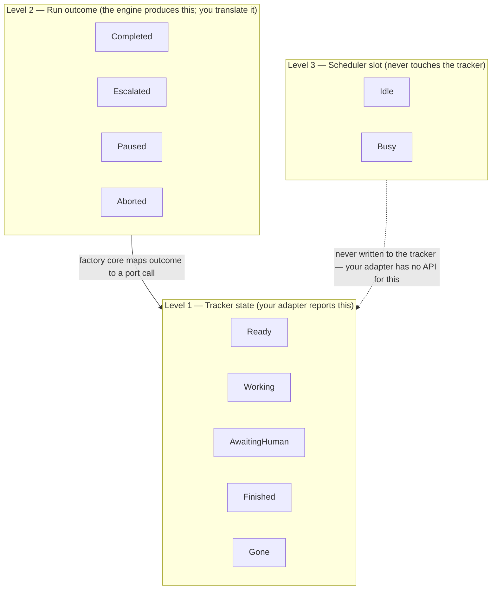
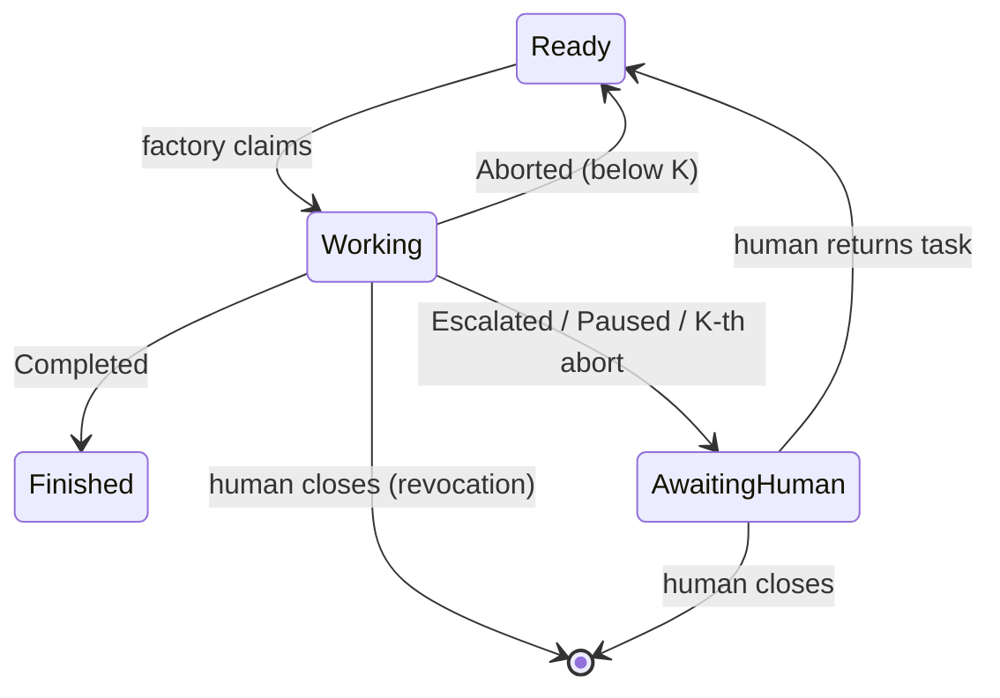

# Adapter author guide: building a `Tracker` port adapter

This guide teaches you how to implement a new `Tracker` port adapter for
Gnomish Factory — for example a Jira or Redmine binding. It is self-sufficient:
every obligation the port contract suite checks is stated here, so you should
not need to read factory core source to build a conforming adapter. Where the
guide names real classes it means them literally — you can navigate to them in
`src/main/java/com/github/oinsio/gnomish/` for the exact code, but you do not
need to in order to build your own adapter.

Two adapters ship today: `adapter/tracker/inmemory` (the executable reference,
`InMemoryTracker`) and `adapter/tracker/github` (the production GitHub
binding). Both live in `src/main/java/com/github/oinsio/gnomish/` alongside the
port itself in `app/port/tracker`. A third adapter — Redmine — is sketched
later in this guide purely as a worked design exercise; it is **not**
implemented.

## 1. The state dictionary and the three-level distinction

The factory reasons about a task at three levels that must never be confused.
Conflating them is the most common adapter-author mistake, so read this
section before touching any code.



- **Tracker state** (`TrackerTaskState`) — the logical state your adapter
  persists and reports: `Ready`, `Working(holder)`, `AwaitingHuman(reason)`,
  `Finished`, `Gone`. This is the only level your adapter is responsible for.
- **Run outcome** — the engine's per-round result (`Completed`, `Escalated`,
  `Paused`, `Aborted`). Core, not your adapter, maps an outcome to a specific
  port call (`finish`, `park`, `recordAbort`). Your adapter never sees an
  outcome type; it only ever receives calls like `park(ref, ParkReason.INFRA,
  report)`.
- **Scheduler slot** — whether a factory instance is currently idle or busy.
  This is process-local bookkeeping and **must never** be written to the
  tracker. There is no port operation for it, and your adapter must not invent
  one (e.g. do not encode "instance X is currently running" as a label or
  custom field — that is a leak of level 3 into level 1).

### Transition matrix

Transitions are initiated only by the factory (via a port call) or by a human
acting directly in the tracker UI — **never** by the gnome process itself.



Rules your adapter must uphold:

- The factory claims tasks only from `Ready`. Your `claim` implementation must
  never let a caller acquire a task that is not `Ready` (see the "already
  working" contract row in §3).
- The *only* exits from `AwaitingHuman` are human actions: returning the task
  to `Ready`, or closing it (which surfaces later as `Gone`). Your adapter must
  never auto-transition an `AwaitingHuman` task back to `Ready` on its own.
- `Paused` (a `manual` pipeline checkpoint) appears in the tracker as
  `AwaitingHuman(CHECKPOINT)` — there is no separate "paused" tracker state.
- `ParkReason` has three values: `ESCALATION` (a human decision is needed),
  `CHECKPOINT` (a debug pause), `INFRA` (an environment/pipeline problem needs
  a fix, no decision text required to resume). Your adapter stores and reports
  back exactly the reason it was given — it does not need to interpret it.
- A task outside the factory's world (closed, deleted, or never existed) is
  `Gone`, not an error. `Gone` and "never seeded/never existed" are
  indistinguishable by contract — your `fetchTask` must return `Gone` for both,
  never throw.

## 2. Per-operation port semantics

The `Tracker` interface (`app/port/tracker/Tracker.java`) has exactly ten
operations. Implement all ten; there is no partial adapter.

| Operation                                                    | Contract                                                                                                                                                                                                                                                                                                                                                                                                                           |
|--------------------------------------------------------------|------------------------------------------------------------------------------------------------------------------------------------------------------------------------------------------------------------------------------------------------------------------------------------------------------------------------------------------------------------------------------------------------------------------------------------|
| `List<ReadyTask> listReady(int limit)`                       | Returns unclaimed tasks in **your adapter's own queue order**, each paired with `AbortFacts`. This is the raw feed only — it must **never** filter by abort backoff. Deciding whether an entry with unexpired backoff should be skipped is core policy applied over the facts you report; filtering it yourself breaks the contract.                                                                                               |
| `TrackerTask fetchTask(TaskRef ref)`                         | Returns the full fact set: frozen `TaskSnapshot`, current `TrackerTaskState` (with holder for `Working`, reason for `AwaitingHuman`), and `AbortFacts`. A closed/nonexistent task returns `TrackerTaskState.Gone` — never an exception.                                                                                                                                                                                            |
| `List<HumanReply> collectDecisions(TaskRef ref)`             | Returns human reply comments/replies posted **after the last `acknowledgeDecision` call**, in posting order. Empty means either nobody replied yet, or the most recent reply was already consumed — these two cases are indistinguishable by design.                                                                                                                                                                               |
| `ClaimResult claim(TaskRef ref, String instanceId)`          | Must be **observably atomic**: under a concurrent race, exactly one caller receives `Acquired`, every other caller receives `Held(winner)` naming the actual winner. This is the hardest operation to implement correctly — see §3.                                                                                                                                                                                                |
| `void release(TaskRef ref)`                                  | Drops the caller's claim **without changing the logical state otherwise** — used on a revoked/abandoned task, leaving it for a human to inspect as-is. Do not transition state here.                                                                                                                                                                                                                                               |
| `void park(TaskRef ref, ParkReason reason, String report)`   | Transitions to `AwaitingHuman(reason)`, publishing `report` as finished text. `report` is already-rendered prose — your adapter never receives an engine domain object.                                                                                                                                                                                                                                                            |
| `void finish(TaskRef ref, String summary)`                   | Transitions to `Finished`, publishing `summary` as the final report. Once finished, a task is never touched again by the factory.                                                                                                                                                                                                                                                                                                  |
| `void recordAbort(TaskRef ref, AbortRecord record)`          | **One operation**: persist a structural abort marker (cause, instance, time) **and** return the task to `Ready`. The facts must be reconstructable by any instance from the tracker alone — a fresh `fetchTask`/`listReady` call from a different instance must observe the updated count and last-abort time. Your adapter reports facts; it must **never** apply backoff or the K-abort fuse policy itself — that is core's job. |
| `void acknowledgeDecision(TaskRef ref, String decisionText)` | Posts an "acting on decision" marker such that a subsequent `collectDecisions` is empty until a new reply arrives. This is the single mechanism that both records what was acted on and anchors future collection.                                                                                                                                                                                                                 |
| `void postNote(TaskRef ref, String text)`                    | Posts free text without changing logical state — the catch-all for anything that is neither a park report, a finish summary, nor a decision ack.                                                                                                                                                                                                                                                                                   |

Two cross-cutting rules apply to every operation:

- **Report rendering happens in core.** Every method that carries a report or
  note (`park`, `finish`, `acknowledgeDecision`, `postNote`) receives
  **finished text plus structural fields** — never an engine domain model
  (e.g. never a `StatusReport` object). Your adapter's only job is to persist
  and post that text; it must not attempt to re-render or reinterpret it.
- **`instanceId`/`holder`/`otherInstance` are plain `String`s** in the current
  port shape (task 1.2 of this change); treat them as opaque identifiers.

## 3. The contract suite is law

The abstract Spock base classes under
`src/test/groovy/com/github/oinsio/gnomish/app/port/tracker/contract/` —
`TrackerContract`, extended by `TrackerMarkerContract`, extended by
`TrackerFetchContract` — are the **single, authoritative** specification of
adapter behavior. Every shipped adapter is required to pass the exact same
suite with zero adapter-specific exemptions. If your adapter passes this
suite, it is a conforming `Tracker` adapter; if it does not, no amount of
prose documentation makes it one.

To bind your adapter to the suite, extend `TrackerFetchContract` (which
transitively pulls in the other two) and implement its three seams:

```groovy
abstract class TrackerContract extends Specification implements PortContractSupport {
    protected abstract Optional<Tracker> arrange()
    protected abstract void seedTask(Tracker adapter, TaskRef ref, TrackerTaskState state, AbortFacts abortFacts)
    protected abstract void seedReply(Tracker adapter, TaskRef ref, HumanReply reply)
}
```

- `arrange()` builds your adapter under test with no fixture tasks loaded yet.
  Return `Optional.empty()` if it cannot be produced in the current test
  environment (e.g. missing WireMock setup) — the suite skips producibility
  gracefully via `assumeProducible`.
- `seedTask(...)` loads one fixture task at a given state and abort-facts
  combination into your adapter's storage, however that storage works
  (in-memory map, pre-stubbed HTTP responses, ...).
- `seedReply(...)` posts one pending human reply on a task, as if a human had
  just replied in the tracker UI.

The properties the suite checks, verbatim:

1. **Feed filtering** — `listReady` returns only `Ready` tasks, in your
   adapter's queue order, and does **not** filter a `Ready` task by unexpired
   abort backoff (that unexpired-backoff task must still come back, carrying
   its real `AbortFacts`).
2. **Claim atomicity** — a race of many concurrent `claim` calls on one
   `Ready` task yields exactly one `Acquired` and every loser receives
   `Held(actualWinner)`. The suite repeats this multiple times to rule out a
   race that merely appeared to pass once.
3. **Claim against non-Ready never yields Acquired** — a task already
   `Working(existingHolder)` refuses every new claimant with
   `Held(existingHolder)`, never `Acquired`.
4. **Abort round-trip** — after `recordAbort`, a fresh `fetchTask` call (the
   contract suite's stand-in for "a different instance") observes the
   incremented count and the exact `lastAbortAt`, and the task is back in
   `Ready`.
5. **Decision ack round-trip** — a seeded reply is returned by
   `collectDecisions` before any ack; after `acknowledgeDecision`, the next
   collection is empty; a later reply posted after the ack surfaces again, but
   an already-acknowledged (stale) reply never resurfaces.
6. **Full fact set on `fetchTask`** — the exact snapshot id, `Working(holder)`
   or `AwaitingHuman(reason)` state, and abort facts you seeded round-trip
   unchanged.
7. **Gone is universal** — both an explicitly-seeded closed task and a
   `TaskRef` your adapter has never heard of report `Gone`, never an
   exception.

`InMemoryTracker` (`adapter/tracker/inmemory/InMemoryTracker.java`) is the
**worked reference implementation** — read it as the model of "the smallest
correct adapter." It holds tasks in a single `LinkedHashMap` keyed by
`TaskRef` (insertion order = queue order for `listReady`) and guards every
operation with one coarse `ReentrantLock`, because `claim`'s
check-decide-mutate sequence must be observably atomic and its critical
sections are microseconds long — per-task locking would add complexity for no
benefit at this scale. It requires no configuration subsection at all, which
is the minimal case of the config seam described in §5.
`InMemoryTrackerContractSpec` shows how a concrete adapter subclass wires
`arrange`/`seedTask`/`seedReply` against it.

## 4. Physical state mapping by example

### 4.1 GitHub labels (as-built)

This section describes the real, shipped `adapter/tracker/github` adapter.

**Label mapping.** Logical states map to mutually exclusive GitHub issue
labels, one label per state, defaults:

| Logical state                | Default label         | Default color                                                  |
|------------------------------|-----------------------|----------------------------------------------------------------|
| `Ready`                      | `gnomish:ready`       | `2ea44f` (green)                                               |
| `Working`                    | `gnomish:working`     | `0366d6` (blue, code default in `GithubTrackerAdapterFactory`) |
| `AwaitingHuman` (any reason) | `gnomish:needs-human` | `d73a4a` (red)                                                 |
| `Finished`                   | `gnomish:delivered`   | `6f42c1` (purple, code default)                                |

All `AwaitingHuman` reasons (`ESCALATION`/`CHECKPOINT`/`INFRA`) share the
single `needs-human` label — the specific reason lives in the report comment
text, not in a separate label, because labels model coarse tracker state and
the reason is finer detail the adapter can recover from its own structural
markers.

State transitions use **point label add/remove calls**, never a whole-set
replace — e.g. moving `Ready` → `Working` removes `gnomish:ready` and adds
`gnomish:working` as two separate calls. This means a human editing unrelated
labels concurrently never loses their edit. Coordination facts (claim holder,
abort count, acks) are never encoded in labels — labels carry only the coarse
logical state; everything else lives in structural comments (§4.1 below).

A human moving `needs-human` back to `ready` is recognized as "returned to
work"; issue closure is recognized as revocation.

**Labels are provisioned idempotently at startup** as a smoke test
(`GithubLabelProvisioner`, wired from `GithubTrackerAdapterFactory`): missing
configured labels are created with their configured color and a fixed
operator-hint description; an existing label is never recolored; provisioning
failure (e.g. no write access after a fork with a stale binding) fails the
run at startup, before any task is claimed — never mid-task.

**Canonical task id.** `github:owner/repo#42`, built and parsed by
`GithubTaskId`. The host segment is included only when the configured
`api-url` differs from the normalized default `https://api.github.com`
(normalization: trim, lowercase scheme/host, drop one trailing slash) — e.g.
`github:ghe.example.com/owner/repo#42`. The `github:` prefix is a fixed code
constant, never configuration. Core treats this string as fully opaque; only
the GitHub adapter parses or builds it. It flows unchanged into branch names
via the shared `TaskIdSanitizer.branchName(taskId)` (see §6.1).

**Structural markers.** Coordination facts ride inside GitHub issue comments
as a hidden HTML comment carrying one-line JSON, followed by human-readable
text — rendered and parsed by `GithubMarker`:

```
<!-- gnomish {"kind":"claim","instance":"gnomish-factory-x7k2q1","at":"2026-07-20T12:00:00Z","v":1} -->
🤖 gnomish: claimed by gnomish-factory-x7k2q1
```

GitHub renders HTML comments invisibly, so a human sees only the prose line
while a fresh adapter instance parses `kind`/`instance`/`at`/`v` back out of
the raw comment body. The marker-kind vocabulary (`GithubMarkerKind`) is
`claim`, `abort`, `ack`, `note`, `report` — the wire value is always the
lowercase enum name, decoupled from Java constant naming so the JSON is stable
across refactors. A `report`-kind marker used for a park additionally carries
an optional `reason` field (the wire value of `ParkReason`), so a fresh
instance's `fetchTask` can recover the park reason without inferring it from
free-text wording. This exact wire shape is a **recommendation**, not a
contract-spec mandate — the contract spec only requires that abort facts and
decision-ack semantics round-trip; a Jira/Redmine renderer that strips or
mangles HTML comments is free to use a different structural encoding (see the
Redmine sketch below).

**Claim lease.** `GithubClaimLease` implements `claim` as a lease sequence —
see §6.2 for the full sequence and edge cases.

### 4.2 Redmine statuses — a thought-through sketch (NOT implemented)

Everything in this subsection is a design exercise to show how the same
model would map onto a different tracker's primitives. No Redmine adapter
exists in this codebase; do not treat any class name below as real.

Redmine issues have a configurable status workflow (e.g. `New`, `In
Progress`, `Feedback`, `Closed`) plus a `Notes` journal on every update, but
lacks GitHub's point label add/remove primitive — a status is a single field,
not a set. A sketch mapping:

| Logical state                | Redmine status (sketch)                                                                                                            |
|------------------------------|------------------------------------------------------------------------------------------------------------------------------------|
| `Ready`                      | `New`                                                                                                                              |
| `Working`                    | `In Progress`                                                                                                                      |
| `AwaitingHuman` (any reason) | `Feedback`                                                                                                                         |
| `Finished`                   | `Closed` (with a specific `done_ratio`/resolution)                                                                                 |
| `Gone`                       | issue `status.is_closed == true` for a reason other than the factory's own `Finished` resolution, or the issue id does not resolve |

Because Redmine status is a single scalar (not point add/remove), a
hypothetical `RedmineTracker.claim` could not rely on a label-transition race
the way GitHub does — instead it would need Redmine's optimistic-locking
`lock_version` field on issue update: read the issue, attempt a conditional
PUT incrementing `lock_version`, and treat a 409 conflict as "someone else
moved first," then re-read to discover the actual winner from the journal. The
coordination-fact markers (claim holder, aborts, acks) would ride as
structured text inside journal `notes` entries — Redmine does not render HTML
comments invisibly the way GitHub does, so a sketch encoding might instead use
a fenced, clearly-machine-labelled block (e.g. a line starting with a fixed
`[gnomish:claim]` prefix followed by inline JSON) rather than GitHub's hidden
comment trick, accepting that this metadata is visible to a human reading the
journal. `Redmine`'s `custom_fields` are a further sketch option for a
dedicated `gnomish_holder` field, but that requires the field to be
provisioned per-project ahead of time, unlike GitHub's issue comments which
need no upfront schema.

This sketch is meant to illustrate that the *port's* three-level model and its
ten operations transfer cleanly to a tracker with very different physical
primitives (scalar status vs. label set, optimistic-lock PUT vs. comment-order
race, visible journal notes vs. invisible HTML comments) — the adapter's job
is exactly this translation, and the contract suite is what proves the
translation preserves the required semantics.

## 5. Snapshot, decision, and abort-fact obligations

- **Snapshot (`TaskSnapshot`).** Captured once, at first claim: `id`, `title`,
  `body`, frozen from that point on. Once captured into the task's persisted
  state, later edits to the live tracker issue must **never** retroactively
  change the running or parked task's view of itself — resume only ever
  collects new human decisions via `collectDecisions`, it never re-reads the
  live tracker task's title/body. Your `fetchTask` still returns the *current*
  snapshot for a fresh `fetchTask` call (there is no port operation that
  freezes the snapshot on your side); the freezing happens in core's own
  persisted state after the first successful claim. Your obligation is just to
  return an accurate, non-blank `id`/`title` and a possibly-empty `body`.
- **Decisions (`HumanReply`).** `collectDecisions` must return replies
  strictly in posting order, and strictly those posted after the last
  `acknowledgeDecision` call on that task. Your adapter decides its own
  pairing heuristic for "which comments/updates count as a human reply" (e.g.
  GitHub: any comment that is not itself a `gnomish` structural marker) — this
  heuristic is explicitly adapter freedom under the round-trip law; the
  contract suite does not prescribe how you recognize a reply, only that once
  recognized, ordering and the ack-anchor rule hold.
- **Abort facts (`AbortFacts`/`AbortRecord`).** `count` is "aborts since last
  durable progress" — it is **not** a lifetime counter; something else (core)
  resets it, your adapter just needs to make its history reconstructable so
  that a correct count is derivable at any time. `recordAbort` must, in one
  operation, both persist the marker (`cause`, `instance`, `at`) and return
  the task to `Ready`. The facts must be recoverable by **any instance** — not
  just the one that recorded them — purely from what you persisted in the
  tracker; do not cache abort counts in adapter process memory as the source
  of truth. Your adapter reports facts only: it must never itself decide to
  apply exponential backoff or trip the K-abort fuse. That policy is computed
  by core from the facts you report (`delay = base × 2^(count−1)`, capped) —
  baking any of that arithmetic into your adapter duplicates policy that can
  drift from core's.

## 6. Config-subsection ownership

Your adapter owns exactly one subsection of `.gnomish/config.yaml`:
`tracker.<your-type>`. The rules:

- **Never read or validate core keys.** `tracker.type` and
  `tracker.abort-threshold` belong to core; your adapter's validator receives
  only its own subsection map and must not reach outside it.
- **Declare and validate your subsection yourself**, by implementing a
  `TrackerSubsectionValidator` (see `GithubTrackerSubsectionValidator` for the
  worked example) that aggregates every problem it finds and reports them as
  `ConfigError`s — fail fast and all-at-once at load time, consistent with the
  rest of pipeline-config error reporting. Do not throw on the first error.
- **No credential-shaped key may appear in yaml, ever.** The GitHub validator
  rejects any subsection key that normalizes (hyphens/underscores stripped,
  lowercased) to something containing `token`. Apply the equivalent check for
  whatever your tracker's credential concept is named (API key, PAT, app
  password, ...).
- **Read credentials from environment variables only**, at adapter
  construction time — never from yaml, never persisted, never logged. The
  GitHub adapter reads `GNOMISH_GITHUB_TOKEN` via `System.getenv(...)` inside
  `GithubTrackerAdapterFactory`, and fails construction with a named exception
  (`GithubTrackerConfigException`) if it is missing or blank.

### 6.1 Mandatory: declare your credential env vars for the scrub

This is not optional. `TrackerAdapterFactory` (`app/TrackerAdapterFactory.java`)
declares a `credentialEnvVars()` method:

```java
default List<String> credentialEnvVars() {
    return List.of();
}
```

The default is an empty list, correct for a credential-free adapter (the
in-memory reference overrides nothing). **Any adapter that reads a credential
from the environment MUST override this method** and return every variable
name it reads, e.g.:

```java
@Override
public List<String> credentialEnvVars() {
    return List.of(TOKEN_ENV_VAR); // "GNOMISH_GITHUB_TOKEN"
}
```

Why this matters: the wiring hands the *active* adapter's declared list to the
agent process launcher, which strips every named variable from the gnome's CLI
subprocess environment — regardless of the
`factory.agent-cli-env-passthrough` setting. This is a hard security boundary:
the gnome (the untrusted agent-CLI subprocess doing the actual task work) must
never see tracker credentials, because it could otherwise exfiltrate them or
use them to manipulate the tracker directly, bypassing the factory's
coordination invariants entirely. If you forget to declare your credential
variable name here, it leaks straight into the gnome's environment with no
other safety net — there is no hardcoded fallback list in the launcher. This
is by design (design decision D17): a hardcoded list in the launcher would
mean every new adapter has to edit executor code; declaring the names on your
own adapter's registration seam keeps the `Tracker` runtime port at exactly
its ten operations while staying extensible.

## 7. Known limitations

- **Branch-name sanitize collisions.** Task branch names and worktree
  directory names are both derived from the canonical task id via the shared
  `TaskIdSanitizer.sanitize`/`branchName` (in `adapter/git`, reused unchanged
  by every tracker adapter): every character outside `[A-Za-z0-9._-]` becomes
  `-`, repeated `-` collapse, and leading/trailing `.`/`-` are stripped. This
  is **lossy and unguarded against collisions** — two different canonical ids
  that sanitize to the same string will collide on the same branch. It is
  deliberately not your adapter's job to prevent this: the authoritative task
  id always lives in the task's persisted state file, never parsed back from
  a branch or directory name, so a collision is a git-workflow-layer concern,
  not a tracker-port one. If your tracker's native ids are exotic (e.g.
  contain many non-ASCII or punctuation-heavy characters), be aware that
  distinct ids can still sanitize identically; this is accepted risk for v1,
  not something an adapter can independently fix.
- **Polling economy — the GitHub analysis as the model.** Any tracker
  reachable only via periodic polling (no inbound webhooks — the factory has
  no inbound HTTP by architecture) should budget its request volume the way
  the GitHub adapter does: use conditional requests wherever the backend
  supports them (GitHub: `If-None-Match`/ETag, treating `304 Not Modified` as
  "no change" without consuming rate limit), and design steady-state,
  single-task operation to stay comfortably inside the tracker's request
  budget (GitHub's primary limit is 5000 req/h; a state transition there costs
  2-3 point-write calls). If your target tracker has no conditional-request
  primitive, the fallback is coarser polling intervals plus caching the last
  successful read — but any such adapter should document its own rate-limit
  math the same way this section documents GitHub's, so an operator can reason
  about polling load before deploying it.
- **The considered-and-rejected surrogate-id approach.** When a GitHub
  repository is renamed, an issue's `owner/repo` in a previously-minted
  canonical id can go stale. The adapter tolerates this by resolving the id's
  repo with one `GET /repos/{owner}/{repo}` call and following GitHub's own
  rename redirect: if the redirect target equals the configured binding, the
  operation proceeds with a WARN log; otherwise it refuses with an error
  naming both repos. An alternative was considered and explicitly rejected:
  using GitHub's immutable internal `node_id` as a surrogate key instead of
  the human-readable `owner/repo#number` form. It was rejected because it
  would make canonical ids and branch names unreadable to a human skimming
  branch lists, would require an extra GraphQL round-trip to resolve
  (`node_id` is not returned by the REST issue-number-based endpoints this
  adapter otherwise uses), and has no analogue in most other trackers (a
  Jira/Redmine adapter would need to invent its own concept of a rename-stable
  surrogate id from scratch). If you are building an adapter for a tracker
  that also supports renaming a project/repo/space, follow the redirect
  -verification pattern above rather than reaching for a surrogate key — it
  keeps ids readable and keeps your adapter's canonical-id logic a pure
  string operation the rest of the time.
