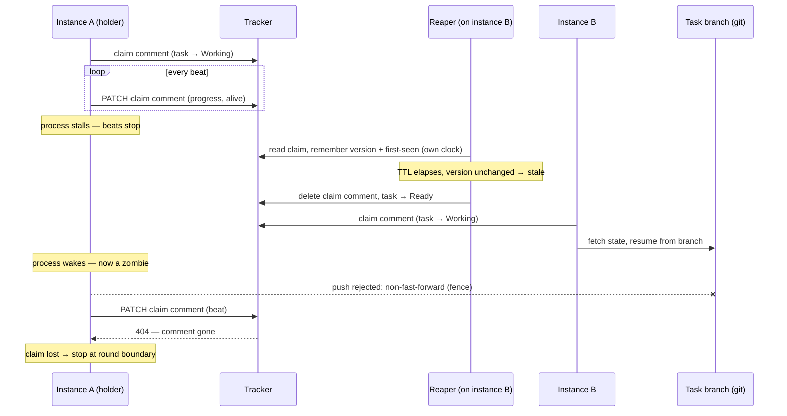

# ADR 0002: Claim Lease Protocol (Heartbeat / Stale-Claim)

Status: accepted (2026-07-20, implemented by `add-claim-heartbeat`)

## Context

A claim written by `add-tracker-port` is set once and never maintained: if the
holding instance dies, its task is stranded in `Working` until an operator
flips labels by hand. `add-claim-heartbeat` turns the claim into a lease.
Design research reviewed Kleppmann's "How to do distributed locking"
(fencing tokens), Kubernetes Leases (node heartbeat, leader election), the AWS
DynamoDB Lock Client, SQS visibility timeout, and Temporal activity
heartbeats.

## Decision

- **Staleness is judged by local observation, never by comparing clocks**
  (DynamoDB Lock Client pattern): an observer remembers the claim's version
  (comment id + `updated_at`) and the moment of its own first observation, on
  its own monotonic clock. Stale = "version unchanged after TTL measured from
  my own first observation" — no `now - updated_at` arithmetic, no clock
  comparison across instances. A freshly started instance therefore cannot
  declare someone else's claim stale before its own TTL has elapsed since it
  first saw that claim — a correct grace period, for free.
- **Beat : TTL ≈ 1 : 3–4 is the industry norm** (Kubernetes node lease 10s/40s,
  DynamoDB Lock Client example 3s/10s). Our own time scale is rounds measured
  in minutes, so beat is unit-minutes and TTL tens of minutes; the TTL is the
  price paid in latency before a dead instance's task returns to circulation.
- **Fencing tokens are mandatory — a lease alone does not stop a zombie**
  (Kleppmann): the resource itself must reject writes from a stale holder.
  Our fence is the git non-fast-forward push (equivalent to a monotonic token
  between two non-force writers) — the task branch is never force-pushed, as
  a safety invariant, not a courtesy. Tracker writes (park/finish/release —
  labels and comments) stay unfenced; a cheap "is this claim still mine?"
  check (ETag read) precedes them. The TOCTOU window that remains costs a
  stray label or comment, never data corruption, and self-heals on the
  thief's next write.
- **The beat doubles as a theft-detection channel**: a beat is a `PATCH` to
  the instance's own claim comment; if a reaper has deleted that comment, the
  beat gets a 404. Failure taxonomy: network/5xx → keep working (the round
  boundary decides); 404 "comment gone" → claim is lost, finishing the round
  is pointless — react as if the claim had been revoked, at the next round
  boundary.
- **Beat payload carries progress** (Temporal heartbeat details): since the
  beat already edits the claim comment, it also carries human-readable
  progress (stage, attempt, last-alive time) — progress in the issue thread
  for free (NFR-O). No state hand-off to the next holder is needed: state
  already lives in the branch and is richer than any heartbeat payload.
- **Confirmed by analogy**: SQS `maxReceiveCount` → DLQ mirrors our abort
  threshold → `park(INFRA)`; SQS "terminate visibility timeout" mirrors `release`;
  at-least-once delivery under any lease means duplicate delivery is possible,
  so work must be idempotent — ours is (rounds live in the branch, resumable);
  Kubernetes `leaseTransitions` mirrors our "stale claim removed" marker as an
  audit trail of holder changes.

## Sequence: stale-claim takeover

The scenario that exercises every decision above — the holder dies, the reaper
returns the task, another instance takes over, and the fence stops the zombie:

## Consequences

Positive: staleness detection needs no clock synchronization across
instances; the branch push itself is the fencing mechanism, with no new
infrastructure; operators get free progress visibility in the issue thread.

Negative: TTL directly trades detection latency for tracker write volume
(GitHub secondary rate limits bound how tight beat/TTL can go); tracker writes
outside the git fence still need the ETag pre-check to bound the TOCTOU
window.
