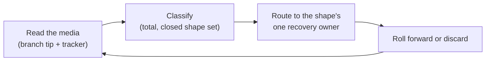

# ADR 0003: Crash Consistency of Factory Transitions

Status: accepted (2026-08-27, introduced by `harden-task-branch-contract`)

## Context

Every externally visible factory transition is multi-step: a git commit, a
push, a tracker write, a confirmation. A crash between two steps freezes an
intermediate state, and the next pickup has to make sense of it. An audit of
autonomous `serve` found seventeen instances of one defect class: the frozen
state was never named, so each reader improvised — one crash-looped a task
into an unreturnable park, one lost a human's escalation answer, one re-ran a
green stage and re-paid its judge.

The architecture constrains the fix. Factory instances are stateless: the only
durable media are the task branch and the tracker. The claim lease
(ADR 0002) is the mutual-exclusion baseline, so divergence scenarios are
sequential under a healthy lease and concurrent only inside the heartbeat
partition window. In container mode the branch is replicated across up to five
repositories with one-way movement only.

## Decision

### The principle: the media are the journal

Recovery reads the world — branch tip plus tracker state — classifies it, and
converges it. There is no step journal. Every frozen intermediate state
classifies to exactly one named shape, and every shape has exactly one
recovery owner.

Precedents: Kubernetes controllers (level-triggered reconciliation, not
edge-triggered steps), crash-only software (the recovery path *is* the startup
path), and this project's own denial cursor (the position rides the record it
delimits).

### The three mechanisms

1. **One logical transition = one commit.** Mutually-implied fields never
   split across commits: a human decision lands with the attempt-counter
   reset, a passing round lands with the advanced pipeline position, a
   container park lands as its outcome commit with the pending marker.
2. **Intent → effect → receipt for every external effect.** A durable intent
   is recorded before the effect, a receipt after it; recovery of an
   intent-without-receipt probes the target before re-driving. The
   destructive step of a sequence (cleanup, label removal, box disposal) runs
   after all constructive receipts.
3. **The tracker medium is classified and swept like the branch medium.**
   Adapters report facts; core classifies them totally; the reaper sweeps the
   union of both listings and repairs every non-steady shape. Write order
   follows the sweep-universe rule — the label admitting a task into the
   sweep universe first, the label removing it last, truth markers between —
   so every kill window freezes a state the sweeper's own query enumerates.

### Recovery disposition per branch shape

Shape *meanings* are owned by the `task-branch-contract` capability spec, and
`docs/glossary.md` points at it rather than copying it; this table owns only
the disposition.
Roll-forward completes the transition the frozen state was part of; discard
returns to a known-good tip.

| Shape                | Recovery owner                                | Disposition                                                             |
|----------------------|-----------------------------------------------|-------------------------------------------------------------------------|
| `Bare`               | take routing (branch creation)                | roll forward: write the STARTED commit                                  |
| `Created`            | take routing → stage engine                   | roll forward: run the first stage                                       |
| `InProgress`         | stage engine                                  | roll forward: resume at the recorded position                           |
| `Parked`             | terminal-transition component, then the human | roll forward: complete the pending tracker write; then wait             |
| `Answered`           | stage engine                                  | roll forward: resume with the decision                                  |
| `CompletedUncleaned` | completion-finish flow                        | roll forward: cleanup, push, tracker finish — never re-enter the engine |
| `Delivered`          | none                                          | terminal: nothing to recover                                            |
| `StaleEpoch`         | replica-pair reconciler                       | discard: the stale-epoch artifacts lose to the live claim's tip         |
| `UnsupportedVersion` | recovery budget → quarantine                  | neither: quarantine on first classification                             |
| `Corrupt(reason)`    | recovery budget → quarantine                  | neither: quarantine on first classification                             |
| `Unknown`            | recovery budget → quarantine                  | neither: quarantine on first classification                             |

Automatic recovery is budgeted by one persisted counter shared with the crash
fuse; exhaustion quarantines with the failure history. The three
non-recoverable shapes bypass the counter — one classification, one
diagnosis, one park.

### Atomicity and durability per medium

**The durability point of any transition is its successful push, never the
local commit.**

| Medium                               | Atomicity mechanism                                                                                              | Written by                                 |
|--------------------------------------|------------------------------------------------------------------------------------------------------------------|--------------------------------------------|
| Host worktree `.gnomish-task/` files | the shared `atomicfile` writer: temp file + atomic rename                                                        | host-side state, marker, and trace writers |
| In-box round state                   | commit granularity: a plain in-box write followed by an in-box commit, so a partial write never reaches a commit | the container round-state persister        |
| Lifecycle commits in container mode  | built from bare git objects; the ref update is the atomic step                                                   | the bare-objects task repository           |

Recovery restores factory-owned files under `.gnomish-task/` from the branch
tip and never salvages them from a dirty worktree — which is also what shields
readers from a partial in-box write. Gnome-owned work files stay salvageable.
Both salvage paths consume one shared factory-owned-paths policy.

Two **accepted non-mechanisms**, recorded so they are not re-proposed as
oversights:

- **No local fsync discipline.** Durability is the push; a local write lost to
  a host crash is expendable, because reconciliation under the lease already
  treats unpushed local work as nonexistent.
- **No atomic in-box `putFile`.** Commit granularity plus the
  restore-from-tip rule already carry the invariant; a second guard on the
  same path would blur which mechanism owns it.

### The kill-point gate and where it runs

Every multi-step transition joins a table-driven kill-point harness: kill after
each durable step, run the pickup, assert the frozen state's shape and its
convergence, then run the recovery a second time and assert it changed nothing.
The branch medium's half drives the real lifecycle writers of both modes
against real local repositories; the tracker medium's half fails the connection
after each write of the claim, park, finish, abort and reap sequences against
the one adapter whose writes are physically non-atomic, and the shapes those
frozen states classify to are asserted where the classifier lives.

**The harness runs in the default `check` lane, not a nightly one.** Measured at
~7 seconds in total (branch harness ~5.4 s, tracker windows ~1.5 s, shape
classification ~0.1 s) against a budget of ~5 minutes added to `check`, so the
cost of a dedicated lane — a second place to look when a transition regresses —
buys nothing. Should a future transition push the harness past the budget, the
lane split is the remedy, not thinning the table.

The idempotence assertion compares a fingerprint that excludes service commits:
the subprocess layer classifies an interrupt conservatively, so a recovery may
at worst re-run a service commit — never paid executor or judge work.

## Alternatives Considered

**Saga / workflow journal.** A journal needs a durable home — a third source
of truth that statelessness forbids and that can itself diverge from the media
it describes, which is the very defect class this ADR closes. Cross-instance
saga hand-off under a lease is a distributed-workflow engine.

**Write-ahead log, or multi-ref / cross-repository transactions.** Same
placement problem, plus git offers no cross-ref transaction; movement between
repositories is reconciled, never transactional.

**Block-allocated sequence counters for fencing.** A second writer-owned
counter that every resume must reconcile. The tracker already allocates a
monotonic number per claim, which serves as the claim epoch for free. True
server-side fencing is unavailable — git and GitHub cannot reject a
stale-epoch write — so epochs make zombie writes *detectable and classifiable*,
not impossible.

**Per-defect regression specs instead of a kill-point gate.** They pin the
known findings and leave every future transition unasked.

## Consequences

Positive: recovery has one shape per frozen state and one owner per shape, so
"what does the next pickup see?" has an answer that compiles — a sealed shape
set forces every reader to handle every shape. No new durable store, no new
infrastructure. A corrupt state costs one classification and one park instead
of a crash loop.

Negative: every reader pays one classification of a tip it was reading
anyway, and the closed shape set is a cross-cutting commitment — adding a
shape breaks every reader until it is handled (deliberately). Automatic
discard of diverged local work is safe only while the lease is healthy; inside
the heartbeat partition window it can cost one duplicate round, which is
accepted.

## See also

- `.claude/rules/crash-consistency.md` — the checklist every new multi-step
  transition passes.
- `docs/glossary.md` — branch shape, tracker shape, sweep universe, recovery
  owner, claim epoch, intent/receipt, quarantine.
- ADR 0002 — the claim lease this contract fences with.
