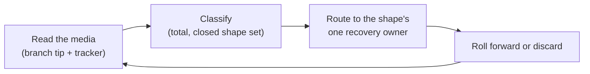
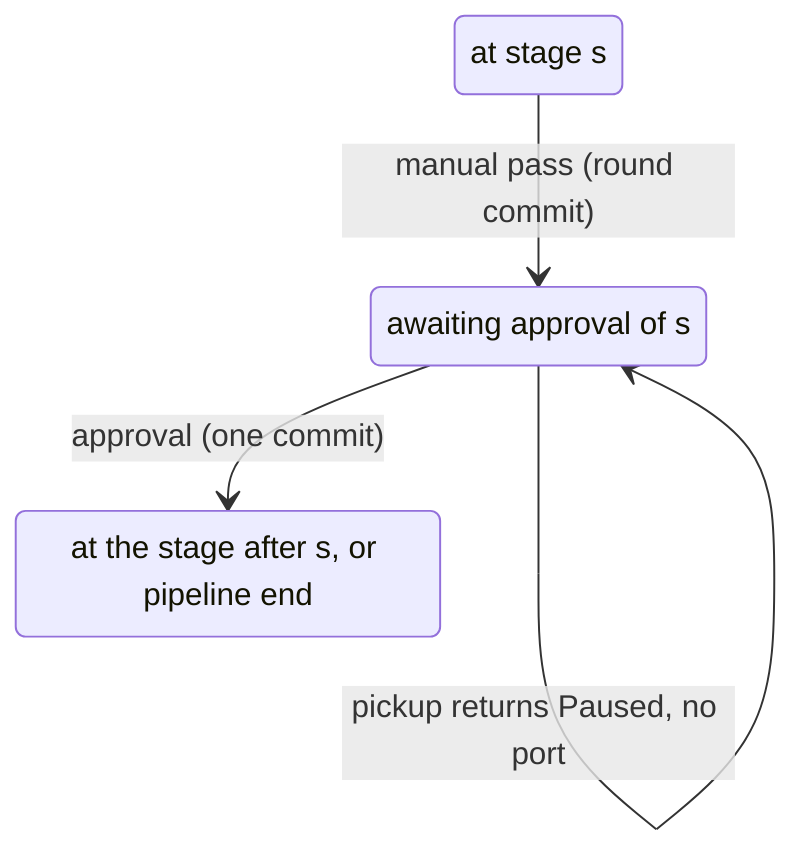

# ADR 0003: Crash Consistency of Factory Transitions

Status: accepted (2026-08-27, introduced by `harden-task-branch-contract`)

## Context

Every externally visible factory transition is multi-step: a git commit, a
push, a tracker write, a confirmation. A crash between two steps freezes an
intermediate state, and the next pickup has to make sense of it. An audit of
autonomous `serve` found seventeen instances of one defect class: the frozen
state was never named, so each reader improvised — one crash-looped a task
into an unreturnable park, one lost a human's escalation answer, one re-ran a
green stage and re-paid its judge.

The architecture constrains the fix. Factory instances are stateless: the only
durable media are the task branch and the tracker. The claim lease
(ADR 0002) is the mutual-exclusion baseline, so divergence scenarios are
sequential under a healthy lease and concurrent only inside the heartbeat
partition window. In container mode the branch is replicated across up to five
repositories with one-way movement only.

## Decision

### The principle: the media are the journal

Recovery reads the world — branch tip plus tracker state — classifies it, and
converges it. There is no step journal. Every frozen intermediate state
classifies to exactly one named shape, and every shape has exactly one
recovery owner.

Precedents: Kubernetes controllers (level-triggered reconciliation, not
edge-triggered steps), crash-only software (the recovery path *is* the startup
path), and this project's own denial cursor (the position rides the record it
delimits).

```mermaid
flowchart LR
    W["Read the media<br/>(branch tip + tracker)"] --> C["Classify<br/>(total, closed shape set)"]
    C --> O["Route to the shape's<br/>one recovery owner"]
    O --> A["Roll forward or discard"]
    A --> W
```

### The three mechanisms

1. **One logical transition = one commit.** Mutually-implied fields never
   split across commits: a human decision lands with the attempt-counter
   reset, a passing round lands with the advanced pipeline position, a
   container park lands as its outcome commit — carrying the pending marker
   only when a tracker write is owed (`take`); a manual `run` park owes none
   and carries no marker, so no receipt follows it.
2. **Intent → effect → receipt for every external effect.** A durable intent
   is recorded before the effect, a receipt after it; recovery of an
   intent-without-receipt probes the target before re-driving. The
   destructive step of a sequence (cleanup, label removal, box disposal) runs
   after all constructive receipts.
3. **The tracker medium is classified and swept like the branch medium.**
   Adapters report facts; core classifies them totally; the reaper sweeps the
   union of both listings and repairs every non-steady shape. Write order
   follows the sweep-universe rule — the label admitting a task into the
   sweep universe first, the label removing it last, truth markers between —
   so every kill window freezes a state the sweeper's own query enumerates.

#### A recorded position never implies an authorisation not yet recorded

For every durable step, the question is what a pickup that sees that step and
nothing after it is allowed to do. If the answer is "continue past a gate",
"deliver" or "run the next stage" while a later write was meant to decide that,
the step is wrong: the decision belongs in the step's own record (provenance:
`make-checkpoint-gate-durable`, which found a `manual` checkpoint skipped by a
kill between the round commit, already advanced past the stage, and the park
commit that was to stop it). Two consequences follow, and both are mechanism 1
applied to a decision rather than to a field:

- **Gates are positions.** The passing round of a `manual` stage records the
  position *awaiting approval* of that stage, not the position after it. A run
  that starts from a gate returns `Paused` and invokes no port, however many
  times it is picked up. Only the *approval* — one commit that moves the
  position past the gate and clears the recorded outcome — opens it, and a
  `manual` last stage therefore never records the pipeline end itself.
- **The verdict rides the round record.** A round that stops the stage — a
  decision needed, a check that cannot verify — carries the stop (the question
  and its options; the check, the reason and the details) on its attempt in
  `state.json`. The next run re-raises the escalation from the record, exactly
  as it re-raises an exhausted attempt budget from the counter, so the park
  commit is pure tracker delivery and losing it loses nothing.

The same rule closes the reverse window: a continuation that consumes a
recorded outcome without an answer lands the *resumed write* — the outcome
cleared and the attempt reset it implies, in one commit — so a kill never
grants a second attempt budget.

```mermaid
stateDiagram-v2
    AtStage: at stage s
    Gate: awaiting approval of s
    Next: at the stage after s, or pipeline end
    AtStage --> Gate: manual pass (round commit)
    Gate --> Gate: pickup returns Paused, no port
    Gate --> Next: approval (one commit)
```

The canon states the rule as "log the intent before the action" (ARIES and
write-ahead logging), Kleppmann's dual-write problem and Helland agree, and
the saga pattern makes the go/no-go write a single pivot transaction guarded
by a `*_PENDING` semantic lock. None of them allows a first write to imply what
only a second write may grant.

Comparable orchestrators keep the wait in the same write as the completion or
make it a property of the next step: Temporal's `UpdateWorkflowExecution`,
Argo's suspend node in the same resource update, GitLab's `manual` job with
its derived `blocked` status, GitHub Actions environments gating the *next*
job. None of them has a published post-mortem of a gate skipped after a
restart; systems that record the gate this way do not produce the defect class.

### Consumed streams: the position rides the record

A factory instance also reads *external append-only streams* it does not own —
today the egress guard's denial log, whose container outlives the process that
reads it. Consuming such a stream advances a read position, which is durable
state of exactly the kind the media-are-the-journal principle governs: a
position that outlives its record re-attributes events to the wrong record, and
a position that dies with the process re-reports events already recorded.
Three rules, in the order a transition applies them (provenance:
`fix-denial-attribution-durability`; precedent: Kafka/Flink offset-with-output,
auditd/Falco loss counters):

1. **The position becomes durable only with the record it delimits**, in the
   same commit — never as a write of its own. It may lag the record after a
   kill, never lead it, so the worst frozen state re-reads events rather than
   losing them. Every record kind that consumes the stream carries a position:
   here the attempt in `state.json` and the `cannotExecute` escalation in
   `task.json`, and a lifecycle rewrite of either document carries the
   committed position forward rather than dropping it.
2. **Recorded events carry a source-assigned identity**, so a re-read merges
   idempotently: events already recorded at the tip are matched by identity and
   attached once. This is what turns rule 1's worst case from duplicates into a
   no-op, and it is why losing a position is recoverable without a second
   durable store.
3. **Known loss is reported in-band.** When the reader can see it lost events —
   a saturated tail cap, a source that no longer holds its log — it records a
   marker through the same channel the events use, so a reader distinguishes
   "nothing happened" from "no data". A counter or a log line is not enough:
   the report a human reads is the surface that must say it.

Reading the position is best-effort — an unanswerable position falls back to a
full re-read, which rule 2 makes cheap — while writing it inherits the
atomicity of the commit it rides.

**Corollary: a reader of a medium that keeps the past judges liveness by
identity, never by presence.** The task branch and a box's working copy keep
every file a commit carried, so "the file is there" cannot tell a message
written for this round from one carried over from an earlier one. The writer's
request carries an identity the orchestrator minted and no later step repeats —
in container mode the *round token*, the branch tip the round opened on, in the
decision file's name and in the snapshot subject — and the receiver reads
exactly that identity and nothing else. Deleting a consumed request (the three
outcome-clearing writes remove the decision files in their own commit) is
hygiene; no reader relies on it, so a kill before the deletion is pushed
changes nothing. A key that is reset by design, such as the attempt number, is
not an identity. Provenance: `make-checkpoint-gate-durable`, after a stale
decision file re-parked a task after every answer.

The canon makes the receiver's identity match the single owner of "is this
request live": AWS Step Functions mints one task token per wait, invalid after
use; Enterprise Integration Patterns' Correlation Identifier matches a reply to
its request; Kleppmann's fencing token rejects a write whose token has gone
backwards. Amazon SQS is the hygiene precedent: the consumer deletes a message
after processing, but an undeleted message becomes visible again, so the
consumer must be idempotent rather than trust the deletion.

### Recovery disposition per branch shape

Shape *meanings* are owned by the `task-branch-contract` capability spec, and
`docs/glossary.md` points at it rather than copying it; this table owns only
the disposition.
Roll-forward completes the transition the frozen state was part of; discard
returns to a known-good tip.

| Shape                | Recovery owner                                | Disposition                                                             |
|----------------------|-----------------------------------------------|-------------------------------------------------------------------------|
| `Bare`               | take routing (branch creation)                | roll forward: write the STARTED commit                                  |
| `Created`            | take routing → stage engine                   | roll forward: run the first stage                                       |
| `InProgress`         | stage engine                                  | roll forward: resume at the recorded position                           |
| `AwaitingApproval`   | stage engine, then the human                  | roll forward: deliver a lost park; continue only after the approval write |
| `Parked`             | terminal-transition component, then the human | roll forward: complete the pending tracker write; then wait             |
| `Answered`           | stage engine                                  | roll forward: resume with the decision                                  |
| `CompletedUncleaned` | completion-finish flow                        | roll forward: cleanup, push, tracker finish — never re-enter the engine |
| `Delivered`          | none                                          | terminal: nothing to recover                                            |
| `UnsupportedVersion` | recovery budget → quarantine                  | neither: quarantine on first classification                             |
| `Corrupt(reason)`    | recovery budget → quarantine                  | neither: quarantine on first classification                             |
| `Unknown`            | recovery budget → quarantine                  | neither: quarantine on first classification                             |

Automatic recovery is budgeted by one persisted counter shared with the crash
fuse; exhaustion quarantines with the failure history. The three
non-recoverable shapes bypass the counter — one classification, one
diagnosis, one park.

`AwaitingApproval` is a shape of its own rather than `InProgress` refined by
position because the recovery owners differ: the stage engine *runs* an
`InProgress` tip and *pauses* a gate. A tip at a gate classifies to
`AwaitingApproval` whatever its recorded outcome says; a gate whose park was
lost is re-delivered, never continued.

### Recovery rebuilds execution context from the record

A pickup rebuilds in-memory execution context from the durable record through
the same parse the live path uses — one code path, two input sources (the live
tip, the recorded commit). A resumed container round never mints its round
token: it reuses the token its snapshot recorded, through the one function that
parses a commit id into a round identity, so the state commit it lands is
checked against the recorded token exactly as the live round's would be. A
guard that compares a recorded value with its own re-read is not a check.

A per-run cell holding such context exists only as a named bridge at a port that
cannot carry the type — here the engine's persistence port and the published
check-workspace SPI, which by design know nothing of commits — and it holds a
whole identity, never a fragment: a round with a snapshot and no token is not a
value it can hold. Provenance: `make-checkpoint-gate-durable`, after the resume
path filled one of two per-run cells and left the other empty.

The canon: ARIES's analysis pass rebuilds the transaction table from the log
alone, and Temporal replays the *same* workflow code against recorded history.
Tekton keeps the spec beside the status, so a continuation reads the input
that pinned the attempt rather than the current one. The anti-patterns are
hidden temporal coupling — a cell filled by one step and read by another,
with nothing to detect the wrong order — and Seemann's Ambient Context.

### Atomicity and durability per medium

**The durability point of any transition is its successful push, never the
local commit.**

| Medium                               | Atomicity mechanism                                                                                              | Written by                                 |
|--------------------------------------|------------------------------------------------------------------------------------------------------------------|--------------------------------------------|
| Host worktree `.gnomish-task/` files | the shared `atomicfile` writer: temp file + atomic rename                                                        | host-side state, marker, and trace writers |
| In-box round state                   | commit granularity: a plain in-box write followed by an in-box commit, so a partial write never reaches a commit | the container round-state persister        |
| Lifecycle commits in container mode  | built from bare git objects; the ref update is the atomic step                                                   | the bare-objects task repository           |

Recovery restores factory-owned files under `.gnomish-task/` from the branch
tip and never salvages them from a dirty worktree — which is also what shields
readers from a partial in-box write. Gnome-owned work files stay salvageable.
Both salvage paths consume one shared factory-owned-paths policy.

**Reads resolve at the tip in every medium.** Every host-side read of an
envelope file (`task.json`, `state.json`, the presence of `.gnomish-task/`
itself) resolves at the worktree's `HEAD` through the shared tip reader, exactly
as the container medium reads it from bare objects: the working tree is the
staging area for the next write, never a read medium — a killed predecessor can
leave it emptied or half-staged while the tip still carries the envelope
(provenance: `fix-envelope-medium`).

Two **accepted non-mechanisms**, recorded so they are not re-proposed as
oversights:

- **No local fsync discipline.** Durability is the push; a local write lost to
  a host crash is expendable, because reconciliation under the lease already
  treats unpushed local work as nonexistent.
- **No atomic in-box `putFile`.** Commit granularity plus the
  restore-from-tip rule already carry the invariant; a second guard on the
  same path would blur which mechanism owns it.

### The kill-point gate and where it runs

Every multi-step transition joins a table-driven kill-point harness: kill after
each durable step, run the pickup, assert the frozen state's shape and its
convergence, then run the recovery a second time and assert it changed nothing.
The branch medium's half drives the real lifecycle writers of both modes
against real local repositories; the tracker medium's half fails the connection
after each write of the claim, park, finish, abort and reap sequences against
the one adapter whose writes are physically non-atomic, and the shapes those
frozen states classify to are asserted where the classifier lives.

**The harness runs in the default `check` lane, not a nightly one.** Measured at
~7 seconds in total (branch harness ~5.4 s, tracker windows ~1.5 s, shape
classification ~0.1 s) against a budget of ~5 minutes added to `check`, so the
cost of a dedicated lane — a second place to look when a transition regresses —
buys nothing. Should a future transition push the harness past the budget, the
lane split is the remedy, not thinning the table.

The idempotence assertion compares a fingerprint that excludes service commits:
the subprocess layer classifies an interrupt conservatively, so a recovery may
at worst re-run a service commit — never paid executor or judge work.

## Alternatives Considered

**Saga / workflow journal.** A journal needs a durable home — a third source
of truth that statelessness forbids and that can itself diverge from the media
it describes, which is the very defect class this ADR closes. Cross-instance
saga hand-off under a lease is a distributed-workflow engine.

**Write-ahead log, or multi-ref / cross-repository transactions.** Same
placement problem, plus git offers no cross-ref transaction; movement between
repositories is reconciled, never transactional.

**Block-allocated sequence counters for fencing.** A second writer-owned
counter that every resume must reconcile. The tracker already allocates a
monotonic number per claim, which serves as the claim epoch for free. What that
epoch is for is *provenance*: stamped into a commit it names the tenure that
wrote it, and at the tracker it is the identity a fenced claim operation
compares against. The fences themselves are the two the media already provide —
the fast-forward-only push, which the remote refuses for a superseded tenure,
and the round-boundary revocation check, which stops a holder whose claim is no
longer its own. An epoch comparison belongs to the medium at write time,
against the highest epoch it has accepted; a reader that compares history
against its own claim has no fence, only false positives (provenance:
`fix-claim-epoch-fence`, which removed one such reader after it quarantined
every legitimate reclaim).

**Per-defect regression specs instead of a kill-point gate.** They pin the
known findings and leave every future transition unasked.

## Consequences

Positive: recovery has one shape per frozen state and one owner per shape, so
"what does the next pickup see?" has an answer that compiles — a sealed shape
set forces every reader to handle every shape. No new durable store, no new
infrastructure. A corrupt state costs one classification and one park instead
of a crash loop.

Negative: every reader pays one classification of a tip it was reading
anyway, and the closed shape set is a cross-cutting commitment — adding a
shape breaks every reader until it is handled (deliberately). Automatic
discard of diverged local work is safe only while the lease is healthy; inside
the heartbeat partition window it can cost one duplicate round, which is
accepted.

## See also

- `.claude/rules/crash-consistency.md` — the checklist every new multi-step
  transition passes; items 12–14 carry the gate rule, the
  liveness-by-identity corollary and the recovery-through-the-live-parse
  corollary.
- `docs/glossary.md` — branch shape, tracker shape, sweep universe, recovery
  owner, claim epoch, intent/receipt, quarantine, gate, awaiting approval,
  approval, resumed write, round token.
- The `stage-engine` capability — the advancement contract the gate changes;
  the `task-branch-contract` capability — the `AwaitingApproval` shape.
- ADR 0002 — the claim lease this contract fences with.
