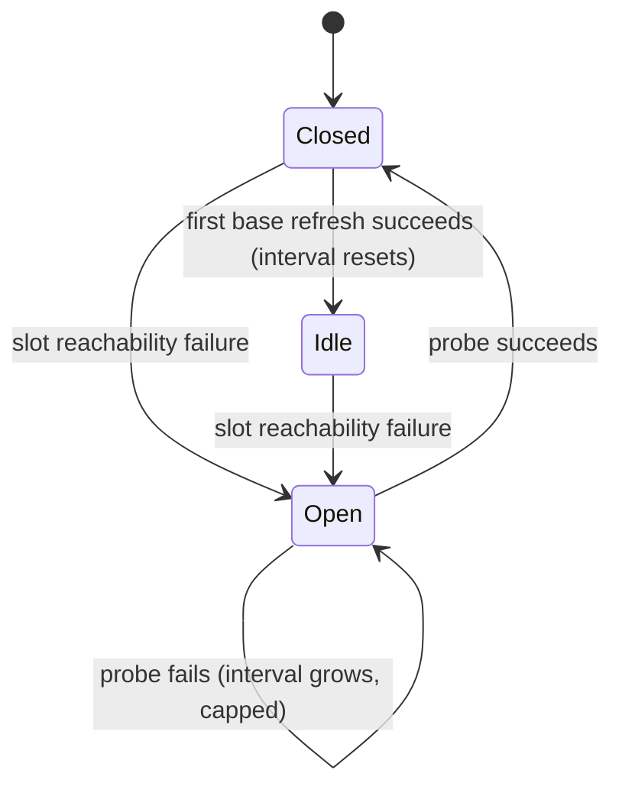

# ADR 0005: Dependency Outage Accounting

Status: accepted-and-implemented (2026-09-06, introduced by
`add-base-ref-resolution`; implemented 2026-09-08)

## Context

Before a task's first engine round the factory performs reads against a
shared dependency: it fetches the task's base from the git remote, discovers
the default branch, reads the trusted configuration tier, and — for a subtask
of an epic — fetches the epic branch for inherited context. When that remote
is unreachable, every one of those steps fails for every task at once. The
failure is nobody's fault among the tasks, yet each step is executed inside
a claimed task's lifecycle, where the existing failure vocabulary is
task-shaped: abort with a marker and a comment, a per-task backoff, the
K-fuse that quarantines a task after repeated aborts, or an escalation that
parks the task for a human.

Charging a shared outage to that vocabulary has two bad endings. Counted as
an abort, a three-hour outage at 3 a.m. writes K comments per task, trips the
fuse across the whole backlog, and leaves a human to un-park every task in
the morning. Uncounted — a plain release with nothing recorded — the feed has
no brake: a released task is eligible on the very next poll, so a dead remote
produces a claim-and-release cycle at feed speed, one tracker write per
cycle, with only log suppression hiding it.

A survey of orchestrators (2026-09-06) shows the split that matters is
"could not start" versus "started and failed", assigned by the *cause* the
detecting mechanism observed, never by the step that happened to be running:
Temporal charges no retry for a schedule-to-start timeout, Oban's snooze
rolls the attempt counter back, Kubernetes ignores disruption conditions in
`backoffLimit`. GitLab is the cautionary case: a failed source fetch is a
`script_failure` merely because it exits through a shell, and the request to
reclassify it has been open since 2020. The survey also shows the cost of an
uncharged failure with no separate bound — a Kubernetes `ImagePullBackOff`
stalls a job silently for hours — and that no CI system pauses intake for an
unreachable *source* repository: they fail the job and let a human re-run it.

## Decision

### The principle: a shared-dependency outage is charged to the daemon

A failure to reach a shared dependency during a task's start is the daemon's
condition, not the task's. It is answered by releasing the claim through the
plain release path — no abort marker, no comment, no attempt burned, the
task back in Ready for any instance — and by pausing intake at the daemon
until the dependency is confirmed back. Nothing in the task's abort facts,
backoff, or fuse accounting moves.

### Classification is by cause, never by step

The class of a failure is decided by what was observed, not by which step
observed it. Only reachability (connect, DNS, timeout, bounded retries
exhausted) is the daemon's class. A ref that does not exist on the remote,
an authentication refusal, a diverging local tag, a remote refusing a
fetch-by-SHA, a malformed configuration on the base, an underdetermined
selection — these are the task's, and they park the task with a report.

The rule binds **every** claim-time fetch of **any** ref. A change that adds
another fetch before the first round (the epic branch for inherited context,
a baseline probe, a sibling branch) inherits this classification and may not
choose its own. The classifier already exists: the branch locate step's
three-way answer — origin answered and holds no such ref / origin holds it /
origin never answered — is the one to reuse.

### The remote outage gate

`serve` keeps one gate per remote target. A slot's reachability failure
opens it; the feed consults it *before* every claim and claims nothing while
it is open, so an open gate costs the tracker nothing. While open, the daemon
probes the remote with a tracker-free reachability check (`ls-remote`) on a
jittered interval that grows from the idle interval to a configured cap; the
first successful probe closes the gate. Recovery is confirmed by a probe,
never by claiming a task — a claim is a tracker write, and using it as the
probe is exactly the amplification the gate exists to remove. Slots already
working continue under an open gate. The gate is process memory: a restart
forgets it and re-learns on the next failure; instances share nothing, since
N instances cost N cheap probes and nothing else. Single-shot `take` has no
gate: it releases the claim and ends with its own typed result and exit
code.

### The separate bound

An uncharged failure needs its own bound or it stalls silently. Two rules
supply it, both landed exactly as designed. The probe interval — jittered,
doubling off `RestartBackoff`, capped at `factory.serve.remote-probe-interval-cap`
(default 10 minutes) — resets to the idle value only on the first
*successful base refresh* after a close, never on the probe that closed the
gate — a flapping remote that answers `ls-remote` but fails the fetch
therefore meets a growing pause, not a restarted one. This is `RemoteOutageGate`
and its extracted `RemoteOutageProbeSchedule`: `openedFreshly()` arms a
pending reset, `probeFailed()` re-arms the next interval off the *same*
backoff instance so a gate that closes and reopens before a refresh ever
succeeds resumes doubling from where it left off, and only
`onSuccessfulRefresh()` clears the pending reset. And a gate open longer than
`factory.serve.remote-sustained-open-threshold` (default 1 hour, comfortably
above the probe cap) logs ERROR once with its own operator-event code — the
one-shot latch is `RemoteOutageSustainedOpenWatch`, so a sustained outage is
never silent but never repeats the ERROR either.

### The log and snapshot signal

Transitions are the signal, failures are not: one WARN
(`OperatorEvent.REMOTE_OUTAGE_GATE_OPENED`, `GF145`) on open naming the
remote and the cause, one INFO recovery line on close (no code, per the
logging rule) with the outage duration and probe count, DEBUG with a
periodic roll-up in between via `RepeatSuppressor` keyed per remote target
(`"remote-outage:" + target`), so two remotes never mask each other. A gate
open past the sustained threshold additionally logs one ERROR
(`OperatorEvent.REMOTE_OUTAGE_GATE_SUSTAINED_OPEN`, `GF146`), once per
outage. The serve snapshot carries a `remote` section beside `tracker`
(`RemoteOutageHealth`: `target`, `open`, `openSince`, `lastError`,
`nextProbeAt`, `consecutiveFailures`, `lastSuccessAt`); the ledger records
one `remoteOutage` line per closed outage (`RemoteOutageClosedOutage`:
`target`, `openedAt`, `closedAt`, `probeCount`, `releasedClaims`,
`lastError`) and no task outcome for a released task, since nothing ran and
nothing was spent.

Single-shot `take` never sees the gate at all: its own
`InfrastructureUnavailable` result maps to exit code **16**
(`TakeExitCodeMapper`), released with no gate, no snapshot, no ledger line —
consistent with the gate's own scope, which is a `serve`-only, process-local
state.

### A recorded deviation

Pausing intake for an unreachable source repository is not what CI systems
do; they fail the job for a human to re-run. The factory has no such human
at the clone, so the gate stands in for the re-run. The deviation is
deliberate, and the two rules above are what it pays for the risk the
survey names.

## Alternatives Considered

- **Escalate to the tracker on the first failure** — parks the whole
  backlog for a condition recovery would have served, and classifies by
  step (the GitLab defect).
- **Record an abort with a new cause** — charges the task, writes a comment
  per cycle, and trips the K-fuse across the backlog.
- **Release with a suppressed WARN and no gate** — the hot claim-and-release
  loop at feed speed, with only the log plane hiding it.
- **Pause after the claim and test recovery by claiming again** — one
  tracker write per probe, the amplification the gate removes.
- **Retry indefinitely inside the fetch** — the retry lives at one level
  only (bounded, inside one fetch); a second level of indefinite retry is
  the multiplied-retry pattern the SRE literature warns against.
- **Reset the probe interval on the closing probe** — turns a flapping
  remote into a claim-and-release cycle; rejected in favour of resetting on
  the first successful refresh.

## Consequences

- Task failure accounting keeps its meaning: an abort fact is always about
  the task, and a dead remote leaves no trace on any task.
- Every future claim-time fetch has a rule to cite instead of a decision to
  make; `add-decision-inheritance` is the first consumer after the base
  refresh.
- The daemon gains a second gate class beside the tracker outage retry.
  The two are distinct on purpose: the tracker retry labels every tracker
  call failure a tracker outage and retries indefinitely, the remote gate
  precedes the claim and probes without the tracker. They must not be
  collapsed.
- An operator reading `serve` during an outage gets one answer from one
  place: blocked on which remote, since when, next probe when.

## See also

- `docs/adr/0002-claim-lease-protocol.md` — the plain release path the gate
  relies on.
- `docs/adr/0003-crash-consistency.md` — the kill window between a failed
  fetch and the release freezes the `Claimed`-with-dead-holder shape, owned
  by the reaper; the gate itself is not a durable step.
- `docs/adr/0004-logging-policy.md` — operator-event codes and repeat
  suppression the gate signal uses.
- `docs/adr/0006-base-refresh-fetch.md` — the fetch whose reachability
  failure opens the gate.
- `docs/glossary.md` — *remote outage gate*.
