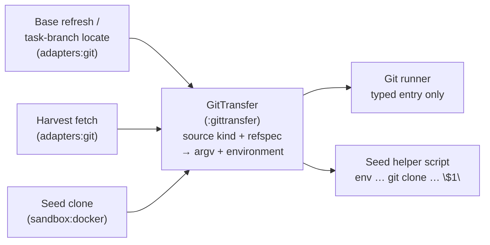

# ADR 0008: Git Transfer Policy

Status: accepted (2026-09-22, introduced by `own-git-transfer-argv`; this
document, the amendment of ADR 0006, the threat-registry rows, and the two
glossary entries are FR11 of that change)

## Context

The factory runs `git fetch` and `git clone` from three kinds of source: the
trusted `origin` remote, an untrusted task container reached over git's
`ext::` transport, and the operator's own clone as the seed of a container's
working copy. Before this decision each of the three sites chose its own
safety flags when its change was written, and ADR 0006 claimed that one
class (`NarrowFetch`) built every factory fetch when it built one of three.

Reproduced on git 2.55 on 2026-09-13: the harvest fetch auto-followed a tag
the gnome created inside the box into the operator clone's `refs/tags/` and
wrote `FETCH_HEAD`; the base refresh recursed into an initialized submodule
and performed a second, unnamed network fetch against the submodule's remote;
the seed clone ran in git's local-path mode, which bypasses object
validation, and carried the operator's local tags into the untrusted box.
None of the three validated the objects it received, the protocol policy
for the container was opened for `ext::` rather than closed to it, and the
operator's global git configuration (`submodule.recurse`, `fetch.prune`,
`url.<base>.insteadOf`) reached every factory git subprocess. Three more
harvest sources are on the roadmap (a local VM, a cloud executor, a GitHub
Actions executor); without one owner they become sites four to six.

The closest external precedent for the harvest direction is Gitaly, which
fetches from user-controlled remotes into a trusted store through one command
factory with a fixed environment, a fixed configuration set, object validation
with three legacy ignores, and no `FETCH_HEAD` write. libgit2's fetch options
and JGit's fetch command show the API shape: every side effect is a typed
field, never a flag a caller may omit.

Driven by FR1–FR12, NFR-S1–S3, NFR-R1 of `own-git-transfer-argv`.

## Decision

### One owner builds every transfer from a source kind and one refspec

`GitTransfer` in the JDK-only leaf module `:gittransfer` is the only place a
transfer argv and environment are built (FR1, FR2). It takes exactly two
inputs — a `TransferSource` from a closed, sealed set of kinds and one
`Refspec` — and produces two values: the argument list from the leading `-c`
pairs through the refspec, and the environment entries to set and to unset.
It launches nothing. The medium that runs the value is the caller's: the git
runner in `adapters:git` applies it to a process, the seed helper in
`sandbox:docker` renders it into its constant script. The leaf imports the
JDK and nothing else, so a policy that can reach no tracker, container, or
remote is the only thing a caller can vary a transfer by.

### The transfer sources

| Source | Trust | Subcommand | `GIT_ALLOW_PROTOCOL` | Configuration isolation | Per-source flags |
|--------|-------|------------|----------------------|-------------------------|------------------|
| `Origin` | trusted remote | `fetch origin <refspec>` | `https:http:ssh:file` | keeps the operator's global configuration; every key the common set depends on is re-asserted by `-c` | `--refmap=` |
| `Container(extUrl)` | untrusted box | `fetch <ext-url> <refspec>` | `ext` | global file, system file and XDG config home point at `/dev/null` | none |
| `SeedPath(source, destination)` | operator clone read into a box | `clone --no-local --no-hardlinks --single-branch --branch <b> <source> <destination>` | `file` | system file and XDG config home point at `/dev/null`; the global file is the seed helper's throwaway `safe.directory` file, holding nothing else | no fetch-only flag |

`Origin` and `Container` are fetch sources; `SeedPath` is a clone source. The
split is a type, so a clone value can never carry a fetch-only flag and a
fetch can never be built from a seed path. Adding a fourth source (the
roadmap's VM, cloud, and GitHub Actions executors) means adding one permitted
record in the leaf and one row in this table — never a flag list at a call
site (G3, M4).

### The common deny-by-default set

Every transfer carries the same set (FR3). It comes in two halves because
`fetch` and `clone` do not parse the same options.

Everywhere, as flags after the subcommand:

- `--no-tags` — tag auto-following writes into `refs/tags/` even on a fetch
  by SHA; narrow means exactly the one ref named and no auto-followed extras.
- `--no-recurse-submodules` — a populated submodule in the operator's clone
  would otherwise trigger a second, unnamed network fetch.
- `--end-of-options` before the source and the refspec — a refspec whose
  first character is `-` is then a refspec, never an option. The `Refspec`
  value refuses such a value at construction as well; the terminator is the
  second lock on the same door.
- No `--depth`: full history on every transfer, because resume must resolve
  it (NFR-P1).

Everywhere, as `-c key=value` pairs placed before the subcommand so they
configure the process rather than the new repository:

- `fetch.recurseSubmodules=no` and `submodule.recurse=false` — the
  configuration twin of the flag, so neither an operator setting nor a
  git-initiated nested fetch can reopen recursion.
- `fetch.prune=false` — an operator's prune setting deletes the destination
  of a short-name source.
- `maintenance.auto=false` and `gc.auto=0` — no background work in the
  shared clone.
- `fetch.fsckObjects=true` and `transfer.fsckObjects=true` — every received
  object is validated (see below).
- `fetch.fsck.badTimezone=ignore`, `fetch.fsck.missingSpaceBeforeDate=ignore`,
  `fetch.fsck.zeroPaddedFilemode=ignore` — the three legacy message ids that
  break real-world histories and that Gitaly ignores build-wide.

Fetch only:

- `--no-write-fetch-head` — `FETCH_HEAD` is one unlocked file per clone,
  truncated by every fetch; the factory never reads it (ADR 0006). `git clone`
  rejects the flag as unknown and writes no `FETCH_HEAD` anyway.
- `--refmap=`, on `Origin` alone — a fetch with an explicit destination still
  applies the clone's configured `remote.origin.fetch` refspecs as a
  destination mapping; an empty refmap disables that. A URL source has no
  configured refspecs, and `clone` has no remote yet.

Clone only (`SeedPath`): `--no-local` — git's transport path instead of its
local-path mode, so the pack is built and validated like any other transfer
(FR7); `--no-hardlinks`; `--single-branch`; `--branch <b>`. The resulting box
holds exactly the task branch and no tag.

### What each source may and may not change

| Source | May change | May not change |
|--------|------------|----------------|
| `Origin` | the one destination the refspec names (`refs/remotes/origin/<n>`, or a `refs/tags/<n>` that did not exist, per ADR 0006); the object database | the working tree, the index, `HEAD`, any `refs/heads/*`, any pre-existing `refs/tags/*`, any other `refs/remotes/origin/*`, `FETCH_HEAD`, any submodule |
| `Container` | the one task-branch ref the factory-fixed refspec names, fast-forward only; the object database | everything else in the operator clone: no tag, no other ref, no `FETCH_HEAD`, no submodule, no configuration, no hook |
| `SeedPath` | the new working copy in the box: the one task branch and its objects | the factory clone (read only, through the transport path, no hardlinks); the box receives no tag, no other branch, no credential, no remote address |

The operator's `git for-each-ref` before and after any factory operation
differs only in the refs this table names for it (UX1).

### Protocol policy is the allowlist alone

`GIT_ALLOW_PROTOCOL` is the whole protocol policy (FR4). Git treats each
listed protocol as `always` and every other as `never`, overriding every
configuration scope, so no `protocol.*.allow` key and no
`GIT_PROTOCOL_FROM_USER` value has an effect beside it, and the owner emits
neither: under the allowlist no protocol sits at the `user` level, so both
would be inert, and an inert setting in a single-owner value is a false claim.
Verified on git 2.55.0: with `GIT_ALLOW_PROTOCOL=ext` the `ext` helper runs
whether or not `protocol.ext.allow=user` is set, and an `ext::` URL
substituted by `url.<base>.insteadOf` under `https:http:ssh:file` is refused,
because git applies the allowlist after the rewrite.

For `Origin`, `file` is what the test fixtures' bare-path origins use, and
`http` is an internal server (the Gitea lane) authenticating through the same
ambient credentials as `https` (proposal Q3). `git://` is deliberately absent:
it carries no authentication (proposal Q2). A custom remote helper on
`origin` (`hg::`, a corporate `s3::`) is unsupported; widening the list is a
change to this table, not a call-site flag. What git may start on its own
(submodule recursion) is closed by the common set, not by protocol policy.

### Object validation on every source, refusal parsed once

Every transfer validates what it receives (FR5): `fetch.fsckObjects` for a
fetch, `transfer.fsckObjects` for a clone, the three legacy ignores above and
no others. Gnome branches live on `origin` too — every task-branch locate on
resume fetches gnome-authored history — so an origin fetch is not a
trusted-content fetch, and validating the container alone would leave the
same objects unchecked one hop later. Validation adds no network round trip;
its CPU cost is bounded by the pack already being received (NFR-P1).

Git reports a refusal as `error: object <id>: <msg-id>: …` per object and
`fatal: fsck error in packed object` as the summary. One parser,
`FetchRefusal` in `adapters:git`, reads that grammar; every site that grades
a failed fetch asks it first, before its own daemon, non-fast-forward, or
probe decision, and maps a present value in its own vocabulary:

| Site | Refusal becomes |
|------|-----------------|
| harvest classification | a boundary violation of the box, the same outcome as a rewritten history |
| branch and tag base refresh, commit base fetch | a task-level park (`Refused`) with a report naming the object and the message id |
| task-branch locate | `BranchLocation.Refused`; the claimed take parks the task as a corrupt-branch quarantine, every other reader throws a deterministic refusal exception, so no consumer can route it to a fresh claim or to absence |

A validation refusal is the repository's or the box's, never the daemon's:
it burns no stage attempt as a quality failure and never charges the outage
accounting of ADR 0005 (NFR-R1). The report carries the message id and the
object id as untrusted text like every other git stderr excerpt (NFR-O2,
UX3). The ignore list grows only by a change: an operator whose history
carries another malformed-but-harmless object sees the message id in the
park report and reports it (proposal Q1).

### Configuration isolation is per source

`Origin` keeps the operator's global configuration (FR6): `credential.helper`,
`url.<base>.insteadOf` for a company mirror, and `core.sshCommand` are how the
operator's fetch and push authenticate, and ambient credentials on `origin`
are a standing decision. What the common set depends on is re-asserted by
`-c`, which wins over every configuration scope, so the global file cannot
re-enable recursion, prune, or maintenance.

`Container` and `SeedPath` read no operator configuration at all: the global
file, the system file, and the XDG configuration home point at `/dev/null`.
This is also what keeps every credential helper and askpass out of the box's
reach (NFR-S3). The seed helper's one exception is its throwaway global file
holding the `safe.directory` entries git honours from global or system scope
only, and nothing else; the leaf names that path, so the script's own export
and the owner's environment cannot disagree.

Every source strips the inherited `GIT_CONFIG_PARAMETERS`, `GIT_CONFIG_COUNT`,
`GIT_OBJECT_DIRECTORY`, `GIT_ALTERNATE_OBJECT_DIRECTORIES`, `GIT_WORK_TREE`,
and `GIT_INDEX_FILE`, so a per-process configuration or a repository override
in the factory's own environment reaches no transfer (NFR-S2).

### The seed script renders the value; the branch stays a positional parameter

The seed clone is a shell script that runs inside a helper container, not a
process the factory launches, which is why the owner is a value builder in a
leaf both `adapters:git` and `sandbox:docker` can reach. The script stays one
constant string: the owner's clone argv carries a placeholder element after
`--branch`, the renderer emits that element as the shell word `"$1"`, and
the branch reaches the script as the helper's first positional parameter.
Neither the branch nor any other tracker-derived text is ever interpolated
into the `sh -c` literal.

### The escape hatch is closed in the runner, by type and by refusal

The git runner's untyped entry refuses `fetch`, `clone`, `pull`,
`submodule update`, and `remote update` — with or without leading `-c`
pairs — with an exception naming the owner (FR8). A transfer enters the runner
only as the owner's typed value, which the runner executes under the same
bounded-network, stall-detection, credential-scrubbing, and clone-mutation-lock
rules as every other network call. `pull` has no owner form and stays
forbidden on every path.

A build gate in `:bootstrap` scans every production source root enumerated
from the build's module list, over comment-stripped code, for a transfer
subcommand spelled as a git argument literal or inside a shell script literal,
and asserts it reached every root (FR9, M1). The allowlist is the owner's
files and the two runner classes that classify these tokens without building
them. The runner's refusal is the second layer: an argv the scan misses still
cannot run.

### A git version floor, checked once at startup

The factory reads `git --version` once per process, before any transfer and
before any tracker write, and refuses to run below 2.45.1 with a report
naming the floor, the installed version, and the reason: the seed clone
relies on git's local-clone hook protections, closed in 2.39.4 and 2.45.1
(FR10, NFR-R2, UX2). A git that cannot report its version is refused the same
way. Every flag the owner uses sits below the floor — `--end-of-options`
(2.24), `--no-write-fetch-head` (2.29), `GIT_CONFIG_GLOBAL` (2.32) — so one
floor covers the whole argv. A passing check logs one INFO line with the
detected version and the floor; a refusal is one ERROR line with the same
two values and the reason (NFR-O1). The seed helper image needs the same
floor, since it runs the clone.

### Origin contact for the outage accounting of ADR 0005

ADR 0005 counts only a base read that contacted `origin` as the successful
refresh that resets the outage gate's probe interval. Contact is defined here,
because the archived design of `signal-outage-gate-on-origin-contact` phrased
it as "`NarrowFetch` ran" and that class no longer exists: **origin was
contacted when the owner's `Origin` fetch ran** — a branch or tag fetch, or a
fetch-by-SHA that delivered the object. A commit served from the clone's own
object store, and a resume bound from the local tip of a clone with no
`origin`, are not contacts. A `Container` or `SeedPath` transfer is never a
contact: neither speaks to the remote.

### The rule for adding a source

A new transfer source is one permitted record in the leaf's sealed
`TransferSource`, supplying its subcommand family, its protocol allowlist,
and its configuration-isolation shape, plus one row in each of the two tables
above. The common set, validation, the runner's refusal, the build gate, and
the identity spec on real git (FR12: one feature per source kind, against an
adversarial fixture, asserting that the set of refs changed is exactly the
named destination and `FETCH_HEAD` is untouched) apply to it without change.

### The test medium is the build

Every test task and every mutation-testing task runs with `GIT_CONFIG_GLOBAL`
pointed at a committed adversarial global configuration that tries to widen
every transfer — submodule recursion, prune, a URL rewrite onto `ext::`, a
marking credential helper — so a transfer's isolation is proven against a
hostile operator setup in every spec, not only in the ones that ask (FR12,
NFR-S2). The identity specs assert that the file is in force before asserting
isolation, so a run outside the build fails rather than passing vacuously.

## Alternatives Considered

- **Owner in `adapters:git` with a declared sync pair to the seed script** —
  the seed clone is script text inside a helper container, and
  `adapters:git` sits above `sandbox:docker` in the layering, so no class
  there can serve it. It would also be the third implementation of one rule,
  which the project's sync-pair rule requires to be extracted, and each of the
  three roadmap sources would need a pair of its own.
- **Deriving `Origin`'s allowlist from the remote URL's scheme at run time** —
  one more git call per transfer to learn what a fixed list already says; a
  scheme list is policy and belongs in the table.
- **The configuration form of protocol policy** (`protocol.allow=never` plus
  `protocol.<name>.allow=user` per source, `GIT_PROTOCOL_FROM_USER` unset) —
  layers a second refusal under a recursion already disabled twice, and loses
  the override property: an operator's `GIT_ALLOW_PROTOCOL` in the factory's
  environment would widen the policy over the owner's `-c`, so the owner would
  have to unset it anyway, at which point setting it is the simpler single
  owner.
- **Full isolation for `Origin` with a factory-supplied credential
  configuration** — reopens the ambient-credentials decision, and every
  operator setup (helper, SSH agent, mirror) would need a factory-side
  equivalent.
- **Validating the container source only** — gnome-authored history reaches
  the factory from `origin` on every resume, so the same objects would go
  unchecked one hop later.
- **Classifying the fsck refusal inside each fetch site** — four copies of
  one stderr grammar, undeclared; the harvest already read `non-fast-forward`
  that way, and a fifth copy is the rule-of-three violation.
- **A `-c`-aware allowlist of known-good flag sets in the runner** — a second
  copy of the policy, exactly the twin this decision removes.
- **Keeping `NarrowFetch` as an `Origin` convenience facade** — two names for
  one construction site is how the ADR 0006 claim went stale; a facade that
  only forwards hides the owner.
- **`SeedPath` carrying the branch and the renderer shell-quoting it** —
  quoting is still interpolation; the script would vary per task and the
  "never interpolated" property would be lost.
- **Per-flag version gating, as Jenkins does** — a branch per flag, and the
  seed clone's protection is a version, not a flag.
- **An environment overlay injected into the runner as the test seam** —
  proves isolation only where a spec opts in, and leaves every fixture git
  call under whatever the developer's global file says.

## Consequences

- Every transfer the factory performs changes exactly the refs it named and
  nothing else in the operator's clone or in the box (G1); the operator's
  shell environment and global git configuration cannot alter what a transfer
  from an untrusted source does (G2).
- Nothing produced inside a box — a tag name, a submodule URL, a
  configuration value, an object — can cause the factory to write a ref it
  did not name, contact a host it did not name, or run a command (NFR-S1).
- A malformed object is refused at the boundary with a report the operator
  can read, and a real repository whose history fails validation beyond the
  three ignores parks its task visibly instead of being silently accepted.
- The seed clone copies objects through the pack protocol instead of the
  file copy `--no-hardlinks` already forced; the cost is one pack build per
  seed, bounded by repository size, and it buys validation and the 2024
  local-clone CVE class.
- An operator whose `origin` is `git://`, or who relies on a custom remote
  helper for `origin`, is refused by the allowlist with git's own message.
- An operator on a git below 2.45.1 is refused at startup with a
  precondition report instead of running with a silently weaker seed clone.
- Every developer's `~/.gitconfig` is out of the test build; a spec that
  commits supplies its own identity and a fixture fetch spells its source in
  full.

## See also

- `docs/adr/0006-base-refresh-fetch.md` — the refspec per base kind, what the
  base refresh may change, and the origin probe; the flag set it once carried
  lives here.
- `docs/adr/0005-dependency-outage-accounting.md` — the outage accounting
  whose definition of origin contact is stated above.
- `docs/sandbox-threat-registry.md` — threats #46, #47, #48 (object poisoning
  through harvest, ref planting into the operator clone, operator ref
  disclosure into the box).
- `docs/glossary.md` — *transfer*, *transfer source*, *box*, *guard*.
- `.claude/rules/implementation.md` — the single-owner checklist this
  decision was implemented under.
