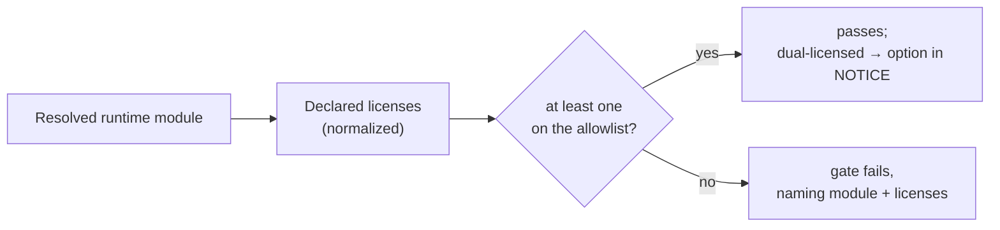

# ADR 0009: Project License

Status: accepted (2026-09-26, introduced by `add-project-license`; this
document is FR9 of that change)

## Context

Until 2026-09-26 the repository carried no license, which under copyright law
means "all rights reserved": nobody could legally run, copy, or build on the
factory, and an adapter author compiling against `gnomish-plugin-api` had no
terms to rely on, although that module's POM already declared Apache 2.0. The
`LICENSE` file landed that day.

Two artifacts are distributed: the `:bootstrap` boot jar and the
`:gnomish-plugin-api` jar. The boot jar nests about thirty third-party jars
unmodified. Their runtime inventory was audited on 2026-09-26 and is clean:
every shipped library is Apache-2.0 or MIT, except two that are offered under
a choice of licenses — Logback (`EPL-2.0` or `LGPL-2.1-only`) and Jakarta
Annotations (`EPL-2.0` or `GPL-2.0 with Classpath Exception`).

Maven POM `<licenses>` is a flat list. Logback's own license page says the
correct SPDX form is `EPL OR LGPL-2.1` and that its POM cannot express the
`OR`, so every tool reading Maven metadata sees two licenses and must decide
what a list of them means.

## Decision

### Apache License 2.0

The factory and the plugin contract are licensed under the Apache License,
Version 2.0. It permits closed-source adapters built against
`gnomish-plugin-api`, and its patent grant protects the authors of those
adapters. The root `LICENSE` and `NOTICE` are the only copies; both
distributed jars carry them byte for byte under `META-INF/`, wired by one build
convention, and the published POM declares the same license. `NOTICE` stays
minimal in the Apache Software Foundation sense: product name, copyright line
(`The Gnomish Factory Authors`), the license statement, the statement that
bundled libraries travel unmodified with their own notices, and the option
taken for each dual-licensed dependency. It lists no versions and no other
dependency. The `project-licensing` capability owns these requirements.

### The dual-license rule

A choice of licenses (SPDX `OR`) is the licensee's choice. Because a POM
cannot say `OR`, tooling reads several declared licenses as "at least one
accepted": a module passes the gate when one of its licenses is on the
allowlist. The project then takes that permissive option and records it in
`NOTICE` — for Logback and Jakarta Annotations, EPL-2.0 — so a compliance
reviewer who finds an LGPL string in Logback's metadata reads the answer in
`NOTICE` and here.

### LGPL is not on the allowlist

The allowlist accepts Apache-2.0, MIT, BSD-2-Clause, BSD-3-Clause, EPL-1.0,
EPL-2.0, MPL-2.0, CDDL-1.0, CDDL-1.1 and GPL-2.0 with Classpath Exception. It
accepts no LGPL, GPL or AGPL in any version. LGPL is linkable in principle,
but its terms rest on a separate-library boundary the user can replace, and a
fat jar that nests the library blurs that boundary. A module whose only
licenses are copyleft therefore fails the gate; a module that offers LGPL
beside an accepted license passes on the accepted one.

The allowlist spells each license as the gate's default normalizer bundle
names it, not as an SPDX identifier, so a spelling variant in a POM is never
a violation. Switching to the plugin's SPDX normalizer bundle is a one-line
change in the gate's convention plugin plus a rewrite of the allowlist to SPDX
spellings.

Adding a permissive license (ISC, 0BSD, Unicode) is one allowlist line with
its reason and needs no amendment of this ADR; adding a copyleft license does.
A rule scoped to one module or one version is an exception and carries its
reason beside it; the shipped inventory needs none.

### What the gate covers

The gate reads the `runtimeClasspath` of the two distributed modules and
nothing else. The `quality-gates` capability owns it.

- **Out-of-process tools are not distributed.** `git`, `docker`, and the agent
  CLIs run as subprocesses. The project never ships them; the operator
  installs them — the agent CLI a sandbox image installs is brought by the
  operator under its vendor's terms.
- **Test- and build-only dependencies are out of scope.** Spock, WireMock,
  Jetty, JUnit, PIT, Error Prone, Spotless and japicmp never reach a
  distributed jar, so their licenses place no obligation on a redistributor.
- **The gate is not part of `./gradlew check`.** The license-report plugin
  supports neither the configuration cache nor parallel project execution,
  both on in `gradle.properties`, so it runs in its own CI workflow as
  `./gradlew checkLicense --no-configuration-cache --no-parallel`. Revisit
  this when the plugin's changelog announces configuration-cache support: the
  gate can then move into `check`.

### Contributor License Agreement

External contributions require a signed individual CLA, drafted from the
Apache Individual CLA, checked on every pull request by an in-repository
workflow that records signatures in the repository itself. The CLA grants
the project the right to relicense contributions, which a Developer
Certificate of Origin (DCO) does not. The decision is reversible in one
direction only: the project can later drop the CLA for a DCO at no cost, but
contributions accepted under a DCO can never be relicensed without every
author's consent. A corporate CLA is added when a company contributor
appears. Pull requests are not accepted for now; the check is in place for
the day they open.

## Consequences

- Every use of the factory and of the plugin contract is covered by one
  license, stated identically in the repository root, in both jars, and in
  the published POM.
- A redistributor meets Apache 2.0 §4(d) and EPL-2.0 §3.2 by copying `NOTICE`.
- A dependency whose only licenses are copyleft cannot reach a distributed jar
  without failing CI; a version bump that keeps a module's licenses needs no
  allowlist edit.
- A red license job needs a local run with two global flags switched off; a
  local `check` stays as fast as before.
- Each external contributor signs once, in one comment.

## Alternatives Considered

- **OSV-Scanner `--licenses`** on the existing lockfiles. Run on 2026-09-26
  with osv-scanner 2.6.0, it flagged Logback for `LGPL-2.1-only` although
  `EPL-2.0` was allowed: it checks each entry of the declared-license list
  separately and records a violation for any entry that fails. It also
  reported about 35 test- and build-scope packages as `non-standard` and
  cannot scope a Gradle lockfile to one configuration, so it would need a
  hand-maintained override per dual-licensed module and per unmapped test
  dependency. OSV-Scanner stays the CVE gate.
- **DCO instead of a CLA** — lighter for contributors, but it grants no
  relicensing right, which is the property the CLA exists for.
- **A hand-maintained list of third-party dependencies with versions** — it
  drifts with every Dependabot bump; the gate's generated inventory, attached
  to every CI run, is the complete list.

## See also

- `LICENSE`, `NOTICE`, `CLA.md`, `CONTRIBUTING.md` at the repository root.
- `config/allowed-licenses.json` — the one allowlist.
- `docs/guides/developer-guide.md` — "The license gate", the local
  reproduction.
- `docs/community-plugins.md` — third-party plugins, each under its own
  license.
