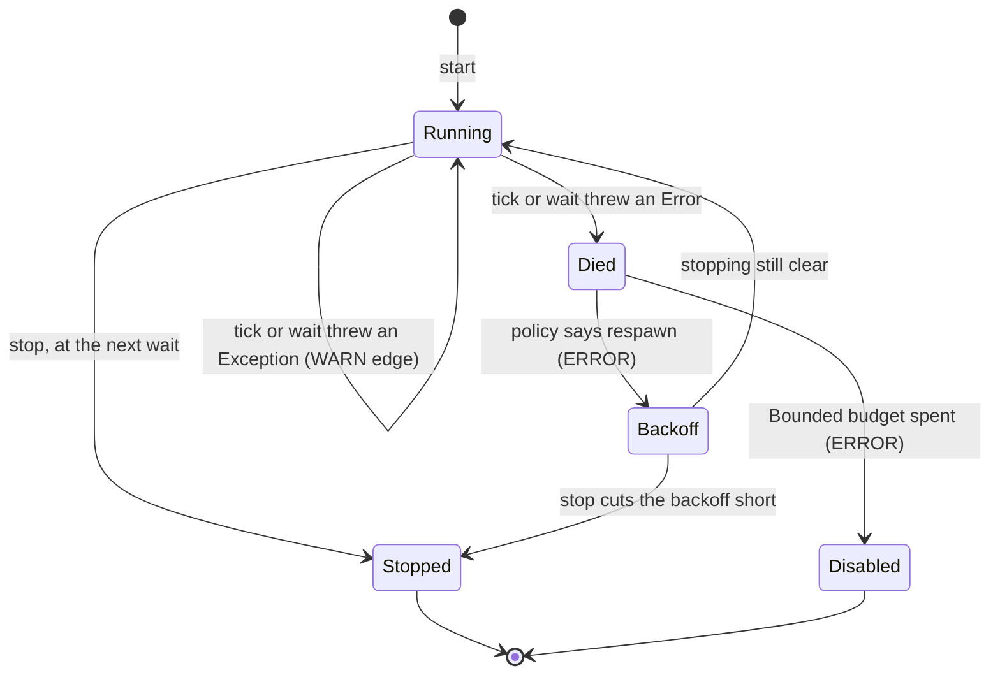

# ADR 0013: Supervised Daemon Loop

Status: accepted (2026-10-09, introduced by `supervise-daemon-loops-and-embed-dashboard`; its
design D1–D3, D5 and D6 took these decisions, recorded here because a change's `design.md`
archives with the change and governs nothing afterwards); amended 2026-10-10 (D2 of the same
change, as amended: the guard catches `Exception`, and an `Error` ends the worker for the restart
policy to decide)

## Context

A **daemon loop** is a thread that lives as long as the process and repeats work on a cadence or
a signal. `gnomish serve` runs four: the standing reaper, the worktree janitor, the sandbox
lifecycle sweep and the snapshot writer; the embedded dashboard adds a fifth. When one of them
dies, nothing fails: the daemon keeps claiming and running tasks while one of its duties has
silently stopped.

**History.** The reaper was the first loop to die this way. It once rode the heartbeat thread,
which runs only while the instance holds a claim, so an idle or freshly restarted daemon never
reaped its own stale claims and sat idle for good. `fix-reaper-idle-liveness` gave it a thread of
its own and settled the shape for it alone: one `catch (Throwable)` around both the tick and the
wait, so an `Error` or a throwing sleeper never ends the loop (its D4); an uncaught-exception
handler that respawns the thread after a doubling backoff capped at 10 minutes, unbounded, with a
loud ERROR line per restart (its D5); and a `stopping` flag so a stop never races a respawn.

The other three loops kept the shape that change called a defect. The janitor and the sweep caught
only `RuntimeException`, slept outside the guard and had no stop, so shutdown never ended them.
The snapshot writer caught only `RuntimeException`, had no death handler, and spun without
waiting if its thread was ever interrupted. A dead writer leaves the snapshot stale while slots
keep working, and the dashboard then reports a dead daemon — a false alarm that invites the
operator to kill a factory with live work. Each loop held its own copy of the loop shape, and two
of them were a declared hand-synchronized pair.

## Decision

### One loop, held by composition (D1)

`app.daemon.SupervisedLoop` owns the thread, the order of tick and wait, the wait, the guard, the
stop and the restart. A loop class keeps its own tick and its own state, and holds one
`SupervisedLoop` built from a `LoopShape(DaemonComponent component, LoopOrder order, LoopWait
loopWait, RestartPolicy policy)`, its tick and the `TimeEquipment` it already holds (ADR 0014).

- `LoopOrder` is `TICK_THEN_WAIT` (the janitor, the sweep, the writer, the dashboard) or
  `WAIT_THEN_TICK` (the reaper, whose first run would repeat work of the startup path).
- `LoopWait` has two shapes: `FixedInterval(Sleeper, Duration)`, and `IntervalOrSignal(Duration)`
  for the snapshot writer, whose `signal()` backs `markDirty()` and whose surplus wakes coalesce.
- `DaemonComponent` names the loop: `reaper`, `janitor`, `sweep`, `snapshot`, `dashboard`.

### The guard catches `Exception`; an `Error` ends the worker and the policy decides (D2)

The tick and the wait each run inside `catch (Exception)`; after a failed tick the loop waits,
after a failed wait it ticks. Failures go to a `RepeatSuppressor` keyed by the component: the
first failure or a changed reason logs WARN, repeats log DEBUG with a periodic counted roll-up,
and the first clean tick after a streak logs one INFO recovery line. A clean tick also resets the
restart backoff. An `Error` is not caught: it leaves the guard, the worker thread dies, and the
restart policy (D5) decides — a respawn with backoff, or a give-up. The wait stays inside the
loop's control either way, so a throwing sleeper is an `Exception` edge and a stop never races the
death.

*Amended 2026-10-10.* The guard first caught `Throwable`, as `fix-reaper-idle-liveness` had
settled it for the reaper, and kept the restart policy for "whatever still escapes" — which was
only the guard's own reporting (a message that throws, a logger fault). Two mechanisms covered one
concern, and the second was reachable only through a crack in the first; every spec of the restart
path had to kill the worker with a message-throwing fixture, in 37 places across 15 spec files.
The sources draw the line where it is drawn now: a worker catches what it can recover from and
lets the rest end the thread for a handler to decide (*Java Concurrency in Practice* §7.3,
`ThreadPoolExecutor.runWorker`, Akka's default decider), and `Error` is "serious problems that a
reasonable application should not try to catch" (its javadoc; *Effective Java* item 70; Sonar
S1181; CERT ERR08-J). A death is no longer silent — it is an ERROR line, a backoff and a respawn —
so the total guard only duplicated D5 and hid it from every test.

The suppressor is the loop's own. `SupervisedLoop` builds it from its equipment's clock, with a
roll-up period from `RollUpPeriod.forInterval`: six of the loop's intervals, never less than the
catalog default. A period equal to the tick would be no suppression at all — every repeat would
outlive it. The heartbeat, which is not a supervised loop, takes its period from the same
function, so the rule has one owner.

### Interrupts are handled once, and a stop never interrupts a tick (D3)

Before and after every wait the loop checks `stopping`: if set, it ends quietly — no WARN, no
ERROR, no respawn. Otherwise a set interrupt flag is cleared, logged once as a stray interrupt,
and the loop waits a full interval again, so an interrupt never becomes a tick without a wait. A
stop sets `stopping` first and then cuts short only a wait in progress (an interrupt for a
sleeper, a signal for `IntervalOrSignal`); a tick in progress completes. `stopAndJoin()` joins
every worker, including one respawned while it joined, which keeps the snapshot writer's final
`stopped` write the last write. The lock in `LoopControl` guards state only and holds nothing
blocking (`.claude/rules/lock-scope.md`); the respawn follows that rule's three-phase shape.

### Restart policies (D5)

When an `Error` ends the worker (or, the rare case, the guard's own reporting throws), its
uncaught-exception handler asks the loop's `RestartPolicy`, a sealed type over `RestartBackoff`
(moved from `app.lease`):

- **`Unbounded(base)`** respawns after a doubling backoff from `min(base, cap)`, logging
  ERROR with the lifetime restart count. It never gives up. The cap is not a parameter: every
  loop shares `RestartBackoff.MAX_BACKOFF` (ten minutes), so no owner spells its own copy.
- **`Bounded(base, maxRestarts, window, clock)`** respawns the same way, but a death that
  would make more than `maxRestarts` restarts within `window` logs one ERROR that the loop is
  disabled, and the loop stays down.

### Operator events belong to the loop; the `component` key names it (D6)

`LoopEvents` is the one call site of each code: `DAEMON_LOOP_TICK_FAILED` (GF152, also used for
a failed wait), `DAEMON_LOOP_STRAY_INTERRUPT` (GF153), `DAEMON_LOOP_WORKER_DIED` (GF154),
`DAEMON_LOOP_GAVE_UP` (GF155) and `DAEMON_LOOP_BACKOFF_SLEEP_FAILED` (GF156). Every line carries
the loop's `component` MDC key, so `grep component=janitor` still isolates one loop. The per-loop
codes these replace (the reaper's, the sweep's, the janitor's and the snapshot writer's own) are
retired and never reused; the "Retired codes" subsection of the observability operator guide
lists each one with its replacement and its `component` filter. Codes raised inside a tick stay with their sites.

## The restart-policy choice

Every long-lived thread falls into one of three cases, and a new one is placed by this question:
what does its repeated death mean?

| Case                   | When                                                                      | Loops                                      |
|------------------------|---------------------------------------------------------------------------|--------------------------------------------|
| `Unbounded`            | the factory's correctness or the operator's view depends on the loop      | reaper, janitor, sweep, snapshot writer    |
| `Bounded`              | an optional loop whose repeated death means a bug a restart will not cure | dashboard: 5 restarts in 10 min, base 10 s |
| unsupervised by design | the thread's death is the designed degradation                            | the claim heartbeat                        |

- The **reaper** keeps base = its interval and cap = 10 min, so its `restartCount` vital and the
  dashboard alarm on it are unchanged. The janitor and the sweep fail mostly on transient causes
  (the file system, Docker). The **snapshot writer** uses base = its interval: one death is
  followed by a write within two intervals, inside the dashboard's `3 × interval` staleness
  window, so a single death never shows as a dead daemon; a writer that keeps dying does go stale,
  and its ERROR lines name it.
- The **dashboard** is the one optional loop, and its render is deterministic: dying five times in
  ten minutes is a bug, and an unbounded policy would only produce an endless ERROR stream. This
  follows the restart-intensity rule of OTP supervisors: a child that keeps dying is stopped.
- The **claim heartbeat** (`add-claim-heartbeat`) is deliberately not a supervised loop. If it
  dies, its claims stop being beaten, expire, and are returned by the reaper of some instance: the
  lease protocol (ADR 0002) is the recovery. Resurrecting it would hide that degradation.

## Enforcement

`DaemonLoopOwnerBoundarySpec` (`:bootstrap`) scans `application/src/main`: thread creation
(`Thread.ofVirtual(`, `Thread.ofPlatform(`, `new Thread(`) only in `SupervisedLoop.java` and four
files whose threads are finite or deliberately unsupervised (`HeldClaims`, `FeedCycle`,
`TakeBatch`, `ServeShutdownWiring`); no scheduler (`ScheduledExecutorService`, `Executors.newScheduled…`,
`new Timer(`) anywhere; `new RestartBackoff(` only in `RestartPolicy.java` and
`RemoteOutageProbeSchedule.java`; no loop file building its own `RepeatSuppressor`; the catalog
roll-up default read only in `RollUpPeriod.java`. Every allowlisted file is asserted reached.

## Alternatives Considered

- **`ScheduledExecutorService`.** A task that throws suppresses all its later runs without a word
  — the silent death this decision removes. It has no wait that a signal cuts short, which the
  snapshot writer needs, and no thread-death hook to hang a restart policy on.
- **An abstract base class.** It couples five unrelated ticks through inheritance, and the base's
  lifecycle leaks into every subclass's specs; composition leaves each tick and its specs where
  they were.
- **Per-loop operator codes passed in as parameters.** The log-contract gate requires a literal
  `OperatorEvent.X` at the site, so this needs five exemptions; per-loop logging callbacks are four
  near-identical log methods per loop, the copy this decision removes.
- **`catch (RuntimeException)` with the wait outside the guard.** Rejected for the wait, not for
  the catch type: a sleeper outside the guard kills the thread with no edge and no handler of the
  loop's own — the shape `fix-reaper-idle-liveness` named a defect. The wait stays inside the
  loop's control, so a throwing sleeper is an `Exception` edge.
- **`catch (Throwable)` around tick and wait** (the original D2, 2026-10-09). Its case is real:
  four loops once died silently from an `Error` or a throwing sleeper. But that argument predates
  the supervisor — a death is now an ERROR line, a backoff and a respawn — so the total guard only
  duplicated the restart policy and hid it from every test (amended 2026-10-10).
- **Escalating `VirtualMachineError` to a process exit**, as Cassandra's `JVMStabilityInspector`
  and Kafka's `FatalExitError` do. A different decision with a different cost for a factory
  holding live task slots; deferred to a change of its own. Here every `Error` goes through the
  policy.
- **Treating any interrupt as a stop.** A stray interrupt would end the loop silently.
- **`Unbounded` for the dashboard.** An endless ERROR stream for an optional view.

## Consequences

- A new daemon loop is a `LoopShape` and a tick; it inherits the guard, the stop, the restart and
  the logging, and the boundary spec fails a loop written any other way.
- A stop waits out a tick in progress, at most one file write for the writer and the dashboard.
- An `OutOfMemoryError` in a tick is a death with a backoff, not a continue: one ERROR line per
  death, bounded by the policy's cap, and a `Bounded` loop may give up on it. A JVM that is really
  out of memory fails louder elsewhere; whether a `VirtualMachineError` should end the process is
  deferred (Alternatives Considered).

## See also

- `.claude/rules/daemon-loops.md` — the checklist for adding or reviewing a loop
- `docs/glossary.md`: supervised daemon loop
- `docs/guides/operator-guide-observability.md`, "Retired codes"
- ADR 0002 (the lease the heartbeat's death falls back to), ADR 0014 (the loop's time)
