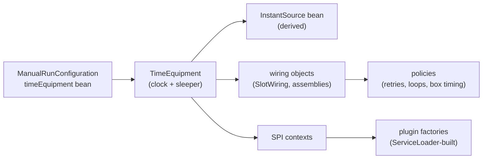

# ADR 0014: One Time Source

Status: accepted (2026-10-09, introduced by `supervise-daemon-loops-and-embed-dashboard`; its
design D16–D21 took these decisions, and D22 the two leaves the parameter limit had pushed into
hiding — recorded here because a change's `design.md` archives with the change and governs
nothing afterwards)

## Context

Every policy the factory builds from time — a retry, a repeat suppressor, a loop's wait, a box's
exec deadline, a claim marker's stamp — needs to run on virtual time under test, or its spec
either waits out a production bound or pins two clocks to one instant by hand.

**History.** `add-stage-engine` (design D8) introduced an injected `Clock` and `Sleeper` so poll
loops and stamps were deterministic under Spock. The `Clock` became a domain port,
`domain.engine.port.Clock` with one method `now()`, adapted by `domain.engine.time.SystemClock`.
It was written for exactly the reason the JDK added `java.time.InstantSource` in JDK 17
(JDK-8266847): a source of `Instant` without the zone and tick surface of `java.time.Clock`. But
`InstantSource` appeared in no artifact of this repository, so infrastructure code took
`java.time.Clock` instead, and the codebase grew two types for "now":

- the port in 42 production files, `java.time.Clock` in 37, a bean of each in the root;
- bridges both ways (`SystemClock`; later `SuppressorClock`), and components that built a third
  clock beside an injected one — the claim heartbeat ran its repeat suppressor on
  `Clock.systemUTC()`, so its roll-up never saw the time its beats were judged by (FR19);
- six GitHub marker writes and `GitTaskRepository.createTask` stamping `Instant.now()` with no
  seam (FR20), and some twenty `X.system()` factories called from ordinary constructors;
- three test fakes, eleven specs holding two clocks, and a test gate that matched only `.system(`.

Once the clock half was swept, the **sleeper half** was found lying exactly where the clock had
been: seven `new ThreadSleeper()` sites outside the root, two surviving `system()` factories,
eight signatures carrying the instant source and the sleeper as two parameters, and three places
that hid one half in a field because the signature was at the parameter limit (D20, D22).

## Decision

### One type, one carrier, one source

- **One type for "now": `java.time.InstantSource`** (D16). The domain port and `SystemClock` are
  deleted; every `java.time.Clock` parameter narrows to `InstantSource`, which `Clock` already
  implements. Domain purity is not at stake: the port already returned `java.time.Instant`. The
  JDK's API note states the practice: pass an `InstantSource` into any method that requires the
  current instant.
- **One carrier for real time's two halves: `TimeEquipment`** (D20), `record
  TimeEquipment(InstantSource clock, Sleeper sleeper)` in `:domain` (`engine/time`), with
  `remaining(deadline)` and `sleepUntil(deadline)` — the two-member computations every bounded
  loop used to spell privately. A component that needs both halves takes it whole; one that only
  reads the instant (`RepeatSuppressor`) takes the `InstantSource`; a waiting-only leaf takes the
  sleeper of its owner's equipment. The `Sleeper` port itself is unchanged (NG9).
- **One production source: the composition root** (D17). The `timeEquipment` bean in
  `:bootstrap`'s `ManualRunConfiguration` — `new TimeEquipment(InstantSource.system(), new
  ThreadSleeper())` — is the one line of real time in the process; the `InstantSource` bean is
  derived from it. Every other component receives it through the wiring it already takes.
- **The real sleeper lives in the root.** `ThreadSleeper` is in `:bootstrap`, so outside the root
  it is unconstructible: the sleeper half of the rule is a compile error, not a grep. No `static
  … system()` factory that wires time exists; each policy takes the equipment in its
  constructor, and a policy built on it has one producer, derived where the time is: the slot's
  `TerminalWriteRetry` is built by `SlotWiring.terminalWriteRetry()` from the slot assembly's
  equipment and dispatched through `SlotWiring.outcomeDispatch()` (D22, task 3.9). A component
  never takes a time value beside a policy built from time elsewhere — it takes the one and
  derives the other.

### Plugins receive the host's equipment through their SPI context (D21)

`TrackerAdapterFactory` and `CheckClientFactory` are built by `ServiceLoader` through a public
no-arg constructor, so nothing reaches them before `create`. Each has exactly one `create`,
taking a host-implemented context (`TrackerAdapterContext`, `CheckClientContext` in
`gnomish-plugin-api` 0.11.0) whose `timeEquipment()` hands the plugin the time the host itself
runs on — and virtual time under test (`FixedTrackerAdapterContext`, `FixedCheckClientContext`).
A collaborator the host adds later is a new accessor on the context, never an overload: an
overload chain lets an implementor override an older link and keep stamping with time it builds
itself, which is the FR19 defect inside a plugin.

### Wall time and monotonic time stay two seams (D19)

`InstantSource` is wall time: stamps, and intervals a human reads or that are measured against a
stamp. Elapsed time measured for its own sake belongs to `System.nanoTime()` or the
`app.lease.MonotonicTime` seam (`SystemMonotonicTime`; the reaper's staleness memory uses it),
as Kafka's `Time` and Micrometer's `Clock` keep the two apart. The raw `nanoTime` reads below are
declared, not hidden clocks; neither gate scans for them, and routing them through
`MonotonicTime` is a later change (NG8).

| Site (production file)                                    | Reads | What it measures                                   |
|-----------------------------------------------------------|-------|----------------------------------------------------|
| `application/.../app/TakeDispatcher.java` (explicit take) | 1     | wall time of one `take` run, for the task summary  |
| `application/.../app/TakeDispatcher.java` (bare take)     | 1     | wall time of one bare `take` run, for the summary  |
| `application/.../app/serve/TakeSlotRunner.java`           | 1     | wall time of one serve slot's task                 |
| `application/.../status/SummaryAccumulatorListener.java`  | 2     | run start, for the engine-event summary            |
| `application/.../status/WallTime.java`                    | 1     | the shared elapsed computation the three above use |
| `adapters/git/.../adapter/git/GitProcessRunner.java`      | 2     | one git subprocess's duration (access log)         |
| `adapters/.../adapter/check/CommandProcessRunner.java`    | 2     | one check command's duration (access log)          |
| `sandbox/docker/.../environment/DockerCli.java`           | 2     | one Docker CLI call's duration (access log)        |

Seven sites in six files (`TakeDispatcher` holds two, one per entry point); each reads the start
and, except where `WallTime` computes it, the end. The common reason: a duration must not move
when the wall clock is stepped mid-run — `TaskSummary` rejects a negative duration.

**Deliberate wall-time intervals.** Two intervals are measured on the `InstantSource` on
purpose: the repeat suppressor's roll-up period (it reports about stamped state, and FR19 requires
the interval and the stamps on one source), and the restart window of a *Bounded* supervised
loop's restart policy (`RestartPolicy.Bounded`), which counts deaths an operator reads in the log.
Both tolerate a stepped clock: the worst case is one early or late roll-up line, or one restart
counted in or out of the window.

### Two gates, a declared pair

- **`TimeSourceOwnerBoundarySpec`** (`:bootstrap`) scans every module's `src/main` (comments
  stripped; `test-fixtures`, `build-logic`, `build-checks` excluded) for `Clock.systemUTC(`,
  `Clock.systemDefaultZone(`, `InstantSource.system(`, `Instant.now(` (dot escaped: a declared
  `Instant now()` is not a read), `new SystemClock(`, `new ThreadSleeper(` and `.system(`. The
  allowlist is exact in both directions: `ManualRunConfiguration.java` (the equipment bean) and
  `EgressAllowlist.java` (`HostResolver.system()`, not time). The same spec pins one producer for
  `new TerminalWriteRetry(` (`SlotWiring.java`), `new AbortHandler(` (`SlotWiringFactory.java`)
  and `new TakeOutcomeDispatch(` (`SlotWiring.java`), and bans `BooleanSupplier` in `application` and `bootstrap` `src/main`.
- **`checkTestTimeInjection`** (`TestTimeInjectionCheck`, `build-logic`) applies the same literal
  set to every test tree and to `:test-fixtures/src/main`; a legitimate use carries the in-place
  `real-time-wiring:` justification (`.claude/rules/testing.md`, "Time is injected").

The build cannot load a test class, so the two hold the literal set twice; both carry the
`Kept in sync with` marker, and the boundary spec reads the check's source and fails when the
sets differ. The identity the decision claims is pinned end to end by
`HeartbeatOutageSuppressionSpec` (the heartbeat's roll-up and recovery on one virtual source) and
`FrozenTimeEquipmentRunSpec` (the shipped composition on a frozen equipment: every stamp of a
container run reads the frozen instant).

## Alternatives Considered

- **Keep the port, extending the JDK type** — `interface Clock extends InstantSource` with a
  default `instant()` delegating to `now()` (D16 a). Two names for one concept forever; a Spock
  `Stub(Clock)` does not run the default body, so a stubbed `now()` hands a suppressor a null
  `instant()`; PIT mutates the default method.
- **An empty marker interface** `interface Clock extends InstantSource {}` (D16 b). A domain-named
  type that adds nothing, and `:logtext` would still need the JDK type.
- **A permanent bridge** (`SuppressorClock`, D16 c). It fixes one meeting point of the two types
  and leaves the other twenty.
- **The literal gate alone, the pair as two parameters** (D20). Smaller, but it keeps every site
  one collaborator from the choice "eighth parameter, or hide a half" — the choice that produced
  the hidden halves. The gate guards a spelling; a carrier that is the only way to obtain a real
  sleeper guards the property. The literal gate is still kept for the JDK statics no type hides.
- **`system()` factories callable from any constructor, policed by the gate** (D17). Real time
  would stay inside the very classes whose specs run on virtual time.
- **One `Time` interface with wall and monotonic methods**, Kafka-style (D19). A sound end state,
  but not what the two-type defect needed, and the JDK offers no standard type for it.
- **A third `default create` overload for the equipment**, or listing the plugin factories as
  gate exemptions (D21 a, b). The overload chain is the defect; an exemption would make every
  stamp a plugin writes untestable on virtual time.

## Consequences

- A new time-dependent component takes `InstantSource` or `TimeEquipment` from its wiring; its
  spec builds `VirtualTimeEquipment` or `VirtualClock`. Nothing else compiles or passes the gates.
- A new plugin collaborator is a context accessor and a minor plugin-API bump.
- Routing the `nanoTime` reads through `MonotonicTime` is open work (NG8); until then the table
  above is their list, and a new raw read joins it with its reason.

## See also

- `.claude/rules/testing.md`, "Time is injected in tests, and the build checks it"
- `docs/glossary.md`: instant source, time equipment, SPI context
- ADR 0010 (the three questions `TimeEquipment` and `TerminalTransitions` answer)
