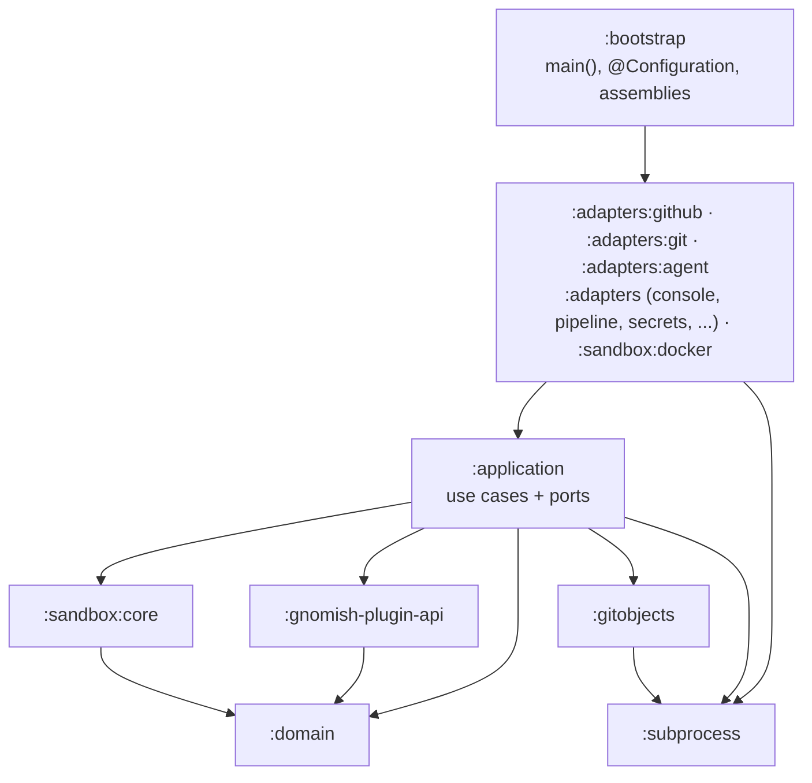

# Developer Guide: Module Structure and Build Gates

This guide is for a developer working on the factory itself: how the Gradle
module tree is laid out, what `./gradlew check` enforces, and how the
supply-chain gates (dependency locking, verification, the OSV scan) are operated.
The quick start — prerequisites and the one `check` command — is in the main
[README](../../README.md#building); this document carries the detail behind it.

## Module structure

<!-- implements FR1, FR2, FR4, UX1, UX2 of split-into-modules -->

The build is a layered Gradle module tree with a one-way dependency direction. Nothing points back up: the domain knows nothing about anything, adapters know the ports they realize, and only the composition root knows which realization is bound to which port.



The diagram shows the layers, not every edge. Notable specifics: `:adapters:github` is the strictest adapter — it sees only `:gnomish-plugin-api` and `:domain`, never `:application`; `:sandbox:docker` realizes the `:sandbox:core` port and is also consumed by the other adapter modules for environment wiring; `:bootstrap`, as the composition root, additionally reaches every lower layer directly. The exact permitted edge set is not this picture — it is declared per module and enforced (see below).

| Module                | Holds                                                                                                                         |
|-----------------------|-------------------------------------------------------------------------------------------------------------------------------|
| `:domain`             | the stage engine and the pipeline model — pure, no I/O, no framework                                                          |
| `:gitobjects`         | git-object plumbing shared below the adapter layer                                                                            |
| `:subprocess`         | the dependency-free JDK-only leaf: the one subprocess wait/kill/drain discipline (supervisor primitive + capture runner)      |
| `:gnomish-plugin-api` | the published third-party contract: tracker port, `SecretsProvider`, the adapter SPI ([README](../../gnomish-plugin-api/README.md)); its `sample` submodule is a minimal consumer of that contract |
| `:sandbox:core`       | the execution-environment port, capability passport and reconciliation                                                        |
| `:sandbox:docker`     | the docker-CLI and host backends behind that port                                                                             |
| `:application`        | the use cases (`run`, `take`, `serve`, `status`, `usage`, `board`, `dashboard`) and the ports they drive adapters through     |
| `:adapters:github`    | the GitHub vendor bundle: tracker and external-check clients over one shared HTTP core                                        |
| `:adapters:git`       | the git-subprocess adapter: task repository, attempt persistence, state-file mappers                                          |
| `:adapters:agent`     | the agent-CLI executor and judge voter                                                                                        |
| `:adapters`           | the coarse remainder: console, `.gnomish/` loader, check runners, secrets, pipeline law, the in-memory reference tracker      |
| `:bootstrap`          | the composition root: `main()`, `@Configuration`, assemblies, architecture tests                                              |
| `:test-fixtures`      | Spock fixtures shared across modules, consumed at test scope only                                                             |
| `build-logic/`        | an included build of convention plugins; every module build file is thin                                                      |

The direction is enforced, not documented: each module declares the sibling projects its production classpath may reach (`verifyModuleLayering`), the dependency-analysis plugin fails any undeclared or unused edge, and ArchUnit rules hold the package-level boundaries inside a module. A violation fails `./gradlew check` naming the rule and the offending edge.

## Per-module verification

<!-- implements FR11, NFR-P1, UX1 of split-into-modules -->

Working inside one module? Verify just that module — it runs that module's tests, coverage and mutation gate, and mutates **only** that module's production classes:

```bash
./gradlew :application:check      # everything, one module
./gradlew :application:pitest     # the mutation gate alone
```

There is no whole-tree mutation task: `./gradlew check` aggregates every module's run, which together cover the full production tree. For a one-shot full mutation report without the rest of `check`, use the opt-in aggregate `./gradlew pitestAll`.

Narrowing further is possible within a module via `-PpitScope=<comma-separated class globs>`; CI uses it to scope the gate to the classes a branch changed, and each module keeps only the globs it owns. Leave it unset locally — an unset run is the one that guarantees whole-module coverage.

Reports land per module: `<module>/build/reports/jacoco/test/html/index.html` and `<module>/build/reports/pitest/index.html`.

Formatting is applied automatically: a Claude Code hook formats files as the agent edits them, and a git pre-commit hook (installed into `.git/hooks/` by any `./gradlew check` run) formats staged files as a safety net. Manual fallback: `./gradlew spotlessApply`.

## Dependency locking and verification

<!-- implements FR1-FR5, NFR-R1, NFR-O1, NFR-S1, UX1, UX2 of add-dependency-verification -->

Dependency locking and verification are both active — after changing dependencies, run the combined regeneration command and commit the updated lockfiles and metadata together:

```bash
./gradlew check --write-locks --write-verification-metadata sha256
```

Locking (lockfiles, feeds the OSV scan below) pins *which versions* resolve; verification (`gradle/verification-metadata.xml`) pins *which bytes* those versions are — every artifact on every resolvable configuration, including Gradle plugins and `build-logic`, is checked by sha256. A build resolving an artifact that is missing from, or mismatches, the metadata fails naming the artifact and points at the command above; nothing from it executes. Running the command twice with no dependency change produces no diff, so a routine bump costs one command plus a diff review. `sources`/`javadoc` classifier artifacts are trusted by regex — they never execute, so IDE sync stays friction-free — and nothing else is exempted. There is no verification bypass anywhere in CI.

`build-logic` is a separate included build with its own lockfile (`build-logic/gradle.lockfile`). On a machine with a warm local Gradle cache, a version-catalog-only bump can leave that lockfile stale — the outer `check` sees `build-logic`'s compile classpath as up-to-date and skips re-resolving it, so `--write-locks` never touches it, and a subsequent build fails naming the unlocked version. If the combined command above reports a lock mismatch inside `:build-logic`, run `./gradlew -p build-logic dependencies --write-locks` once, then repeat the combined command to fold the new checksums into the verification metadata. A fresh clone (CI, a first-time reviewer checkout) has no warm cache and is not affected.

**Dependabot flow**: Dependabot ([`.github/dependabot.yml`](../../.github/dependabot.yml)) bumps versions only — it updates neither lockfiles nor verification metadata. On a Dependabot PR: check out its branch, run the combined command above, and push the lockfile + metadata commit; this is the existing reviewer-run step, not a second procedure, and the PR merges green.

**Threat model**: `gradle/verification-metadata.xml` is the build's trust anchor — changes to it are reviewed in PRs like any code change. It closes the residual documented in [`open-adapter-binding-registry`](../../openspec/changes/archive/2026/08/2026-08-19-open-adapter-binding-registry) (NFR-S1): post-[JEP 486](https://openjdk.org/jeps/486) there is no runtime boundary between classpath jars, so a malicious jar shipped under a trusted binding id with the expected sandbox passport could not be stopped at runtime — verification stops it at build time instead, before the jar ever reaches the JVM. It also covers compromised mirrors and Maven-hijack-class packaging attacks. It does not cover the Gradle wrapper jar (validated separately by `setup-gradle`'s `validate-wrappers: true` in CI, already active) and it checks bytes only, not publisher identity — PGP trusted keys are a deferred upgrade, not required while checksums close the tampered-bytes threat completely.

**Tamper test** (confirms the gate is fail-closed): corrupt a pinned artifact's checksum in `gradle/verification-metadata.xml` (or add an unlisted dependency), then run any task that resolves it — the build fails naming the artifact before any code from it executes, with a link to a detailed report; restore the metadata (or drop the dependency) afterward.

## The vulnerability gate (OSV)

<!-- implements FR9, UX4 of fix-osv-dependency-gate -->

The vulnerability gate reads those lockfiles, so it can be reproduced locally before pushing — same verdict CI produces, same suppressions ([osv-scanner.toml](../../osv-scanner.toml)). Regenerate lock state with the combined command above (plain `--write-locks` leaves verification metadata stale and the next `check` fails-closed on it), then scan:

```bash
osv-scanner scan source --config=osv-scanner.toml -r ./   # brew install osv-scanner
```

`--config` is not optional: the scanner otherwise looks for a config next to each lockfile, and the lock state lives in module directories, so the repo-root allowlist would be ignored. For the same reason there is exactly one allowlist — a per-module `osv-scanner.toml` would be shadowed by the explicit flag. An entry there is accepted risk on a test- or buildscript-scope artifact only and carries an expiry date; anything on a production classpath is fixed by pinning a version in [gradle/libs.versions.toml](../../gradle/libs.versions.toml) instead.

## CI

CI (GitHub Actions) runs `check`, CodeQL, OSV-Scanner, and Gitleaks on every push and pull request. **Secret scanning** and **Push protection** are enabled in the repository settings. The Gradle wrapper jar is validated by `setup-gradle`'s `validate-wrappers: true`.
