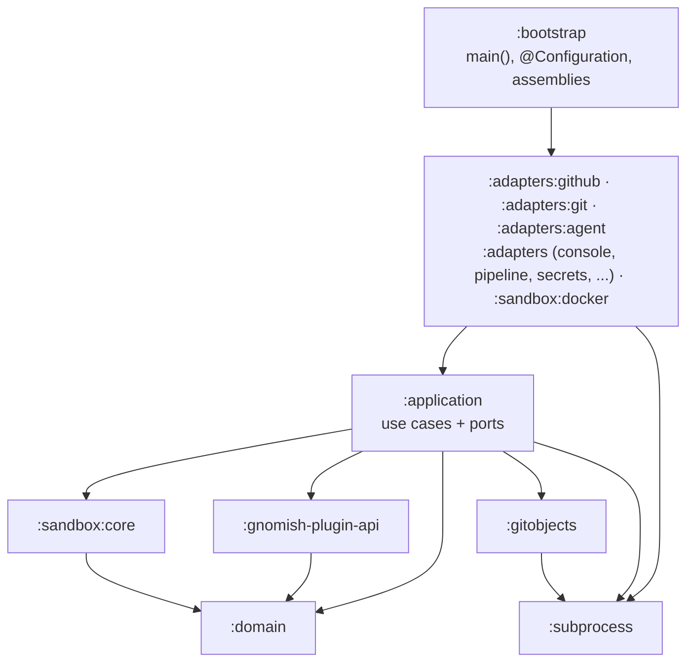

# Developer Guide: Module Structure and Build Gates

This guide is for a developer working on the factory itself: how the Gradle
module tree is laid out, what `./gradlew check` enforces, and how the
supply-chain gates (dependency locking, verification, the OSV scan, the license
gate) are operated, and how a release is cut.
The quick start — prerequisites and the one `check` command — is in the main
[README](../../README.md#building); this document carries the detail behind it.

## Module structure

<!-- implements FR1, FR2, FR4, UX1, UX2 of split-into-modules -->

The build is a layered Gradle module tree with a one-way dependency direction. Nothing points back up: the domain knows nothing about anything, adapters know the ports they realize, and only the composition root knows which realization is bound to which port.


```mermaid
flowchart TB
    bootstrap[":bootstrap<br/>main(), @Configuration, assemblies"]
    adapters[":adapters:github · :adapters:git · :adapters:agent<br/>:adapters (console, pipeline, secrets, ...) · :sandbox:docker"]
    application[":application<br/>use cases + ports"]
    api[":gnomish-plugin-api"]
    sandboxcore[":sandbox:core"]
    gitobjects[":gitobjects"]
    subprocess[":subprocess"]
    domain[":domain"]

    bootstrap --> adapters
    adapters --> application
    adapters --> subprocess
    application --> api & sandboxcore & gitobjects & domain
    application --> subprocess
    gitobjects --> subprocess
    api --> domain
    sandboxcore --> domain
```

The diagram shows the layers, not every edge. Notable specifics: `:adapters:github` is the strictest adapter — it sees only `:gnomish-plugin-api` and `:domain`, never `:application`; `:sandbox:docker` realizes the `:sandbox:core` port and is also consumed by the other adapter modules for environment wiring; `:bootstrap`, as the composition root, additionally reaches every lower layer directly. The exact permitted edge set is not this picture — it is declared per module and enforced (see below).

| Module                | Holds                                                                                                                                                                                              |
|-----------------------|----------------------------------------------------------------------------------------------------------------------------------------------------------------------------------------------------|
| `:domain`             | the stage engine and the pipeline model — pure, no I/O, no framework                                                                                                                               |
| `:gitobjects`         | git-object plumbing shared below the adapter layer                                                                                                                                                 |
| `:subprocess`         | the dependency-free JDK-only leaf: the one subprocess wait/kill/drain discipline (supervisor primitive + capture runner)                                                                           |
| `:gnomish-plugin-api` | the published third-party contract: tracker port, `SecretsProvider`, the adapter SPI ([README](../../gnomish-plugin-api/README.md)); its `sample` submodule is a minimal consumer of that contract |
| `:sandbox:core`       | the execution-environment port, capability passport and reconciliation                                                                                                                             |
| `:sandbox:docker`     | the docker-CLI and host backends behind that port                                                                                                                                                  |
| `:application`        | the use cases (`run`, `take`, `serve`, `status`, `usage`, `board`, `dashboard`) and the ports they drive adapters through                                                                          |
| `:adapters:github`    | the GitHub vendor bundle: tracker and external-check clients over one shared HTTP core                                                                                                             |
| `:adapters:git`       | the git-subprocess adapter: task repository, attempt persistence, state-file mappers                                                                                                               |
| `:adapters:agent`     | the agent-CLI executor and judge voter                                                                                                                                                             |
| `:adapters`           | the coarse remainder: console, `.gnomish/` loader, check runners, secrets, pipeline law, the in-memory reference tracker                                                                           |
| `:bootstrap`          | the composition root: `main()`, `@Configuration`, assemblies, architecture tests                                                                                                                   |
| `:test-fixtures`      | Spock fixtures shared across modules, consumed at test scope only                                                                                                                                  |
| `build-logic/`        | an included build of convention plugins; every module build file is thin                                                                                                                           |
| `build-checks/`       | an included build of the project's own Error Prone checks (`ParameterCountLimit`); `java-conventions` puts them on every module's processor path                                                   |

The direction is enforced, not documented: each module declares the sibling projects its production classpath may reach (`verifyModuleLayering`), the dependency-analysis plugin fails any undeclared or unused edge, and ArchUnit rules hold the package-level boundaries inside a module. A violation fails `./gradlew check` naming the rule and the offending edge.

## Per-module verification

<!-- implements FR11, NFR-P1, UX1 of split-into-modules -->
<!-- implements FR1, FR2, FR3, FR4, NFR-O1, NFR-R1, UX1, UX2, UX3 of scope-pit-locally -->

Working inside one module? Verify just that module — it runs that module's tests, coverage and mutation gate, and never mutates another module's classes:

```bash
./gradlew :application:check      # everything, one module
./gradlew :application:pitest     # the mutation gate alone
```

What the mutation gate mutates is decided once per build by one owner in `build-logic` (`MutationScopeSource`), the same way on your machine and in CI. There are three modes, chosen by the `pitScope` property:

**Branch (the default — no property).** Each module mutates the production classes whose source files differ between your working tree and the scope base — committed, staged, unstaged and untracked changes alike, so uncommitted work is covered. The base is the merge base of `HEAD` with `main` (else `origin/main`); on the branch `main` itself it is `HEAD`'s first parent, so the last merge is what gets mutated. A branch with no commits of its own keeps `HEAD` as the base and mutates only the uncommitted work. A module the branch did not touch skips its mutation gate entirely — its verdict and report tasks too, so a report an earlier run left behind is never judged. Two changes widen the scope, because a weakened test can hide a survivor anywhere it reaches: a changed file under a module's `src/test/` mutates that module's whole production tree, and a changed file under `test-fixtures/src/` mutates every module's whole tree. A deleted production file contributes nothing. If no base can be resolved — no `main` or `origin/main`, a root commit, not a git checkout — the build mutates the whole tree: a scope the build cannot justify is always wider, never narrower.

**Whole tree (`-PpitScope=all`, or `./gradlew pitestAll`).** Every module mutates its full production tree. `pitestAll` is the opt-in aggregate that runs every module's mutation gate without the rest of `check`, and it implies the whole tree whatever `pitScope` says.

**Explicit (`-PpitScope=<comma-separated class globs>`).** Each module mutates only the globs that match classes it owns, and skips its gate when none do — useful for re-running one class: `./gradlew :adapters:git:pitest -PpitScope=com.github.oinsio.gnomish.adapter.git.GitProcessRunner`.

Every build that runs a mutation task logs one line saying what was scoped and why, for example `PIT scope: branch — base 3f2c1a7 (merge-base main) — adapters/git: 3 classes, application: whole module (test change) — 17 modules skipped`. Check it against `git status` when a verdict surprises you.

The branch scope trades one risk for speed: a mutant in an unchanged class can start surviving because of a change elsewhere. The nightly whole-tree run in CI (see [CI](#ci)) is the guarantee that closes it — it mutates everything on `main` once a day and opens an issue when that fails.

Reports land per module: `<module>/build/reports/jacoco/test/html/index.html` and `<module>/build/reports/pitest/index.html`.

Formatting is applied automatically: a Claude Code hook formats files as the agent edits them, and a git pre-commit hook (installed into `.git/hooks/` by any `./gradlew check` run) formats staged files as a safety net. Manual fallback: `./gradlew spotlessApply`.

## CRAP report (advisory)

`./gradlew crapReport` scores every production method by CRAP (Change Risk Anti-Patterns) — `CC² × (1 − coverage)³ + CC`, where `CC` is cyclomatic complexity — and prints the methods that exceed the threshold. It is a developer tool, not a gate: it is outside `check` and never fails the build.

- **What it reads.** One JaCoCo XML report aggregated across the build (`jacoco-report-aggregation` in the root project, `build/reports/jacoco/testCodeCoverageReport/`), so a class covered only by `:bootstrap`'s suites is not scored as uncovered. Producing it runs every module's `test`, Docker suites included; a build whose tests are cached costs seconds.
- **The tool.** [open-crap4j](https://github.com/ChrisEdwards/open-crap4j) (`com.architester.crap4j`, wired in `build-logic/.../crap-conventions.gradle`). It takes both numbers from JaCoCo's bytecode counters — complexity from `COMPLEXITY`, coverage from branches where a method has any — so complexity runs higher than source-level counts: a string `switch` or `try`-with-resources adds branches. Lambda bodies are folded into the method that declares them.
- **Defaults.** CRAP threshold 15 and a complexity cap of 15: a method above either is listed. With the mutation gate holding coverage near 100%, CRAP here is mostly CC, so the cap and the PIT-exempt classes (`excludedClasses`, `@DoNotMutate`) are where the report has something to say.
- **Run it on its own.** The report reads whatever execution data each module's last `test` left. A filtered run (`--tests …`) in the same invocation, or just before, replaces a module's coverage with that of one spec and inflates the violations. Run `crapReport` by itself.
- **Output.** The console summary, and every scored method in `build/reports/crap4j/crapReport/report.json`.

## Dependency locking and verification

<!-- implements FR1-FR5, NFR-R1, NFR-O1, NFR-S1, UX1, UX2 of add-dependency-verification -->

Dependency locking and verification are both active — after changing dependencies, run the combined regeneration command and commit the updated lockfiles and metadata together:

```bash
./gradlew check --write-locks --write-verification-metadata sha256
```

Locking (lockfiles, feeds the OSV scan below) pins *which versions* resolve; verification (`gradle/verification-metadata.xml`) pins *which bytes* those versions are — every artifact on every resolvable configuration, including Gradle plugins and `build-logic`, is checked by sha256. A build resolving an artifact that is missing from, or mismatches, the metadata fails naming the artifact and points at the command above; nothing from it executes. Running the command twice with no dependency change produces no diff, so a routine bump costs one command plus a diff review. `sources`/`javadoc` classifier artifacts are trusted by regex — they never execute, so IDE sync stays friction-free — and nothing else is exempted. There is no verification bypass anywhere in CI.

`build-logic` is a separate included build with its own lockfile (`build-logic/gradle.lockfile`). On a machine with a warm local Gradle cache, a version-catalog-only bump can leave that lockfile stale — the outer `check` sees `build-logic`'s compile classpath as up-to-date and skips re-resolving it, so `--write-locks` never touches it, and a subsequent build fails naming the unlocked version. If the combined command above reports a lock mismatch inside `:build-logic`, run `./gradlew -p build-logic dependencies --write-locks` once, then repeat the combined command to fold the new checksums into the verification metadata. A fresh clone (CI, a first-time reviewer checkout) has no warm cache and is not affected.

**Dependabot flow**: Dependabot ([`.github/dependabot.yml`](../../.github/dependabot.yml)) bumps versions only — it updates neither lockfiles nor verification metadata. On a Dependabot PR: check out its branch, run the combined command above, and push the lockfile + metadata commit; this is the existing reviewer-run step, not a second procedure, and the PR merges green.

**Threat model**: `gradle/verification-metadata.xml` is the build's trust anchor — changes to it are reviewed in PRs like any code change. It closes the residual documented in [`open-adapter-binding-registry`](../../openspec/changes/archive/2026/08/2026-08-19-open-adapter-binding-registry) (NFR-S1): post-[JEP 486](https://openjdk.org/jeps/486) there is no runtime boundary between classpath jars, so a malicious jar shipped under a trusted binding id with the expected sandbox passport could not be stopped at runtime — verification stops it at build time instead, before the jar ever reaches the JVM. It also covers compromised mirrors and Maven-hijack-class packaging attacks. It does not cover the Gradle wrapper jar (validated separately by `setup-gradle`'s `validate-wrappers: true` in CI, already active) and it checks bytes only, not publisher identity — PGP trusted keys are a deferred upgrade, not required while checksums close the tampered-bytes threat completely.

**Tamper test** (confirms the gate is fail-closed): corrupt a pinned artifact's checksum in `gradle/verification-metadata.xml` (or add an unlisted dependency), then run any task that resolves it — the build fails naming the artifact before any code from it executes, with a link to a detailed report; restore the metadata (or drop the dependency) afterward.

## The vulnerability gate (OSV)

<!-- implements FR9, UX4 of fix-osv-dependency-gate -->

The vulnerability gate reads those lockfiles, so it can be reproduced locally before pushing — same verdict CI produces, same suppressions ([osv-scanner.toml](../../osv-scanner.toml)). Regenerate lock state with the combined command above (plain `--write-locks` leaves verification metadata stale and the next `check` fails-closed on it), then scan:

```bash
osv-scanner scan source --config=osv-scanner.toml -r ./   # brew install osv-scanner
```

`--config` is not optional: the scanner otherwise looks for a config next to each lockfile, and the lock state lives in module directories, so the repo-root allowlist would be ignored. For the same reason there is exactly one allowlist — a per-module `osv-scanner.toml` would be shadowed by the explicit flag. An entry there is accepted risk on a test- or buildscript-scope artifact only and carries an expiry date; anything on a production classpath is fixed by pinning a version in [gradle/libs.versions.toml](../../gradle/libs.versions.toml) instead.

## The license gate

<!-- implements FR12, NFR-R1 of add-project-license -->

The dependency-license gate reads the `runtimeClasspath` of the two distributed modules (`:bootstrap` and `:gnomish-plugin-api`) and fails when a resolved module declares no license the one allowlist, [config/allowed-licenses.json](../../config/allowed-licenses.json), accepts. It runs in its own CI workflow, not in `check`: the license-report plugin supports neither the configuration cache nor parallel project execution, so both are switched off on the command line. Reproduce the CI verdict locally with the same command CI runs — the verdict depends only on the committed lock state, so it equals CI's:

```bash
./gradlew checkLicense --no-configuration-cache --no-parallel
```

The CI step runs the same invocation with the two distributed jars appended, `./gradlew checkLicense :bootstrap:bootJar :gnomish-plugin-api:jar --no-configuration-cache --no-parallel`, then compares each jar's `META-INF/LICENSE` and `META-INF/NOTICE` byte for byte with the root files. That comparison, and the presence check of the root files before it, is `scripts/check-distribution-terms.sh`; run `bash scripts/check-distribution-terms.sh identity bootstrap/build/libs gnomish-plugin-api/build/libs` after the build to reproduce it.

The report lands in `build/reports/dependency-license/`: `index.html` is the full inventory (every module with its normalized licenses), and `dependencies-without-allowed-license.json` lists each failing module (empty on a green run); the job log prints the same coordinates and declared licenses. CI attaches the whole directory to every run as the `dependency-license-report` artifact.

A violation means a module on a shipped classpath offers **no** accepted license. A module offering several licenses passes when one is accepted — that is how Logback (EPL-2.0 or LGPL-2.1) passes, with the option recorded in [NOTICE](../../NOTICE). LGPL, GPL and AGPL alone are never accepted; the reasons are in [ADR 0009](../adr/0009-project-license.md). To accept a new *permissive* license (ISC, 0BSD, Unicode), add one `moduleLicense` rule spelled exactly as the report's normalized name shows it, with a comment giving the reason; it needs no ADR amendment. A copyleft license, or a rule scoped to one module or version, is a policy change and goes through the ADR.

## CI

CI (GitHub Actions) runs `check`, CodeQL, OSV-Scanner, Gitleaks, and the license gate (with the `LICENSE`/`NOTICE` presence and jar-identity checks, see above) on every branch push and pull request — never on a tag push, so a release tag starts no second `check` (see *Releasing*). The CLA check runs on every pull request and blocks an unsigned contributor until they sign ([CONTRIBUTING.md](../../CONTRIBUTING.md)). **Secret scanning** and **Push protection** are enabled in the repository settings. The Gradle wrapper jar is validated by `setup-gradle`'s `validate-wrappers: true`.

The `check` run passes no mutation scope: the build scopes the gate to the branch's changes exactly as it does locally (see [Per-module verification](#per-module-verification)). Besides the JaCoCo and PIT reports, each run attaches a Gradle profile report as the `profile` artifact — the first place to look when asking where a run's time went.

<!-- implements FR6, NFR-S1, NFR-C1, UX4 of scope-pit-locally -->

**The nightly whole-tree run** ([`.github/workflows/pitest-nightly.yml`](../../.github/workflows/pitest-nightly.yml), *PIT nightly*) runs `./gradlew check -PpitScope=all` on `main` every day at 02:17 UTC and uploads the PIT reports as the `pit-report` artifact. It is the whole-tree guarantee behind the branch scope: a mutant in an unchanged class that stops dying because of a change elsewhere fails this run within a day. A commit the run has already verified is not mutated again — the job looks up a `nightly-verified-<sha>` cache entry and ends green before Gradle starts. Its token carries only `contents: read` and `issues: write`.

When it fails, it reports on the tracker: an open issue labelled `nightly-mutation` gets a comment, or a new one is opened when none is open. The body lists the failed Gradle tasks with the first line of each failure — for `pitestVerifyAllKilled`, the count of mutations that were not killed — and links the run and its `pit-report` artifact. The report is written by `scripts/nightly-mutation-issue.sh`. After fixing the survivor, run the workflow by hand (*Actions → PIT nightly → Run workflow*, or `gh workflow run pitest-nightly.yml`) and close the issue once it is green.

## Releasing

<!-- implements FR1, FR2, NFR-O1 of add-release-pipeline (design D6, D8) -->

A release is one pushed tag; `.github/workflows/release.yml` does the rest. The product version is the tag without its `v` — no file in the repository records it, and every other build reports `0.0.0-dev`.

1. Merge the change to `main`.
2. Wait for the CI run of the merge commit on `main` to finish green.
3. Optionally add the release notes file `docs/releases/v<version>.md` (merged like any change); without it the notes are generated from the merged pull requests.
4. Tag that commit and push the tag: `git tag v0.2.0 <sha> && git push origin v0.2.0`. A suffix (`v0.2.0-rc.1`) publishes a pre-release.

The workflow checks before it builds (`scripts/release-preflight.sh`); each failure is an annotation titled with the check:

| Check            | Message says                                         | Meaning and fix                                                                                       |
|------------------|------------------------------------------------------|-------------------------------------------------------------------------------------------------------|
| `Tag shape`      | `is not vMAJOR.MINOR.PATCH with an optional -suffix` | the tag is malformed (`v0.2`); delete it with `git push --delete origin <tag>` and push a correct one |
| `Commit on main` | `does not resolve`                                   | the checkout has no `origin/main`; the job's `fetch-depth: 0` was lost — restore it                   |
| `Commit on main` | `is not reachable from main`                         | the tag points at a branch commit; merge first, then tag the merged commit                            |
| `CI status`      | `could not list the ci.yml runs`                     | the GitHub API did not answer; re-run the release workflow                                            |
| `CI status`      | `no ci.yml run on a push to main exists`             | the commit never reached `main` by a push (or CI was skipped); tag a commit CI ran on                 |
| `CI status`      | `is still in_progress` (or `queued`)                 | CI has not finished; re-run the release workflow when it does                                         |
| `CI status`      | `concluded 'failure'` (or another conclusion)        | CI is red for that commit; fix `main` and tag a green commit                                          |

After the gate, the workflow builds the archives twice and fails on differing sums (`Reproducible archive`), checks that the unpacked `bin/gnomish --version` prints the tag's version (`Archive version`) and that the archive's `LICENSE`/`NOTICE` equal the root files, and only then attests and publishes. A failed run publishes nothing, so re-running it for the same tag is safe; the tag never moves.

**Tag protection** is a repository setting, set once by a maintainer: a ruleset restricting creation, update and deletion of `v*` tags to the Maintain and Admin roles.

```bash
gh api --method POST repos/oinsio/gnomish-factory/rulesets --input - <<'JSON'
{
  "name": "release tags",
  "target": "tag",
  "enforcement": "active",
  "conditions": { "ref_name": { "include": ["refs/tags/v*"], "exclude": [] } },
  "rules": [{ "type": "creation" }, { "type": "update" }, { "type": "deletion" }],
  "bypass_actors": [
    { "actor_id": 2, "actor_type": "RepositoryRole", "bypass_mode": "always" },
    { "actor_id": 5, "actor_type": "RepositoryRole", "bypass_mode": "always" }
  ]
}
JSON
```

`actor_id` 2 and 5 are GitHub's built-in Maintain and Admin repository roles; `gh api repos/oinsio/gnomish-factory/rulesets` lists the result.
