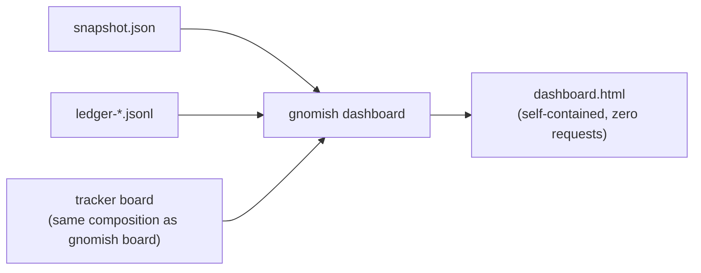

# Operator Guide: The Dashboard Page

<!-- implements UX1, UX2, UX3, UX4, U1, U2 of add-dashboard-page -->
<!-- implements NFR-O3, UX1, UX2 of add-serve-sandbox-lifecycle -->
<!-- implements FR1, FR2, FR3, FR6, FR7, FR9 of redesign-dashboard -->

This is the reference for `gnomish dashboard` — a single self-contained HTML
page composing four surfaces documented elsewhere in this guide: the
daemon snapshot ([`operator-guide-observability.md`](operator-guide-observability.md)),
the ledger history (same document), the tracker board
(["The `board` Command"](operator-guide.md#the-board-command-tracker-as-a-kanban-view)),
and the sandbox hygiene data
(["Keep, resume, cleanup"](operator-guide-sandbox.md#keep-resume-cleanup)).
It assumes those documents for what each block's data means; this page is
about the composition, not the sources.

## How the page is laid out

The page is a wallboard for an orchestrator where humans are exception
handlers, so it is ordered by how urgently a block can need you, and nothing
lower is allowed to be louder than something higher:

1. **Freshness strip** — full width, above everything: is what you are looking
   at current?
2. **Status line** — is the daemon running, and is anything alarming about it?
3. **Waiting for a human** — the only block that ever shouts.
4. **In progress** — what the gnomes are doing and what they will pick up next.
5. **Outcomes by day**, **Tokens**, **Sandbox hygiene** — quiet reference,
   consulted deliberately.

Blocks never appear or disappear with the data. A block with nothing to show
renders one sentence saying so — an empty escalation queue reads as a
deliberate all-clear, not as a blank region you have to interpret.

Timestamps render as a relative age that re-ticks every second, with the exact
instant on hover; with scripting disabled the server-rendered absolute instant
simply stays. Counts of 1000 and up are shown compactly (`25.6K`, `4.79M`) with
the exact value on hover, in tabular numerals so columns do not shift under a
refresh.

## The waiting-for-a-human and in-progress blocks

Both are fed by the same tracker board composition `gnomish board` uses, so a
row's semantics match what that command reports for the same task. They carry
the board's own fetch time, and they degrade together: a refresh failure keeps
the cached board with a notice, and a board that never fetched renders as
unavailable with the tracker failure summarized — while the status line and the
ledger-fed blocks keep reporting normally.

Waiting-for-a-human rows carry a glyph for the park reason category
(escalation / checkpoint / infra), the task id, and the task title. A field the
tracker port does not expose is dropped from the row rather than filled with a
placeholder: today that is the escalation reason text and the escalation
instant.

In-progress rows are one list over Working and Ready, distinguished by their
status dot and by what the row's trailing note holds — the holding instance and
claim age for a working row, the eligibility note (backoff deadline,
`finished`, WIP-held) for a ready one. A ready window capped at its limit still
says so.

## The outcomes and tokens blocks

Outcomes render as one full-width stacked bar per day over delivered /
awaiting-a-human / aborted / revoked. The bars show the **mix**, never the
volume: a two-outcome day and a twenty-outcome day span the same width so their
mixes compare directly, and the volume difference is carried by the numbers
beside them, where it cannot be misread as a difference in quality.

Tokens render per model as a stacked bar over cache-read / cache-creation /
input / output, captioned with the integer cache share first (`90% from cache ·
in 3.7K · out 28.8K`). A model with no cache traffic says the cache is not in
use rather than showing a 0%, which would read as a cache that exists and is
failing. Spend never uses the alarm palette — a large number is not an alert.

Nothing here adds a server, a socket, or an inbound endpoint (add-factory-serve
NG3): the command renders a file, once or on a loop, and a browser opens it
from `file://`.



## The sandbox hygiene block

The page's quietest block, placed last, answers one question: "is container
cleanup running?" It shows the last sweep tick's four-group breakdown —
cleaned, stopped, checked and untouched, skipped without a verdict — and the
tick's own time. With no sweep data it shrinks to a dashed footnote saying the
sweep has not run, never a table of zeroes that would read as a swept-and-clean
host.

Per-object depth is deliberately **not** on the page: no kept-environment
inventory with ages and time-to-reap, no stop/dispose actions table. That
detail stays with the snapshot, the ledger, and `gnomish status <id>`, which is
where you go when you want one object's history.

Hygiene **alerts** do not render in this block. They surface as alarm lines in
the status line at the top of the page, alongside the daemon's own conditions,
because that is where an operator already looks:

| Condition                  | Fires when                                                                 |
|-----------------------------|------------------------------------------------------------------------------|
| `sandbox sweep not running` | no tick has completed for longer than `k` × the sweep's own cadence            |
| `sandbox cleanup stalled`   | `n` consecutive ticks in a row reached no claim verdict — ticking, deciding nothing |
| `an instance died or hung`  | a **`tracked`** running box was stopped as an orphan, named with its task      |

The third one is a symptom, not a statistic: a routine `manual` age-policy stop
raises no alert at all — it appears in the block's category breakdown and
nowhere else — so the alert only ever means an instance holding a claim stopped
beating.

## Wall-display recipe (`--watch`)

```bash
gnomish dashboard --watch --dir /srv/acme/widgets
```

Open the output file in a browser tab once (`file:///home/you/.gnomish/serve/
<instance-name>/dashboard.html` by default) and leave the tab open. The
command re-renders the file every **10 s** and bakes a matching
`<meta http-equiv="refresh">`, so the tab reloads itself from disk — no
JavaScript polling, no server, nothing but the browser's own `file://` reload.

**Two independent staleness layers**, so the wall never quietly goes out of
date:

- **Daemon staleness (data layer)** — computed the same way as the
  dead-man's-switch rule 1 in
  [`operator-guide-observability.md`](operator-guide-observability.md#the-dead-mans-switch-monitor-ux3-design-d9):
  the snapshot's own `writtenAt` + `intervalSeconds` say whether the daemon
  itself has gone quiet. A dead daemon puts an alarm line in the status line —
  every other block keeps reporting normally.
- **Page staleness (view layer)** — the page bakes its own `generatedAt`, and
  the script re-checks it against the browser's own clock **every second**. If
  the page hasn't been regenerated for more than **`k = 3` × the render cadence
  (~30 s)**, the freshness strip turns to the alarm palette with an upward
  counting "renderer silent for …" and the cards dim. This is what catches a
  dead renderer process — meta-refresh alone would just keep reloading a file
  nobody is writing to anymore, so the tab would look current when it isn't.

Staleness **degrades** the page and never covers it: the cards dim but stay
readable, so the last known state is still there to read while you work out why
the renderer stopped. There is no full-viewport banner.

An alarm line in the status line and a red freshness strip mean different
things and never get confused: one says the daemon is stale, the other says the
page you are looking at is stale (UX3).

The board-fed blocks refresh on their own slower cadence — **60 s** — and show
the last cached board model with its fetch time between refreshes, so an
all-day open tab costs one tracker read pair (`listReady` + `listOpen`) every
60 s, not every 10 s render.

The ledger-fed blocks aggregate the last **7 days** of ledger files, re-read
every render cycle (local files, effectively free).

## Ticket-snapshot recipe (one-shot, `--out`)

```bash
gnomish dashboard --out incident.html --dir /srv/acme/widgets
```

Without `--watch`, the command renders once and exits — no loop, no
meta-refresh. Attach the single `incident.html` file to a ticket or escalation
comment: it opens identically for the reviewer, with no other files needed
(the page is fully self-contained — no external requests, nothing else to
send along). Its freshness strip reads "one-shot snapshot · taken N min ago":
the age is plain information, and the stale degradation never engages. A
one-shot page is a point-in-time record, meant to stay reviewable long after
capture, not a live view that can go stale.

## Output location

Default output is `dashboard.html` inside the instance's observability
directory, `~/.gnomish/serve/<instance-name>/` — the same directory the
daemon writes `snapshot.json` and the ledger into (see
[`operator-guide-observability.md`](operator-guide-observability.md#where-the-files-live)).
`--out <path>` overrides it. `--dir <clone>` resolves configuration (tracker,
instance name) exactly as `gnomish board` and `gnomish take` do.

## Documented constants

| Constant                 | Value | Meaning                                                      |
|---------------------------|-------|----------------------------------------------------------------|
| Render / refresh cadence  | 10 s  | `--watch` re-render interval and meta-refresh period           |
| Board refresh cadence     | 60 s  | how often the tracker board re-fetches for its two blocks      |
| Page-staleness multiplier | k = 3 | freshness-strip threshold: no re-render for `k ×` cadence (~30 s), re-checked every second |
| History window            | 7 days | ledger days aggregated into the outcomes and tokens blocks    |
| Sweep-staleness multiplier | k = 3 | `sandbox sweep not running` threshold: no tick for `k ×` the sweep's own cadence, which travels in the snapshot as `vitals.sweep.intervalSeconds` |
| Consecutive-skipped threshold | n = 3 | `sandbox cleanup stalled` threshold: ticks in a row reaching no claim verdict |
| Kept-inventory bound      | 20 rows | kept environments the snapshot records, **oldest first**; not rendered on the page since redesign-dashboard |
| Sweep-action bound        | 20 rows | sweep actions read from the ledger window; feed the dead-instance alert, not a page table |

These are constants of the command, not configuration — there is no flag to
change them (design D4/D5). The two sandbox thresholds deliberately need no
daemon configuration: the sweep's own cadence travels *in* the snapshot, so the
page judges staleness without reading the daemon's properties.

## What the page does not do

No interactivity, no tracker writes, no fetches beyond what the underlying
composition already does at render time — the page performs no actions of its
own. Per-task depth stays with the existing canon: `gnomish status <id>` and
the tracker UI. No fleet view — the page shows one instance's snapshot and
ledger; the board's Working column already lists every holder it sees, same
as `gnomish board`.
