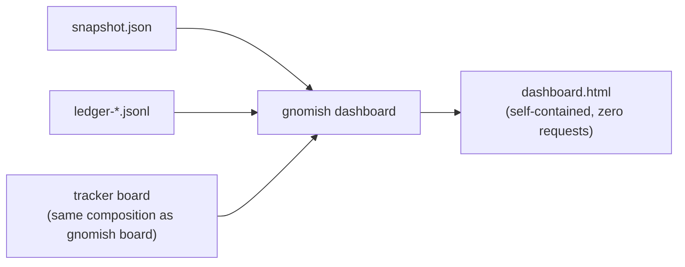

# Operator Guide: The Dashboard Page

<!-- implements UX1, UX2, UX3, UX4, U1, U2 of add-dashboard-page -->
<!-- implements NFR-O3, UX1, UX2 of add-serve-sandbox-lifecycle -->

This is the reference for `gnomish dashboard` — a single self-contained HTML
page composing four surfaces documented elsewhere in this guide: the
daemon snapshot ([`operator-guide-observability.md`](operator-guide-observability.md)),
the ledger history (same document), the tracker board
(["The `board` Command"](operator-guide.md#the-board-command-tracker-as-a-kanban-view)),
and the sandbox hygiene section
(["Keep, resume, cleanup"](operator-guide-sandbox.md#keep-resume-cleanup)).
It assumes those documents for what each section's data means; this page is
about the composition, not the sources.

Nothing here adds a server, a socket, or an inbound endpoint (add-factory-serve
NG3): the command renders a file, once or on a loop, and a browser opens it
from `file://`.



## The sandbox hygiene section

The fourth section answers "is container cleanup running, and what is it
holding?" It reads two sources the page already has — the snapshot's
`vitals.sweep` (last tick time, per-category counts, the kept-environment
inventory with each environment's age and time-to-reap) and the ledger's sweep
lines (the recent stop/dispose actions) — and degrades on its own: a daemon
that predates the sweep contract, or one that has not finished its first tick,
renders "no sweep data yet" while every other section keeps reporting.

The section carries its own **`sandbox alert:`** highlight, separate from the
daemon section's `daemon alert:`, because its conditions are facts about the
host's Docker objects rather than about the daemon's own liveness:

| Condition                  | Fires when                                                                 |
|-----------------------------|------------------------------------------------------------------------------|
| `sandbox sweep not running` | no tick has completed for longer than `k` × the sweep's own cadence            |
| `sandbox cleanup stalled`   | `n` consecutive ticks in a row reached no claim verdict — ticking, deciding nothing |
| `an instance died or hung`  | a **`tracked`** running box was stopped as an orphan, named with its task      |

The third one is a symptom, not a statistic: a routine `manual` age-policy stop
raises no alert at all — it appears in the section's category breakdown and
nowhere else — so the alert only ever means an instance holding a claim stopped
beating.

## Wall-display recipe (`--watch`)

```bash
gnomish dashboard --watch --dir /srv/acme/widgets
```

Open the output file in a browser tab once (`file:///home/you/.gnomish/serve/
<instance-name>/dashboard.html` by default) and leave the tab open. The
command re-renders the file every **10 s** and bakes a matching
`<meta http-equiv="refresh">`, so the tab reloads itself from disk — no
JavaScript polling, no server, nothing but the browser's own `file://` reload.

**Two independent staleness layers**, so the wall never quietly goes out of
date:

- **Daemon-section staleness (data layer)** — computed the same way as the
  dead-man's-switch rule 1 in
  [`operator-guide-observability.md`](operator-guide-observability.md#the-dead-mans-switch-monitor-ux3-design-d9):
  the snapshot's own `writtenAt` + `intervalSeconds` say whether the daemon
  itself has gone quiet. A dead daemon reddens the daemon section only —
  history and board keep reporting normally.
- **Page-staleness banner (view layer)** — the page bakes its own
  `generatedAt` and the 10 s render cadence; an inline script compares
  `generatedAt` against the browser's own clock. If the page hasn't been
  regenerated for more than **`k = 3` × the render cadence (~30 s)**, a
  full-page banner declares the *view itself* stale. This is what catches a
  dead renderer process — meta-refresh alone would just keep reloading a file
  nobody is writing to anymore, so the tab would look current when it isn't.

A red daemon section and a full-page banner mean different things and never
get confused: one says the daemon is stale, the other says the page you are
looking at is stale (UX3).

The board section refreshes on its own slower cadence — **60 s** — and shows
the last cached board model with its fetch time between refreshes, so an
all-day open tab costs one tracker read pair (`listReady` + `listOpen`) every
60 s, not every 10 s render.

The history section aggregates the last **7 days** of ledger files, re-read
every render cycle (local files, effectively free).

## Ticket-snapshot recipe (one-shot, `--out`)

```bash
gnomish dashboard --out incident.html --dir /srv/acme/widgets
```

Without `--watch`, the command renders once and exits — no loop, no banner
logic. Attach the single `incident.html` file to a ticket or escalation
comment: it opens identically for the reviewer, with no other files needed
(the page is fully self-contained — no external requests, nothing else to
send along). The page shows its `generatedAt` timestamp as plain information —
a static line, and no JavaScript at all, so the reader reads its age off the
timestamp directly — rather than bannering. A one-shot page is a point-in-time
record, meant to stay reviewable long after capture, not a live view that can
go stale.

## Output location

Default output is `dashboard.html` inside the instance's observability
directory, `~/.gnomish/serve/<instance-name>/` — the same directory the
daemon writes `snapshot.json` and the ledger into (see
[`operator-guide-observability.md`](operator-guide-observability.md#where-the-files-live)).
`--out <path>` overrides it. `--dir <clone>` resolves configuration (tracker,
instance name) exactly as `gnomish board` and `gnomish take` do.

## Documented constants

| Constant                 | Value | Meaning                                                      |
|---------------------------|-------|----------------------------------------------------------------|
| Render / refresh cadence  | 10 s  | `--watch` re-render interval and meta-refresh period           |
| Board refresh cadence     | 60 s  | how often the tracker board section re-fetches                 |
| Page-staleness multiplier | k = 3 | banner threshold: no re-render for `k ×` cadence (~30 s)       |
| History window            | 7 days | ledger days aggregated into the history section               |
| Sweep-staleness multiplier | k = 3 | `sandbox sweep not running` threshold: no tick for `k ×` the sweep's own cadence, which travels in the snapshot as `vitals.sweep.intervalSeconds` |
| Consecutive-skipped threshold | n = 3 | `sandbox cleanup stalled` threshold: ticks in a row reaching no claim verdict |
| Kept-inventory bound      | 20 rows | kept environments listed, **oldest first**; `keptTotal` states how many the tick actually saw |
| Sweep-action bound        | 20 rows | recent stop/dispose actions listed, newest first                |

These are constants of the command, not configuration — there is no flag to
change them (design D4/D5). The two sandbox thresholds deliberately need no
daemon configuration: the sweep's own cadence travels *in* the snapshot, so the
page judges staleness without reading the daemon's properties.

## What the page does not do

No interactivity, no tracker writes, no fetches beyond what the underlying
composition already does at render time — the page performs no actions of its
own. Per-task depth stays with the existing canon: `gnomish status <id>` and
the tracker UI. No fleet view — the page shows one instance's snapshot and
ledger; the board's Working column already lists every holder it sees, same
as `gnomish board`.
