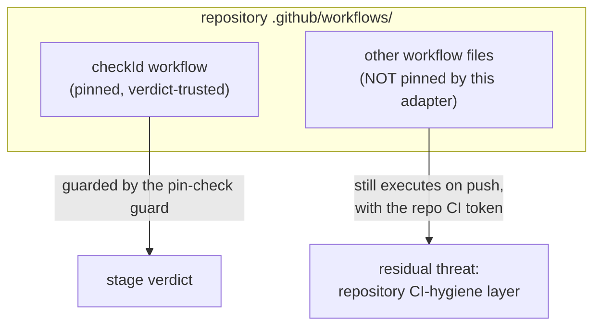

# Operator Guide: GitHub Actions External Check

<!-- implements UX1, UX2, NG6, FR9 of add-external-check-github-actions -->

This is the reference for the `external` check's GitHub Actions adapter
(`add-external-check-github-actions`): the platform-authored verdict source
for a stage's Quality Control (`.claude/rules/stage-description.md` §6). It
assumes the single-task workflow in
[`operator-guide.md`](operator-guide.md); this document covers what the
adapter needs from the operator and the CI-hygiene trade-offs it does not
cover for you.

## Token scope

The adapter reads its credential from `GNOMISH_GITHUB_ACTIONS_TOKEN`, a
**separate** environment variable from `GNOMISH_GITHUB_TOKEN` (the tracker
token). Two tokens, not one, is a deliberate blast-radius boundary: the
tracker token can write issues and labels, while the check token needs to do
nothing but read workflow runs. If a build log or a misconfigured process
ever leaks the check token, the leak cannot be used to write to the tracker
or forge a task's escalation state — the worst it can do is read CI history.

**Required scope (NFR-S1):** read-only, enough to list workflow runs and job
logs, nothing more:

- **Fine-grained PAT (recommended):** GitHub → Settings → Developer settings
  → Personal access tokens → Fine-grained tokens → Generate new token. Scope
  it to the target repository, and under Repository permissions grant
  **Actions: Read-only**. No other permission is needed — specifically, do
  not grant Contents or Issues write access to this token.
- **Classic PAT (fallback):** the `repo` scope, used read-only — GitHub's
  classic tokens have no narrower read-only Actions scope. Because a classic
  `repo`-scoped token is technically capable of writes, keep it strictly out
  of any path the gnome or its sandbox can read; treat it as no safer than
  the tracker token from a blast-radius standpoint, only cheaper to obtain.

Set the token as an environment variable on the machine running the
factory, exactly like `GNOMISH_GITHUB_TOKEN` — never in `.gnomish/`
(anything under `.gnomish/` is gnome-writable and lands on the task branch;
see `GithubCheckToken`'s javadoc for the resolution mechanics). The token is
resolved once at wiring time and never re-read or logged (FR8).

## Base URL config: what exists today

UX2 promises that enabling the adapter needs no factory configuration
beyond the token and, for GitHub Enterprise or a Gitea remote, a base URL —
mirroring the tracker adapter's `tracker.github.api-url` key. **That wiring
does not exist yet.** The adapter's classes
(`GithubCheckExternalClient`, `GithubCheckToken`, the shared
`GithubHttpClient`) are built and unit/contract-tested, but there is no
factory-assembly class that reads a pipeline config, resolves the token, and
constructs a `GithubHttpClient(apiUrl, token)` for the check adapter — the
equivalent of `GithubTrackerAdapterFactory` for the tracker side. Task 5.2 of
`add-external-check-github-actions` explicitly left this unbuilt.

Concretely, as of this writing:

- There is **no `check.github.api-url` (or similar) YAML key** — nothing
  under `.gnomish/config.yaml` configures this adapter. Do not add one; it
  would be ignored.
- There is **no CLI entry point** that constructs and injects a
  `GithubCheckExternalClient` into the stage engine's `ExternalCheckClient`
  port. An operator cannot make an `external` check backed by this adapter
  run end-to-end today, regardless of how the token or base URL are set.
- `GithubHttpClient` already accepts an `apiUrl` constructor parameter
  (`GithubHttpClient(String apiUrl, String token)`), the same shape the
  tracker adapter uses for `tracker.github.api-url` — so once wiring lands,
  a `check.github.api-url` key following that exact precedent is the
  expected shape. Until then, treat any such key as unsupported.

What **is** real and usable today is the pipeline-config declaration syntax
for an `external` check itself (`load-pipeline-config` FR2/FR11, task 6.1 of
this change) — see the timeout-class section below for the full field set.
That declaration loads and validates correctly; only the adapter that would
service it is not yet wired into a runnable command.

## CI hygiene for the residual threat (NG6)

The adapter's pin-set contribution is narrow by design (design D3): it pins
only the one workflow file named by the check's `checkId`. Any *other* file
under `.github/workflows/` is outside that pin. If a gnome edits or adds
another workflow, that workflow still runs on push with the repository's CI
token, unpinned and unwitnessed by any check — the adapter never reads it
and cannot detect a substitution there.



This is deliberate: pinning the whole `workflows/` directory would
permanently fail any task whose job is legitimately editing CI. The
trade-off is documented for operators rather than closed by the adapter
(proposal NG6, design D3's residual-threat paragraph). Mitigate it at the
repository level:

- **Minimal CI token permissions.** Whatever token GitHub Actions injects
  into your workflows (`GITHUB_TOKEN` or a PAT referenced by `secrets.*`)
  should carry the least privilege the workflow needs — read-only where
  possible, and never write access to the tracker, deployment credentials,
  or anything a gnome-authored change could exfiltrate or abuse.
- **No privileged secrets reachable from a gnome branch or PR.** Secrets
  used by workflows that a gnome's branch can trigger (in particular
  anything running on `pull_request` or `push` from a task branch) must not
  include deploy keys, cloud credentials, or tokens with write access
  outside CI itself.
- **Treat `.github/workflows/*` as sensitive even outside the pinned
  check.** A change to any workflow file is worth the same scrutiny as a
  change to sandbox policy — it runs with ambient CI credentials regardless
  of which stage's pin set covers it.

This guidance is the repository-hygiene half of a threat that
`add-sandbox-core` addresses from the sandbox side (task 9.5: sandbox
config, host-mode passport honesty, allowlist maintenance, and — as its
step 0 of the Docker-inside ladder — routing `gnomish/*` workflows without
privileged secrets to CI instead of running them inside the box).
`add-sandbox-core` is not implemented yet, so there is no linked operator
doc for it today; treat this as a forward reference to that task by number
until it lands.

## Timeout class: `quality` vs `infrastructure`

An `external` check declaration may set `timeout-class`, alongside the
existing `checkId`, `interval`, and `timeout` fields:

```yaml
verify:
  - type: external
    checkId: ci/build
    interval: 30s
    timeout: 5m
    timeout-class: infrastructure   # optional; default is `quality`
```

(`checkId`/`interval`/`timeout` are real, loadable syntax per
`load-pipeline-config` FR11; `timeout-class` is the field this change adds,
task 6.1 — this is the same declaration syntax discussed above, independent
of whether the GitHub Actions adapter itself is wired to service it yet.)

At the poll deadline, the stage engine (`ExternalPolling`, task 6.2)
resolves a still-`Running` check per the declared class:

- **`quality` (default, unchanged behavior).** A timeout becomes a quality
  `Fail` carrying a timeout finding — it burns a stage attempt, exactly like
  any other failed check. Keep the default when the check is fast and its
  runner queue is reliable: a genuine timeout there usually means the
  workflow itself is stuck (an infinite loop or a hang introduced by the
  gnome's change), which *is* a quality signal worth burning an attempt
  over.
- **`infrastructure`.** A timeout becomes `CannotVerify`, naming the elapsed
  timeout — no stage attempt is burned, and the task escalates to a human
  immediately instead of retrying.

**The trade-off:** `infrastructure` protects attempts at the cost of an
immediate escalation on every timeout, even when the run would have
finished a minute later. Use it when the check's own runner queue is known
to be slow or variable enough that a timeout carries no information about
the gnome's change — shared/contended runners, or pipelines with
heavy cold-start variance. In that setting, `quality`'s default retry burns
an attempt on pure infrastructure noise and gives the gnome nothing
actionable to fix, which is exactly the case add-stage-engine's NG6 left
open for "a consumer" to configure (design D7) — this check is that
consumer. If the check is fast and reliable, leave the default: a timeout
there is worth treating as the gnome's problem.

## When the check can't be verified

Separate from a timeout, a poll can fail to reach a verdict at all. Both
shapes below become `CannotVerify` — the task escalates to a human and **no
stage attempt is burned** — but they differ in how the adapter gets there,
and the escalation reason tells them apart.

<!-- implements NFR-R1, NFR-R3 of add-external-check-github-actions -->

- **Infrastructure failure (transient).** A network error, a `5xx`, a `429`,
  or a `403` carrying GitHub's rate-limit signal (primary or secondary
  limit). The shared HTTP client retries these with backoff first; only after
  the retry budget is exhausted does the poll report `CannotVerify` with a
  generic "runs query failed" reason (NFR-R1). Waiting and re-running the task
  later is the right response — the platform was momentarily unavailable.

- **Misconfiguration (permanent).** A `401` (the token is invalid or
  expired), a non-rate-limited `403` (the token lacks **Actions: Read** on
  this repo — see [Token scope](#token-scope)), or a `404` (no workflow by the
  `checkId` file name exists). These are **not** retried and **not** polled to
  the timeout: the adapter fails fast, reporting `CannotVerify` immediately
  with a reason that names the check and the likely cause (NFR-R3). The fix is
  a config change — correct the token or the `checkId` — not a re-run.

**The `404` caveat.** The adapter resolves `checkId` by workflow **file
name**, and treats a `404` as "that workflow does not exist." A workflow that
simply hasn't run for this commit yet returns an empty list (`200`), which
reads as still-`Running` — so a `404` genuinely means the file name is wrong
*or* the workflow isn't registered on the platform. GitHub registers a
workflow by filename only once it exists on the repository's **default
branch**. If you add a brand-new CI workflow inside a task branch and never
merge it to the default branch, a check referencing it will escalate as a
`404` misconfiguration rather than wait for it — keep any workflow a check
names on the default branch. This is the deliberate trade-off for fast, clear
feedback on a mistyped `checkId`: a typo is diagnosed on the first poll
instead of after a full `timeout` of silent polling.
