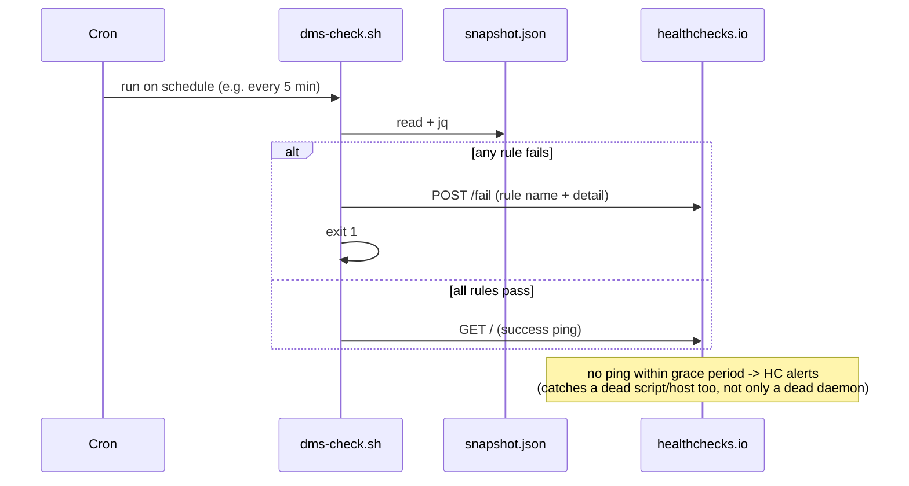

# Operator Guide: Serve Observability Files and the Dead-Man's-Switch Monitor

<!-- implements FR2, FR3, FR9, FR14, FR15, UX1, UX2, UX3, UX4 of add-serve-observability -->

This is the reference for the `serve` daemon's file-based observability
surface: the local snapshot and ledger files it writes, and the external
cron monitor pattern documented against them (design D9). It assumes
[`operator-guide-serve.md`](operator-guide-serve.md) — the feed automaton,
lifecycle, and slot model described there are exactly what the files below
report on.

Nothing here adds a tracker write, a metrics SDK, or an inbound port: the
daemon only publishes local files (add-factory-serve NG3; `add-serve-
observability` G4). Alerting lives entirely outside the daemon, in a cron
script you own and adapt.

## Where the files live

```
~/.gnomish/serve/<instance-name>/
  snapshot.json              # overwritten in place, one file, current state
  ledger-2026-08-02.jsonl    # append-only, one file per UTC day
  ledger-2026-08-03.jsonl
```

The directory is keyed by the *configured instance name*
(`factory.instance-name`), not by the full per-process instance id — the
name is stable across restarts, so the path an operator or a cron job
points at never moves (FR9). The full instance id (with its per-process
suffix) appears only inside the written data, alongside the host and
factory version, so restarts are still distinguishable by content (design
D2). One `cat`/`jq` of this predictable path answers "alive? busy?" without
touching daemon config or logs (UX1).

Because the path is keyed by the configured name, running two daemons with
the same `factory.instance-name` on one host is a documented misconfiguration
— they would write the same `snapshot.json` and ledger files, and there is no
cross-process locking to stop them (design D2, FR9). Give every daemon on a
host a distinct configured name.

## `snapshot.json` — the gauge

Atomically overwritten (temp file + rename) on a timer and immediately on
state transitions (FR1). Six sections plus two self-description scalars —
see [`snapshot-v1.reference.json`](../../application/src/test/resources/snapshot-v1.reference.json)
for the exact shape:

| Section | Answers | Key fields |
|---|---|---|
| `instance` | "which process wrote this?" | `instanceId` (full id), `host`, `factoryVersion` |
| `lifecycle` | "is the daemon up?" | `state` (`running\|draining\|stopping\|stopped`), `reason` |
| `feed` | "is it claiming work?" | `state` (`filling\|idleEmpty\|idleBlocked\|full`), `since`, `lastPollAt`, `openFronts`, `wipLimit` |
| `slots` | "what is it working right now?" | `capacity`, `entries[]` (`taskId`, `stage`, `attempt`, `since`) |
| `vitals` | "are the daemon's own threads alive?" | `heartbeat` (`state`, `lastTickAt`, `heldClaims`), `reaper` (`lastRunAt`, `restartCount`, `intervalSeconds`), `janitor` (`lastRunAt`), `sweep` (see below, or `null`) |
| `tracker` | "is the tracker reachable?" | `lastSuccessAt`, `consecutiveFailures` |

`vitals.sweep` is the sandbox-lifecycle sweep's entry: `lastTickAt`,
`intervalSeconds` (the sweep's own cadence, the staleness yardstick for
`lastTickAt` — not the top-level one), `counts` (the LAST tick's verdicts, per
category: `checkedAlive`, `keptUnderThreshold`, `stoppedOrphan`, `disposedAged`,
`disposedReconstructible`, `skippedNoVerdict`), `kept[]` (each kept environment's
`taskKey`, `ageSeconds`, `untilReapSeconds`) with `keptTotal` stating any
truncation, and `consecutiveSkippedTicks`. It is `null` until the daemon's first
sweep tick completes, and absent from snapshots written before the sweep landed —
both mean "no sweep data yet", never "a tick that counted zero". The ledger's
`sweepAction` and `sweepTick` lines carry the per-action history the snapshot
deliberately does not.

Everything else stays with its own canon on purpose: ready-queue depth (the
feed does not poll while `full` — the field would lie), per-task detail
(`gnomish status <id>` / the task branch), and history (the ledger, below).
A `judge` acceptance criterion counts as verifiable only if it is concrete
— by the same standard, every snapshot field is a plain identifier, state,
counter, or timestamp, readable without daemon config or source access
(UX1, UX4).

**Self-description and staleness (FR2).** The top two fields,
`writtenAt` (ISO-8601 UTC) and `intervalSeconds`, let a reader compute
staleness from the file alone:

```
stale := (now - writtenAt) > intervalSeconds * k     # k = 3 (design D10)
```

`intervalSeconds` defaults to 30 (`factory.serve.snapshot-interval`); it is
the *maximum* gap between writes — transition writes (lifecycle, feed
state, slot assign/release) only tighten it, never widen it (FR1). `k = 3`
is the documented multiplier for every staleness check in this guide,
including the monitor rules below.

**Degradation is data, not just log lines (UX4).** A dead heartbeat shows
up as `vitals.heartbeat.state = "died"`, a graceful stop as
`lifecycle.state = "stopped"` with a `reason`, and a daemon that has simply
stopped writing shows up as a `writtenAt` that stops advancing — the file
itself is retained on graceful exit, so the last snapshot is always the
final word on how the process left (FR4).

## `ledger-YYYY-MM-DD.jsonl` — the history

Append-only JSONL, one file per UTC calendar day, flushed per line without
fsync; a torn last line after a crash is expected and any reader must skip
it rather than fail (NFR-R2). A live file is never renamed — rotation is
the daemon switching to a new day's filename, so a `tail -F` never chases a
rename (FR14). "Last night" is therefore always 1–2 files, identifiable
purely by the date in the filename — no timestamp parsing needed to find
them (UX2). See
[`ledger-v1.reference.jsonl`](../../application/src/test/resources/ledger-v1.reference.jsonl)
for exact shapes; every line carries `version`, a `type` discriminator, and
the same `instance` block as the snapshot.

| `type` | Written when | Carries |
|---|---|---|
| `taskOutcome` | a slot reaches a terminal result (`delivered\|awaitingHuman\|aborted\|revoked`) | `taskId`, `outcome`, `parkReason` (awaitingHuman only), `stage`, `attemptsUsed`, `startedAt`, `finishedAt`, `wallMillis`, `tokensByModel` |
| `lifecycle` | daemon start/stop | `event` (`started\|stopped`), `reason` |
| `runSummary` | drain-run completion only | `counts` per outcome, summed `tokensByModel`, `wallMillis` |
| `sweepAction` | the sandbox-lifecycle sweep stops or disposes one object | `objectName`, `role`, `mode` (`tracked\|manual`), `taskKey`, `category` (`stoppedOrphan\|disposedAged\|disposedReconstructible`), `reason`, `ageSeconds` |
| `sweepTick` | every completed sweep tick | `counts` per verdict category, including the untouched ones |

Objects the sweep left untouched are never itemized — they are counted on the
tick's `sweepTick` line only, so a day of quiet ticks costs one line per tick
rather than one per container on the host.

`EmptyQueue`/`Skipped` results write no `taskOutcome` line — an engine run
happened if and only if spend happened, and spend is what the ledger
records. Overnight totals are one `jq` aggregation away:

```bash
jq -sr '[.[] | select(.type=="taskOutcome")] | group_by(.outcome)
        | map({outcome: .[0].outcome, count: length}) | .[]' \
  ~/.gnomish/serve/my-instance/ledger-2026-08-0[23].jsonl
```

**Retention.** The snapshot writer's tick also sweeps `ledger-*.jsonl`
files older than `factory.serve.ledger-retention-days` (default 30; `0`
means keep forever) — no separate retention process to run (FR15).

## The dead-man's-switch monitor (UX3, design D9)

The daemon never alerts itself (NG6) — alerting is an external cron script
that reads `snapshot.json`, evaluates the six rules below, and pings an
outbound healthchecks-style endpoint. The monitor's own *silence* is the
alert: point healthchecks.io (or a self-hosted equivalent) at the script's
cron schedule with a grace period, and a missed run — daemon dead, host
down, script crashed — is caught even if the script itself never gets to
report a specific rule.



### The six rules

Each rule reads only snapshot fields; none requires daemon config access
(M1). Every rule is traced to its D9 clause and the field(s) it reads.

1. **Stale `writtenAt` while `running`** — the daemon looks alive in
   `lifecycle.state` but the file has stopped updating: `now - writtenAt >
   intervalSeconds * k` → the writer thread (and therefore the process) is
   dead. Reads `lifecycle.state`, `writtenAt`, `intervalSeconds`.
2. **Occupied slots with heartbeat not `running`** — `slots.entries` is
   non-empty but `vitals.heartbeat.state != "running"` → claims are dying
   under a daemon that is otherwise up.
3. **Long `idleBlocked`** — `feed.state == "idleBlocked"` for longer than a
   configured threshold (`now - feed.since`) → escalations are parked and
   nobody is answering them, so the WIP limit is starving fresh work.
4. **Growing `consecutiveFailures`** — `tracker.consecutiveFailures` is
   non-zero and has not decreased since the previous check → the tracker
   is unreachable; because the counter is fed by every tracker caller
   (feed, heartbeat, reaper — design D12), this fires even while the feed
   is legitimately not polling in `full`.
5. **Stale `reaper.lastRunAt` or growing `restartCount`** — reaping has
   stalled or is crash-looping, so dead claims will linger past their TTL
   instead of being recovered. The staleness yardstick is
   `vitals.reaper.intervalSeconds`, **not** the top-level `intervalSeconds`:
   the reaper ticks on the heartbeat interval (default 300 s), an order of
   magnitude slower than the snapshot writer (default 30 s), so measuring its
   lastRunAt against the writer cadence would fire on every healthy tick.
   Reads `vitals.reaper.lastRunAt`, `vitals.reaper.restartCount`,
   `vitals.reaper.intervalSeconds`.
6. **`heldClaims ≠ slots.entries.length` on two consecutive checks** — the
   heartbeat's claim count and the slot registry's occupancy have drifted
   apart → desync between the two views of "what is this daemon working on."
   A single check's mismatch is normal transition lag (a slot assign/release
   races the heartbeat tick), so the rule fires only when the drift is still
   present on the next run — one cron interval later, which is the "beyond
   seconds" tolerance design D9 asks for. The previous check's drift is
   remembered in the monitor's own state file. Reads
   `vitals.heartbeat.heldClaims`, `slots.entries`.

### Reference script

```bash
#!/usr/bin/env bash
# dms-check.sh <instance-name> <healthchecks-ping-url>
# Dead-man's-switch monitor over serve's snapshot.json (design D9, UX3).
# Requires: bash, jq, curl, GNU date (or gdate on macOS — adjust DATE below).
set -euo pipefail

INSTANCE_NAME="${1:?usage: dms-check.sh <instance-name> <ping-url>}"
PING_URL="${2:?usage: dms-check.sh <instance-name> <ping-url>}"
DIR="$HOME/.gnomish/serve/${INSTANCE_NAME}"
SNAPSHOT="${DIR}/snapshot.json"
STATE_FILE="${DIR}/.dms-monitor-state.json"   # this script's own scratch file, not a daemon file
K=3                                            # design D10 staleness multiplier
IDLE_BLOCKED_THRESHOLD_S=$((30 * 60))          # tune per project's escalation SLA
DATE=date                                      # use `gdate` here on macOS (brew install coreutils)

fail() {
  echo "DMS[$INSTANCE_NAME]: $1" >&2
  curl -fsS -m 10 --retry 3 "${PING_URL}/fail" --data-raw "$1" >/dev/null || true
  exit 1
}

[[ -f "$SNAPSHOT" ]] || fail "snapshot missing: $SNAPSHOT (daemon never started, or wrong path)"

snap=$(cat "$SNAPSHOT")
now=$($DATE -u +%s)
to_epoch() { $DATE -u -d "$1" +%s; }

written_at=$(to_epoch "$(jq -r .writtenAt <<<"$snap")")
interval=$(jq -r .intervalSeconds <<<"$snap")
lifecycle_state=$(jq -r .lifecycle.state <<<"$snap")

# Rule 1 -- stale writtenAt while running -> daemon dead
if [[ "$lifecycle_state" == "running" ]] && (( now - written_at > interval * K )); then
  fail "rule1: writtenAt stale by $((now - written_at))s (limit $((interval * K))s) while running"
fi

slot_count=$(jq '.slots.entries | length' <<<"$snap")
heartbeat_state=$(jq -r .vitals.heartbeat.state <<<"$snap")

# Rule 2 -- occupied slots with heartbeat not running -> claims dying under a live daemon
if (( slot_count > 0 )) && [[ "$heartbeat_state" != "running" ]]; then
  fail "rule2: heartbeat.state=$heartbeat_state with $slot_count occupied slot(s)"
fi

feed_state=$(jq -r .feed.state <<<"$snap")
feed_since=$(to_epoch "$(jq -r .feed.since <<<"$snap")")

# Rule 3 -- long idleBlocked -> escalations not being handled
if [[ "$feed_state" == "idleBlocked" ]] && (( now - feed_since > IDLE_BLOCKED_THRESHOLD_S )); then
  fail "rule3: idleBlocked for $((now - feed_since))s (limit ${IDLE_BLOCKED_THRESHOLD_S}s)"
fi

prev_failures=0
prev_restarts=0
prev_drift=0
if [[ -f "$STATE_FILE" ]]; then
  prev_failures=$(jq -r '.consecutiveFailures // 0' "$STATE_FILE")
  prev_restarts=$(jq -r '.restartCount // 0' "$STATE_FILE")
  prev_drift=$(jq -r '.driftSeen // 0' "$STATE_FILE")
fi

failures=$(jq -r .tracker.consecutiveFailures <<<"$snap")

# Rule 4 -- growing consecutiveFailures -> tracker outage
if (( failures > 0 )) && (( failures >= prev_failures )); then
  fail "rule4: tracker.consecutiveFailures=$failures, not decreasing since last check ($prev_failures)"
fi

reaper_last=$(to_epoch "$(jq -r .vitals.reaper.lastRunAt <<<"$snap")")
reaper_interval=$(jq -r .vitals.reaper.intervalSeconds <<<"$snap")
restarts=$(jq -r .vitals.reaper.restartCount <<<"$snap")

# Rule 5 -- stale reaper.lastRunAt or growing restartCount -> reaping degraded.
# The reaper ticks on its OWN cadence (heartbeat interval, default 300s), not the
# snapshot-write interval -- measure staleness against reaper.intervalSeconds (M1).
if (( now - reaper_last > reaper_interval * K )); then
  fail "rule5: reaper.lastRunAt stale by $((now - reaper_last))s (limit $((reaper_interval * K))s)"
fi
if (( restarts > prev_restarts )); then
  fail "rule5: reaper.restartCount grew $prev_restarts -> $restarts (crash-looping)"
fi

held_claims=$(jq -r .vitals.heartbeat.heldClaims <<<"$snap")
drift_now=0
(( held_claims != slot_count )) && drift_now=1

# Rule 6 -- heldClaims != slots.entries.length on TWO consecutive checks -> desync.
# A single mismatch is normal transition lag (a slot assign/release racing the
# heartbeat tick); only a mismatch that survives into the next run -- one cron
# interval later, the "beyond seconds" tolerance of design D9 -- fails. The prior
# check's drift is remembered in this script's own state file.
if (( drift_now == 1 )) && (( prev_drift == 1 )); then
  fail "rule6: heldClaims=$held_claims != slots.entries.length=$slot_count on two consecutive checks"
fi

jq -n --argjson f "$failures" --argjson r "$restarts" --argjson d "$drift_now" \
  '{consecutiveFailures: $f, restartCount: $r, driftSeen: $d}' > "$STATE_FILE"

curl -fsS -m 10 --retry 3 "$PING_URL" >/dev/null
```

```bash
# crontab: every 5 minutes, well inside the default 30s * k = 90s staleness window
*/5 * * * * /path/to/dms-check.sh my-instance https://hc-ping.com/<uuid> >>/var/log/gnomish-dms.log 2>&1
```

### Success-ping vs explicit-fail: pick one, document the choice

The script above pings `/fail` explicitly on a rule violation and lets the
plain success ping (a lapsed ping) cover host/script death. Two viable
patterns, both outbound-only (NG3, D9):

- **Ping-on-success only** (drop the `/fail` calls, just `exit 1` without
  pinging): simpler script, but healthchecks.io reports every failure mode
  — including a bad rule — identically as "no ping," with no rule name in
  the alert. Debugging starts from re-running the script by hand.
- **Explicit `/fail` + rule name** (as above): the alert payload names the
  failing rule immediately, cutting the "why did it alert" step; the
  tradeoff is one more `curl` call and endpoint to keep working — if the
  network path to the monitor is down, a "fail" you can't send degrades to
  the same silence as the first pattern, so silence must stay the safety
  net either way.

Either choice satisfies UX3: silence remains the ultimate signal, and both
avoid an inbound endpoint on the daemon.
