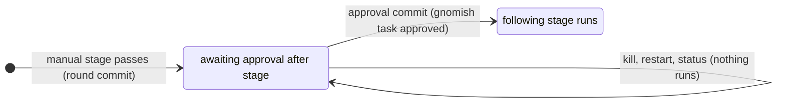

# Operator Guide: Running a Single Task (`gnomish run`)

This guide is the reference for `gnomish run` — driving **one ad-hoc task through
one pipeline** without a tracker. It assumes the factory is built (see the main
[README](../../README.md#building)) and the target project has a working `.gnomish/`
pipeline. The tracker-driven workflow layered on top is
[`operator-guide.md`](operator-guide.md); read-only task inspection
(`gnomish status` / `gnomish usage`) is
[`operator-guide-inspect.md`](operator-guide-inspect.md); where the gnome process
actually executes — an ephemeral container box by default, or the host — is
[`operator-guide-sandbox.md`](operator-guide-sandbox.md)'s territory.

`gnomish run` executes one task through the whole quality-control cycle. By
default it is manifest-driven: real `agent-cli` and judge adapters run each stage
(see [Manifest-driven run](#manifest-driven-run)). No flag swaps a human in for
the gnome, the judge or the CI. `run` never reads its standard input: when the task
stops at an escalation or a manual checkpoint, the process records the stop on the
task branch, prints what stopped and the command that continues it, and exits. The
operator's part — or the part of a script or an AI agent driving `run` — is the next
invocation: `--resume`, with a `--decision` when an escalation needs an answer (see
[Driving `run` from a script or an agent](#driving-run-from-a-script-or-an-agent)).

`--dir` must name a registered clone: register it once with `gnomish project add
<name> --dir=<clone>` (see
[`operator-guide.md` → *Setting up a project*](operator-guide.md#setting-up-a-project)).

Run it through the `gnomish` launcher from the distribution archive (see the
README's *Install* section), or straight from a source checkout with `bootRun`, and
pass the task flags. With **no** run flag present the application keeps its plain
boot-and-exit behavior. `run` is the implicit default subcommand —
`gnomish --task=... --dir=...` and `gnomish run --task=... --dir=...` are
equivalent — so existing invocations keep working.

```bash
# via the launcher (bin/gnomish of the unpacked archive, on PATH)
gnomish --task="fix the flaky login spec" --dir=/path/to/target-repo

# or straight from Gradle
./gradlew bootRun --args='--task="fix the flaky login spec" --dir=/path/to/target-repo'
```

## Flags

Flags use Spring's `--key=value` form (quote values with spaces):

| Flag                              | Required           | Default             | Meaning                                                                                                    |
|-----------------------------------|--------------------|---------------------|------------------------------------------------------------------------------------------------------------|
| `--dir=<path>`                    | no                 | `.` (cwd)           | project clone directory **and** the `.gnomish/` pipeline location                                          |
| `--task="<text>"`                 | one of these two\* | —                   | task description inline (first line → title, rest → body); mutually exclusive with `--task-file`           |
| `--task-file=<path>`              | one of these two\* | —                   | task description read from a file                                                                          |
| `--task-id=<id>`                  | no                 | auto-generated      | override the generated id (`[A-Za-z0-9_-]+`); makes logs and JSON stable                                   |
| `--from-stage=<name>`             | no                 | first stage         | start partway through the pipeline, skipping earlier stages' checks                                        |
| `--mode=git\|in-place`            | no                 | `git`               | task workflow mode — see [Git mode vs. in-place mode](#git-mode-vs-in-place-mode)                          |
| `--base=<ref>`                    | no                 | current clone state | git mode only; override the branch base                                                                    |
| `--resume=<task>`                 | no                 | —                   | git mode only; resume a task by id instead of starting a new one — see [Resuming a task](#resuming-a-task) |
| `--discard-work`                  | no                 | `false`             | git mode only; requires `--resume`; discards the interrupted round instead of salvaging it                 |
| `--decision="<text>"`             | no                 | —                   | git mode only; requires `--resume` of an escalated task; the operator's answer to the recorded escalation  |

\* Exactly one of `--task`/`--task-file` is required unless `--resume` is given, in which case none of `--task`/`--task-file`/`--task-id`/`--from-stage` may be used. `--base`, `--resume`, `--discard-work`, and `--decision` are rejected together with `--mode=in-place` (exit code 2, usage error). `--decision` without `--resume`, with a blank value, on a task awaiting approval at a manual checkpoint, or on a task whose recorded outcome is not an escalation is a usage error too (exit code 2), naming the conflict; the branch is left untouched.

A closed, empty, or absent standard input changes nothing — no path of `run` waits for input. To look at a task while it runs, use `gnomish status --dir=<dir> <task>` from another terminal (see [`operator-guide-inspect.md`](operator-guide-inspect.md)): it reads the last recorded round from the task branch and leaves the running process alone. After every attempt the run prints a one-line summary; a full report prints at the end. The runner writes nothing inside the project clone — logs, findings, and (in git mode) the task workspace all live outside it. The terminal carries the run's own output plus `WARN` and above; the full narrative goes to the project's rolling log file, `~/.gnomish/projects/<name>/logs/<instance>.log` — its location, the `GNOMISH_LOG_LEVEL` override, the `taskId=`/`stage=`/`attempt=` correlation keys and the `[GFnnn]` codes are described in [`operator-guide-observability.md` → *Reading the log*](operator-guide-observability.md#reading-the-log), which applies to every command, not only to `serve`.

## Git mode vs. in-place mode

**Git mode (`--mode=git`, the default)** treats `--dir` as the project clone and never mutates it directly. It creates a task branch `gnomish/<sanitized-task-id>`, checks it out into a dedicated worktree, and commits the state file and stage artifacts after every round, pushing best-effort as it goes. The branch name and worktree path print upfront so you can inspect progress with plain `git` commands while the run is in flight. This is what makes a task **resumable**: a died process, an escalation, or a paused checkpoint can all be picked up later — by the same machine or another one — from the last committed round.

Worktrees live outside the clone, under `~/.gnomish/projects/<name>/worktrees/<clone>/<sanitized-task-id>/`, where `<name>` is the registered project and `<clone>` the clone's registered name — so two clones of one project, or two projects whose clones share a folder name, never collide. `git worktree prune` runs at every start. Cleanup depends on how the task ends: **completed** tasks have their worktree removed (the branch stays for history); **escalated** or **paused** tasks keep the worktree for a fast resume; **aborted** tasks always keep it, since it may hold the only copy of unsaved work.

**In-place mode (`--mode=in-place`)** is the preserved legacy behavior: no git, no worktree, in-memory state only, no resume — if the process dies, the task's progress is lost. The same holds for every stop: an escalation or a manual checkpoint prints its report and exits 10 or 11, but there is no branch to record it on and no command to continue it, so the task ends for good. The run says so in a reminder when it starts. It remains useful as a pipeline author's dry-run of a project's `.gnomish/` config in a scratch directory, where you don't want branches or worktrees created at all.

### `--base` and where the law comes from

`run`'s behavior around branch base and pipeline law is unchanged by
base-ref resolution (see [`operator-guide-serve.md`](operator-guide-serve.md#base-ref-resolution-task-branchbase-and-the-remote-outage-gate)
for the `serve`/`take` side of it). Without `--base`, git mode branches from
the clone's local `HEAD` with no network calls, and the pipeline law
(`.gnomish/` manifests, stage instructions, judge criteria) stays the
working tree — uncommitted edits keep driving the pipeline-author loop. With
`--base=<ref>`, the given ref wins as the branch's start point, is resolved
**locally with no fetch**, and — because a ref was resolved — its law is
read from git objects at that ref's commit instead: a clone with no
reachable remote still works offline in both forms.

## Resuming a task

`gnomish run --dir=<dir> --resume=<task>` locates the task branch — checking the local repo first, then a remote-tracking branch, then falling back to a narrow fetch of exactly `gnomish/<task>` — and continues from its recorded state:

- **escalated**, with `--decision="<text>"` → appends the decision to the branch (author `operator`, the current stage, the current time) and resets the stage's attempts in the same commit, then continues at the same stage; the gnome sees the decision on its next round;
- **escalated**, without `--decision` → resets the stage's attempts and clears the recorded outcome in one commit (`gnomish: task resumed`), then continues with no decision appended — the retry after you fixed the environment or the stage configuration. Because the reset is on the branch before the first round, a process that dies mid-retry does not grant a second fresh attempt budget on the next resume. The exception is an escalation that recorded a question (the gnome asked for a decision): without an answer there is nothing to continue with, so the run prints the question, its options and the line to continue again, runs no round, writes nothing to the branch, and exits 10;
- **awaiting approval** (a manual checkpoint) → the resume **is** the approval: one commit (`gnomish: task approved`) moves the position past the checkpoint stage and clears the recorded `paused` outcome, then the run starts the following stage. There is no prompt and no decision; `--decision` here is a usage error (exit 2). The same holds when the process died after the stage passed but before the `paused` outcome was recorded — the gate is part of the stage's round commit, so the resume approves and continues exactly as for a recorded pause;
- **no recorded outcome** (the process died mid-round) → continues from the recorded position; any uncommitted work from the interrupted round is salvaged into a service commit by default, or discarded and the round replayed if `--discard-work` is given;
- **completed** → reports the outcome and exits without further work;
- **aborted** → refuses to resume (exit 2): the worktree is kept for inspection; start a new task instead.

Resume reconciles the local branch against its remote counterpart automatically: equal state continues normally, a local branch behind origin fast-forwards (discarding any uncommitted leftovers), and a local branch ahead of origin continues from local. Origin history itself is never rewritten: the local ref is the only thing that moves.

A **true divergence** — neither tip an ancestor of the other — is the one case that depends on who is running. Under a claim (`gnomish take --resume`, and every task a `serve` slot picks up) the local line is discarded: the local ref is reset to the origin tip under a compare-and-swap and the run continues from what origin holds, because a commit that never reached origin was never durable for the fleet and origin only ever advanced through a legitimate claim holder. Every such discard is named in a WARN with both tips and the claim epoch it ran under. `gnomish run --resume` holds no claim, so nothing arbitrated the two lines and your local commits may be their only copy: there the run stops with exit 5 and a message naming both tips, leaving the branch and the working tree untouched. Reconcile by hand (`git rebase`, `git merge`, or an explicit reset) and resume, or resume the task through `gnomish take --resume` and let the claim decide.

## Driving `run` from a script or an agent

`run` is built to be driven as a subprocess — by a shell script, a CI job, or an AI
agent iterating on a stage of `.gnomish/`. Every invocation ends on its own, without
input, and its exit code alone says what to do next.

When a git-mode run stops at an escalation or a manual checkpoint, it **parks on its
branch** before it exits: the outcome — `escalated` with the escalation report, or
`paused` with the stage that passed — is recorded in the task record
(`.gnomish-task/task.json`) on `gnomish/<task>` in one commit and pushed best-effort;
the worktree (host) or the stopped box (container) is kept for the resume. `run` has
no tracker, so no tracker status changes; the branch is the only record, and any
machine with the clone can resume from it.

The stop itself does not depend on that park commit. A stage marked `manual` that
passes records its position as **awaiting approval** in the same round commit that
records the passing round — the position stays *at* the checkpoint, never past it.
A gnome's question and a check that could not be verified ride their round commit
the same way. So a process that dies between the round and the park loses nothing:
the checkpoint is still on the branch and nothing moves past it until it is
approved, and a recorded question or unverifiable check is raised again from the
branch instead of re-running (and re-paying for) the round. `gnomish status` shows a checkpoint as
`Stage: awaiting approval after '<stage>'` (`"position": { "type":
"awaitingApproval", "stage": "<stage>" }` with `--json`), whether or not the park
was recorded. Only an approval moves the task past it — in `run`, the next
`--resume`:



The last lines of a stopped run are self-sufficient. An escalation prints its report
by kind — the exhausted attempt limit, the gnome's question with its options, the
check that could not be verified, or the executor failure — and a checkpoint prints
`Stage '<stage>' passed. Awaiting approval.`. In git mode a final line
beginning `To continue:` names the resume command for this clone and task, with
`--decision` shown as optional after an escalation:

```
To continue: gnomish run --dir=/work/clone --resume=PROJ-1 [--decision="..."]
```

Every value is joined to its flag by `=` — the only form the CLI accepts — and a
directory a shell would split or expand is single-quoted (`--dir='/work/my clone'`), so
the command pastes into a shell as printed; drop the brackets and fill in the answer to
pass a decision. The same line goes to the log at `INFO` with the task id.

| Exit code | What happened                                       | Next command                                                                                                                                               |
|-----------|-----------------------------------------------------|------------------------------------------------------------------------------------------------------------------------------------------------------------|
| 0         | completed                                           | none — review the task branch (see [Merging a gnome's task branch](#merging-a-gnomes-task-branch))                                                         |
| 10        | escalated; the report is on stdout                  | `gnomish run --dir=<dir> --resume=<task> --decision="<answer>"` to answer it, or `gnomish run --dir=<dir> --resume=<task>` to retry after fixing the cause |
| 11        | paused at a manual checkpoint after the named stage | inspect the branch, then `gnomish run --dir=<dir> --resume=<task>` — the resume approves the checkpoint                                                    |
| 12        | aborted                                             | read the error output and the log; resuming refuses, so fix the cause and start a new task                                                                 |
| 2         | usage error, named on stderr                        | correct the flags; nothing was written to the branch                                                                                                       |

A recorded question cannot be skipped: `--resume` without `--decision` over it exits 10
again with the question restated and no round run. An escalation without a question
(the attempt limit, a check that could not be verified, an executor failure) accepts
either form — a decision gives the gnome guidance, a plain `--resume` simply retries.
In in-place mode, 10 and 11 are final: there is nothing to resume.

A typical agent loop over one stage: run the task; on 10, read the report, edit the
stage or form an answer, and resume with `--decision` if the report asked a question;
on 11, inspect the branch and resume, which approves the checkpoint; repeat until 0.

## Exit codes

The process exit code reports the outcome — anything `>= 10` means the engine reached a legitimate terminal state:

| Code | Meaning                                                                                                                                                                          |
|------|----------------------------------------------------------------------------------------------------------------------------------------------------------------------------------|
| 0    | completed                                                                                                                                                                        |
| 1    | internal error                                                                                                                                                                   |
| 2    | usage error — including a configuration violation or an unregistered `--dir`, reported before anything runs                                                                      |
| 3    | pipeline load failure — including an `api` stage or an `external` check on an unconfigured provider                                                                              |
| 4    | retired — used in the MVP for stdin ending inside an interactive adapter; removed as unneeded; kept as a gap so other codes do not shift; may be filled by a future tool failure |
| 5    | diverged branch on a claimless resume (see above — under a claim it reconciles automatically)                                                                                    |
| 6    | task not found (`status`/`usage` only — no `gnomish/<task>` branch)                                                                                                              |
| 7    | branch shape refused on pickup (`status` on a branch in a quarantine shape)                                                                                                      |
| 10   | escalated (attempts exhausted / undecidable); parked on the branch in git mode                                                                                                   |
| 11   | paused at a manual checkpoint, awaiting approval; parked on the branch in git mode                                                                                               |
| 12   | aborted                                                                                                                                                                          |

`take` and `serve` carry their own exit-code tables — see
[`operator-guide.md`](operator-guide.md) and
[`operator-guide-serve.md`](operator-guide-serve.md).

## What reaches `origin`, and when

Pushing the task branch is the factory's job, never yours. Every commit the factory writes is followed by a best-effort push of `gnomish/<task>` to `origin`, under the exact refspec `gnomish/<task>:gnomish/<task>` and never with `--force`:

- **round commits** — the state file and stage artifacts, after every attempt;
- **lifecycle commits** — task started, a resume decision appended or a bare resume's attempt reset (`gnomish: task resumed`), a checkpoint's approval (`gnomish: task approved`), the terminal outcome, the `Completed` cleanup commit, and the tracker-write-confirmed commit. The outcome and its cleanup commit travel together in one push, so a completed task's branch reaches the remote in its final form: cleanup at the tip, no `.gnomish-task/` files in the PR diff.

Push is best-effort by design: durability is the recorded branch state, so a failed push logs one WARN and the run continues. Two mechanisms close the gap a lost push leaves:

- **Touchpoint reconciliation.** At resume start and at a run's terminal boundary — unless that boundary parks the task, where the fence below does the same job more thoroughly — the factory compares `origin`'s tip for the branch with the local one. If `origin` is missing the branch or holds a strict ancestor of the local tip, it pushes. So a push lost to a crash or an outage is delivered by the next instance to touch the task, whichever machine that is. It costs one `ls-remote` when `origin` is already current, never blocks the run, and pushes nothing where the two histories diverged — resolving that belongs to the resume-time reconciler, which has already run by then, not to a touchpoint.
- **Delivery fence before a park.** Before the tracker is told a task is escalated or paused, the factory verifies the park's commit — the recorded outcome and its pending-write marker — is on `origin`, pushing with one bounded re-attempt if it is not. This is what makes a park safe to pick up from another machine: the tracker never announces a park whose commit `origin` lacks. If the fence exhausts its attempts, the park still lands and its report on the tracker carries one extra line saying `origin` is behind the recorded park; that line names the branch and the `git push origin <branch>` that fixes it — until it is pushed, another instance resuming the task would read stale state.
- **A `run` park has neither.** `gnomish run` has no tracker to tell, so no fence runs before its park, and the terminal-boundary touchpoint is skipped for every park. The park's commit is pushed best-effort like every other; if that push is lost, the next `--resume` in the same clone delivers it at resume start, and until then a resume from another machine reads the state before the park.

In a clone with **no `origin` remote**, all of this is silent: no push is attempted at any point, and no warnings are logged. A purely local run behaves exactly as it did before.

> **Caveat: `push.default = matching` hides push failures.** With that setting, your own manual `git push` in the clone also pushes every same-named branch — including the factory's task branches. The remote then looks up to date whether or not the factory's own pushes ever worked, which is precisely how a missing push can go unnoticed for a long time. If you are verifying replication behavior, use `push.default = simple` (git's default since 2.0) or check `git ls-remote origin 'refs/heads/gnomish/*'` directly rather than trusting what your last manual push left behind.

> **Git never prompts.** Every git command the factory runs has interactive credential prompting switched off, so an expired token or a missing helper makes a push or fetch FAIL immediately rather than hang waiting for a password. In `gnomish run`, which inherits your terminal, that is the difference between a run that reports a failed push and a run that sits there forever.

> **Credentials in the `origin` URL are masked in what the factory writes.** If your clone's `origin` is `https://<token>@host/owner/repo.git` (or `https://user:<token>@…`), git's own failure output can echo that credential back — most visibly in `could not read Password for 'https://<token>@host'`, which is exactly what a factory subprocess with no terminal hits. Every git command's error output is stripped of that `userinfo@` prefix before the factory logs it or puts it in a report the tracker publishes, so a push WARN reads `https://***@host`. The mask is defence in depth, not a licence: prefer a git credential helper over a token in the remote URL, since a URL-embedded token is still readable in `.git/config` and in the process list of anything that echoes the remote.

## Merging a gnome's task branch

On completion, the factory strips `.gnomish-task/` from the branch tip in a final cleanup commit, but every round leading up to it stays reachable in the branch history as an audit trail — that's what makes resume and escalation reviewable. That history is internal bookkeeping, not something a target project wants in its permanent log. **Squash-merge** gnome PRs into the target project's mainline so only the final clean diff lands there and the round-by-round journal stays behind on the (eventually discarded) task branch.

## Manifest-driven run

`gnomish run` is **manifest-driven**: it reads the target project's `.gnomish/` pipeline and wires each stage's real adapter straight from the manifest — an `agent-cli` stage executor gets the CLI executor (a real `claude -p` subprocess per round), and every `judge` verify check gets the CLI judge, regardless of the stage's own executor type. This is the normal, paid mode, and starting a real agent round requires **no confirmation gate** by design — that is the tool's purpose, and the operator is present. Where that agent process executes — an ephemeral container box by default, or the host — is decided by the sandbox binding, not the manifest; see [`operator-guide-sandbox.md`](operator-guide-sandbox.md). `api` stages aren't supported yet and are rejected at startup (exit 3, before any round runs), naming the offending stage. Likewise an `external` verify check whose provider has no `factory.check.<provider>` section is rejected at startup (exit 3, before any branch or worktree exists), naming the stage, the check and the provider: configure the provider section or remove the check from the stage.

There is no human stand-in for any of these roles. The interactive-mode flag of earlier builds is now an unknown flag (exit 2, usage error), so a wrapper script still passing it must drop it. To observe a pipeline without paying for agent rounds, point `factory.agent-cli-binary` at the `fake-agent` fixture in the factory's test tree (`test-fixtures/src/main/resources/fake-agent/fake-agent.sh`): it plays a scripted scenario chosen by `GNOMISH_FAKE_SCENARIO` for every round, and, through `GNOMISH_FAKE_JUDGE_SCENARIO` / `GNOMISH_FAKE_JUDGE_MODEL`, a judge verdict for the judge's model (see the fixture's `README.md`).

## Manifest settings vs. installation properties

A stage's `executor.settings` (and a `judge` check's own `settings`) accept exactly four keys — `allowedTools`, `disallowedTools`, `maxTurns`, `roundTimeout` — validated at startup before any round runs; an unrecognized key or malformed value is a startup error naming the stage/check and the key. These are portable, repo-level settings that travel with the pipeline definition.

Installation-level configuration — things that are true of *this machine*, not the repo — lives in `factory.*` settings instead, never the manifest: the host file `~/.gnomish/factory.yaml`, the project file `~/.gnomish/projects/<name>/project.yaml`, or the command line, each key only where its level allows (see [`operator-guide.md` → *Setting up a project*](operator-guide.md#setting-up-a-project)). The settings relevant to `run`, with their level:

| Setting (level)                                      | Meaning                                                                                                                                                                                                                                                                                                                                                                                                                                                                                                                                                                                            |
|------------------------------------------------------|----------------------------------------------------------------------------------------------------------------------------------------------------------------------------------------------------------------------------------------------------------------------------------------------------------------------------------------------------------------------------------------------------------------------------------------------------------------------------------------------------------------------------------------------------------------------------------------------------|
| `factory.agent-cli-binary` (any)                     | path or name of the agent CLI binary (default: `claude` on `PATH`)                                                                                                                                                                                                                                                                                                                                                                                                                                                                                                                                 |
| `factory.agent-cli-tail-drain-grace` (host)          | how long a round waits, after the agent process exits, for its stdout drain to deliver the already-piped tail of the stream (default: `5s`). The drain runs concurrently with the process, so by exit time only the bytes still in the pipe remain and the default needs no tuning; raise it only if a pathologically loaded host starts reporting "agent stdout drain did not finish". A non-positive or malformed value is a startup error                                                                                                                                                       |
| `factory.git-network-timeout` (any)                  | hard bound on one git command that reaches a remote — `fetch`, `push`, `ls-remote`, `clone`, `remote update` (default: `300s`). Local git commands are never bounded. On expiry the command's whole process tree is killed and the run logs `git network command timed out and its process tree was killed: subcommand=..., elapsed=..., deadline=...`; the push points then warn `push timed out` / `lifecycle push timed out` rather than `push failed`, and the stage reports "cannot verify" instead of a quality failure. A non-positive or malformed value is a startup error                |
| `factory.docker-command-timeout` (host)              | hard bound on one `docker` management command in container mode (default: `300s`). On expiry the tree is killed and the run logs `docker command timed out and its process tree was killed: subcommand=..., elapsed=..., deadline=...`. Raise it if a first `docker run` on this host has to pull a large image over a slow link. A non-positive or malformed value is a startup error                                                                                                                                                                                                             |
| `factory.check-command-timeout` (any)                | hard bound on one `command` check (default: `30m`). On expiry the tree is killed and the run logs `command check timed out and its process tree was killed: check=..., elapsed=..., deadline=...`; the check fails as a **quality** failure carrying the output captured so far, so it burns a stage attempt and feeds its tail back as findings — the command ran and did not finish, which is a result, not an unavailable verifier. Raise it above the slowest legitimate check on this machine (a cold full build, an integration suite). A non-positive or malformed value is a startup error |
| `factory.sandbox.env-passthrough` (sandbox-boundary) | environment variable names passed through into the gnome's execution environment — see [`operator-guide-sandbox.md`](operator-guide-sandbox.md)                                                                                                                                                                                                                                                                                                                                                                                                                                                    |

Raising a deadline on a slow link is a config line, never a code change: set it in the host or project file like the rest, e.g. `git-network-timeout: 20m` under `factory:`, for a first clone of a very large repository over a thin connection. Prefer raising the specific deadline over disabling bounds — there is no "unbounded" value, by design: an unbounded command is what used to hold a run overnight.

Git's own stall detection does most of the work before these deadlines ever fire: every network invocation carries `http.lowSpeedLimit=1000` / `http.lowSpeedTime=60`, and — only when `GIT_SSH_COMMAND` is not already set by the operator — an ssh wrapper with `BatchMode=yes`, `ConnectTimeout=10`, `ServerAliveInterval=15`, `ServerAliveCountMax=4`. An operator-set `GIT_SSH_COMMAND` (a jump host, a custom wrapper) is never clobbered; it is then that operator's job to carry equivalent options. One caveat is worth knowing when reading a timeout WARN: `ServerAlive*` detects a *dead transport*, not a live sshd whose `git-receive-pack` is wedged — the keepalives keep answering while nothing progresses. That case is exactly what `factory.git-network-timeout` is the backstop for, so a timeout on an otherwise healthy-looking link is usually a stuck server-side process rather than a value set too low.

The other `factory.*` roots belong to other subsystems: `factory.sandbox.*` ([`operator-guide-sandbox.md`](operator-guide-sandbox.md)), `factory.serve.*` ([`operator-guide-serve.md`](operator-guide-serve.md)), and `factory.instance-name` / `factory.tracker.*` / `factory.check.*` / `factory.connections.*` ([`operator-guide.md`](operator-guide.md), [`operator-guide-github-actions-check.md`](operator-guide-github-actions-check.md)).

## Ollama E2E prerequisite

`./gradlew ollamaE2eTest` runs a local E2E suite that points the real `claude` CLI at a locally running Ollama instance (native Anthropic-compatible API since Ollama v0.14, via `ANTHROPIC_BASE_URL`) and drives a trivial stage through `gnomish run` end to end. It's excluded from `check`/`test`/`build` and is a native dev-machine prerequisite, not a Testcontainers layer — dockerized Ollama has no Metal access on macOS and is too slow. Individual specs skip cleanly with a clear message when Ollama or `claude` isn't available, so it's safe to run without any setup.
