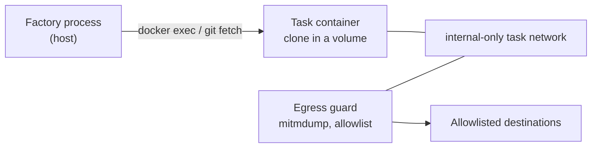

# Operator Guide: The Sandbox

<!-- implements UX1, UX2, UX3, UX4, UX5, UX6, NG5, NG7 of add-sandbox-core -->
<!-- implements UX3, UX4 of add-serve-sandbox-lifecycle -->

This guide is for the operator configuring where gnome processes actually run.
Since add-sandbox-core, every gnome-product process — agent rounds, judge
votes, command checks — executes through a task execution environment: either
the **container adapter** (an ephemeral Docker box per task) or the **host
adapter** (the pre-sandbox behavior, explicit opt-in). Sandbox setup is factory
config only — no target-repo changes are needed to sandbox an existing
pipeline (UX1).

## Quick start (container mode)

Container is the default binding. On a machine with Docker, three properties
are enough:

```properties
# application.properties (or -D flags / environment) of the factory instance
factory.sandbox.image=my-project-sandbox:1
factory.sandbox.egress-allowlist=api.anthropic.com,repo.maven.apache.org
```

Build the image from the reference recipe in
`docs/examples/sandbox-image/` — it bakes the image contract the factory
assumes (git, curl, a non-root `gnome` user owning `/gnomish/**`, root-owned
control surfaces) plus your project's toolchain. Without Docker the factory
refuses with an error naming the two ways out — install Docker, or explicitly
bind host — and never falls back to host silently.

What each task then gets:



Before the first gnome process in every box, a fail-closed **self-check**
proves the box's isolation from inside: direct egress fails, a non-allowlisted host is
denied, an allowlisted host passes, and the isolation in effect matches the
adapter's passport. A failed probe rejects the environment as an
infrastructure failure naming the probe (UX2) — no round executes in a box
whose protection cannot be demonstrated.

## Binding stages

```properties
factory.bindings.default=container      # the default even when unset
factory.bindings.stages.review=host     # per-stage override, operator-only
```

The target repo can declare *needs* in a stage's `Mechanism` (e.g. requiring
egress control) — needs may only tighten. Binding an adapter, and any
weakening, is yours alone: a repo can never request host mode. When a stage's
needs exceed the bound adapter's passport, the stage refuses fail-closed with
one error naming the unmet need (UX2).

### Which bindings exist

The binding names you can write are **discovered**, not fixed in the factory
core: each sandbox backend module ships its own binding and capability
passport, and the set that is available is the set the distribution's classpath
carries. At startup the factory reports every discovered binding — its config
name, the artifact it came from, and its full passport — before any stage runs,
so `host` and `container` (and anything else installed) are visible up front
rather than inferred from a stage's behaviour. Naming a binding nothing
contributes fails at startup, listing what *was* discovered.

Discovery is **first-party only**, and gated: the factory core owns a trust
table mapping each trusted binding id to the passport it is expected to
declare. A provider whose id is not in that table, or whose declared passport
differs from the expected one, is refused at startup rather than registered —
a backend proposes a passport, the core decides it. That matters because the
passport is precisely what needs-reconciliation trusts. There is no plugin path
for third-party sandbox backends; the sandbox is a trust boundary, and the
classpath your build assembles is the trust domain. Closing the remaining gap —
a jar impersonating a trusted id — is a build-time concern, handled by pinning
the classpath (dependency verification), not something the running factory can
detect.

One consequence worth knowing: `container` is contributed by the Docker backend
module. In a distribution built without it, the default binding is
unsatisfiable, and startup says so — naming the bindings that *are* available
and your two ways out (restore the module, or set
`factory.bindings.default=host` deliberately). It never quietly falls back to
host: silently weakening isolation is the one thing binding resolution will not
do.

One current boundary, stated honestly: mixed host/container bindings within
one pipeline are refused (the round protocol is mode-wide; bind every stage
alike). Container mode is supported across all three entry points — `gnomish
run`, `gnomish take` (single and batch), and `gnomish serve` slots — reusing
the same container assembly and the same ownership-based cleanup described
below (UX3).

## Host mode honestly

The host adapter's passport declares **isolation: none**, and that is exactly
what it means:

- Processes run on your machine as your user; every file you can read, they
  can read — on-disk SSH keys, cloud configs, browser profiles.
- The environment allowlist bounds **environment variables only**, not
  filesystem access. It stops a leaked `AWS_SECRET_ACCESS_KEY` from appearing
  in `env`; it does not stop a process from reading `~/.aws/credentials`.
- There is no egress control: any process can reach any destination.

Host mode remains fully supported for trusted setups — running the factory on
this project's own repository, licensed toolchains, iOS/GPU builds — but treat
it as running the gnome with your own hands. Mode-independent process discipline (stdin prompts, the findings
funnel, law binding, factory git hardening) still applies.

## Environment passthrough

The child environment of every process is a positive allowlist: the adapter's
base set (host: `PATH`, `HOME`, `TMPDIR`, locale, `TERM`, `USER`, `SHELL`;
container: empty — the image's own `ENV` supplies the runtime), plus the
variables you pass through by exact name:

```properties
factory.sandbox.env-passthrough=JAVA_HOME,SSH_AUTH_SOCK
```

Values are read live from the factory's environment at exec time — the config
stores names, never values. No patterns: one `AWS_*` would drag keys in
wholesale. Credential names (the tracker token, the external-check token) are
refused in passthrough at startup. The applied names (never values) are logged
at debug per exec, so "my build can't see X" is one log read (UX6).

**`SSH_AUTH_SOCK`** is deliberately outside the host base set: on-disk keys
are already exposed by host mode's absent filesystem isolation, but the agent
socket is the only route to locked or hardware-backed keys. A project with
private SSH dependencies adds it back as the one line above.

**Reward-hacking caution.** A missing variable does not crash the stage — the
build fails, the check fails, and that is a *quality failure* the gnome gets
as feedback. A gnome starved of a variable its build needs may "fix" the build
by routing around the dependency instead of asking. If a toolchain variable is
load-bearing, pass it through before the first run rather than diagnosing the
workaround afterwards.

## Egress allowlist maintenance

The allowlist is default-deny and operator-owned; a repo may *ask* for
entries in its docs, only you grant them:

```properties
factory.sandbox.egress-allowlist=api.anthropic.com,repo.maven.apache.org,registry.npmjs.org
```

Every denial is logged as structured metadata (host, path, method — never
bodies) and attached to the round that caused it. Where to look:

- `gnomish status` — an `egress denial:` line under the round's summary
- `status.json` / the task branch's `state.json` — `attempts[].denials[]`,
  one entry per denial, in the same shape a failed check's `findings[]` uses

Denials are observability, never a gate: a round that denied something still
passes if its checks pass. Reading them (UX3):

- **A denied registry/tooling host right after a build step** — the toolchain
  needs a new entry. Add it and return the task.
- **A denied host you don't recognize, mid-round, unrelated to any tool** —
  treat as a possible exfiltration attempt or injected instruction; read the
  round trace before returning anything.

Keep the list minimal — every entry is a channel. Wildcards are supported by
the guard config but name no single destination, so the self-check's
allowlisted-pass probe skips when the list holds only wildcards.

## Resource limits

```properties
factory.sandbox.limits.cpus=2        # default 2
factory.sandbox.limits.memory=2g     # default 2g
factory.sandbox.limits.pids=512      # default 512
factory.sandbox.limits.disk=10g      # default 10g (volume size, see below)
```

A build that exceeds a limit dies inside the box and surfaces as an ordinary
quality failure with attempt mechanics — tune limits up when legitimate builds
hit them, not preemptively. The disk quota is opt-in
(`factory.sandbox.enforce-disk-quota=true`): `--storage-opt size=` needs a
quota-capable storage driver (overlay2 on xfs with `pquota`) most dev daemons
lack, so defaulting it on would fail every container start.

## `verify-in: fresh-box` for the final gate

Recommend to repo authors: the final quality gate of a pipeline declares
`verify-in: fresh-box` in the stage manifest (UX5). The check then runs in a
new environment materialized from the attempt commit — exactly what a human
will merge — and doubles as proof that the branch is self-sufficient: nothing
uncommitted, no in-box residue, no PATH shims survive into the verdict.

## Docker inside the sandbox (the ladder)

The box cannot run Docker (Testcontainers-style tests fail in-box). The
supported ladder (NG5):

- **Step 0 — today:** run container-needing tests as a CI `external` check.
  The stage pushes the attempt commit; your CI (e.g. GitHub Actions) runs the
  test suite; the factory polls the platform-authored verdict. Keep such
  `gnomish/*` workflows free of privileged secrets — they execute
  gnome-authored code.
- **Step 1 — change D:** factory-run neighbor-service stacks from a filtered
  declaration (no privileged, no host mounts outside the workspace, no
  published ports).
- `factory.sandbox.runtime=sysbox-runc` exists for Linux operators who accept
  running nested-Docker runtimes themselves; the factory passes it through
  without endorsement.

## Provider-side web tools (open threat #45)

Until change B's gateway, a model with provider-executed web tools (web
search / URL fetch run on the provider's infrastructure) can reach arbitrary
URLs *around* the guard — the request never crosses the task network.
Interim guidance: **disable provider-side web tools** for the keys the
factory uses, where the provider allows it (NG7). The threat registry keeps
this honestly open until the gateway lands.

## Keep, resume, cleanup

Escalated/paused tasks keep their environment: the container is stopped,
volume and network retained, so any instance can salvage and resume from the
branch alone. Completed tasks dispose everything. Nothing in a box is
precious: the branch is the durable state.

Every factory-created Docker object is labelled, atomically at creation, with
the task's environment key, its **ownership mode** (`tracked` — claimed
through the tracker, the `take`/`serve` path — or `manual` — `gnomish run`,
which has no tracker), and the **project identity** (a stable digest of the
clone's `origin` remote URL, or your explicit override below). `run`, `take`,
and `serve` all run one shared sweep-and-reap pass through this labelling
(`sandbox-lifecycle`, `add-serve-sandbox-lifecycle`): `run` and `take` run it
once at startup, `serve` runs it on a recurring tick for the daemon's whole
lifetime.

- A `tracked` object is alive iff its task's tracker claim has a fresh
  heartbeat. A crashed or hung instance's stale claim makes its objects
  unowned: a running main box is **stopped** (never disposed outright — volume
  and network stay, so a sibling instance's resume still salvages the
  un-harvested work), while guard/judge/verification/seed-helper objects are
  disposed immediately — they hold no durable work and are trivially
  reconstructed on the next attempt.
- `manual`-mode objects (`gnomish run`) have no tracker to ask, so they are
  governed by age alone: a running manual box is stopped only after
  `factory.sandbox.manual-running-stop-age` (default 24h) since it started.
- Any stopped or container-less object — kept deliberately or left behind by a
  crash — is disposed once its age exceeds `factory.sandbox.kept-reap-age`
  (default 7 days). Escalation is one-way: running → stopped → disposed, never
  a shortcut.
- An object younger than `factory.sandbox.minimum-age` (default 2 minutes) is
  never touched, however it classifies — the grace window for a slot that is
  still mid-launch.
- The sweep is scoped to its own project identity (`factory.sandbox.project-id`,
  or the derived default): a second project sharing the same Docker host never
  sees, and never touches, this one's objects. The derived default is a digest of
  the clone's `origin` remote URL, or — for a clone with no `origin` — a digest of
  the clone's own absolute path, so two origin-less checkouts on one host stay in
  separate scopes rather than sweeping each other. Set the override explicitly
  when several clones of the *same* project must share one scope. The override
  must match `[A-Za-z0-9._-]+`: it is stamped verbatim into a Docker label whose
  read-back format is comma- and equals-delimited, so any other character is
  rejected at startup rather than corrupting the label machinery.

```properties
factory.serve.sandbox-sweep-interval=5m     # default 5m — serve's tick cadence
factory.sandbox.minimum-age=2m              # default 2m
factory.sandbox.kept-reap-age=7d            # default 7d
factory.sandbox.manual-running-stop-age=24h # default 24h
factory.sandbox.project-id=my-project       # [A-Za-z0-9._-]+; default: derived (see above)
```

**Label compatibility.** An object carrying the project label but no ownership
mode (a build older than the mode label) is treated as `tracked`, age-protected
the same as any other object, and never insta-disposed — a mixed-version host
degrades safely on the first post-upgrade sweep.

An object older than the **project** label is a different case: the sweep lists
by factory label AND project label, so such an object appears in no listing and
is never swept — not now, not later. This is deliberate. A label-less object
says nothing about which project owns it, and sweeping it anyway would break the
guarantee above for everyone sharing the daemon. Clean them up once, by hand,
after upgrading:

```bash
docker ps -a  --filter label=com.github.oinsio.gnomish.factory
docker volume ls --filter label=com.github.oinsio.gnomish.factory
docker network ls --filter label=com.github.oinsio.gnomish.factory
```

Anything in that listing without a `com.github.oinsio.gnomish.project` label is
a pre-upgrade leftover; check it holds no work you still want, then remove it
with the ordinary `docker rm` / `docker volume rm` / `docker network rm`.

The daemon reports the last tick's breakdown, the kept-environment inventory,
and recent sweep actions on `gnomish dashboard`; a `tracked` stopped-orphan
event there reads as an incident (an instance died or hung), never as routine
cleanup — routine manual age-stops are counted separately.

This ownership-labelled, claim-heartbeat-derived cleanup covers the Docker
container/volume/network/guard namespace only (`sandbox-lifecycle` of
add-serve-sandbox-lifecycle). Non-Docker execution surfaces — Colima VMs, GHA
runs, provisioning snapshot images — are not covered here; their own changes
adopt this same ownership precedent (labelled ownership, age-scoped fallback,
no reverse liveness lookups) rather than reinventing cleanup from scratch.
