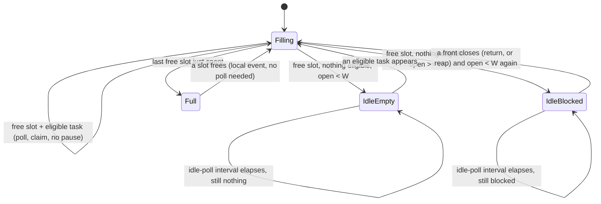

# Operator Guide: Running Continuously (serve, Batch, Drain)

<!-- implements NFR-P2, UX1, UX2, UX4 of add-factory-serve -->

This is the reference for autonomous operation: `gnomish serve`, batch
`take <ref> <ref> ...`, and drain mode. It assumes the single-task workflow in
[`operator-guide.md`](operator-guide.md) — labels, escalation flow, and stuck-claim
recovery all still apply per task; this document covers what changes when many
tasks run concurrently under one long-lived process.

Bare `take` and explicit `take <ref>` work one task and exit. Two more run
modes turn that into an autonomous factory:

- **`gnomish serve`** — a long-lived daemon that feeds itself from the ready
  queue, up to N tasks concurrently, until stopped.
- **`gnomish take <ref> <ref> ...`** — batch mode: the same explicit-mode
  disposition matrix as `take <ref>`, applied to every ref in the list, up to
  N concurrently, ending in one summary and one aggregate exit code.

Both reuse the same N-slot scheduler as the underlying machinery — a slot is
just the existing take cycle (claim → run → react to the outcome), unchanged.
`serve`'s *feed* is what is new: it claims from the queue and hands
already-claimed tasks to slots, instead of an operator naming refs.

## Command reference

```bash
gnomish serve                        # daemon: feed the queue forever, N slots, until SIGTERM
gnomish serve --drain                # daemon: feed the queue until empty, then exit 0
gnomish serve --slots=4              # override the configured slot count for this run
gnomish take 42 43 44                # batch: work three named refs, up to N concurrently
```

| Flag                | Applies to    | Meaning                                                                 |
|----------------------|---------------|--------------------------------------------------------------------------|
| `--dir=<path>`       | `serve`       | project clone directory and `.gnomish/` location; defaults to `.`        |
| `--slots=<n>`        | `serve`       | overrides `factory.serve.slots` for this run; must be a positive integer |
| `--drain`            | `serve`       | stop-on-empty instead of running forever (see "Drain mode" below)        |

`serve` has no `<ref>`, no `--interactive`, and none of `take`'s single-task
flags (`--mode`, `--task`/`--task-file`/`--task-id`, `--resume`, `--from-stage`,
`--base`, `--discard-work`, `--takeover`) — it works the whole ready queue, not
one named task, and it is unconditionally non-interactive: an escalation
always parks with a tracker report, never a TTY dialog, even with a terminal
attached (one console cannot host N concurrent dialogs).

Batch `take <ref> <ref> ...` (two or more positional refs) is the existing
`take <ref>` disposition matrix applied to each ref independently — the
"Stuck `Working`" and "Explicit mode" behavior in `operator-guide.md` still
apply per ref — plus:

- `--interactive` and `--base` are rejected outright in batch mode (no single
  console session across N concurrently worked refs; `--base` only makes
  sense for one fresh explicit-mode claim).
- `--takeover`, if given, authorizes takeover for **every** `Working` ref in
  the list (whole-run, not per-ref); without it, a `Working` ref held by
  another instance is skipped and named in the summary, exactly like a single
  `take <ref>` refusal.
- The run ends with one summary line naming every ref and its outcome, e.g.
  `batch take: 3 ref(s) — 42 -> delivered: ..., 43 -> skipped: ..., 44 -> parked: ...`.

## Exit codes

`serve`'s own exit code (not the per-task outcome, which is the tracker's
story) is:

| Code | Meaning                                                                 |
|------|--------------------------------------------------------------------------|
| 0    | clean stop — drain completed, or a graceful SIGTERM within grace          |
| 1    | startup failure — the label-provisioning smoke test could not reach the configured tracker binding |
| 2    | usage error — malformed flags                                            |

Batch `take` reuses the single-`take` exit-code table (see "`take` CLI
Reference" in `operator-guide.md`) per ref, then aggregates: exit 0 only if
every ref exited 0, otherwise the **smallest non-zero** per-ref code wins —
since the single-`take` table numbers "tool could not operate" below 10 and
"legitimate outcome" at 10 and above, this arithmetic always lets a tool
failure dominate a legitimate outcome, with no separate code table to
maintain.

## Lifecycle

**Startup.** `serve` loads the pipeline, requires a `tracker:` section (same
as `take`), then runs the same label-provisioning call the tracker adapter
always makes as a startup smoke test — for GitHub this provisions the four
`gnomish:*` labels. An unreachable repository or bad token fails here, before
any task is claimed, with an error naming the binding (exit 1). Every restart
is a clean start: a previous instance id's claims are never adopted as this
process's own — they are left entirely to the lease protocol (reaped after
TTL, or explicitly taken over), and may be re-claimed through the ordinary
queue by the new process like any other ready task. No instance-local state
survives a restart or needs to.

**SIGTERM / graceful stop.**

```mermaid
sequenceDiagram
    participant Op as Operator
    participant D as Daemon
    participant S as Slots (in-flight tasks)
    participant Gh as Tracker

    Op->>D: SIGTERM
    D->>D: stop claiming immediately (feed thread interrupted)
    D->>S: flag claims lost (round-boundary stop signal)
    S->>S: finish current round, if within grace window
    S->>Gh: release claim (label stays; reaper restores Ready after the claim TTL)
    D->>D: wait up to sigterm-grace for all slots to release
    D->>D: kill process tree (no gnome subprocess survives)
    D->>D: close the application context
    D->>D: stop the logging system (flush the async log file)
    D->>Op: exit 0
```

On SIGTERM the daemon stops claiming immediately, lets every in-flight slot
stop at its next round boundary — the only point where state is durably
committed — within the configured grace window, and explicitly releases the
claims of whichever slots make it. A release drops the claim and stops the
heartbeat; it does not move the label — the task returns to `Ready` when the
reaper of any running instance finds the claim stale, one claim TTL later
(`add-claim-return` adds the fenced immediate return). A round that outlives
the grace window is deliberately left
alone: the process still exits (killing its whole process tree, so no gnome
subprocess outlives the daemon), and that task's claim is recovered later by
the ordinary lease path (TTL, reaper, resume from the branch) — no new
mechanism is invented for it. Because a 30-second default grace rarely
catches an hour-long round's boundary, a *planned* stop should prefer
`--drain` (below) over sending SIGTERM to a daemon mid-round.

The last two steps are the daemon's own, not the framework's: Spring's
automatic shutdown hook is disabled and Logback registers none, so a single
sequence closes the application context and then stops the logging system
(ADR [0004](../adr/0004-logging-policy.md), design D6 of
`harden-logging-observability`). Stopping the logging system last is what
flushes the asynchronous file appender — a terminal slot line written while
the drain was still running reaches `~/.gnomish/logs/gnomish.log` rather than
dying in the queue. If the context close fails, the daemon logs `[GF053]` and
stops logging anyway; the exit is not blocked by it.

**Drain mode.** With `--drain`, "nothing eligible to claim" becomes the
stop-claiming signal instead of an idle sleep: the feed stops polling for new
work the moment the queue empties out, occupied slots run their tasks to
terminal results, and the process exits 0 once every slot is empty, logging a
closing report of what it worked (e.g. `drain worked 3 task(s): 42 ->
delivered, 43 -> skipped: ..., 44 -> parked as escalation`). An empty queue at
the very first poll exits 0 immediately with an empty-run report. This is the
shape a cron-triggered run should take — see "Cron operation" below.

## Feed states and the WIP-limit message

The feed inside `serve` is a four-state automaton. Claiming happens only in
the feed; a slot always receives an already-claimed task.



- **Filling** — a free slot and an eligible task exist: poll, claim,
  immediately loop again, no pause.
- **Idle-empty** — a free slot exists but nothing is eligible (empty or fully
  backoff-suppressed queue) and open fronts are below the WIP limit W.
- **Idle-blocked** — a free slot exists, but every backoff-eligible entry is a
  fresh task blocked by the WIP limit (open fronts ≥ W) and no returned task
  is ready to claim instead.
- **Full** — no free slot at all: the feed sends **no tracker polls** until a
  slot frees; freeing a slot wakes it immediately (a local event, not the
  poll timer).

Idle-empty and Idle-blocked share one idle-poll interval (`factory.serve.idle-poll-interval`,
default 30 s, jittered by up to +20% so instances don't synchronize); Filling
has no pause and Full has no timer at all. Only state *transitions* are
logged — not every cycle spent in the same state — and only Idle-blocked and
Full log at INFO (the two states that name an actionable bottleneck); Filling
and Idle-empty log at DEBUG.

When the daemon stalls on the WIP limit, the log line names the count and the
limit explicitly:

```
N front(s) await human decisions; not starting fresh work (WIP limit W)
```

That is the one log line an operator needs (UX2): it names the bottleneck (the
open fronts, not the daemon) and the next action is to answer the parked
escalations in the tracker — the daemon resumes claiming fresh work on its own
the moment a front closes and open drops back below W. "Open fronts" counts
`Working` + `AwaitingHuman` project-wide; **returned** tasks (a park marker or
a stale-claim-removal marker in the task's history — i.e. a human answered an
escalation, or the reaper recovered a dead claim) are claimed ahead of fresh
ones and outside the limit entirely ("stop starting, start finishing").

A task whose history already carries a *finish* record is not a claim
candidate at all, even if a human moves it back to `gnomish:ready` — the feed
declines it (restores its terminal status and posts an explanation comment)
before candidate selection runs, so it never occupies a slot and never counts
toward or against W. This is a different case from a returned task above: see
"Finished Tasks Are Terminal" in [`operator-guide.md`](operator-guide.md).

## Instance knobs vs. protocol constants

Two different kinds of numbers govern `serve`, and mixing them up is the
single most common misconfiguration (UX1: one command, a handful of instance
knobs; the protocol needs none of them tuned per instance).

**Instance knobs** — `factory.serve.*` / `factory.*` properties, set per
installation (Spring `--key=value` or `application.yaml`), with a CLI override
where one exists:

| Property                             | CLI override | Default | Meaning                                                            |
|---------------------------------------|--------------|---------|----------------------------------------------------------------------|
| `factory.serve.slots`                 | `--slots`    | `2`     | N — concurrent claim/work slots for this instance                    |
| `factory.serve.idle-poll-interval`     | —            | `30s`   | shared Idle-empty/Idle-blocked poll interval                         |
| `factory.serve.sigterm-grace`         | —            | `30s`   | how long SIGTERM handling waits for in-flight slots before moving on |
| `factory.serve.worktree-age-threshold` | —            | `14d`   | minimum **host worktree** inactivity before the janitor disposes of it |
| `factory.serve.sandbox-sweep-interval` | —            | `5m`    | cadence of the sandbox sweep+reap tick (one immediate tick at startup, then this) |

The last two govern **two disjoint populations with two disjoint cleaners**, and
neither ever touches the other's objects: the janitor disposes of instance-local
host worktrees by inactivity alone, while the sandbox sweep governs host-global
Docker objects by ownership and age. The sweep's own thresholds (`factory.sandbox.minimum-age`, `kept-reap-age`,
`manual-running-stop-age`, `project-id`) live with the rest of the sandbox
configuration — see
["Keep, resume, cleanup"](operator-guide-sandbox.md#keep-resume-cleanup) in the
sandbox guide.

**Protocol constants** — live only in the target project's own
`.gnomish/config.yaml` `tracker:` section, shared by every instance (the same
file already carries `heartbeat-interval`/`heartbeat-ttl-multiplier`, see
"Quick Start" in `operator-guide.md`), and are read only from the factory's
own clone — a task branch a gnome writes can never raise them:

| Key         | Default | Meaning                                                                                          |
|-------------|---------|---------------------------------------------------------------------------------------------------|
| `wip-limit` | `10`    | W — the project-wide cap on open fronts (`Working` + `AwaitingHuman`); operator-documented expectation is W ≥ N |

The distinction matters operationally: slots (N) and poll cadence are yours to
tune per machine you run `serve` on; the WIP limit is a project-wide
agreement everyone running against that project shares, so it lives beside
the heartbeat constants in the repo, not in any one instance's config.

## Base Ref Resolution: `task-branch.base` and the Remote Outage Gate

<!-- implements UX1, UX4, UX6 of add-base-ref-resolution -->

Every autonomously started task branches from a base that is resolved once,
fetched fresh, and pinned before any gnome runs — see the glossary's *base
ref*, *allowed bases*, and *base pin* entries for the vocabulary. This section
is the operator reference for configuring it and reading its failure surface.

### The `task-branch.base` section

An optional section of `.gnomish/config.yaml`, part of the **trusted tier**
(see below) and read only from the repository's default branch:

```yaml
task-branch:
  base:
    type: patterns          # optional; "patterns" is the only value today
    default: develop        # optional; must match one of the allowed patterns
    allowed:
      - pattern: develop
      - pattern: "release/*"
        role: release        # optional, "development" | "release", default "development"
```

Zero configuration is valid and means "no allowed bases, no configured
default" — every task branches from the repository default branch as the
remote reports it. An `allowed` pattern is matched only against a task's own
**designator** selection, never against `--base` or the configured `default`
— those are project- or operator-level choices already made, not the one
thing the list bounds. An unknown key (the pre-release draft's root-level
`base:`/`menu` shape has no alias), an invalid pattern, or a `default` outside
`allowed` is a located load error at startup, never a runtime surprise (UX1).

### Selecting a base per task: `tracker.github.designators`

How a task names its base is the tracker adapter's own configuration, not
this section's — for the GitHub adapter:

```yaml
tracker:
  github:
    designators:
      base: "base:(.+)"     # kind -> one-capture-group regex, matched against issue labels
```

A label matching the rule (`base:release/1.18`) supplies the candidate value;
two differently-valued matches are a conflict and park the task naming both
values and the allowed patterns (UX2). Configuring a `base` rule while
`task-branch.base.allowed` is empty is itself a load error — such a rule
could only ever reject. See
[`adapter-author-guide.md`](adapter-author-guide.md#6-config-subsection-ownership)
for what a new tracker adapter must expose to support a `base`-kind
designator.

### The external-automation escape hatch (UX4)

There is no plugin point for computing a base inside the factory — no
repository-provided code ever runs to choose one. The supported customization
path is external: a GitHub Action, a Jira automation, or a cron job computes
the base and sets the label (matched by `tracker.github.designators.base`);
the factory only validates the label against `task-branch.base.allowed` and
executes the choice.

### Two configuration tiers, and the restart you need

- **Trusted tier** — `tracker:`, `task-branch:` (this section), and future
  selector sections — binds once at `serve`/`take` **startup**, from the
  refreshed repository default branch, and is never re-read per claim.
  **A change to `task-branch.base.allowed` merged to the default branch
  takes effect only on the next start of `serve`/`take`** — exactly like a
  `tracker:` change today. Base *tips* are still refreshed on every claim;
  only the allowed-bases policy itself is startup-scoped.
- **Task tier** — stages, stage instructions, judge criteria, the rest of
  `config.yaml` — binds per task from that task's own base, read from git
  objects at the base's law commit, never from the factory clone's working
  tree.

### `gnomish run` is unchanged

Manual `run` keeps today's behavior exactly — see
[`operator-guide-run.md`](operator-guide-run.md#--base-and-where-the-law-comes-from):
without `--base` it branches from the local clone's `HEAD` with no network
calls and its law source stays the working tree; with `--base <ref>` the ref
is resolved locally (no fetch) and its law is read from git objects at that
ref's commit, offline.

### The remote outage gate (UX6)

A base-refresh or default-branch-discovery failure classified as an
infrastructure failure — the remote itself is unreachable, never a bad ref or
an underdetermined designator — releases the claim and opens one **remote
outage gate** per remote target: while open, the feed claims nothing and the
daemon probes the remote on a jittered, growing, capped interval until the
first successful probe closes it.

Operator-visible surface:

| Signal      | What you see                                                                                                                                              |
|-------------|--------------------------------------------------------------------------------------------------------------------------------------------------------------|
| Log — open  | one WARN, `[GF145] remote outage gate opened for <target>: ...`, naming the target and the cause                                                              |
| Log — during | DEBUG-only, roll-up-suppressed lines per failed probe; no repeated WARN                                                                                      |
| Log — sustained | one ERROR, `[GF146] remote outage gate for <target> has been open longer than <threshold>: ...`, the first time the outage crosses the configured duration |
| Log — close | one INFO recovery line naming the outage duration and probe count                                                                                             |
| Snapshot    | a `remote` section beside `tracker`, one entry per target: `state` (`open` \| `closed`), `openSince`, `lastError` (scrubbed), `nextProbeAt`, `consecutiveFailures`, `lastSuccessAt` — `gnomish dashboard` and the raw `snapshot.json` answer "blocked on remote X since T, next probe at T'" from this one place |
| Exit code   | a single-shot `take` hitting the same failure ends with `TakeResult.InfrastructureUnavailable`, exit code **16**; `serve` itself has no exit code for it — the daemon stays up, the gate is its degraded-but-alive state |

No task-level abort marker is written and no stage attempt is burned: the
outage is charged to the daemon, never to the task (see the glossary's
*remote outage gate* entry, and `docs/adr/0005-dependency-outage-accounting.md`
for the accounting principle behind it).

## The write-budget coupling: ΣN and the beat interval

Every `Working` task an instance holds gets re-beaten on the configured
heartbeat interval (default 5 minutes → 12 writes/hour per task), and every
instance running against a project shares the **same** token's write budget
(GitHub's secondary limit is roughly 500 writes/hour). The heartbeat
dominates steady-state writes, so at the default 5-minute interval:

```
ΣN (sum of slots across every running instance) ≲ 20 concurrent tasks
```

leaves headroom for claims, state transitions, escalation reports, and
reaping on top of the heartbeat traffic. This bound is on **total concurrent
`Working` tasks across all instances**, not on any single instance's slot
count — three instances at N=2 and one instance at N=14 both cost the same
ΣN=20.

**The scaling knob is the beat interval, not slot count** (UX4): adding more
slots (or more instances) without changing anything else spends the shared
write budget faster and eventually a `PATCH`/comment call gets secondary-rate-limited,
which the tracker adapter retries with backoff rather than crashing, but which
still slows every instance down. If you need to run more concurrent tasks than
ΣN ≈ 20 supports, lengthen `tracker.heartbeat-interval` in
`.gnomish/config.yaml` first — that is a project-wide change every instance
picks up, and it buys headroom for more slots at the cost of a longer TTL
before a dead instance's claim is reaped (`heartbeat-ttl-multiplier ×
heartbeat-interval`). Adding slots or instances without widening the interval
just moves the same tasks closer to the shared ceiling.

## The WIP method boundary

The WIP limit W bounds **how many fronts are open at once** — it says nothing
about **whether those fronts conflict with each other**. W caps
count(`Working`) + count(`AwaitingHuman`) project-wide so a bad queue (badly
specified criteria, escalation-heavy backlog) can burn at most W tasks' worth
of agent rounds before the daemon stops starting fresh work and waits on a
human. It does **not**:

- guarantee that N branches merge cleanly with each other or with the base
  branch — cross-branch integration discipline (rebase stages, task slicing
  small enough to avoid overlap) remains the pipeline author's responsibility,
  not something W enforces or checks;
- provide fairness or priority beyond "returned tasks first, then oldest-first
  as a soft preference within the head zone" — it is not a scheduler for
  contention between tasks, only a cap on how many are open.

In short: W is a cost and backpressure control, not a merge-safety or
scheduling-fairness guarantee.

## Cron operation: `serve --drain` is now the path

Cron-triggered periodic runs should invoke `serve --drain`, not a bare
one-shot `take`: it works the queue with N slots (not one task at a time),
keeps the heartbeat/reaper thread alive for the whole run (so stuck claims
from a previous crashed run are reaped automatically instead of needing the
manual label flip — see "Stuck `Working`" mode 1 in `operator-guide.md`,
which now applies to cron too), and exits 0 with a closing report once the
queue is empty.

```bash
# crontab: replace a bare `gnomish take` loop with a single drained serve run
*/15 * * * * cd /path/to/project && gnomish serve --drain --dir=.
```

The manual label flip ("Stuck `Working`" mode 3 in `operator-guide.md`) is
demoted to a genuine last resort: reach for it only if you are deliberately
running plain one-shot `take` outside `serve` for some reason and a task is
visibly stranded with no long-lived instance around to reap it.

## Observability files and alerting

While it runs, `serve` also publishes its state as local files under
`~/.gnomish/serve/<instance-name>/` — a `snapshot.json` gauge (alive? busy?
what are the slots doing?) and daily `ledger-YYYY-MM-DD.jsonl` history
files (what ran overnight, and what it cost) — with no added tracker
writes and no inbound port. See
[`docs/operator-guide-observability.md`](operator-guide-observability.md)
for the file formats and a ready-to-adapt cron script that turns snapshot
staleness and invariant checks into an outbound dead-man's-switch alert.

## Autonomy gate and CI hygiene

Running `serve` unattended raises the stakes on two things covered in a
separate reference rather than here: who is trusted to apply
`gnomish:ready` (doing so is equivalent to authorizing host code execution),
and how CI on `gnomish/*` branches must be locked down (read-only
`GITHUB_TOKEN`, no privileged secrets). See
[`docs/operator-guide-autonomy-gate.md`](operator-guide-autonomy-gate.md)
for both.
