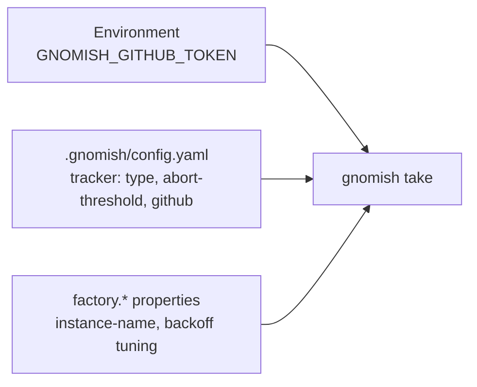
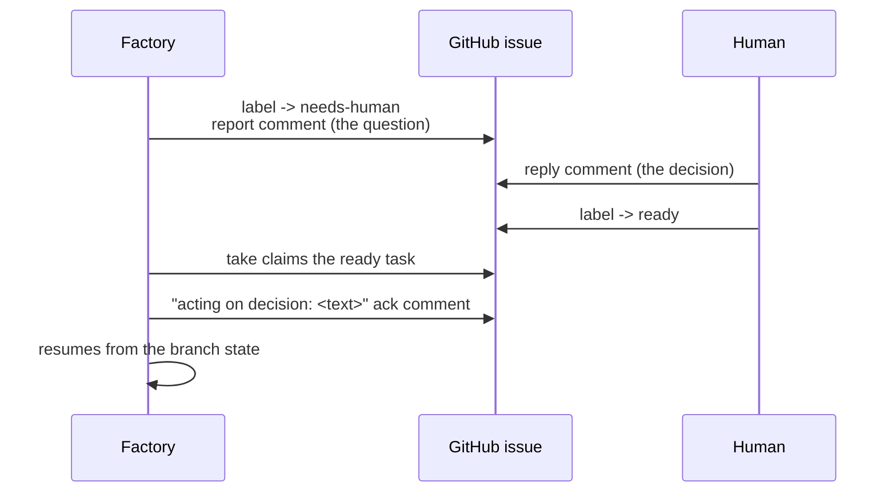
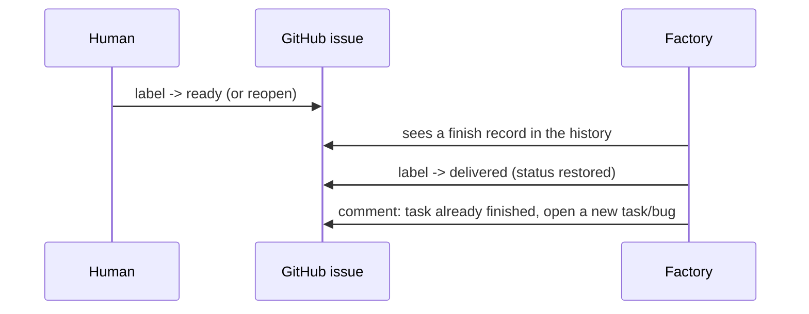
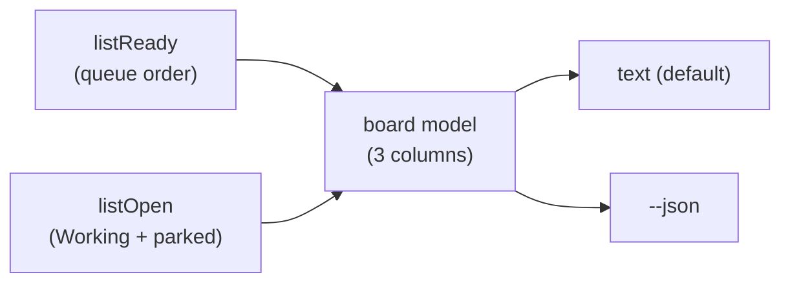

# Operator Guide: Running the Factory Against a Tracker

<!-- implements FR19 of add-tracker-port -->

This guide is for the human on the other end of `gnomish take` — the operator who
hands tasks to the factory through a GitHub issue tracker and resolves the
escalations it can't decide alone. It assumes the factory is already built and a
target project has a working `.gnomish/` pipeline (see
[`operator-guide-run.md`](operator-guide-run.md) for `gnomish run`); this document
covers the tracker-driven single-task workflow layered on top.
Where gnome processes actually execute — the container sandbox, host mode, the
egress allowlist — is
[`docs/operator-guide-sandbox.md`](operator-guide-sandbox.md)'s territory.

## Quick Start

Three places carry configuration, each with a different owner and a different
reason for existing.



1. **`.gnomish/config.yaml`** (lives in the target project repo, shared by every
   factory instance) gets a `tracker` section:

   ```yaml
   tracker:
     type: github
     abort-threshold: 3               # optional, defaults to 3
     heartbeat-interval: 5m           # optional, defaults to 5m
     heartbeat-ttl-multiplier: 3      # optional, ≥ 3, defaults to 3
     github:
       api-url: https://api.github.com
       repo: acme/widgets
       # labels: entirely optional — see the label dictionary below
   ```

   `type`, `abort-threshold`, and the two `heartbeat-*` keys are the only keys
   the core loader understands; everything under `github:` is validated by the
   GitHub adapter itself. An absent `tracker` section is valid — `take` is
   simply unavailable and `run` is unaffected.

   The two heartbeat keys are **protocol constants shared by every instance** of
   the project — they live only in this file, never in anything the gnome can
   write:

   - **`heartbeat-interval`** (a duration, default `5m`) — how often a live
     instance re-beats every `Working` claim it holds, so other instances can
     tell the holder process is still alive.
   - **`heartbeat-ttl-multiplier`** (an integer ≥ 3, default `3`) — how many
     beat intervals an unbeaten claim survives before it is considered dead and
     reaped. The time-to-live is `multiplier × interval`, so the defaults give a
     **15-minute TTL**. Pinning it to a multiple of the interval makes an
     inconsistent beat/TTL pair impossible to express.

   **The beat interval is your throughput knob (mind the shared write budget).**
   Each held `Working` task costs one tracker write per beat — 12 writes/hour
   per task at the `5m` default — and every instance shares the *same* token's
   write budget (GitHub's secondary limit is roughly 500 writes/hour). So
   `beat interval × number of concurrent working tasks` is what bounds how many
   tasks you can run at once before that shared budget, not compute, is the
   constraint. Shortening the interval buys faster stale-claim recovery at the
   cost of spending more of that budget per task; lengthening it frees budget
   for more concurrency at the cost of a longer TTL before a dead instance's
   task comes back.

2. **`GNOMISH_GITHUB_TOKEN`** is an environment variable on the machine running
   the factory — never in yaml, never visible to the gnome. Give it a
   personal access token (or GitHub App token) with issue read/write and label
   write access on the target repo. If it's missing or blank, `take` fails
   fast at startup with a named error, before any task is touched.

   A stage's GitHub Actions `external` check (add-external-check-github-actions)
   uses a separate token, **`GNOMISH_GITHUB_ACTIONS_TOKEN`**, scoped read-only:
   `actions: read` on a fine-grained PAT, or a classic token's `repo` scope used
   read-only — enough to list workflow runs and fetch job logs, nothing more.
   Keep it separate from `GNOMISH_GITHUB_TOKEN` so a leaked CI-check credential
   can't write to the tracker. See
   [`docs/operator-guide-github-actions-check.md`](operator-guide-github-actions-check.md)
   for the full operator write-up (base URL config — including what isn't
   wired yet, CI hygiene for the residual gnome-modified-workflow threat, and
   the `timeout-class` trade-off).

3. **`factory.*` properties** are per-instance/installation tuning, set the
   same way as the existing `factory.instance-name`/`factory.agent-cli-binary`
   properties (Spring `--key=value` or `application.yaml`):

   | Property                             | Default           | Meaning                                                                                                           |
   |--------------------------------------|-------------------|-------------------------------------------------------------------------------------------------------------------|
   | `factory.instance-name`              | `gnomish-factory` | diagnostic name folded into this instance's identity; shows up in public issue comments, so keep it non-sensitive |
   | `factory.tracker.abort-backoff-base` | `2m`              | base delay before a task that just aborted becomes eligible again for bare `take`                                 |
   | `factory.tracker.abort-backoff-cap`  | `1h`              | ceiling on the exponential backoff                                                                                |

## Handing Off a Task

Put the `gnomish:ready` label on an issue and run `gnomish take` (bare, for a
queue-draining cron) or `gnomish take <ref>` (explicit, naming that issue). The
factory claims it, works it through the pipeline, and either delivers it or
escalates — no other factory-side command is needed to start, answer, or revoke
a task.

Labels are provisioned automatically: at startup the GitHub adapter creates any
of its four labels that don't yet exist on the repo, with their default color
and an operator-hint description. This doubles as a smoke test of the binding —
if the token can't write to the configured repo (a common symptom after cloning
or forking without updating config), startup fails immediately with an error
naming the repo, instead of failing silently mid-task later. Once a label
exists, the factory never recolors it — repaint it however you like.

## Label Dictionary

| Label                 | Default color   | Meaning                                                 | Who moves it here                                                      |
|-----------------------|-----------------|---------------------------------------------------------|------------------------------------------------------------------------|
| `gnomish:ready`       | green `2ea44f`  | queued for the factory                                  | human (hand-off), or the factory itself (abort recovery, human return) |
| `gnomish:working`     | blue `0366d6`   | claimed and in progress                                 | factory only                                                           |
| `gnomish:needs-human` | red `d73a4a`    | parked — a decision, checkpoint, or infra fix is needed | factory only                                                           |
| `gnomish:delivered`   | purple `6f42c1` | done; review the branch                                 | factory only                                                           |

Labels are mutually exclusive — the factory always adds one and removes another
in the same transition, never replacing the whole label set, so any other
labels you use for your own triage are left untouched. Coordination facts
(who holds the claim, abort history, acknowledgements) never live in labels —
they're in structural comments on the issue thread, which is also how the
factory recognizes a human moving `gnomish:needs-human` back to `gnomish:ready`
as "task returned to work."

Configured names/colors override these defaults per logical state under
`tracker.github.labels.{ready,working,needs-human,delivered}`, each an object
with `name` and `color` (6-digit hex, no `#`).

## Escalation, Decision, and Acknowledgement Flow

The factory never waits in-band for an answer. An escalation parks the task and
exits the run immediately — identically whether a terminal is attached —
leaving a report comment that says what's blocked and how to unblock it.



The reply the factory acts on is always visible as an "acting on decision" ack
comment, posted before the factory does anything else — that ack is also what
anchors the next round of decision collection, so replying twice without an ack
in between just means both replies are picked up together. If you move a
parked task back to `ready` without replying, and the parked reason was a
pending question, the factory parks it again restating the question rather
than guessing.

Every escalation report names its own return path: reply and move to ready if
a question is open; just move to ready if the fix was environmental (a
`needs-human` from an infrastructure problem, or a manual pipeline checkpoint) —
the human return itself is read as confirmation.

## Finished Tasks Are Terminal

The lifecycle is one-way: `Ready` → `Working` → `Finished` (delivered, or
otherwise closed out by the pipeline), never back. There is no "reopen for
rework" path — if a delivered task needs further changes, open a new task or
bug that references it; the factory never resumes a finished one.

If a human moves a `gnomish:delivered` task back to `gnomish:ready` — by
relabeling it or reopening a closed issue — the factory does not treat that
as new work. It recognizes that the task's history already contains a finish
record and **declines** it instead of claiming it:



This happens within one poll cycle — both for `serve`'s feed and for bare
`take` — and it also applies to `gnomish take <ref>` run explicitly against
that issue: the CLI refuses with the same explanation instead of claiming
(see "Explicit mode" and the exit-code table below).

Don't confuse this with the escalation return path above: a task moved from
`gnomish:needs-human` back to `gnomish:ready` **is** genuinely resumable —
that's the "returned" case the factory prioritizes and continues from where
it parked. Declining only fires for a task whose history already contains a
*finish* record; a park record never triggers it.

## Snapshot Behavior

At the moment a task is first claimed, the factory reads its id, title, and
body once and freezes them — into `TaskContext` for the running gnome and into
`task.json` on the task branch. Editing the issue body afterward, while the
task is `Working` or parked, has **no effect** on the task in flight: resume
never re-reads the issue, only new decision comments.

If you need to change the actual task content mid-flight, you have two levers,
neither of which is "edit the issue and hope":

- **A decision comment** — steer the *next* step without altering what the
  gnome already committed to solving.
- **Revoke and recreate** — close the issue (the factory salvages its work at
  the next round boundary and releases the claim) and open a fresh issue with
  the corrected body.

## Stuck `Working`: Three Ways Back

When an instance dies mid-task (process killed, machine lost), its claim stops
being beaten but the issue stays `gnomish:working`. Recovery has three modes,
and which ones apply depends on how you run the factory.

**1. Automatic reaping (whenever any instance is running).** Every `take` or
`serve` run starts a standing reaper thread at run start and stops it when the
run ends — independent of whether the instance holds a claim of its own, and
independent of the heartbeat thread that beats its own held claims. On every
tick the reaper lists the open tasks and checks each `Working` claim against
the TTL (multiplier × beat interval, 15 minutes by default). A claim whose
heartbeat has been silent for the TTL — measured on the observer's own clock,
so a fresh instance always grants a full grace period — is returned to
`gnomish:ready` automatically, with an audit marker in the thread naming the
dead holder. No human is involved. So a task stranded by a dead instance comes
back on its own as soon as *any* other instance — holding claims of its own or
not, including a `serve` daemon that just restarted with nothing claimed — has
been running long enough to observe that claim past the TTL. The reaper never
claims the task for itself — it just returns it to the queue for the next
`take`. The only thing that can prevent this is a run that ends before a full
TTL window elapses — a short-lived bare `take` may exit before it ever
observes a foreign claim go stale; see mode 3.

**2. Explicit confirmed takeover (any time, no waiting).** You don't have to
wait out the TTL for a visibly-stuck task. Run `gnomish take <ref>` on a
`Working` task and it shows who holds the claim and how stale the last beat is,
then asks you to confirm:

- On a terminal it prompts `[y/N]`.
- Headless (cron, CI, no TTY), pass `--takeover` to authorize it up front.

Confirming records the holder transition in the thread, removes the old claim,
then claims and resumes from the branch exactly like any other task. Declining
(or a headless run without `--takeover`) changes nothing and refuses, naming
the holder.

**3. The manual escape hatch (last resort, for runs too short to observe a
full TTL).** Mode 1 needs the reaping run to stay alive at least one TTL
window past the moment the foreign claim actually goes stale — every `take`
runs the standing reaper, but a one-shot cron `take` that claims a task, works
it, and exits can still end before that window has elapsed, especially if its
own task finishes quickly. In that case it never gets the chance to observe
the foreign claim cross the TTL, and the queue can sit with a stranded task
until some other run happens to stay up long enough. `serve --drain` closes
this gap for cron operation — see "Running Continuously" below — because the
daemon keeps its standing reaper alive for the whole run instead of one task's
round, so it reliably outlives the TTL and mode 1 covers the cron case too.
The manual flip is genuinely last-resort operation: reach for it only if you
are deliberately running bare one-shot `take` outside `serve` (e.g. a single
manual invocation) and a task is visibly stranded. If so: remove
`gnomish:working`, add `gnomish:ready` yourself. The task branch still holds
every committed round, so the next `take` (bare or explicit) picks up from the
last durable point, not from scratch. Do this only when you're sure the
claiming instance is actually gone — if you're wrong, the git
non-fast-forward fence still protects the branch: a stale instance that thaws
and tries to push is refused and aborts, so the worst case is a wasted round,
never corruption.

## Running Continuously: serve, Batch, and Drain

<!-- implements NFR-P2, UX1, UX2, UX4 of add-factory-serve -->

Bare `take` and explicit `take <ref>` work one task and exit. Two more run
modes — `gnomish serve` (a long-lived feeding daemon) and batch
`take <ref> <ref> ...` — turn that into an autonomous factory, with drain
mode as the recommended cron path. See
[`docs/operator-guide-serve.md`](operator-guide-serve.md) for the full
command reference, lifecycle (SIGTERM/drain), feed states and the WIP-limit
message, instance knobs vs. protocol constants, the write-budget coupling,
and the WIP method boundary.

## The `board` Command: Tracker as a Kanban View

<!-- implements UX1, G3 of add-board-command -->

`gnomish board` renders the tracker as a three-column read-only board — the
operator's mental model made literal: **Ready** (the queue), **Working** (who
holds what), **AwaitingHuman** (what is parked for you). It reads the tracker
and nothing else: no task branches, no daemon files, no `serve` instance
required, so it works identically whether a daemon is running or not. Like
`gnomish status`, it prints text by default and a stable JSON document under
`--json`; both are projections of one model, so nothing is text-only or
JSON-only.

> **Not the same "board" as the GitHub Projects mirror below.** `gnomish
> board` is this local CLI view (tracker → text/JSON, read-only). The
> "[Projects v2 Boards: Display Only](#projects-v2-boards-display-only)"
> section that follows is about a *GitHub Projects* board and the
> `board-bridge.yml` workflow that mirrors a project column into the
> `gnomish:ready` label — a different thing, running in the other direction
> (board UI → label). The CLI is always written out as "`gnomish board`".

The command issues exactly two tracker reads — one `listReady`, one
`listOpen` — and never writes (no claim, park, comment, or marker); it needs
only the tracker credentials already configured for `take`/`serve`, resolved
from the `--dir` config root.



### The Three Columns

| Column            | Source                      | Row shows                                                |
|-------------------|-----------------------------|----------------------------------------------------------|
| **Ready**         | `listReady`, queue order    | id, title, returned/fresh mark, eligibility annotation   |
| **Working**       | `listOpen`, `Working` state | id, title, holder, claim freshness (age or unknown)      |
| **AwaitingHuman** | `listOpen`, parked          | id, title, park reason (escalation / infra / checkpoint) |

A representative run (text mode):

```
Ready (4 queued, 1 eligible, 1 in backoff, 1 finished, 1 WIP-held) [truncated: showing first 4 only]
  github:g/r#1 - Fix flaky OrderServiceSpec — in backoff until 2026-08-05T09:01:00Z
  github:g/r#2 - Old reopened task — finished
  github:g/r#3 - Add new feature flag — WIP-held
  github:g/r#4 - Returned after park (returned)
Working (2)
  github:g/w#1 - Refactor retry module (holder=factory-a-1b2c, updated 3m ago)
  github:g/w#2 - Update operator docs (holder=factory-b-9f00, freshness unknown)
AwaitingHuman (3)
  github:h/1 - Needs operator decision (reason=escalation)
  github:h/2 - Environment broken (reason=infra)
  github:h/3 - Checkpoint pause (reason=checkpoint)
```

### Ready Eligibility and the Summary Line

A task can sit in `gnomish:ready` yet the daemon still won't claim it — this
is the log-archaeology the board exists to remove. The Ready column names why,
in the feed's own precedence order, and each queued task counts under exactly
one reason:

- **in backoff until `<instant>`** — the task aborted recently and is inside
  its exponential backoff window. The deadline is *materialized* (computed
  from the task's abort facts by the same core policy the feed uses, so the
  board cannot disagree with the daemon).
- **finished** — the task carries a finish record (terminal, or reopened after
  delivery); the feed defensively drops it, so the eligible count does too.
  See "[Finished Tasks Are Terminal](#finished-tasks-are-terminal)".
- **WIP-held** — a *fresh* task the feed skips because the open-front count is
  at or above the WIP limit. Returned tasks bypass the WIP gate and are never
  WIP-held.

The header reconciles the window as `N queued, E eligible, <breakdown by
reason>` (e.g. `4 queued, 1 eligible, 1 in backoff, 1 finished, 1 WIP-held`);
since every task counts once, the reasons sum to `N`. "eligible" is exactly
what the feed would claim right now.

The board predicts *claimability*, not the claim order: it does not say which
eligible task the feed picks next or how deep it reads — the feed's random
head-zone pick is deliberately outside the board's remit.

### Known Behavior

- **Missing claim marker.** A `Working` task whose `listOpen` row carries a
  null claim version shows the holder with **freshness unknown** and no age
  (JSON: `claimUpdatedAt: null`). The holder is still known; only the
  last-beat instant is gone.
- **Mislabel omission.** A `gnomish:working` issue carrying *no* claim
  footprint at all — a human mislabel, no holder to name — is **absent** from
  the board by design. The board reports exactly what `listOpen` returns and
  never invents a holder. (Contrast the missing-marker case above, which still
  has a holder to show.)
- **Age is display-only.** Claim freshness is a plain age ("updated 3m ago")
  with **no stale/healthy verdict** — staleness is the reaper's judgment and
  depends on `serve` TTL config the board may not have. External monitors
  apply their own threshold to the JSON `claimUpdatedAt` instant.
- **Truncated window.** The Ready column is a window, not an export: it
  defaults to the first 50 (`--limit`). When `listReady` returns exactly
  `--limit` entries the board says so (`[truncated: showing first N only]`)
  and `--json` sets `truncated: true`; the summary counts then describe the
  *shown window*, not the whole queue.

### CLI Flags

| Flag           | Default | Meaning                                                                                                            |
|----------------|---------|--------------------------------------------------------------------------------------------------------------------|
| `--dir=<path>` | `.`     | project clone whose `.gnomish/config.yaml` names the tracker (config root only — the board reads no task branches) |
| `--json`       | off     | emit the v1 JSON document instead of text                                                                          |
| `--limit=<n>`  | `50`    | Ready window size (the `listReady` bound); must be a positive integer                                              |

### Monitoring the Queue over `--json` (external alerts)

<!-- implements G3 of add-board-command; scenario U3 -->

`--json` gives a cron script a stable, self-describing feed for tracker-side
alert rules — the **tracker-owner complement** to the daemon-side dead-man's-
switch monitor in
[`operator-guide-observability.md`](operator-guide-observability.md): that one
watches a `serve` daemon's `snapshot.json`; this one watches the *tracker* and
works even when no daemon is running. Run both side by side for full coverage.

The document is versioned (`version: 1`), stamped (`generatedAt`), and needs
no factory config to interpret. Fields a monitor uses:

| Field                                                                    | Meaning                                                                   |
|--------------------------------------------------------------------------|---------------------------------------------------------------------------|
| `.generatedAt`                                                           | observation instant (ISO-8601 UTC)                                        |
| `.truncated`                                                             | true when the Ready window hit `--limit` — treat `queuedCount` as a floor |
| `.ready.queuedCount`                                                     | ready tasks in the shown window                                           |
| `.ready.eligibleNowCount`                                                | of those, what the feed would claim now                                   |
| `.ready.inBackoffCount` / `.ready.finishedCount` / `.ready.wipHeldCount` | the ineligible breakdown                                                  |
| `.ready.openFrontCount` / `.ready.wipLimit`                              | the WIP gate, as observed count vs. limit                                 |
| `.ready.rows[].eligibility.reason`                                       | per row: `inBackoff` \| `finished` \| `wipHeld` \| `null`                 |
| `.ready.rows[].eligibility.deadline`                                     | materialized backoff deadline (when `reason == "inBackoff"`)              |
| `.working[].holder` / `.working[].claimUpdatedAt`                        | holder and last-beat instant (`null` = marker missing)                    |
| `.awaitingHuman[].id` / `.awaitingHuman[].parkReason`                    | parked task and why (`escalation` \| `infra` \| `checkpoint`)             |

**Escalation age is monitor-derived.** AwaitingHuman rows deliberately carry
no timestamp — the board is a snapshot, not a history. To alert on a
long-waiting escalation, the monitor remembers when it *first saw* each id (in
its own state file, exactly like the dead-man's-switch script) and ages it
from there. Queue growth is the same shape: compare `queuedCount` against the
previous check's value.

```bash
#!/usr/bin/env bash
# board-watch.sh <clone-dir> — tracker-side alerting over `gnomish board --json`.
# Fires on (a) the ready window growing since the last check and (b) an
# escalation parked longer than a threshold. Age is derived here because the
# board exposes no per-row timestamp for parked tasks. Requires: bash, jq.
set -euo pipefail

CLONE_DIR="${1:?usage: board-watch.sh <clone-dir>}"
STATE="${XDG_STATE_HOME:-$HOME/.local/state}/gnomish-board-watch.json"
ESCALATION_MAX_S=$((4 * 3600))          # tune to your escalation SLA
now=$(date -u +%s)

board=$(gnomish board --json --dir "$CLONE_DIR")
queued=$(jq -r '.ready.queuedCount' <<<"$board")
truncated=$(jq -r '.truncated' <<<"$board")

prev_queued=0
[[ -f "$STATE" ]] && prev_queued=$(jq -r '.queued // 0' "$STATE")

alert() { echo "BOARD ALERT: $1" >&2; }   # swap for your paging hook

# (a) queue growth — with a truncated window `queued` is a floor, so growth is real
(( queued > prev_queued )) && alert "ready queue grew ${prev_queued} -> ${queued} (truncated=${truncated})"

# (b) long-waiting escalations — first-seen ages tracked in this script's own state
prev_seen="{}"; [[ -f "$STATE" ]] && prev_seen=$(jq -c '.seen // {}' "$STATE")
seen=$(jq -c --argjson now "$now" --argjson prev "$prev_seen" '
  [ .awaitingHuman[] | select(.parkReason == "escalation") ]
  | reduce .[] as $r ({}; .[$r.id] = ($prev[$r.id] // $now))' <<<"$board")
jq -r --argjson now "$now" --argjson max "$ESCALATION_MAX_S" '
  to_entries[] | select($now - .value > $max) | .key' <<<"$seen" |
  while read -r id; do alert "escalation $id parked > ${ESCALATION_MAX_S}s"; done

jq -n --argjson q "$queued" --argjson s "$seen" '{queued: $q, seen: $s}' > "$STATE"
```

```bash
# crontab: poll every few minutes; no daemon need be running
*/5 * * * * /path/to/board-watch.sh /srv/acme/widgets >>/var/log/gnomish-board-watch.log 2>&1
```

This satisfies U3: alerting on queue growth and escalation age from the
documented JSON fields alone, without reading factory source.

## The `dashboard` Command: One Page Over Daemon, History, and Board

<!-- implements UX1-UX4, U1, U2 of add-dashboard-page -->

`gnomish dashboard` renders one self-contained HTML page composing the daemon
snapshot, ledger history, and tracker board — a wall display with `--watch`,
or a portable point-in-time snapshot for a ticket with `--out`. See
[`docs/operator-guide-dashboard.md`](operator-guide-dashboard.md) for the full
recipe, the two independent staleness layers, and the documented cadence
constants.

## Projects v2 Boards: Display Only

*(This is the GitHub Projects board — the display view mirrored into labels,
not the `gnomish board` CLI command [above](#the-board-command-tracker-as-a-kanban-view).)*

GitHub Projects v2 boards are not a source of truth for the factory — only
issue labels and structural comments are. A board is a convenient *view*
layered on top: you can arrange a "Ready" column, drag cards into it, and have
that reflect into the `gnomish:ready` label via a small bridge workflow, but
the factory itself never reads project fields or column membership directly.

A reference cron GitHub Action that syncs "column → ready label" using the `gh`
CLI ships alongside this guide at
[`docs/examples/board-bridge.yml`](../examples/board-bridge.yml). Copy it into
`.github/workflows/` in the target repo and adjust the column name and project
number for your board.

## Fork Warning: Check `tracker.github.repo`

If you fork the target project, `.gnomish/config.yaml` — including its
`tracker.github.repo` value — comes along in the fork. Left unchanged, the
factory will faithfully try to operate against the **original** repo's issues
using **your** token, which typically just fails at label provisioning
(no write access) and stops before any task is claimed. Update
`tracker.github.repo` (and `api-url`, if you're pointed at a different GitHub
host) to your fork before running `take`.

One related case is tolerated automatically: if the upstream repo itself gets
renamed (an `owner/repo` rename, not a fork), GitHub serves a redirect, and a
canonical task id minted before the rename still resolves — the factory
follows the redirect and proceeds with a warning. Only a genuine mismatch
(your binding pointing at a repo that isn't, and never was via rename, the
one a task id names) is refused outright, with an error naming both repos.

## `take` CLI Reference

```bash
gnomish take                 # bare auto mode: claim the head of the ready queue, process one task, exit
gnomish take 42              # explicit mode: act on issue #42 per the disposition matrix
gnomish take github:acme/widgets#42   # explicit mode with a full canonical id
```

`take` is always git mode — there is no `--mode` flag, no ad-hoc `--task`/
`--task-file`/`--task-id`, no `--resume`, and no `--from-stage`: task identity
and resume position always come from the tracker and the task branch, never
from the command line.

| Flag                              | Applies to                         | Meaning                                                                                  |
|-----------------------------------|------------------------------------|------------------------------------------------------------------------------------------|
| `--dir=<path>`                    | both                               | project clone directory and `.gnomish/` location; defaults to `.`                        |
| `--interactive[=executor\|judge]` | both                               | human stands in for the named role instead of the real adapter                           |
| `--base=<ref>`                    | explicit mode only, fresh claim    | override the branch base; rejected on the bare form                                      |
| `--discard-work`                  | explicit mode only, resume         | discard an interrupted round's leftovers instead of salvaging them                       |
| `--takeover`                      | explicit mode only, `Working` task | confirm taking over a task held by another (possibly dead) instance without a TTY prompt |

Short refs (`42`, `#42`) expand into the canonical `github:owner/repo#42` form
using the configured `tracker.github` binding. A full canonical id naming a
different repo is refused unless it resolves via a GitHub rename redirect (see
the fork warning above).

**Explicit mode (`take <ref>`)** is an operator mandate: it claims and works a
`Ready` task even past an unmet readiness criterion or unexpired abort
backoff (without resetting the abort counter), and resumes a task whose branch
already carries an outcome. On a `Working` task held by another instance it
takes the confirmed-takeover path (see "Stuck `Working`" above): it shows the
holder and the age of the last beat and asks for confirmation — a `[y/N]`
prompt on a TTY, or the `--takeover` flag when headless — and only on
confirmation removes the old claim and resumes; declining or a headless run
without the flag refuses, naming the holder, and changes nothing. It refuses a
parked `AwaitingHuman` task (naming the reason and return path) without
changing anything, declines a task whose history already carries a finish
record — restoring its terminal status and posting the same explanation
comment as the automatic path (see "Finished Tasks Are Terminal" above) — and
skips a `Gone` (closed or nonexistent) task with a clear error.

**Bare mode (`take`)** takes the head of the ready queue (adapter order,
oldest first), hides tasks still inside their abort backoff window, claims
one, processes it to a terminal result, and exits. An empty or fully-backed-off
queue is a clean no-op — the expected steady state of a cron-driven factory.

### Exit Codes

| Code | Meaning                                                                                            |
|------|----------------------------------------------------------------------------------------------------|
| 0    | delivered, or a clean bare-mode no-op (empty queue)                                                |
| 1    | failure outside a claimed run (tracker unreachable at startup, label provisioning failure)         |
| 2    | usage error                                                                                        |
| 3    | pipeline load failure                                                                              |
| 10   | parked as escalation — a decision is needed                                                        |
| 11   | parked as a manual checkpoint                                                                      |
| 12   | infrastructure abort, below the abort threshold — task returned to `Ready`                         |
| 13   | parked as infra — abort threshold reached, or an infrastructure escalation                         |
| 14   | revoked — claim lost mid-run (issue closed or reassigned under a working gnome)                    |
| 15   | refused or skipped (held by another instance, already delivered, closed/nonexistent, foreign repo) |

Codes shared with `gnomish run` (0/1/2/3/10/11/12) keep the same meaning. An
uncaught exception during a take run always runs the abort protocol first and
exits 12 or 13 — never a bare 1.
