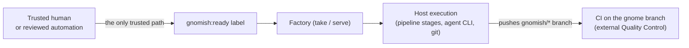

# Operator Guide: The Autonomy Gate and CI Hygiene

<!-- implements NFR-S1, NFR-S2 of add-factory-serve -->

This is the security reference for running the factory autonomously
(`gnomish serve` or a `serve --drain` cron path, see
[`operator-guide-serve.md`](operator-guide-serve.md)). It assumes the
single-task workflow and label dictionary in
[`operator-guide.md`](operator-guide.md); this document covers who is
trusted to start work and what the CI around a gnome branch is allowed to
touch. Under the current trusted-repo envelope (NG1 of `add-factory-serve`
— no execution sandbox yet), both matter more than usual: the factory runs
pipeline commands directly on the host.

## The autonomy gate: `gnomish:ready` is a code-execution grant

Putting the `gnomish:ready` label on an issue is not a triage marker — it is
an instruction: "claim this and run its pipeline." Because `serve` and
`take` execute pipeline stages as host processes (agent CLIs, `git`, any
`command` Quality Control check — see `stage-description.md`), applying the
label is equivalent to authorizing arbitrary agent-generated code to run
against the host project, with whatever the factory's own credentials can
reach.



Consequently: **anyone or anything that can apply `gnomish:ready` has the
same reach as anyone who can push code straight to the host running the
factory.** That includes anyone who can trigger automation that applies the
label indirectly — a bridge workflow, a bot, a webhook relay — not just
someone with direct label-write access on the issue.

## Guidance: who is allowed to set `ready`

Only trust two kinds of sources to set `gnomish:ready`:

- **A trusted human** with write access to the tracker repo, making a
  deliberate hand-off decision (the normal single-task flow in
  `operator-guide.md`).
- **Trusted, reviewed automation** whose trigger conditions are themselves
  gated by repo write access — for example the
  [`board-bridge.yml`](examples/board-bridge.yml) reference workflow, which
  reacts only to a Projects v2 board that only collaborators can edit.

Never wire anything that lets **untrusted input** apply the label, directly
or through a chain of automation. Concretely, do not:

- run a workflow triggered by `pull_request_target` (or any event carrying
  external content) from non-collaborator forks that ends in adding
  `gnomish:ready`;
- expose a public-facing bot, form, or webhook receiver that a stranger can
  hit to get a label applied to an issue in your tracker;
- let issue/PR body text, comment content, or any other attacker-controlled
  field drive a label-setting automation without a human-write-access
  gate in front of it.

If you are unsure whether a piece of automation counts as "trusted," ask:
could someone outside the project's trusted contributors cause this
automation to fire? If yes, it must not be able to reach `gnomish:ready`.

## CI hygiene for `gnomish/*` branches

A gnome branch (`gnomish/*`, per the branch naming the factory pushes to)
is code written and pushed by an agent, without a human review gate before
CI sees it. Treat any CI that runs against it with the same suspicion as a
pull request from an untrusted fork — because structurally, it is one:

- Any `gnomish/*`-prefixed GitHub Actions workflow, and any existing
  workflow that CI-triggers on a push to `gnomish/*` (including one used as
  an `external` Quality Control check per `stage-description.md`), MUST
  declare read-only permissions and nothing more:

  ```yaml
  permissions:
    contents: read
  ```

  Grant additional scopes (`checks: write`, `pull-requests: write`, ...)
  only if the workflow genuinely needs to report a status back — never
  `contents: write`, and never the broad legacy default of "all
  permissions" GitHub used to apply. This repo's own
  [`.github/workflows/ci.yml`](../.github/workflows/ci.yml) is the
  working example: `permissions: contents: read` at the workflow level.
- These workflows MUST NOT have access to privileged or
  organization-level secrets — deployment credentials, publishing tokens,
  admin PATs, or anything scoped beyond the one repository. A gnome-pushed
  branch triggering CI is agent-authored code running in your CI
  environment; a secret reachable from that run is a secret the agent
  effectively has.
- `GITHUB_TOKEN` (the default Actions token) must stay at its read-only
  default for these workflows — do not elevate it via
  `permissions: write-all` or a repo-level default that grants write.

This is exactly the reasoning behind sandbox-executor design work already
in progress (`add-sandbox-gha-executor`, `add-sandbox-core`): a read-only
token and no privileged secrets is the floor for any GitHub Actions run a
gnome branch can trigger, sandbox or not.

## Traceability

- **NFR-S1** (`add-factory-serve`): the operator guide states the autonomy
  gate as a requirement — the ability to set the ready label equals the
  ability to execute code on the factory host; auto-`ready` bridges from
  untrusted sources are forbidden under the trusted-repo envelope. Covered
  above under "The autonomy gate" and "Guidance."
- **NFR-S2** (`add-factory-serve`): the guide requires CI hygiene for gnome
  branches — workflows triggered by `gnomish/*` pushes run without
  privileged secrets and with a read-only `GITHUB_TOKEN`, because a gnome
  branch is gnome-authored code pushed without a human. Covered above under
  "CI hygiene for `gnomish/*` branches."
