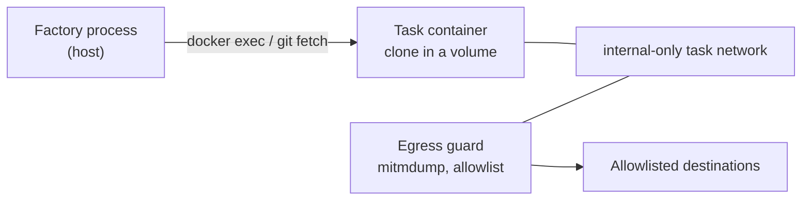

# Operator Guide: The Sandbox

<!-- implements UX1, UX2, UX3, UX4, UX5, UX6, NG5, NG7 of add-sandbox-core -->

This guide is for the operator configuring where gnome processes actually run.
Since add-sandbox-core, every gnome-product process — agent rounds, judge
votes, command checks — executes through a task execution environment: either
the **container adapter** (an ephemeral Docker box per task) or the **host
adapter** (the pre-sandbox behavior, explicit opt-in). Sandbox setup is factory
config only — no target-repo changes are needed to sandbox an existing
pipeline (UX1).

## Quick start (container mode)

Container is the default binding. On a machine with Docker, three properties
are enough:

```properties
# application.properties (or -D flags / environment) of the factory instance
factory.sandbox.image=my-project-sandbox:1
factory.sandbox.egress-allowlist=api.anthropic.com,repo.maven.apache.org
```

Build the image from the reference recipe in
`docs/examples/sandbox-image/` — it bakes the image contract the factory
assumes (git, curl, a non-root `gnome` user owning `/gnomish/**`, root-owned
control surfaces) plus your project's toolchain. Without Docker the factory
refuses with an error naming the two ways out — install Docker, or explicitly
bind host — and never falls back to host silently.

What each task then gets:



Before the first gnome process in every box, a fail-closed **self-check**
proves the cage from inside: direct egress fails, a non-allowlisted host is
denied, an allowlisted host passes, and the isolation in effect matches the
adapter's passport. A failed probe rejects the environment as an
infrastructure failure naming the probe (UX2) — no round executes in a box
whose protection cannot be demonstrated.

## Binding stages

```properties
factory.bindings.default=container      # the default even when unset
factory.bindings.stages.review=host     # per-stage override, operator-only
```

The target repo can declare *needs* in a stage's `Mechanism` (e.g. requiring
egress control) — needs may only tighten. Binding an adapter, and any
weakening, is yours alone: a repo can never request host mode. When a stage's
needs exceed the bound adapter's passport, the stage refuses fail-closed with
one error naming the unmet need (UX2).

Two current boundaries, stated honestly: mixed host/container bindings within
one pipeline are refused (the round protocol is mode-wide; bind every stage
alike), and binding resolution currently governs the `gnomish run` git modes —
the tracker-driven `take`/`serve` paths still run their existing host worktree
shape until the serve/lifecycle integration pass adopts the container adapter
there.

## Host mode honestly

The host adapter's passport declares **isolation: none**, and that is exactly
what it means:

- Processes run on your machine as your user; every file you can read, they
  can read — on-disk SSH keys, cloud configs, browser profiles.
- The environment allowlist bounds **environment variables only**, not
  filesystem access. It stops a leaked `AWS_SECRET_ACCESS_KEY` from appearing
  in `env`; it does not stop a process from reading `~/.aws/credentials`.
- There is no egress control: any process can reach any destination.

Host mode remains fully supported for trusted setups — dogfooding, licensed
toolchains, iOS/GPU builds — but treat it as running the gnome with your own
hands. Mode-independent process discipline (stdin prompts, the findings
funnel, law binding, factory git hardening) still applies.

## Environment passthrough

The child environment of every process is a positive allowlist: the adapter's
base set (host: `PATH`, `HOME`, `TMPDIR`, locale, `TERM`, `USER`, `SHELL`;
container: empty — the image's own `ENV` supplies the runtime), plus the
variables you pass through by exact name:

```properties
factory.sandbox.env-passthrough=JAVA_HOME,SSH_AUTH_SOCK
```

Values are read live from the factory's environment at exec time — the config
stores names, never values. No patterns: one `AWS_*` would drag keys in
wholesale. Credential names (the tracker token, the external-check token) are
refused in passthrough at startup. The applied names (never values) are logged
at debug per exec, so "my build can't see X" is one log read (UX6).

**`SSH_AUTH_SOCK`** is deliberately outside the host base set: on-disk keys
are already exposed by host mode's absent filesystem isolation, but the agent
socket is the only route to locked or hardware-backed keys. A project with
private SSH dependencies adds it back as the one line above.

**Reward-hacking caution.** A missing variable does not crash the stage — the
build fails, the check fails, and that is a *quality failure* the gnome gets
as feedback. A gnome starved of a variable its build needs may "fix" the build
by routing around the dependency instead of asking. If a toolchain variable is
load-bearing, pass it through before the first run rather than diagnosing the
workaround afterwards.

## Egress allowlist maintenance

The allowlist is default-deny and operator-owned; a repo may *ask* for
entries in its docs, only you grant them:

```properties
factory.sandbox.egress-allowlist=api.anthropic.com,repo.maven.apache.org,registry.npmjs.org
```

Every denial is logged as structured metadata (host, path, method — never
bodies) and attached to the task report as findings. Reading them (UX3):

- **A denied registry/tooling host right after a build step** — the toolchain
  needs a new entry. Add it and return the task.
- **A denied host you don't recognize, mid-round, unrelated to any tool** —
  treat as a possible exfiltration attempt or injected instruction; read the
  round trace before returning anything.

Keep the list minimal — every entry is a channel. Wildcards are supported by
the guard config but name no single destination, so the self-check's
allowlisted-pass probe skips when the list holds only wildcards.

## Resource limits

```properties
factory.sandbox.limits.cpus=2        # default 2
factory.sandbox.limits.memory=2g     # default 2g
factory.sandbox.limits.pids=512      # default 512
factory.sandbox.limits.disk=10g      # default 10g (volume size, see below)
```

A build that exceeds a limit dies inside the box and surfaces as an ordinary
quality failure with attempt mechanics — tune limits up when legitimate builds
hit them, not preemptively. The disk quota is opt-in
(`factory.sandbox.enforce-disk-quota=true`): `--storage-opt size=` needs a
quota-capable storage driver (overlay2 on xfs with `pquota`) most dev daemons
lack, so defaulting it on would fail every container start.

## `verify-in: fresh-box` for the final gate

Recommend to repo authors: the final quality gate of a pipeline declares
`verify-in: fresh-box` in the stage manifest (UX5). The check then runs in a
new environment materialized from the attempt commit — exactly what a human
will merge — and doubles as proof that the branch is self-sufficient: nothing
uncommitted, no in-box residue, no PATH shims survive into the verdict.

## Docker inside the sandbox (the ladder)

The box cannot run Docker (Testcontainers-style tests fail in-box). The
supported ladder (NG5):

- **Step 0 — today:** run container-needing tests as a CI `external` check.
  The stage pushes the attempt commit; your CI (e.g. GitHub Actions) runs the
  test suite; the factory polls the platform-authored verdict. Keep such
  `gnomish/*` workflows free of privileged secrets — they execute
  gnome-authored code.
- **Step 1 — change D:** factory-run neighbor-service stacks from a filtered
  declaration (no privileged, no host mounts outside the workspace, no
  published ports).
- `factory.sandbox.runtime=sysbox-runc` exists for Linux operators who accept
  running nested-Docker runtimes themselves; the factory passes it through
  without endorsement.

## Provider-side web tools (open threat #45)

Until change B's gateway, a model with provider-executed web tools (web
search / URL fetch run on the provider's infrastructure) can reach arbitrary
URLs *around* the guard — the request never crosses the task network.
Interim guidance: **disable provider-side web tools** for the keys the
factory uses, where the provider allows it (NG7). The threat registry keeps
this honestly open until the gateway lands.

## Keep, resume, cleanup

Escalated/paused tasks keep their environment: the container is stopped,
volume and network retained, so any instance can salvage and resume from the
branch alone. Completed tasks dispose everything. Crashes leave only labeled
Docker objects, which the startup orphan sweep reclaims; the serve daemon
additionally disposes aged kept environments by runtime metadata. Nothing in a
box is precious: the branch is the durable state.
