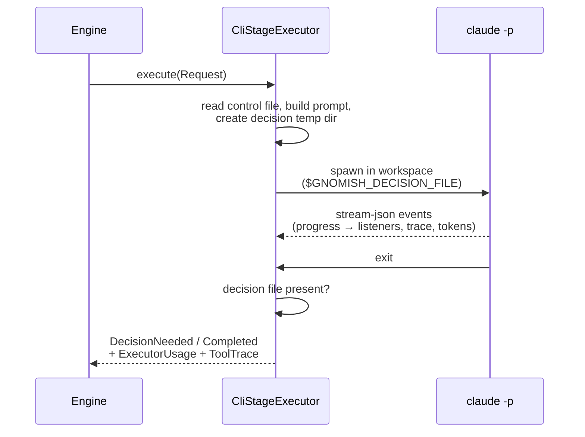

# Design: add-agent-executor

## Context

add-stage-engine fixed the port shapes (`StageExecutor`, `JudgeVoter`) and add-manual-run proved them with interactive adapters. This change builds the first real adapters on the Claude Code CLI (`claude -p`, stream-json output, ProcessBuilder per ADR 0001). The decisions below settle the wire protocols between the factory and the agent process, the telemetry mapping, and the test strategy — driven by FR1–FR16 and NFR-R1–R3/O1–O3/S1–S2/C1 of the proposal.

A recurring theme: **the QC cycle is the safety net**. Executor-side protocols may degrade softly (a missed signal costs at most one attempt, caught by verify), so simplicity and portability beat bulletproofing. The judge is the net itself, so its degradation default is inverted.

The round, end to end:

## Decisions

**D1 — DecisionNeeded travels as a decision file.** The round prompt instructs the agent: to ask a human, write JSON `{question, options[]}` to `$GNOMISH_DECISION_FILE` and finish. After process exit: file present → `DecisionNeeded`, absent → `Completed`. The file lives in a per-round temp directory the adapter creates outside the workspace and deletes after reading — a stale file from a prior attempt is impossible by construction, and nothing leaks into a future task branch (FR3, NFR-R3, NFR-S2). Reading is tolerant: invalid JSON → the whole file content becomes the question; empty file → fallback text; raw content logged at WARN (NFR-O2). The file is a one-hop transport, not storage — the question is immediately lifted into `ExecutionResult.DecisionNeeded` and delivered by the existing escalation channels. *Rationale:* both failure modes degrade softly — a missed signal becomes Completed and verify catches it (one attempt); a false signal escalates without burning an attempt (a minute of attention) — so the simplest portable mechanism wins; default = Completed.
*Alternatives rejected:* JSON in the final message (steals the human-readable round-summary channel, fragile free-text parsing); an MCP `request_decision` tool (server + config injection + lifecycle for schema validation of three fields — revisit only if file-protocol compliance proves poor, Q2); agent-controlled exit codes (the CLI does not expose them to the agent). The protocol is this adapter's detail, not the port's — a future api-executor will use native tool use.

**D2 — Every attempt is a fresh run; no session resume.** Retry = new `claude -p` in the same working copy, with prior findings rendered into the prompt from `Request.feedback` (FR1). *Rationale:* the port semantics already say so — `Request` is self-contained and the adapter stateless between calls; session files are machine-local, so after the git-workflow change attempt N+1 may run on another instance and `--resume` would make retry behavior depend on who executes it (a permanent conflict with stateless instances, not a temporary one); a failed round's context contains the misconception that caused the failure — a fresh run on distilled findings works better than digging deeper into a polluted session. Continuity comes from the workspace, not the session.
*Alternative rejected:* `--resume <sessionId>` — its only gain (saved re-exploration tokens) is capped by `attemptLimit` and outweighed by heterogeneous retry behavior.

**D3 — stream-json has two roles with different failure classes.** The result event is *essential*: unparseable/missing → infrastructure failure of the round (no verdict exists). Telemetry is *best-effort*: parse trouble → `ExecutorUsage.none()` + empty trace, the round stands (FR4, NFR-R2). Unknown event types and extra fields are silently ignored — the format is semi-documented and drifts between CLI versions. Events carry no timestamps, so the adapter stamps read time: tool start = reading the assistant event with the tool_use block; duration = until the matching tool_result (by `tool_use_id`); orphaned tool_use → until process exit; `wallTime` is measured process start → exit, independent of parsing (FR6). Precision is telemetry-grade, not billing-grade — parallel tool calls overlap and summed durations may exceed wall time; documented, not fought (NFR-O3). The trace keeps top-level calls only (filtered by the parent-id field) — nested subagent work would double-count in aggregates; `ExecutorUsage.tools` is derived from the trace (one source of truth).
*Alternative rejected:* failing the round on any telemetry anomaly — turns format drift into spurious infrastructure failures.

**D4 — Tokens are per-model maps with four fields; money is out.** `TokenUsage` → `input`, `output`, `cacheCreation`, `cacheRead` (primitive longs; "known at all" stays the container's concern). `ExecutorUsage.tokens` → `tokensByModel: Map<String, TokenUsage>`, map-only (no duplicate total — exact redundancy invites drift); empty map = unreported, preserving unknown ≠ zero; merge = key union + field sums; display totals are derived helpers (FR5, NFR-C1). Keys are resolved model ids from the result event's `modelUsage`; fallback for older CLIs: everything under the main model from the init event. *Rationale:* for agentic loads cache reads dominate real cost — a lossy 2-field mapping errs by an order of magnitude either way; a round is multimodel (subagents, helper models) and tokens of different models are not additive; after dropping cost-USD, model identity is the only path to future cost interpretation (now-or-never: history cannot be split later). `total_cost_usd` is not carried — fictitious under subscription auth and derivable from tokens+model; money budgets are removed project-wide (FR16).
*Alternative rejected:* single `TokenUsage` + a `model` field — breaks on multimodel rounds and creates a second telemetry shape next to the map.

**D5 — Real judge in scope: `CliJudgeVoter` with an inverted degradation default.** One `vote()` = one `claude -p` round in the workspace: prompt = criteria file + task context (goal, decisions — FR7 of add-stage-engine) + structured-verdict instruction; verdict extracted tolerantly from the final message (strip fences, first JSON object); anything short of a verdict → `CannotVerify`, never a silent pass — the executor has the QC net behind it, the judge *is* the net (FR8, NFR-R1). Engine machinery (majority loop, short-circuit, feedback pipe) is already built and tested. *Rationale for in-scope:* with a human judge the change's hypothesis is only half-tested — the most valuable link (judge finds → agent fixes → judge accepts) is not exercised at all; marginal cost is small since the process runner and parser exist for the executor anyway.
*Alternatives rejected:* human stays judge (loop not autonomous, feedback generated by a human); defer to api-executor (a judge is inherently agentic — it must read the working copy; an honest API judge = a hand-rolled agent loop over the API, which the CLI gives for free). Verdict-as-file rejected: it conflicts with the read-only judge (needs a Write hole against the policy's spirit), the judge's final-message channel is free (its summary *is* the verdict), and the protocols' defaults are opposite by design — no false symmetry with D1.

**D6 — Wiring is manifest-driven; `--interactive` is an explicit override.** The manifest is the source of truth about the mechanism (§5 Mechanism: `executor.type`, pinned models). Default: `agent-cli` stage → `CliStageExecutor`, judge check → `CliJudgeVoter`; `api` stage → fail fast in the existing startup validation chain (exit 3, before any dialog) — no runtime dispatch or composite executor until add-api-executor. `--interactive` restores the full add-manual-run behavior; `--interactive=executor` / `--interactive=judge` swap one role (agent + human judge = verdict calibration; human + real judge = judge-prompt debugging without paying for agent rounds) (FR10). The paid default is deliberate: that is the tool's purpose and the operator is present — no confirmation gate (UX2).
*Alternative rejected:* interactive default + `--live` flag — devalues the manifest as source of truth and burdens the real mode with a flag forever.

**D7 — Settings have two homes; policy is hard-wired.** Sorting criterion: *does the setting survive moving the repo to another machine without lying?* Manifest `settings` (portable stage behavior): `allowedTools`, `disallowedTools`, `maxTurns`, `roundTimeout` (timeout expiry = infrastructure failure — a hung CLI must not hang the engine). Installation config (`FactoryProperties`): CLI binary path (default `claude` from PATH — also the fake-binary seam, D11), env passthrough (the Ollama seam). Hard-wired adapter policy, not configurable: judge strictly read-only (a judge check's `allowedTools` may only narrow); a pinpoint Write allowlist for the decision-file path the adapter itself generated (closes D1's permission risk); transport flags (FR11–FR13, NFR-S1). Unknown settings keys are a startup error raised by the adapter — the loader stays opaque (D5a of load-pipeline-config); a typo like `allowedTols` must not silently change stage behavior. The "manifest with future api keys won't load" cost is imaginary: settings belong to a concrete `executor.type`, and `api` stages are already cut at startup (D6).
*Alternative rejected:* model in settings — it is a first-class manifest field (`executor.model`, `check.model()`) mapped to `--model`.

**D8 — One briefing renderer, per-adapter control-file policy.** The section renderer (task goal, inputs, feedback unroll, decisions, control content) is extracted from `adapter.console` into a shared package with an explicit public API — module boundaries forbid the CLI adapter from importing console internals, and `StageBriefing` is over the file-size cap anyway. Sections take pre-read data; *reading* the control file stays with each adapter because the failure reaction differs: the human gets a placeholder (they see it and judge for themselves), the agent gets a stop — unreadable control file = infrastructure failure before process start, since a silently control-less prompt could pass verify with nobody noticing (FR13, FR14). The judge uses a section subset: goal + decisions + criteria + verdict instruction, *no* prior-attempt feedback — a vote grades current state; knowing "it failed last time" would bias the verdict. Interactive rendering behavior does not change by a character.
*Alternative rejected:* a private prompt builder inside the CLI adapter — a clone of the console renderer that diverges on first edit.

**D9 — The prompt closes the QC loop's three gaps.** (a) Retry prompts carry a rework preamble — "the working copy already contains the prior attempt's result; rework, don't restart" — because a fresh-run agent (D2) has no memory and might raze finished work. (b) The full verify plan, including judge acceptance criteria, goes into the prompt: `command` checks the agent can run itself before finishing (self-checks save attempts — the loop's most expensive resource), and acceptance criteria are part of the spec, not an exam secret (stage-description already requires them concrete and checkable); criteria files are read in the same pre-spawn preflight as the control file — unreadable → infrastructure failure (FR13). Goodhart's objection rejected: a criterion satisfiable without solving the task is a defect of the criterion, and supervised runs should expose it. (c) The final message becomes the round summary: it rides the `RoundFinished` progress event and the log — not the domain (the port stays stable; a summary is not decision data). When git-workflow arrives, the round summary should go into the attempt's commit message — that requirement is born here but belongs to that change (FR2, FR7).

**D10 — Live progress is an adapter SPI, not a domain port.** The parse loop emits sealed progress events (`RoundStarted(model, sessionId)`, `ToolStarted(name)`, `RoundFinished(summary, …)`) to listeners with `EngineEventListener` semantics verbatim: synchronous, return fast, exceptions swallowed — observability, never an effect. Two subscribers: an SLF4J renderer (live feed in the console log stream, structured lines under the attempt MDC; raw events at DEBUG) and a status enricher adding current tool + call counter to `Executing` activity — closing the blind spot where a minutes-long round shows only `Executing(since)` (FR7, NFR-O1, UX1, UX3). Judge rounds feed the same renderer; the enricher is executor-only (a vote runs under `verifying`). Precedent: `StatusSnapshotHolder` already feeds from engine events and console markers; executor progress is a third feeder of the same kind. Contract tests assert progress through the listener, not by scraping logs.
*Alternative rejected:* extending the domain `EngineEvent` stream — executor-internal progress is the adapter's detail; the engine's events are per-round, not per-tool.

**D11 — Three test layers.** The adapter's contract is with the *CLI*, not the backend — the CLI generates stream-json itself regardless of the model behind it. (1) *Reference dumps* (`*.reference.json`, recorded from real runs, sensitive data scrubbed): byte-real parser fixtures — plain round, subagent round, judge verdict, result with/without `modelUsage` — closing the format-drift risk. (2) *Fake agent binary* (a script standing in for `claude` via the configurable binary path): reads args, prints scripted stream-json, writes workspace files, exits with a chosen code — real ProcessBuilder/pipes/exit codes, deterministic and free; the port-contract suites, decision-protocol and verdict-parse edge cases, killed-process and live-progress tests run here. (3a) *Local E2E*: real `claude` CLI pointed at Ollama (v0.14+ speaks native Anthropic API; `ANTHROPIC_BASE_URL` + auth token + default-model env) — real emission, permission mechanics, exit codes, tool loop, free; scenarios deliberately trivial so a weak local model's failure does not read as an adapter bug; skipped with a clear message when Ollama is absent; native prerequisite, not Testcontainers (dockerized Ollama gets no Metal on macOS — unusably slow). (3b) *Paid smoke*: manual Gradle task outside `check`, never in CI; records the reference dumps (resolved model ids and cache tokens that Ollama cannot produce) and confirms no real-backend divergence; run on CLI version bumps, parser changes, unexplained layer-1/3a divergence, and before archive (G4, M1–M4).
*Alternative rejected:* Ollama replacing the fake — non-deterministic and slow where determinism is the point; the fake replacing E2E — it never exercises the real CLI's behavior.

**D12 — Status contract v1 is amended in place, no version bump.** Usage DTOs move to `tokensByModel` (per-model objects with four token fields), `JudgeUsageDto.perVote` follows, and `executing` activity gains the live detail — one wave, `status-report-v1.reference.json` regenerated. The v1 versioning policy (rename/removal bumps the version) governs *released* contracts; no v1 document has ever left this repo — add-manual-run is not yet archived and the contract's only consumer ships in the same codebase. Stamping v2 for an unreleased v1 would burn a version number for no consumer's benefit.
*Alternative rejected:* bumping to v2 — versioning theater; deferring the usage amendment — splits one telemetry model across two contract shapes.

## Risks / Trade-offs

- [Writing the decision file outside the workspace may fight CLI permission mechanics] → the adapter grants a pinpoint Write allowlist for the exact path it generated (D7); fallback if still painful: a path inside the workspace under `.gnomish/runtime/`, deleted by the adapter after reading.
- [stream-json format drift between CLI versions] → tolerant parsing (unknown ignored), reference-dump fixtures, explicit fallbacks (`modelUsage`, parent-id field), paid smoke re-recorded on CLI bumps (D11).
- [Missed decision signal costs an attempt] → accepted by design: verify catches it, findings feed back; the alternative (bulletproof protocol) buys little for its complexity (D1).
- [Agent or judge ignores the JSON protocol] → executor: degrade to Completed + QC net; judge: CannotVerify escalation, raw message in the log; both protocols carry an explicit revisit trigger (Q2).
- [Weak Ollama model fails scenarios for intelligence reasons] → E2E scenarios kept trivial (create a file; criterion "file exists"); compliance doubts resolved against the paid smoke, not by hardening the adapter.
- [Timing telemetry can exceed wall time (parallel tools)] → documented measurement property, aggregates stay derived from one trace (NFR-O3).
- [Paid rounds start without confirmation] → deliberate (UX2): manifest-driven run is the product; `--interactive` is the free path; misconfiguration fails fast before any spend.
