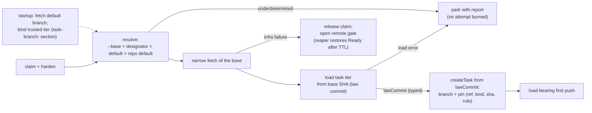

# Design: add-base-ref-resolution

## Context

See proposal.md — Why. Code facts that shape the approach (audit of
2026-09-04): all four fresh-start paths (host/container × run/take) already
pass through one funnel, `GitFreshTaskSupport`, which is the only place a
null base becomes `"HEAD"`; a second copy of that default sits in
`TaskBranchCreator.startPoint()` (host), while the container-side
`GitObjectsTaskRepository` has none. `task.json` already writes a
`baseCommit` field that is carried through resume bootstrap but on which no
decision depends — a free slot for the pin.
The container gets its working copy by cloning the already-created task
branch from a read-only mount with `--network none`, so any base fetch can
only ever run factory-side, before `createTask` — one point serves both
media. Git-side bounded network invocations, credential scrubbing, and
`GitInfrastructureRetry` exist; Resilience4j lives only in the GitHub
adapter. Supersedes design decision D7 of `add-git-workflow` (archived
2026-07-19) as that decision itself anticipated.

Law-source facts (review of 2026-09-05): `PipelineLawReader.freeze` reads
files under a `Path` — every `assemble` call site passes the clone directory;
the definition is loaded once per process from the working tree
(`TakeCommandSupport.loadPipeline`), while the law is re-frozen per task from
the *live* working tree, so a `git pull` in the clone silently changes the
law between serve tasks; the external-check pin guard is built over the
literal `"HEAD"` (`RunAssembler`). `GitObjects` already reads blobs and checks
existence at a commit but cannot list a tree. Every consumer of instructions
and criteria (prompt builders, judge voter) takes frozen strings, never
paths. `add-pipeline-routing` D3/D5 assume "same tree per task", which the
allowed-bases list falsifies.

Law-root facts (audit of 2026-09-07, `/architect`): the loader validates
stage file references against `<project>/.gnomish/`
(`GnomishDirPipelineSource` → `PipelineLoader` → `ReferencedFiles`), while
every `assemble` call site freezes them against the clone root
(`RunAssembler` wraps `lawSourceRoot` — the clone directory — directly), so
a reference such as `stages/work/instructions.md` validates at load and
freezes as unreadable at run. The defect dates from the module split (#27)
and is masked by fixtures that write every law file twice (15 fixture
sites) and by ~27 specs that build `StageDefinition` in code, bypassing the
loader — including `GitModeLawBindingSpec`, which therefore pins the wrong
root. Root cause: one `lawSourceRoot` parameter serves two roots — the law
root (`.gnomish/`) and the repository root the external-check pin guard
legitimately needs. D12 fixes the root rule; task 5.4 carries the code.

## Goals / Non-Goals

**Goals:** implement FR1–FR10 with one resolution owner, no behavior change
for manual `run`, and artifacts (`designator mechanism`, pin format
precedent) shaped so `add-pipeline-routing` consumes them without rework.

**Non-Goals:** everything in proposal NG1–NG11; additionally, no new retry
machinery for the fetch itself (reuse `GitInfrastructureRetry` — the remote
outage gate of D9 is a pause in front of the claim, not a retry), and no
observability dashboard surface for the pin (task.json + existing inspection
suffice).

## Decisions

**D1 — One resolver at the existing funnel.** `BaseRefResolver` is invoked
from `GitFreshTaskSupport`; below the funnel every component receives a
resolved ref, and both duplicated defaults (`GitFreshTaskSupport` null→HEAD,
`TaskBranchCreator.startPoint()`) are deleted. *Rationale:* the funnel is the
audited single point all four fresh-start paths share (FR10, M2); pushing
resolution lower would re-create per-medium divergence. *Alternative
rejected:* resolving in each mode runner — exactly the duplicated-default
bug this change removes, multiplied.

**D2 — Pure policy in a new leaf module `:baseref`.** The module holds the
allowed-bases pattern grammar, selection validation, source priority, the
underdetermined-input classification, and the decision value types
`(ref, rule, reason)` — a function from values to a value, zero internal and
zero external dependencies, gated by `layering { allowedProjects = [] }`.
The base designator enters it as an already-classified input value
(absent | single | conflict, the module's own type); `:application` maps the
port's designator shape onto it, because the module may import nothing.
Fetch, `rev-parse`, and `ls-remote --symref` stay in `:adapters:git`; the
`task-branch.base` DTO parsing stays in the pipeline loader (`:adapters`), mapping into
`:baseref` value types; orchestration and pinning stay in `:application`.
*Rationale:* change 2 (propagation obligations) is a planned second consumer
of the same pattern grammar; the empty-allowlist gate constructively
guarantees the policy can know nothing of subprocesses or trackers (NFR-S3);
the policy is dense decision logic that benefits from its own 100% PIT scope.
*Alternative rejected:* a package in `:application` (the settings.gradle
"module overhead" default) — kept as the documented fallback: if at
implementation time the policy degenerates into a trivial conditional, fold
it back into `:application` without loss.

**D3 — The `task-branch.base` section is trusted-tier law read from the refreshed default
branch.** Shape per pipeline-config delta (FR1) and naming per D16. The section is read
factory-side, by ref (D12), from the repository default branch only
(Renovate's model: config on the default branch, no per-branch drift, and
selector fields re-asserted from the default branch even when the base
branch's config is merged in), bound once at startup and never re-read per
claim (D15); it picks the base; the task tier of the law
then binds from the chosen base's law commit. This ordering is what breaks
the "config chooses the base, but which ref holds the config" cycle (FR2,
NFR-S1). *Alternative rejected:* reading `task-branch.base` from the base branch itself
— circular; per-branch configs — the drift Renovate explicitly designed
away.

**D4 — Fetch is allowed; pull never; manual run untouched.** D7's rejected
"silent network mutation of the operator's clone" conflated fetch and pull:
`git fetch` leaves working tree, HEAD, and local branches untouched, so the
FR7 (`add-git-workflow`) invariant survives. Autonomous paths refresh
fail-closed; manual `run` without `--base` keeps branching from local HEAD
with zero network (FR8) — the offline/determinism half of D7 that was worth
keeping. *Alternative rejected (steelman'd):* status quo everywhere —
correct only while a human updates the clone; serve has no such human, so
staleness grows without bound.

**D5 — Designators are derived adapter-side; the port carries the
classified fact, never raw labels.** The `fetchTask` fact set (`TrackerTask`)
gains `designators`: per kind, one of absent | single(value) |
conflict(values). The three-shape type and the one classification function
(candidate values → shape; equal duplicates collapse to single) live in
`:gnomish-plugin-api`, the module every adapter already compiles against, so
the decision logic exists once. Each adapter supplies the candidates its own
way: the GitHub adapter applies a configured regex with one capture group to
the issue's labels; the in-memory adapter sets designators through a test
operation and still needs no subsection; a future Jira adapter reads a native
field (fixVersion). The rule lives in the adapter's own subsection —
`tracker.github.designators: { <kind>: <regex> }`, kinds open — and is
validated on the adapter's config seam exactly as `tracker.github.labels` is
today. The `TrackerAdapterFactory` seam gains a query for the kinds an
adapter is configured to extract (the `credentialEnvVars` shape); the
trusted-tier startup validation turns "kind `base` extracted,
`task-branch.base.allowed` empty" into a located `ConfigError` naming both
places, because such a rule can only ever reject (the Kubernetes "selector
cannot match its template" class of error). The resolver keeps its defensive
arm — no allowed base plus a designator is underdetermined — so the runtime
stays fail-closed if the
startup check is bypassed. This resolves proposal Q1. *Rationale:* the port
spec's own rule ("port vocabulary is the factory's; no core class references
a tracker concept such as label") and the ports-and-adapters literature
(Cockburn: the adapter converts device signals to the application's
language; Fowler's Gateway: the interface is shaped by the application's
need; Kubernetes API conventions: data that drives system behavior is a typed
field, not a label) both put the label regex in the adapter. The two
objections that made the first draft choose core-side extraction dissolve
against existing precedent: the config is already plumbed to the adapter
(state-label names come from `tracker.github`), and the classification is one
shared function, not one per adapter — only the genuinely tracker-specific
candidate extraction is per adapter. *Alternative rejected (the first
draft, agreed 2026-09-04 and reversed 2026-09-06):* raw labels in the port
facts with a core-side `base.select.label` regex — leaks the label concept
into core and cannot carry a Jira adapter, whose fact is not a label (the
ArgoCD pull-request generator hit exactly this leak with Bitbucket).
`add-pipeline-routing` rebases by adding kind `type` to the same adapter map
and gets its `type:` default from the GitHub adapter, not from core.

**D6 — Fetch sits between `harden()` and `createTask()`,
factory-side only.** The refresh fetch (and default-branch discovery via
`ls-remote --symref`) runs in `TakeFreshClaim` / `TakeContainerFreshClaim`
after claim hardening and before `createTask`, wrapped in
`GitInfrastructureRetry`. The container medium needs nothing extra: the box
clones the already-created branch. `add-pipeline-entry-precondition`
is sequenced after this change: its baseline probe runs after fetch+resolve
so it probes the refreshed base, and it reads the baseline SHA from the
structured pin (D7) through the versioned mapper, never as a flat
`baseCommit`; its design and proposal record the same order. *Rationale:* one point covers
both media; failures before `createTask` leave no branch to clean up.
*Alternative rejected:* Resilience4j for the retry — it lives only in the
GitHub adapter and would leak an HTTP-stack dependency into git
infrastructure.

**D7 — Pin `(ref, sha, rule)` reuses the `baseCommit` slot behind the
version gate.** The mapper grows the pin as a structured object; legacy
files carrying only `baseCommit` read as unpinned (ref/rule absent); the
rule vocabulary is a wire vocabulary with a data-driven round-trip spec over
every constant. Resume reads the pin and never re-resolves (FR7, NFR-S2).
The pin exists so a resume can also *see* that the rule would resolve
differently today — a report line, never a re-resolution. *Alternative
rejected:* a separate pin file — splits mutually-implied facts across
writes, violating the one-commit rule.
*Revised 2026-09-10 after the post-implementation review.* **The pin also
carries the kind** — branch, tag, or commit — that origin stated when the
refresh classified the ref (D11a). This is not the rejected "kind on the
allowed-base entry": that would be configuration guessing at a remote fact,
while the pinned kind *is* the remote fact, recorded at the moment it was
established. Resume hands the pinned kind to the refresh, which then fetches
that namespace only; a tag pushed later under a pinned branch's name (or the
reverse) neither redirects nor parks the task, which D11a's collision arm
would otherwise do to every resume of a task whose base name was reused.
GitLab's `ref_type` fix for its ambiguous-ref API (gitlab#591446) is the
same shape: a name is only addressable together with its type. A legacy pin
without a kind resumes exactly as before this revision — classified by
`ls-remote` at resume time.

**D8 — Crash consistency of claim → refresh → resolve → create.** Durable
steps in order: tracker claim; (no durable step: discovery, base fetch,
resolution — all reads; the trusted tier was bound at startup, D15);
task-creation commit carrying the pin;
first push. Kill windows and shapes:
1. *After claim, before the creation commit.* Tracker medium: the
   `claim-heartbeat` shape `Claimed` (working label, live claim footprint)
   whose holder is dead; its one recovery owner is the reaper, which
   restores `Ready` on TTL expiry. Branch medium: no ref exists — not a
   `task-branch-contract` shape and, by construction, nothing to recover,
   since no branch write has happened. The next claimant is not a recovery
   owner: it takes the restored `Ready` task through the ordinary lease and
   re-runs resolution from scratch — idempotent in effect because nothing
   durable references the earlier answer (NFR-R1/R2). A different answer on
   re-resolution is legal by construction. The claim release of an
   infrastructure failure (D9) is a tracker write that follows the failed
   fetch; a kill between the two freezes the same `Claimed` shape with the
   same reaper owner (NFR-R3); a kill after the release freezes
   `ClaimAbandoned` — a release drops the claim footprint and leaves the
   working label (FR15, D2 of add-tracker-port) — whose recovery owner is
   that same reaper, by grace then stale-claim removal, so the window adds
   no owner either. The gate D9 opens is process memory, not a durable step.
2. *After the creation commit, before the first push* — the existing
   `task-branch-contract` shape (local branch unseen by origin); unchanged
   recovery (load-bearing first push / re-create on another instance).
The pin and the branch land in one commit (mutually-implied facts), the
fetch precedes every durable write (constructive before destructive is
trivially satisfied — nothing is destroyed), and both windows already sit in
the kill-point matrix of their owning capabilities; the new fetch only
lengthens window 1. Because it does, this change adds the window's own
kill-point spec (tasks 6.4, 8.4): kill after the claim and before
`createTask`, drive the reaper on virtual time to `Ready`, assert the branch
ref is absent, and assert a second reaper pass changes nothing. The D9 route
into the same window is a second row of the same table — claim, a real
refresh against an unreachable `origin`, release — so the failed fetch's
"nothing durable landed" is asserted rather than argued. *Alternative rejected:* pinning in the tracker at claim
time — splits the pin from the branch it describes across two media.

**D9 — A dead remote is the daemon's condition, not the task's: release
the claim, gate the feed.** A base-refresh reachability failure is caught
at the fresh-claim step, classified by cause (never by step), and answered
with a plain `release`: no abort marker, no comment, no attempt burned (FR9).
The release moves no label — it drops the claim and leaves the logical
state, per FR15/D2 of add-tracker-port, and the GitHub adapter's `release`
is a documented no-op — so the task is back in Ready only once the reaper
finds the claim stale, one claim TTL later. The kill-point row that covers
the release (D8, NFR-R3) and `TrackerReleaseContract` pin exactly that for
both adapters; the fenced immediate return the operator guides had implied
is a separate port verb, `add-claim-return`, never a meaning `release`
quietly grows. The revocation path keeps plain `release`: there a human may
already have moved the label, which is the case the no-op was designed for. The take result is a typed `TakeResult` variant
with its own exit code, never `Skipped` with free text. In serve the same
failure opens the **remote outage gate** — one owner class per remote
target, consulted by the feed before every claim, probing with a
tracker-free `ls-remote` on a jittered, growing, capped interval
(`RestartBackoff`'s policy), closed by the first successful probe, its
interval reset only by the first successful base refresh after the close
(FR14). Both slot-side signals are emitted at the base read itself — a
decoration of the slot's `BaseRefGit` reports each `refresh`/`resolveForResume`
outcome to the gate as it returns — never derived from the slot's terminal
result, which arrives hours after the refresh it implies and would reset
the interval on a refresh that predates the outage (revised 2026-09-11; the
original task 7.3 mapping of `TakeResult` variants to signals is withdrawn).
Transitions are the log and snapshot signal (NFR-O1, NFR-O3, M4).
The principle, the survey of orchestrators behind it, the recorded
deviation from CI practice, the separate bound, and the rejected
alternatives are `docs/adr/0005-dependency-outage-accounting.md`; the rule
binds every claim-time fetch of any ref, which is what
`add-decision-inheritance` adopts for the epic branch.

**D10 — Security model: the gnome gets no new levers.** Two rules carry the
whole model: (1) the `task-branch.base` section is read only from the default branch —
in-branch or working-copy edits are project content until a human merges
them (the `PipelineLaw` reward-hacking rule); (2) the base is pinned at
claim, before any agent runs, and resume never re-resolves from
gnome-writable data. Remaining vectors are human-permission questions
(triage rights pick a *valid* but wrong base — visible in the PR target,
bounded by the operator's allowed bases; push rights can mint a branch that
matches an allowed pattern — inherent to pattern lists, gated by merge
review; a gnome PR editing
`.gnomish/` — law only after human merge). *Alternative rejected
(permanently):* an executable selector shipped in the target repo's
`.gnomish/` (the `command`-check pattern) — the selector would run on the
factory host at claim time, before any sandbox exists, with factory
credentials, i.e. arbitrary code execution for anyone with repo write
access; the factory deliberately neutralizes repo code on the host
(`FactoryCloneHardening`, "Controls are data"). The supported escape hatch
is external automation setting the label (proposal UX4); the `type:`
discriminator (FR1, pipeline-config delta) leaves a schema-compatible door
for a future
operator-classpath `BaseRefPolicy` plugin — trusted like the rest of the
operator's classpath, not built now (NG6).

**D11 — Base refs are general refspecs, each kind lands where git would
put it, and `FETCH_HEAD` is never read.** The config and the pin accept
branches, tags, and commit SHAs. A branch refreshes into
`refs/remotes/origin/<n>` (forced — the clone's cache of origin, and what
`TaskBranchLocator` already does); a tag into `refs/tags/<n>` without force,
a diverging local tag being a task-level park naming both commits; a SHA is
checked locally, fetched by SHA only when absent, and verified as a commit
object, with no ref written. Every refresh runs with `--no-tags`,
`--no-write-fetch-head`, an empty `--refmap=`, and full depth; the SHA is
read back from the destination, never from `FETCH_HEAD`; `CloneMutationLock`
is the serialization, so git's compare-and-swap ref failure is unreachable.
A remote refusing fetch-by-SHA (protocol v0 without
`uploadpack.allow*SHA1InWant`; none of the public forges) is a task-level
park. The git facts, the tool survey, and the rejected alternatives
(`FETCH_HEAD`, a private `refs/gnomish/` namespace, forced tags,
branch-only bases, shallow fetch) are `docs/adr/0006-base-refresh-fetch.md`.
This resolves proposal Q2.

**D11a — The kind is a fact origin states, and a name that is both a branch
and a tag on origin parks the task.** A base ref carries no kind: the allowed
list and the designator name `develop` or `v2.3.0`, and only the remote knows
which namespace holds it. So the refresh classifies before it fetches, with
one `ls-remote origin refs/heads/<n> refs/tags/<n>` — a bare SHA is
recognized lexically first and never asked about. Four answers: only a head
→ branch; only a tag → tag; neither → the task-level park "origin holds no
such ref"; **both → a task-level park naming the head commit and the tag
commit**. Never a preference between them.

*Rationale:* absence must be a fact a remote stated, not an inference from a
failed fetch — the rule `TaskBranchLocator` and `RemoteBranchTip.Carriage`
already carry, and the one whose violation forked a duplicate branch once
already. The collision arm is the security half: git itself resolves an
unqualified ambiguous name **to the tag**, silently, and that exact
preference is how a tag named after a protected branch drew that branch's CI
secrets in GitLab (gitlab-foss#53477, gitlab#219583); `actions/checkout`
carries a tail of the same class from fetching `refs/heads/<ref>*` and
`refs/tags/<ref>*` together. A factory that picked either side would let
whoever can push a tag redirect a task's base. Jenkins' own advice — spell
the ref fully — is the escape hatch below.

*Cost:* one remote refs read plus one narrow fetch, which is NFR-P1's budget
exactly: the read that classifies a named base and the `ls-remote --symref`
that discovers the default branch are alternatives, never both — a task
whose base came from the allowed list, a designator, or `--base` never asks for the
default branch, and a task that fell through to the default branch learns
from that same read that it is a head.

*Deferred, not now:* accepting a fully qualified `refs/heads/<n>` or
`refs/tags/<n>` in the allowed list, a designator, or `--base` as the documented way
past a collision (Jenkins' "safest specifier" rule). `RefNameSyntax` already
admits the syntax; what is missing is only the classification short-circuit
and the matching semantics of a qualified allowed pattern. Left out because the
collision is rare, the park names both commits so the operator can rename or
re-tag, and a half-specified qualified form would be a second grammar to
keep in step with the allowed list.

*Alternative rejected:* a `kind` field on the allowed-base entry. The kind is a
property of the remote, not of project policy, so a declared kind is a
second source of truth that can only ever drift from what origin holds; and
it would have to be repeated for every entry to pay off in the one case that
matters. Propagation obligations (NG1) may later want to know "this base is
a tag, so there is nothing to merge back" — that fact is available from the
classification at resolution time and needs no configuration.

**D12 — Law is read by ref from git objects; the working tree is never a law
source once a ref is resolved.** A law source abstraction (read a file, test
a regular file, list a directory — all relative to a root) gets exactly two
realizations: a working-tree source and a git-objects source bound to one
commit, the **law commit**. `GnomishFiles`, `ReferencedFiles`, `PipelineLoader`
and `PipelineLawReader` read through it; `GitObjects` gains tree listing
(`ls-tree`). **Both realizations are rooted at the law root — the
`.gnomish/` directory** — the same root the loader validates against, so a
reference that validates at load reads at run in every medium; the
assembly carries the law binding and the repository root as two typed
values, never one `Path` doing both jobs (the repository root serves the
external-check pin guard, whose pin paths are repository-relative by
design). **Both realizations refuse a symlink entry under the law root**,
never following it (revised 2026-09-07: the first draft kept the
working-tree `realpath` guard, which accepted a symlink whose target stayed
under the root — one commit would then be valid law in manual `run` and
invalid in `take`; Kustomize `LoadRestrictionsRootOnly` and Argo CD's
out-of-bounds symlink scan, adopted after three CVEs of one class, take the
same fail-closed line). The lexical half of `PathSafety` is the whole
traversal guard in git objects (a git tree has no `realpath`), and the
working-tree realization keeps its `realpath` check on top for defense in
depth; an absolute reference is refused in both. The pin guard receives the
law commit instead of `"HEAD"`, so law and pin come from one SHA by
construction. A field is relative to exactly one root, recorded in
`docs/adr/0007-pipeline-law-source.md`: `instructions` and `criteriaFile`
to the law root; external-check pin paths and (per
`enforce-artifact-contracts`) artifact output paths to the working copy
root. Escaping the law root by an
explicit repository-anchored prefix (Bazel `//`, Argo CD `/`) is a named
non-goal with the syntax reserved, so a later change extends the grammar
rather than loosening the guard. Selection is by *fact*, not by mode: any path that resolved a
ref uses git objects (take, serve, manual `run` with `--base` — the latter
resolving locally, offline, with no fetch); in-place mode and manual `run`
without `--base` keep the working tree, which preserves the pipeline
author's edit-and-run loop on uncommitted files (FR8, UX3). This is
the industry mechanism (GitLab through Gitaly, Jenkins `SCMFileSystem`,
GitHub Actions and Renovate through content APIs; OWASP CICD-SEC-4 names the
principle) and adds **no durable step** — reads only — so D8's kill-window
list is unchanged. *Alternative steelmanned and rejected — a detached
worktree at the base as the law root:* three classes instead of ten, every
path-based reader untouched, the existing binding spec passes as is; but a
worktree is a create-plus-delete durable pair (a new kill window, orphan
sweeping, a project tree materialized on the host that `FactoryCloneHardening`
deliberately neutralizes), the `task-branch.base` section must be read by ref anyway, and
the `"HEAD"` pin stays wrong unless fixed separately. *Rejected outright:*
checking the base out in the shared clone — mutates state that concurrent
serve slots share and breaks the FR7 invariant D4 preserves.
*Revised 2026-09-07 after the 5.4 review.* **The binding names a revision
and knows its repository; the adapter peels once.** `LawBinding` in
`:application` carries a repository root and a revision
(`workingTree(repoRoot)`, `atRevision(repoRoot, rev)`,
`atCheckout(repoRoot)`) — never a commit id, because peeling needs git and
because resume (D13) has a ref *name* before its narrow fetch and a commit
only after it. The adapter-side factory resolves the revision to a commit id
exactly once and returns the law source and that id together, so law and pin
cannot diverge (Argo CD #26530 and #16601 are the double-resolve incidents
this rule prevents; JGit and libgit2 shape their APIs the same way: resolve,
then object id only). **The pin is a typed peeled commit id, never a
`String` the guard re-resolves** — the guard receives the id and compares; it
does no `rev-parse` of its own. The binding owns the law-root rule and the
"law belongs to this repository" invariant, which is what makes it a
parameter object rather than a bag. It collapses the law parameters into
one and brings `RunAssembler.assemble` to eight parameters — one over the
`process-invariants.md` limit, not under it, as an earlier revision of this
paragraph claimed. The eighth is removed by `introduce-take-order`, whose
`RunOrder` absorbs `definition` and `interactiveMode`; that change lists
`RunAssembler.assemble` among its consumers. **One segment walk owns the symlink verdict for both
realizations**: each realization supplies tree entries (file / directory /
symlink / absent); the walk, written once, refuses any symlink entry at
*any* segment of the path regardless of its target (Kustomize's rule — a
configuration tree has no legitimate link, so the target is never parsed), so
a symlinked directory is *refused* in git objects as well, not *absent*
(plain `ls-tree` cannot see through a `120000` entry and reports a missing
tree, indistinguishable from a deleted directory — which is why the walk,
not git, classifies). With every segment classified without following links,
the working-tree `realpath` comparison named above can never disagree with
the lexical guard, so it is dropped rather than kept as a line no spec could
kill (task 5.8; the mutation gate, not the threat model, decides). The
working-tree realization has a check-then-read window a replaced link could
exploit; the git-objects realization has none, one more reason every
resolved-ref path reads git objects.
*Revised 2026-09-10 after the post-implementation review.* **The peeled law
commit is also the branch's start point; a base name never reaches the
repository port.** The 2026-09-07 rule ("the adapter peels once, then object
id only") was applied to the law and not to branch creation: `createTask`
kept its pre-refresh `String baseRef` contract from `add-git-workflow`'s D7
era ("must already resolve locally"), so both lifecycle adapters re-resolved
the bare name with `rev-parse`. Git resolves a bare name in a fixed order —
`$GIT_DIR/<n>`, `refs/<n>`, `refs/tags/<n>`, `refs/heads/<n>`,
`refs/remotes/<n>`, `refs/remotes/<n>/HEAD` (gitrevisions) — and the refresh
of D11 lands a branch in `refs/remotes/origin/<n>`, which no bare name
reaches. Reproduced on a bare origin: a stale local `main` started the branch
from the stale commit while the law was read from origin's tip; a
`release/1.18` existing only on origin failed `createTask` after a successful
fetch; a planted local tag `main` won over both. Law and pin named one SHA,
the branch another — the exact divergence the 2026-09-07 rule exists to
prevent, and an NFR-S1 lever in host mode. The fix is one owner, not a
second peel: `LawSources.open` already peels the binding exactly once and
returns the `ObjectId` with the source; `TaskTierLaw.Bound` carries that
`lawCommit` instead of downgrading it to a hex string, `createTask` takes it
as a typed commit, and `TaskBranchCreator` / `GitObjectsTaskRepository` do
no name resolution at all. `LawBinding` gains `atCommit(ObjectId)` so that
after the first peel no string revision exists to be re-resolved (the
`assemble` re-open of the law becomes a no-peel lookup). Manual `run` binds
its law first and creates the branch from the same `lawCommit`, so the
manual tier obeys the rule without a fetch; a working-tree binding outside a
repository refuses rather than falls back to a name. The type is the gate: a
future caller cannot hand the port a name without going through the one
peel. *Alternative steelmanned and rejected — pass the fully qualified name
(`refs/remotes/origin/<n>`, `refs/tags/<n>`) and keep the `String` port:*
smallest diff, and exactly what `actions/checkout` does; but the clone is
shared with a human whose own `git fetch` may move `refs/remotes/origin/<n>`
between the law read and the branch read, so law and branch could still
diverge (Argo CD #26530 again), the double resolution stays, and creating
from a remote-tracking ref implies upstream tracking the SHA form never sets.
*Rejected outright — a private `refs/gnomish/*` namespace (Zuul, Gerrit):*
immune to human fetches, but contradicts ADR 0006's "each kind lands where
git would put it", needs its own cleanup, and is unnecessary once the SHA is
held. No durable step is added or reordered on the autonomous paths —
`createTask` stays the single durable write, only its input changes — so
D8's kill-window list is unchanged; the manual path's law bind is a read.

Single-owner mechanisms (per `design-decisions.md`):

| Owner | Value (type) | Consumers | Old way removed | Enforced by |
|-------|--------------|-----------|-----------------|-------------|
| `LawSources.open` — the one peel of a `LawBinding` revision | `ObjectId lawCommit` in `BoundLaw`, carried by `TaskTierLaw.Bound` | `TakeFreshClaim`, `TakeContainerFreshClaim` (via `GitFreshTaskSupport.createTask`), `GitModeRunner`, `ContainerGitModeRunner`, `TaskRepository.createTask` → `TaskBranchCreator`, `GitObjectsTaskRepository`, the two push-best-effort decorators; the external-check pin guard (already typed) | `rev-parse` / `resolveRef` of a base *name* in `TaskBranchCreator.createBranch` and `GitObjectsTaskRepository.createTask`; the `String baseRef` parameter of `createTask`; the hex downgrade in `TaskTierLaw.bind`. Exemptions: `ResumeBaseResolution.localTip` (no-origin resume, offline by spec), `BaseRefresh` / `RefreshedTip` / `TagBaseFetch` / `CommitBaseFetch` (they *are* the fetch-side read of the destination ref) | the `ObjectId` parameter type of `createTask`; grep gate of task 10.9; identity spec of task 10.8 (branch first parent = law commit = pinned SHA) |
| `BaseRefresh` — the one classification and fetch of a base name | `BaseRefreshOutcome.Refreshed(name, commit, kind)` | `FreshClaimBaseBinding`, `ResumeBaseResolution`, `TrustedTierStartup` | none newly; `FreshClaimBaseBinding` stops discarding `kind` | the sealed outcome type; `BaseRefreshSpec` |

**D13 — Resume binds the task tier from the tip of the pinned ref name.**
Security is identical either way (a base tip is human-merged content); the
choice is freshness versus determinism. Industry pins configuration for
*re-runs* because a re-run reproduces; our resume *continues*, and the
escalation loop's value is that a human fix to criteria on the base reaches
the returned task without a re-pin operation (the existing "resume picks up
human-fixed criteria" scenario). So: the base is never re-resolved (D7), but
the law commit on resume is the current tip of the pinned ref name; for a tag
or SHA base the two coincide. Autonomous resume therefore narrow-fetches the
pinned ref name before binding (the same bounded, fail-closed fetch as D6
with the same per-kind destinations as D11; a SHA base needs no fetch at
all, since the object is already in the task branch's history; an
unreachable remote is an infrastructure failure releasing the claim);
manual resume in a clone without a reachable remote binds from the local
ref tip. A pinned ref that no longer resolves anywhere (series branch deleted
after release) parks the task with a report — the task is probably obsolete,
and a silent fall-back to the SHA would hide that. The
"base moved under a parked task" hazard is closed by the pipeline pin of
`add-pipeline-routing`, whose hash therefore MUST cover structure only (stage
list, order, verify checks) and not instruction or criteria content —
otherwise every human fix would park the task it was meant to unblock. This
is a recorded, deliberate deviation from the re-run model.

**D14 — Startup validates the default branch; each task binds from its base.**
`serve`/`take` keep loading the full definition from the refreshed default
branch at startup: fail-fast for the common case, the source of the trusted
tier, and what `board`/`dashboard` and routing's pipeline table need. It is
not authoritative for a task: after resolution the task tier is loaded from
the task's law commit and frozen from it. A load error on a base is
deterministic, so it is neither an infrastructure failure (no claim-release
retry loop) nor a quality failure (no attempt burned): it parks the task with
a configuration report through the same path as underdetermined base input
(FR13, UX5). `add-pipeline-routing` rebases on this: its D3 "load-per-task
buys nothing (same tree)" and D5 "one law per pipeline at startup" become
"one law per (pipeline, law commit)", cached per pair if measured to matter.

**D15 — The trusted tier binds once at startup; a claim never re-reads it.**
The `task-branch.base` section (and the rest of the trusted tier) is read from the
refreshed default branch by the startup load of D14 and held for the
process lifetime; the claim path performs only default-branch discovery,
the base refresh, and the task-tier load. A change to the allowed bases merged to the
default branch takes effect on the next start — the same lifecycle
`tracker:` configuration already has (FR2, FR13, NFR-P1). *Rationale:*
policy and network cost stay startup-scoped: the claim path keeps exactly
one refs read plus one narrow fetch, the trusted tier has one source and
one binding time (no "which tip did this claim see" question), and the
`board`/`dashboard`/routing consumers of the startup definition read the
same tier the resolver does. *Alternative rejected:* refreshing the default
branch and re-reading the block on every claim — a second narrow fetch per
claim whenever the base is not the default branch, a trusted tier that can
change between two slots of one daemon, and a startup definition that stops
being the definition the slots resolve under. Freshness of the *base tip*
is unaffected either way: that is the per-claim refresh of D6.

**D16 — The section is `task-branch.base` with an `allowed` list; the
designator kind stays `base`.** (Review of 2026-09-06; resolves proposal Q3.)
A root-level `base:` key is ambiguous in an infrastructure YAML — base image,
base URL, merge base — and reads as a sentence fragment beside `tracker:` and
`autonomy:`, which name areas. Qualifying it under `task-branch`, an existing
glossary term, makes the key read as "the base of the task branch" without
inventing a word, and gives later settings of the same branch a home — a
`task-branch.prefix` override is the first candidate (NG12) — instead of a
new root key each time. The list key is `allowed` because it states the rule
(a selection outside it is rejected) where `menu` was a metaphor carried over
from the design session; it is also the word family of the egress
allowlist. The concept is renamed wherever it appears — YAML, glossary
(*allowed bases*), `:baseref` and loader types, error texts, spec names —
because under the no-jargon rule renaming a concept renames the code (tasks
9.x). The tracker's designator kind keeps the word `base`
(`tracker.github.designators.base`): it is the same word as the subsection it
selects for, and `designators` already scopes it. *Rationale:* the term must
be one word in every place a reader meets it; the landed code under the old
vocabulary is small (tasks 1–3) and cheaper to rename now than to carry as a
second dictionary. *Alternatives rejected:* `branching:` — names the area,
but collides with pipeline branching (routing, decisions); `start-point:` —
git's own term, precise but unfamiliar and silent about *which* branch;
`base-ref:` — matches the capability name yet leaves the ambiguity intact;
renaming the designator kind to `task-branch-base` — fully qualified, but a
longer name carrying no new information and a rework of the landed adapter
seam; keeping `menu` in code while the YAML says `allowed` — two words for
one thing, the drift this decision exists to prevent.

**Design note (NG7):** base freshness at the merge end — whether the target
moved while the task ran — is the host merge queue's concern; the factory
does not re-validate or speculatively merge at delivery time.

## Resolution flow

## Sync surfaces

This change edits both ends of the declared pair
`TakeFreshClaim` / `TakeContainerFreshClaim` (fresh-claim recipe): the
fetch+resolve step is inserted identically in both, and the pair stays a
declared pair (the third-implementation trigger is not reached). Today the
pair is declared only by its registry row in `manual-sync-pairs.md` —
neither end carries a marker — so this change adds the `Kept in sync with`
markers to both ends, with the new step in the invariant line, and removes
the registry row. The
resolution logic itself is *not* duplicated across the pair — both ends call
the one funnel (D1), which is the shared-abstraction half of the surface.
The pin's rule vocabulary is a wire vocabulary written and read by the same
mapper module, covered by the mandatory round-trip spec rather than a
declared pair. The law source (D12) is a shared abstraction with two
strategies, not a pair: one interface, one contract spec run against both
realizations over identical trees. It changes both ends of the declared pairs
`TakeEngineExecution` / `TakeContainerEngineExecution` and
`TakeResumeRunner` / `TakeContainerResumeRunner` identically (the law root
argument becomes a law commit; resume resolves the pinned ref tip). These
two pairs are likewise registry-row-only today, so both ends of each gain
their `Kept in sync with` markers with the updated invariant line, and
their registry rows are removed.

The pin also touches both ends of the declared pair
`GitTaskRepository` / `GitObjectsTaskRepository` (task lifecycle write
protocol): `createTask` starts carrying the pin `(ref, kind, sha, rule)` into
the task-creation commit on both media. The mirrored change is deliberately
narrow — the pin's serialization is single-point in the shared
`TaskJsonMapper`, so each end only passes the pin through its own
`createTask` path identically; no other step of the lifecycle write
protocol changes. Deleting `TaskBranchCreator.startPoint()`'s default removes
an undeclared duplication (the double default) rather than adding one. The
D12 revision of 2026-09-10 changes the port signature itself — `createTask`
takes the typed law commit as the start point — so both ends lose their
name resolution in the same step, and the fresh-claim pair
`TakeFreshClaim` / `TakeContainerFreshClaim` passes `lawCommit` from
`TaskTierLaw.Bound` on both media.

**Overlapping deltas.** The `module-layering` delta MODIFIES the same two
requirements (module tree, dependency direction) as the active
`add-subprocess-access-log` delta. Order fixed: access-log syncs first, this
change second; this change's delta is written over access-log's text, not
over `openspec/specs/`, so a sync in that order merges cleanly. If this
change is synced first, the later access-log sync must merge its
`:logtext` and `:gitobjects` sentences by hand rather than replace the
requirement (the OpenSpec MODIFIED merge is replace-only).
`add-pipeline-entry-precondition` is sequenced after this change (D6):
the fresh-claim recipe invariant becomes "harden → fetch+resolve →
synthesize → createTask → entry precondition → run", and its pin reader
follows D7. Its task 4.1 reads a "baseline SHA" after `createTask`, and
`add-pipeline-routing` cites the recipe around `createTask`; both build on
the revised `createTask(lawCommit, pin)` signature of section 10, so
section 10 lands before either resumes.

The remote outage gate (D9) is one owner class; the feed consults it and
the slot opens it, neither holds a second copy of its state or policy. It
is not a twin of `FeedOutageRetry` (indefinite retry of the *tracker*
calls, which labels every failure a tracker outage — no git call ever flows
through it, since the gate check precedes the claim) nor of
`GitInfrastructureRetry` (three bounded attempts *inside* one fetch); the
three sit at different layers and the design names them so no one collapses
them later. The gate's growing pause reuses `RestartBackoff`'s policy rather
than re-implementing it; if the reuse needs a parameter the reaper does not,
extend `RestartBackoff`, do not fork it.

## Risks / Trade-offs

- [Claim latency grows by one refs read + one narrow fetch] → both bounded
  by the existing git network deadline (NFR-P1); serve slots are virtual
  threads, blocking is cheap.
- [A remote that permits no fetch-by-SHA breaks SHA bases] → all four
  surveyed forges permit it by default; only a self-hosted protocol-v0
  server refuses, and SHA bases are primarily for manual `--base` where
  the object usually exists locally. The refusal is a task-level park
  whose report names the server option, not a wrong branch and not a gate.
- [A flapping remote — probes pass, fetches fail — could cycle the gate]
  → the probe interval resets only on a successful base refresh (D9), so
  each flap lengthens the pause instead of restarting it.
- [The designator mechanism lands before its second consumer (routing),
  risking a shape that fits only `base`] → the shape was co-designed with
  routing's needs (absent | single | conflict is exactly routing's
  contract) and reviewed against its proposal; routing rebases by adding a
  kind to the adapter's `designators` map, not by reshaping. Its artifacts
  still describe the first-draft mechanism ("adapters report raw labels")
  and must be updated to D5 before it is applied.
- [Per-adapter candidate extraction could drift into per-adapter
  classification] → the shape and the classifier are one published function
  in the port module; the contract suite asserts all three shapes for every
  adapter, so an adapter that classifies on its own fails the suite.
- [`:baseref` could end up a near-empty module if the grammar shrinks] →
  documented fallback in D2: fold back into `:application`.
- [Reading law by ref changes `PathSafety` semantics: no `realpath`, symlink
  entries refused] → specified in D12 and pinned by the law-source contract
  spec, which asserts the same verdict from both realizations over one
  tree; the working-tree realization loses the "symlink inside the root is
  ordinary law" arm — a pipeline author's local symlink to a law file stops
  working in `run`, accepted for one rule across media.
- [Moving the runtime law root to `.gnomish/` changes which file the
  engine freezes] → it is the root the loader already validated against
  and every shipped `stage.yaml` already assumes; the only readers of the
  clone-root copy were the duplicated fixtures, which task 5.4 deletes.
- [`GitObjects` grows a public tree-listing method] → one `ls-tree` call with
  its own spec; the module stays a thin `git` subprocess seam.
- [Resume from the ref tip can bind a law that changed structurally] →
  accepted for this change (today's behavior); closed by routing's structural
  hash, whose scope D13 fixes.
- [Recovery herd: every slot and instance resumes claiming the moment the
  remote returns] → probes are jittered, the WIP limit throttles fresh
  starts, and a probe is one cheap `ls-remote`, not a claim.
- [A single bad ref opens the gate for every task] → classification by
  cause (FR9): a refusal by a remote that still answers parks the one task
  it belongs to, and only reachability failures open the gate.
- [A revoked credential opens the gate for every task] → it does, and that
  is the decision, not the leak: the condition is the daemon's credential,
  so parking the backlog task by task would be the worse ending. ADR 0005's
  credential-failure section records the split and the two limitations it
  accepts; `RemoteAuthRefusalSpec` pins it.
- [A change to the allowed bases on the default branch is invisible to a
  running serve until restart] → accepted (D15): the trusted tier is
  startup-scoped like `tracker:`; the operator guide names the restart, and
  base *tips* are still refreshed per claim.
- [Allowed patterns admit any branch a pattern matches, including one minted
  by a hostile push] → inherent to pattern lists (Renovate has the same
  property); gated by merge review and named in D10 as a permission
  question, not a factory lever.

## Migration Plan

No deployed-state migration: legacy `task.json` files read as unpinned
(D7) and resume behaves exactly as before for them; projects without a
`task-branch.base` section get remote-default-branch behavior only for
*newly created* tasks. Rollback is removing the config section — zero-config
semantics remain valid indefinitely. No deployed project carries the
pre-D16 `base:`/`menu` shape (the change has not shipped), so no alias is
kept: a root-level `base:` is an unknown key. Glossary gains the new terms
(base ref, allowed bases, designator, base pin, law commit, trusted tier,
task tier, remote outage gate) and the existing *task branch* entry names
its configuration section, in this change, per the no-jargon rule. The principle behind D9 — a
shared-dependency outage is charged to the daemon and never to a task's
failure budget — outlives this change and lands as
`docs/adr/0005-dependency-outage-accounting.md`, and the fetch mechanics
of D11 as `docs/adr/0006-base-refresh-fetch.md` — both written with this
change's planning (task 8.5 keeps them in step with the implementation).
The law-source principle of D12–D14 outlives this change and is recorded
as `docs/adr/0007-pipeline-law-source.md` (task 8.2, now written); D12
references it rather than restating it. The 2026-09-10 revision of D12
adds one durable rule to `docs/adr/0006-base-refresh-fetch.md` (task 10.9):
the commit read from the fetch destination is the only start point of the
task branch, and a ref name crosses a port boundary only as pin metadata or
inside a `LawBinding`. The pin's new `kind` field ships behind the existing
wire version gate; a pin written without it reads as kind-less and resumes
with `ls-remote` classification, exactly as before.
