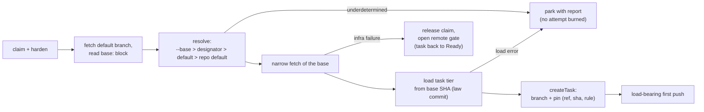

# Design: add-base-ref-resolution

## Context

See proposal.md — Why. Code facts that shape the approach (audit of
2026-09-04): all four fresh-start paths (host/container × run/take) already
pass through one funnel, `GitFreshTaskSupport`, which is the only place a
null base becomes `"HEAD"`; a second copy of that default sits in
`TaskBranchCreator.startPoint()` (host), while the container-side
`GitObjectsTaskRepository` has none. `task.json` already writes a
`baseCommit` field that is carried through resume bootstrap but on which no
decision depends — a free slot for the pin.
The container gets its working copy by cloning the already-created task
branch from a read-only mount with `--network none`, so any base fetch can
only ever run factory-side, before `createTask` — one point serves both
media. Git-side bounded network invocations, credential scrubbing, and
`GitInfrastructureRetry` exist; Resilience4j lives only in the GitHub
adapter. Supersedes design decision D7 of `add-git-workflow` (archived
2026-07-19) as that decision itself anticipated.

Law-source facts (review of 2026-09-05): `PipelineLawReader.freeze` reads
files under a `Path` — every `assemble` call site passes the clone directory;
the definition is loaded once per process from the working tree
(`TakeCommandSupport.loadPipeline`), while the law is re-frozen per task from
the *live* working tree, so a `git pull` in the clone silently changes the
law between serve tasks; the external-check pin guard is built over the
literal `"HEAD"` (`RunAssembler`). `GitObjects` already reads blobs and checks
existence at a commit but cannot list a tree. Every consumer of instructions
and criteria (prompt builders, judge voter) takes frozen strings, never
paths. `add-pipeline-routing` D3/D5 assume "same tree per task", which the
base menu falsifies.

## Goals / Non-Goals

**Goals:** implement FR1–FR10 with one resolution owner, no behavior change
for manual `run`, and artifacts (`designator mechanism`, pin format
precedent) shaped so `add-pipeline-routing` consumes them without rework.

**Non-Goals:** everything in proposal NG1–NG11; additionally, no new retry
machinery for the fetch itself (reuse `GitInfrastructureRetry` — the remote
outage gate of D9 is a pause in front of the claim, not a retry), and no
observability dashboard surface for the pin (task.json + existing inspection
suffice).

## Decisions

**D1 — One resolver at the existing funnel.** `BaseRefResolver` is invoked
from `GitFreshTaskSupport`; below the funnel every component receives a
resolved ref, and both duplicated defaults (`GitFreshTaskSupport` null→HEAD,
`TaskBranchCreator.startPoint()`) are deleted. *Rationale:* the funnel is the
audited single point all four fresh-start paths share (FR10, M2); pushing
resolution lower would re-create per-medium divergence. *Alternative
rejected:* resolving in each mode runner — exactly the duplicated-default
bug this change removes, multiplied.

**D2 — Pure policy in a new leaf module `:baseref`.** The module holds the
menu pattern grammar, selection validation, source priority, the
underdetermined-input classification, and the decision value types
`(ref, rule, reason)` — a function from values to a value, zero internal and
zero external dependencies, gated by `layering { allowedProjects = [] }`.
The base designator enters it as an already-classified input value
(absent | single | conflict, the module's own type); `:application` maps the
port's designator shape onto it, because the module may import nothing.
Fetch, `rev-parse`, and `ls-remote --symref` stay in `:adapters:git`; the
`base:` DTO parsing stays in the pipeline loader (`:adapters`), mapping into
`:baseref` value types; orchestration and pinning stay in `:application`.
*Rationale:* change 2 (propagation obligations) is a planned second consumer
of the same pattern grammar; the empty-allowlist gate constructively
guarantees the policy can know nothing of subprocesses or trackers (NFR-S3);
the policy is dense decision logic that benefits from its own 100% PIT scope.
*Alternative rejected:* a package in `:application` (the settings.gradle
"module overhead" default) — kept as the documented fallback: if at
implementation time the policy degenerates into a trivial conditional, fold
it back into `:application` without loss.

**D3 — The `base:` block is trusted-tier law read from the refreshed default
branch.** Shape per pipeline-config delta (FR1). The block is read
factory-side, by ref (D12), from the repository default branch only
(Renovate's model: config on the default branch, no per-branch drift, and
selector fields re-asserted from the default branch even when the base
branch's config is merged in); it picks the base; the task tier of the law
then binds from the chosen base's law commit. This ordering is what breaks
the "config chooses the base, but which ref holds the config" cycle (FR2,
NFR-S1). *Alternative rejected:* reading `base:` from the base branch itself
— circular; per-branch configs — the drift Renovate explicitly designed
away.

**D4 — Fetch is allowed; pull never; manual run untouched.** D7's rejected
"silent network mutation of the operator's clone" conflated fetch and pull:
`git fetch` leaves working tree, HEAD, and local branches untouched, so the
FR7 (`add-git-workflow`) invariant survives. Autonomous paths refresh
fail-closed; manual `run` without `--base` keeps branching from local HEAD
with zero network (FR8) — the offline/determinism half of D7 that was worth
keeping. *Alternative rejected (steelman'd):* status quo everywhere —
correct only while a human updates the clone; serve has no such human, so
staleness grows without bound.

**D5 — Designators are derived adapter-side; the port carries the
classified fact, never raw labels.** The `fetchTask` fact set (`TrackerTask`)
gains `designators`: per kind, one of absent | single(value) |
conflict(values). The three-shape type and the one classification function
(candidate values → shape; equal duplicates collapse to single) live in
`:gnomish-plugin-api`, the module every adapter already compiles against, so
the decision logic exists once. Each adapter supplies the candidates its own
way: the GitHub adapter applies a configured regex with one capture group to
the issue's labels; the in-memory adapter sets designators through a test
operation and still needs no subsection; a future Jira adapter reads a native
field (fixVersion). The rule lives in the adapter's own subsection —
`tracker.github.designators: { <kind>: <regex> }`, kinds open — and is
validated on the adapter's config seam exactly as `tracker.github.labels` is
today. The `TrackerAdapterFactory` seam gains a query for the kinds an
adapter is configured to extract (the `credentialEnvVars` shape); the
trusted-tier startup validation turns "kind `base` extracted, `base.menu`
empty" into a located `ConfigError` naming both places, because such a rule
can only ever reject (the Kubernetes "selector cannot match its template"
class of error). The resolver keeps its defensive arm — empty menu plus a
designator is underdetermined — so the runtime stays fail-closed if the
startup check is bypassed. This resolves proposal Q1. *Rationale:* the port
spec's own rule ("port vocabulary is the factory's; no core class references
a tracker concept such as label") and the ports-and-adapters literature
(Cockburn: the adapter converts device signals to the application's
language; Fowler's Gateway: the interface is shaped by the application's
need; Kubernetes API conventions: data that drives system behavior is a typed
field, not a label) both put the label regex in the adapter. The two
objections that made the first draft choose core-side extraction dissolve
against existing precedent: the config is already plumbed to the adapter
(state-label names come from `tracker.github`), and the classification is one
shared function, not one per adapter — only the genuinely tracker-specific
candidate extraction is per adapter. *Alternative rejected (the first
draft, agreed 2026-09-04 and reversed 2026-09-06):* raw labels in the port
facts with a core-side `base.select.label` regex — leaks the label concept
into core and cannot carry a Jira adapter, whose fact is not a label (the
ArgoCD pull-request generator hit exactly this leak with Bitbucket).
`add-pipeline-routing` rebases by adding kind `type` to the same adapter map
and gets its `type:` default from the GitHub adapter, not from core.

**D6 — Fetch sits between `harden()` and `createTask()`,
factory-side only.** The refresh fetch (and default-branch discovery via
`ls-remote --symref`) runs in `TakeFreshClaim` / `TakeContainerFreshClaim`
after claim hardening and before `createTask`, wrapped in
`GitInfrastructureRetry`. The container medium needs nothing extra: the box
clones the already-created branch. `add-pipeline-entry-precondition`
is sequenced after this change: its baseline probe runs after fetch+resolve
so it probes the refreshed base, and it reads the baseline SHA from the
structured pin (D7) through the versioned mapper, never as a flat
`baseCommit`; its design and proposal record the same order. *Rationale:* one point covers
both media; failures before `createTask` leave no branch to clean up.
*Alternative rejected:* Resilience4j for the retry — it lives only in the
GitHub adapter and would leak an HTTP-stack dependency into git
infrastructure.

**D7 — Pin `(ref, sha, rule)` reuses the `baseCommit` slot behind the
version gate.** The mapper grows the pin as a structured object; legacy
files carrying only `baseCommit` read as unpinned (ref/rule absent); the
rule vocabulary is a wire vocabulary with a data-driven round-trip spec over
every constant. Resume reads the pin and never re-resolves (FR7, NFR-S2).
The pin exists so a resume can also *see* that the rule would resolve
differently today — a report line, never a re-resolution. *Alternative
rejected:* a separate pin file — splits mutually-implied facts across
writes, violating the one-commit rule.

**D8 — Crash consistency of claim → refresh → resolve → create.** Durable
steps in order: tracker claim; (no durable step: config fetch, discovery,
base fetch, resolution — all reads); task-creation commit carrying the pin;
first push. Kill windows and shapes:
1. *After claim, before the creation commit.* Tracker medium: the
   `claim-heartbeat` shape `Claimed` (working label, live claim footprint)
   whose holder is dead; its one recovery owner is the reaper, which
   restores `Ready` on TTL expiry. Branch medium: no ref exists — not a
   `task-branch-contract` shape and, by construction, nothing to recover,
   since no branch write has happened. The next claimant is not a recovery
   owner: it takes the restored `Ready` task through the ordinary lease and
   re-runs resolution from scratch — idempotent in effect because nothing
   durable references the earlier answer (NFR-R1/R2). A different answer on
   re-resolution is legal by construction. The claim release of an
   infrastructure failure (D9) is a tracker write that follows the failed
   fetch; a kill between the two freezes the same `Claimed` shape with the
   same reaper owner (NFR-R3); a kill after the release is `Ready`, not a
   window. The gate D9 opens is process memory, not a durable step.
2. *After the creation commit, before the first push* — the existing
   `task-branch-contract` shape (local branch unseen by origin); unchanged
   recovery (load-bearing first push / re-create on another instance).
The pin and the branch land in one commit (mutually-implied facts), the
fetch precedes every durable write (constructive before destructive is
trivially satisfied — nothing is destroyed), and both windows already sit in
the kill-point matrix of their owning capabilities; the new fetch only
lengthens window 1. Because it does, this change adds the window's own
kill-point spec (tasks 6.4, 8.4): kill after the claim and before
`createTask`, drive the reaper on virtual time to `Ready`, assert the branch
ref is absent, and assert a second reaper pass changes nothing. *Alternative rejected:* pinning in the tracker at claim
time — splits the pin from the branch it describes across two media.

**D9 — A dead remote is the daemon's condition, not the task's: release
the claim, gate the feed.** A base-refresh reachability failure is caught
at the fresh-claim step, classified by cause (never by step), and answered
with a plain `release`: no abort marker, no comment, no attempt burned, the
task back in Ready (FR9). The take result is a typed `TakeResult` variant
with its own exit code, never `Skipped` with free text. In serve the same
failure opens the **remote outage gate** — one owner class per remote
target, consulted by the feed before every claim, probing with a
tracker-free `ls-remote` on a jittered, growing, capped interval
(`RestartBackoff`'s policy), closed by the first successful probe, its
interval reset only by the first successful base refresh after the close
(FR14). Transitions are the log and snapshot signal (NFR-O1, NFR-O3, M4).
The principle, the survey of orchestrators behind it, the recorded
deviation from CI practice, the separate bound, and the rejected
alternatives are `docs/adr/0005-dependency-outage-accounting.md`; the rule
binds every claim-time fetch of any ref, which is what
`add-decision-inheritance` adopts for the epic branch.

**D10 — Security model: the gnome gets no new levers.** Two rules carry the
whole model: (1) the `base:` block is read only from the default branch —
in-branch or working-copy edits are project content until a human merges
them (the `PipelineLaw` reward-hacking rule); (2) the base is pinned at
claim, before any agent runs, and resume never re-resolves from
gnome-writable data. Remaining vectors are human-permission questions
(triage rights pick a *valid* but wrong base — visible in the PR target,
bounded by the operator's menu; push rights can mint a menu-matching branch
— inherent to pattern menus, gated by merge review; a gnome PR editing
`.gnomish/` — law only after human merge). *Alternative rejected
(permanently):* an executable selector shipped in the target repo's
`.gnomish/` (the `command`-check pattern) — the selector would run on the
factory host at claim time, before any sandbox exists, with factory
credentials, i.e. arbitrary code execution for anyone with repo write
access; the factory deliberately neutralizes repo code on the host
(`FactoryCloneHardening`, "Controls are data"). The supported escape hatch
is external automation setting the label (proposal UX4); the `type:`
discriminator (FR1, pipeline-config delta) leaves a schema-compatible door
for a future
operator-classpath `BaseRefPolicy` plugin — trusted like the rest of the
operator's classpath, not built now (NG6).

**D11 — Base refs are general refspecs, each kind lands where git would
put it, and `FETCH_HEAD` is never read.** The config and the pin accept
branches, tags, and commit SHAs. A branch refreshes into
`refs/remotes/origin/<n>` (forced — the clone's cache of origin, and what
`TaskBranchLocator` already does); a tag into `refs/tags/<n>` without force,
a diverging local tag being a task-level park naming both commits; a SHA is
checked locally, fetched by SHA only when absent, and verified as a commit
object, with no ref written. Every refresh runs with `--no-tags`,
`--no-write-fetch-head`, an empty `--refmap=`, and full depth; the SHA is
read back from the destination, never from `FETCH_HEAD`; `CloneMutationLock`
is the serialization, so git's compare-and-swap ref failure is unreachable.
A remote refusing fetch-by-SHA (protocol v0 without
`uploadpack.allow*SHA1InWant`; none of the public forges) is a task-level
park. The git facts, the tool survey, and the rejected alternatives
(`FETCH_HEAD`, a private `refs/gnomish/` namespace, forced tags,
branch-only bases, shallow fetch) are `docs/adr/0006-base-refresh-fetch.md`.
This resolves proposal Q2.

**D12 — Law is read by ref from git objects; the working tree is never a law
source once a ref is resolved.** A law source abstraction (read a file, test
a regular file, list a directory — all relative to a root) gets exactly two
realizations: a working-tree source and a git-objects source bound to one
commit, the **law commit**. `GnomishFiles`, `ReferencedFiles`, `PipelineLoader`
and `PipelineLawReader` read through it; `GitObjects` gains tree listing
(`ls-tree`); the git-objects source reports a symlink entry as unreadable
(fail-closed — a git tree has no `realpath`, so the lexical half of
`PathSafety` is the whole traversal guard there). The pin guard receives the
law commit instead of `"HEAD"`, so law and pin come from one SHA by
construction. Selection is by *fact*, not by mode: any path that resolved a
ref uses git objects (take, serve, manual `run` with `--base`); in-place mode
and manual `run` without `--base` keep the working tree, which preserves the
pipeline author's edit-and-run loop on uncommitted files (FR8, UX3). This is
the industry mechanism (GitLab through Gitaly, Jenkins `SCMFileSystem`,
GitHub Actions and Renovate through content APIs; OWASP CICD-SEC-4 names the
principle) and adds **no durable step** — reads only — so D8's kill-window
list is unchanged. *Alternative steelmanned and rejected — a detached
worktree at the base as the law root:* three classes instead of ten, every
path-based reader untouched, the existing binding spec passes as is; but a
worktree is a create-plus-delete durable pair (a new kill window, orphan
sweeping, a project tree materialized on the host that `FactoryCloneHardening`
deliberately neutralizes), the `base:` block must be read by ref anyway, and
the `"HEAD"` pin stays wrong unless fixed separately. *Rejected outright:*
checking the base out in the shared clone — mutates state that concurrent
serve slots share and breaks the FR7 invariant D4 preserves.

**D13 — Resume binds the task tier from the tip of the pinned ref name.**
Security is identical either way (a base tip is human-merged content); the
choice is freshness versus determinism. Industry pins configuration for
*re-runs* because a re-run reproduces; our resume *continues*, and the
escalation loop's value is that a human fix to criteria on the base reaches
the returned task without a re-pin operation (the existing "resume picks up
human-fixed criteria" scenario). So: the base is never re-resolved (D7), but
the law commit on resume is the current tip of the pinned ref name; for a tag
or SHA base the two coincide. Autonomous resume therefore narrow-fetches the
pinned ref name before binding (the same bounded, fail-closed fetch as D6
with the same per-kind destinations as D11; a SHA base needs no fetch at
all, since the object is already in the task branch's history; an
unreachable remote is an infrastructure failure releasing the claim);
manual resume in a clone without a reachable remote binds from the local
ref tip. A pinned ref that no longer resolves anywhere (series branch deleted
after release) parks the task with a report — the task is probably obsolete,
and a silent fall-back to the SHA would hide that. The
"base moved under a parked task" hazard is closed by the pipeline pin of
`add-pipeline-routing`, whose hash therefore MUST cover structure only (stage
list, order, verify checks) and not instruction or criteria content —
otherwise every human fix would park the task it was meant to unblock. This
is a recorded, deliberate deviation from the re-run model.

**D14 — Startup validates the default branch; each task binds from its base.**
`serve`/`take` keep loading the full definition from the refreshed default
branch at startup: fail-fast for the common case, the source of the trusted
tier, and what `board`/`dashboard` and routing's pipeline table need. It is
not authoritative for a task: after resolution the task tier is loaded from
the task's law commit and frozen from it. A load error on a base is
deterministic, so it is neither an infrastructure failure (no claim-release
retry loop) nor a quality failure (no attempt burned): it parks the task with
a configuration report through the same path as underdetermined base input
(FR13, UX5). `add-pipeline-routing` rebases on this: its D3 "load-per-task
buys nothing (same tree)" and D5 "one law per pipeline at startup" become
"one law per (pipeline, law commit)", cached per pair if measured to matter.

**Design note (NG7):** base freshness at the merge end — whether the target
moved while the task ran — is the host merge queue's concern; the factory
does not re-validate or speculatively merge at delivery time.

## Resolution flow

## Sync surfaces

This change edits both ends of the declared pair
`TakeFreshClaim` / `TakeContainerFreshClaim` (fresh-claim recipe): the
fetch+resolve step is inserted identically in both, and the pair stays a
declared pair (the third-implementation trigger is not reached). Today the
pair is declared only by its registry row in `manual-sync-pairs.md` —
neither end carries a marker — so this change adds the `Kept in sync with`
markers to both ends, with the new step in the invariant line, and removes
the registry row. The
resolution logic itself is *not* duplicated across the pair — both ends call
the one funnel (D1), which is the shared-abstraction half of the surface.
The pin's rule vocabulary is a wire vocabulary written and read by the same
mapper module, covered by the mandatory round-trip spec rather than a
declared pair. The law source (D12) is a shared abstraction with two
strategies, not a pair: one interface, one contract spec run against both
realizations over identical trees. It changes both ends of the declared pairs
`TakeEngineExecution` / `TakeContainerEngineExecution` and
`TakeResumeRunner` / `TakeContainerResumeRunner` identically (the law root
argument becomes a law commit; resume resolves the pinned ref tip). These
two pairs are likewise registry-row-only today, so both ends of each gain
their `Kept in sync with` markers with the updated invariant line, and
their registry rows are removed.

The pin also touches both ends of the declared pair
`GitTaskRepository` / `GitObjectsTaskRepository` (task lifecycle write
protocol): `createTask` starts carrying the pin `(ref, sha, rule)` into the
task-creation commit on both media. The mirrored change is deliberately
narrow — the pin's serialization is single-point in the shared
`TaskJsonMapper`, so each end only passes the pin through its own
`createTask` path identically; no other step of the lifecycle write
protocol changes. Deleting `TaskBranchCreator.startPoint()`'s default removes
an undeclared duplication (the double default) rather than adding one.

**Overlapping deltas.** The `module-layering` delta MODIFIES the same two
requirements (module tree, dependency direction) as the active
`add-subprocess-access-log` delta. Order fixed: access-log syncs first, this
change second; this change's delta is written over access-log's text, not
over `openspec/specs/`, so a sync in that order merges cleanly. If this
change is synced first, the later access-log sync must merge its
`:logtext` and `:gitobjects` sentences by hand rather than replace the
requirement (the OpenSpec MODIFIED merge is replace-only).
`add-pipeline-entry-precondition` is sequenced after this change (D6):
the fresh-claim recipe invariant becomes "harden → fetch+resolve →
synthesize → createTask → entry precondition → run", and its pin reader
follows D7.

The remote outage gate (D9) is one owner class; the feed consults it and
the slot opens it, neither holds a second copy of its state or policy. It
is not a twin of `FeedOutageRetry` (indefinite retry of the *tracker*
calls, which labels every failure a tracker outage — no git call ever flows
through it, since the gate check precedes the claim) nor of
`GitInfrastructureRetry` (three bounded attempts *inside* one fetch); the
three sit at different layers and the design names them so no one collapses
them later. The gate's growing pause reuses `RestartBackoff`'s policy rather
than re-implementing it; if the reuse needs a parameter the reaper does not,
extend `RestartBackoff`, do not fork it.

## Risks / Trade-offs

- [Claim latency grows by one refs read + one narrow fetch] → both bounded
  by the existing git network deadline (NFR-P1); serve slots are virtual
  threads, blocking is cheap.
- [A remote that permits no fetch-by-SHA breaks SHA bases] → all four
  surveyed forges permit it by default; only a self-hosted protocol-v0
  server refuses, and SHA bases are primarily for manual `--base` where
  the object usually exists locally. The refusal is a task-level park
  whose report names the server option, not a wrong branch and not a gate.
- [A flapping remote — probes pass, fetches fail — could cycle the gate]
  → the probe interval resets only on a successful base refresh (D9), so
  each flap lengthens the pause instead of restarting it.
- [The designator mechanism lands before its second consumer (routing),
  risking a shape that fits only `base`] → the shape was co-designed with
  routing's needs (absent | single | conflict is exactly routing's
  contract) and reviewed against its proposal; routing rebases by adding a
  kind to the adapter's `designators` map, not by reshaping. Its artifacts
  still describe the first-draft mechanism ("adapters report raw labels")
  and must be updated to D5 before it is applied.
- [Per-adapter candidate extraction could drift into per-adapter
  classification] → the shape and the classifier are one published function
  in the port module; the contract suite asserts all three shapes for every
  adapter, so an adapter that classifies on its own fails the suite.
- [`:baseref` could end up a near-empty module if the grammar shrinks] →
  documented fallback in D2: fold back into `:application`.
- [Reading law by ref changes `PathSafety` semantics: no `realpath`, symlink
  entries refused] → specified in D12 and pinned by the law-source contract
  spec; the working-tree realization keeps today's guard unchanged.
- [`GitObjects` grows a public tree-listing method] → one `ls-tree` call with
  its own spec; the module stays a thin `git` subprocess seam.
- [Resume from the ref tip can bind a law that changed structurally] →
  accepted for this change (today's behavior); closed by routing's structural
  hash, whose scope D13 fixes.
- [Recovery herd: every slot and instance resumes claiming the moment the
  remote returns] → probes are jittered, the WIP limit throttles fresh
  starts, and a probe is one cheap `ls-remote`, not a claim.
- [A single bad ref or a revoked credential opens the gate for every task]
  → classification by cause (FR9): only reachability failures open it; the
  rest park the one task they belong to.
- [Menu patterns admit any branch a pattern matches, including one minted
  by a hostile push] → inherent to pattern menus (Renovate has the same
  property); gated by merge review and named in D10 as a permission
  question, not a factory lever.

## Migration Plan

No deployed-state migration: legacy `task.json` files read as unpinned
(D7) and resume behaves exactly as before for them; projects without a
`base:` block get remote-default-branch behavior only for *newly created*
tasks. Rollback is removing the config block — zero-config semantics remain
valid indefinitely. Glossary gains the new terms (base ref, base menu,
designator, base pin, law commit, trusted tier, task tier, remote outage
gate) in this change, per the no-jargon rule. The principle behind D9 — a
shared-dependency outage is charged to the daemon and never to a task's
failure budget — outlives this change and lands as
`docs/adr/0005-dependency-outage-accounting.md`, and the fetch mechanics
of D11 as `docs/adr/0006-base-refresh-fetch.md` — both written with this
change's planning (task 8.5 keeps them in step with the implementation).
The law-source principle of D12–D14 outlives this change and is recorded
as `docs/adr/0007-pipeline-law-source.md` (task 8.2); D12 references it
rather than restating it once it exists.
