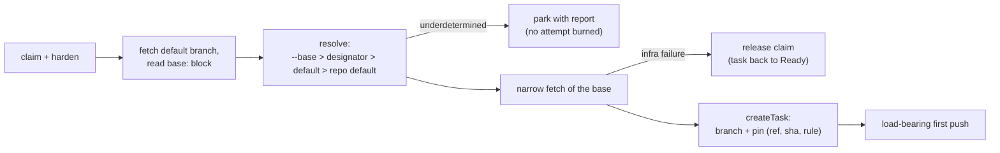

# Design: add-base-ref-resolution

## Context

See proposal.md — Why. Code facts that shape the approach (audit of
2026-09-04): all four fresh-start paths (host/container × run/take) already
pass through one funnel, `GitFreshTaskSupport`, which is the only place a
null base becomes `"HEAD"`; a second copy of that default sits in
`TaskBranchCreator.startPoint()` (host), while the container-side
`GitObjectsTaskRepository` has none. `task.json` already writes a
`baseCommit` field that no production code reads — a free slot for the pin.
The container gets its working copy by cloning the already-created task
branch from a read-only mount with `--network none`, so any base fetch can
only ever run factory-side, before `createTask` — one point serves both
media. Git-side bounded network invocations, credential scrubbing, and
`GitInfrastructureRetry` exist; Resilience4j lives only in the GitHub
adapter. Supersedes design decision D7 of `add-git-workflow` (archived
2026-07-19) as that decision itself anticipated.

## Goals / Non-Goals

**Goals:** implement FR1–FR10 with one resolution owner, no behavior change
for manual `run`, and artifacts (`designator mechanism`, pin format
precedent) shaped so `add-pipeline-routing` consumes them without rework.

**Non-Goals:** everything in proposal NG1–NG9; additionally, no new retry
machinery (reuse `GitInfrastructureRetry`), and no observability dashboard
surface for the pin (task.json + existing inspection suffice).

## Decisions

**D1 — One resolver at the existing funnel.** `BaseRefResolver` is invoked
from `GitFreshTaskSupport`; below the funnel every component receives a
resolved ref, and both duplicated defaults (`GitFreshTaskSupport` null→HEAD,
`TaskBranchCreator.startPoint()`) are deleted. *Rationale:* the funnel is the
audited single point all four fresh-start paths share (FR10, M2); pushing
resolution lower would re-create per-medium divergence. *Alternative
rejected:* resolving in each mode runner — exactly the duplicated-default
bug this change removes, multiplied.

**D2 — Pure policy in a new leaf module `:baseref`.** The module holds the
menu pattern grammar, selection validation, source priority, the
underdetermined-input classification, and the decision value types
`(ref, rule, reason)` — a function from values to a value, zero internal and
zero external dependencies, gated by `layering { allowedProjects = [] }`.
Fetch, `rev-parse`, and `ls-remote --symref` stay in `:adapters:git`; the
`base:` DTO parsing stays in the pipeline loader (`:adapters`), mapping into
`:baseref` value types; orchestration and pinning stay in `:application`.
*Rationale:* change 2 (propagation obligations) is a planned second consumer
of the same pattern grammar; the empty-allowlist gate constructively
guarantees the policy can know nothing of subprocesses or trackers (NFR-S3);
the policy is dense decision logic that benefits from its own 100% PIT scope.
*Alternative rejected:* a package in `:application` (the settings.gradle
"module overhead" default) — kept as the documented fallback: if at
implementation time the policy degenerates into a trivial conditional, fold
it back into `:application` without loss.

**D3 — The `base:` block is law read from the refreshed default branch.**
Shape per pipeline-config delta (FR1). The block is read factory-side from
the repository default branch only (Renovate's model: config on the default
branch, no per-branch drift); it picks the base; the rest of pipeline law
freezes from the chosen base exactly as today. This ordering is what breaks
the "config chooses the base, but which ref holds the config" cycle (FR2,
NFR-S1). *Alternative rejected:* reading `base:` from the base branch itself
— circular; per-branch configs — the drift Renovate explicitly designed
away.

**D4 — Fetch is allowed; pull never; manual run untouched.** D7's rejected
"silent network mutation of the operator's clone" conflated fetch and pull:
`git fetch` leaves working tree, HEAD, and local branches untouched, so the
FR7 (`add-git-workflow`) invariant survives. Autonomous paths refresh
fail-closed; manual `run` without `--base` keeps branching from local HEAD
with zero network (FR8) — the offline/determinism half of D7 that was worth
keeping. *Alternative rejected (steelman'd):* status quo everywhere —
correct only while a human updates the clone; serve has no such human, so
staleness grows without bound.

**D5 — Designator extraction is core-side over raw label facts.** The
tracker port's task facts gain the raw labels; a kind-generic extractor
(compiled pattern with one capture group, classification into
absent | single | conflict) lives with the `:baseref` value types and is
applied in `:application`. Label-backed adapters (GitHub, in-memory) only
report labels; a future Jira adapter may instead fulfill the same
three-shape contract from a native field (fixVersion) — the port contract
fixes the shapes, not the source. This resolves proposal Q1. *Rationale:*
one extraction implementation instead of one per adapter; the pattern comes
from `.gnomish/config.yaml` (`base.select.label`), which adapters do not
read. *Alternative rejected:* adapter-side derivation (routing's original
sketch) — would need the config plumbed into every adapter and one regex
implementation per adapter; routing's delta rebases onto this mechanism by
adding kind `type`, as agreed 2026-09-04.

**D6 — Fetch sits between `harden()` and `createTask()`,
factory-side only.** The refresh fetch (and default-branch discovery via
`ls-remote --symref`) runs in `TakeFreshClaim` / `TakeContainerFreshClaim`
after claim hardening and before `createTask`, wrapped in
`GitInfrastructureRetry`. The container medium needs nothing extra: the box
clones the already-created branch. `add-pipeline-entry-precondition`'s
baseline probe, when it lands, runs after fetch+resolve so it probes the
refreshed base — recorded in both designs. *Rationale:* one point covers
both media; failures before `createTask` leave no branch to clean up.
*Alternative rejected:* Resilience4j for the retry — it lives only in the
GitHub adapter and would leak an HTTP-stack dependency into git
infrastructure.

**D7 — Pin `(ref, sha, rule)` reuses the `baseCommit` slot behind the
version gate.** The mapper grows the pin as a structured object; legacy
files carrying only `baseCommit` read as unpinned (ref/rule absent); the
rule vocabulary is a wire vocabulary with a data-driven round-trip spec over
every constant. Resume reads the pin and never re-resolves (FR7, NFR-S2).
The pin exists so a resume can also *see* that the rule would resolve
differently today — a report line, never a re-resolution. *Alternative
rejected:* a separate pin file — splits mutually-implied facts across
writes, violating the one-commit rule.

**D8 — Crash consistency of claim → refresh → resolve → create.** Durable
steps in order: tracker claim; (no durable step: config fetch, discovery,
base fetch, resolution — all reads); task-creation commit carrying the pin;
first push. Kill windows and shapes:
1. *After claim, before the creation commit* — a claim with no task branch:
   the existing `claim-heartbeat` shape; recovery owner is the next claimant
   (or the reaper on TTL expiry), which re-runs resolution from scratch —
   idempotent because nothing durable references the earlier answer
   (NFR-R1/R2). A different answer on re-resolution is legal by
   construction.
2. *After the creation commit, before the first push* — the existing
   `task-branch-contract` shape (local branch unseen by origin); unchanged
   recovery (load-bearing first push / re-create on another instance).
The pin and the branch land in one commit (mutually-implied facts), the
fetch precedes every durable write (constructive before destructive is
trivially satisfied — nothing is destroyed), and both windows already sit in
the kill-point matrix of their owning capabilities; the new fetch only
lengthens window 1. *Alternative rejected:* pinning in the tracker at claim
time — splits the pin from the branch it describes across two media.

**D9 — Serve degrades quietly on refresh outages.** Infrastructure
classification releases the claim via the existing claim-removal path; the
task returns to Ready; `RepeatSuppressor` keeps the log at one WARN (with an
`OperatorEvent` code) plus DEBUG roll-ups; no automatic tracker escalation
(FR9, NFR-O1, M4). Accumulated failure surfaces through existing
abort-threshold accounting and operator observation. *Alternative rejected:*
escalating to the tracker on first failure — a dead remote at 3 a.m. would
park the whole backlog for humans that infrastructure recovery would have
served silently.

**D10 — Security model: the gnome gets no new levers.** Two rules carry the
whole model: (1) the `base:` block is read only from the default branch —
in-branch or working-copy edits are project content until a human merges
them (the `PipelineLaw` reward-hacking rule); (2) the base is pinned at
claim, before any agent runs, and resume never re-resolves from
gnome-writable data. Remaining vectors are human-permission questions
(triage rights pick a *valid* but wrong base — visible in the PR target,
bounded by the operator's menu; push rights can mint a menu-matching branch
— inherent to pattern menus, gated by merge review; a gnome PR editing
`.gnomish/` — law only after human merge). *Alternative rejected
(permanently):* an executable selector shipped in the target repo's
`.gnomish/` (the `command`-check pattern) — the selector would run on the
factory host at claim time, before any sandbox exists, with factory
credentials, i.e. arbitrary code execution for anyone with repo write
access; the factory deliberately neutralizes repo code on the host
(`FactoryCloneHardening`, "Controls are data"). The supported escape hatch
is external automation setting the label (proposal UX4); the `type:`
discriminator (D3) leaves a schema-compatible door for a future
operator-classpath `BaseRefPolicy` plugin — trusted like the rest of the
operator's classpath, not built now (NG6).

**D11 — Base refs are general refspecs.** The config and the pin accept
branches, tags, and commit SHAs: branches and tags are fetched narrowly
(tags with their objects); a bare SHA is verified locally and fetched by SHA
only where the remote permits it. Prefer full-depth single-ref fetch over
shallow — resume must be able to resolve history (the GitLab-runner depth
caveat). *Alternative rejected:* branch-only bases — OneFlow-style
tag-anchored hotfixes would be inexpressible for no savings.

**Design note (NG7):** base freshness at the merge end — whether the target
moved while the task ran — is the host merge queue's concern; the factory
does not re-validate or speculatively merge at delivery time.

## Resolution flow

## Sync surfaces

This change edits both ends of the declared pair
`TakeFreshClaim` / `TakeContainerFreshClaim` (fresh-claim recipe): the
fetch+resolve step is inserted identically in both, the pair stays a
declared pair (the third-implementation trigger is not reached), and the
`Kept in sync with` markers gain the new step in their invariant line. The
resolution logic itself is *not* duplicated across the pair — both ends call
the one funnel (D1), which is the shared-abstraction half of the surface.
The pin's rule vocabulary is a wire vocabulary written and read by the same
mapper module, covered by the mandatory round-trip spec rather than a
declared pair. Deleting `TaskBranchCreator.startPoint()`'s default removes
an undeclared duplication (the double default) rather than adding one.

## Risks / Trade-offs

- [Claim latency grows by one refs read + one narrow fetch] → both bounded
  by the existing git network deadline (NFR-P1); serve slots are virtual
  threads, blocking is cheap.
- [A remote that permits no fetch-by-SHA breaks SHA bases] → SHA bases are
  primarily for manual `--base` where the object usually exists locally;
  the failure is a clear infrastructure report, not a wrong branch.
- [The designator mechanism lands before its second consumer (routing),
  risking a shape that fits only `base`] → the shape was co-designed with
  routing's needs (absent | single | conflict is exactly routing's
  contract) and reviewed against its proposal; routing rebases by adding a
  kind, not by reshaping.
- [`:baseref` could end up a near-empty module if the grammar shrinks] →
  documented fallback in D2: fold back into `:application`.
- [Menu patterns admit any branch a pattern matches, including one minted
  by a hostile push] → inherent to pattern menus (Renovate has the same
  property); gated by merge review and named in D10 as a permission
  question, not a factory lever.

## Migration Plan

No deployed-state migration: legacy `task.json` files read as unpinned
(D7) and resume behaves exactly as before for them; projects without a
`base:` block get remote-default-branch behavior only for *newly created*
tasks. Rollback is removing the config block — zero-config semantics remain
valid indefinitely. Glossary gains the new terms (base ref, base menu,
designator, base pin) in this change, per the no-jargon rule.
