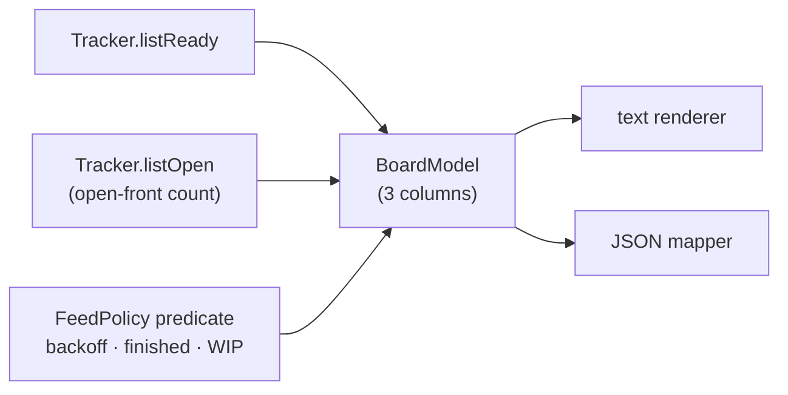

# Design: add-board-command

## Context

The board is a read-only composition over the two existing tracker list
operations (`listReady`, `listOpen`), plus a port-type enrichment (titles)
and a CLI surface. Driven by FR1–FR7, NFR-P1, NFR-O1 of the proposal.
Constraints inherited from the codebase: `ReadyTask`/`OpenTask` carry no
title today although both adapters already receive it in their list
responses and drop it during mapping (`GithubIssueFeedParser` parses only
issue numbers; `InMemoryTracker` holds a full `TaskSnapshot`); backoff
eligibility is core policy in `BackoffPolicy` (`filterEligible`,
`delay = base * 2^(count-1)` capped); the `status` command already models
the dual text/`--json` convention.

## Goals / Non-Goals

**Goals:**
- One board model behind both renders (UX4), built from exactly two port
  calls (NFR-P1).
- Eligibility annotations (backoff, `finished`, WIP-held) that match what
  the feed would actually decide (FR2, D7).
- Title enrichment with zero extra tracker requests (FR7, NFR-P1).

**Non-Goals:**
- Any daemon-side data, HTML output, or new tracker operations (NG1, NG2,
  NG5 of the proposal).

## Decisions

**D1 — New `board` subcommand, not a `status` mode.** `gnomish board` is
added to the `Subcommand` enum and `SubcommandDispatch`, implemented by a
new `BoardCommand` component with its own arguments parser. *Rationale:*
`status` belongs to the per-task canon (git branches, `--dir`, works
offline); a tracker mode would silently switch the data source behind one
command name (FR1, NG4). *Alternatives rejected:* `gnomish status
--tracker` (source switch by flag); `gnomish tracker board` namespace
(breaks the flat-CLI convention).

**D2 — Titles ride the existing list types; no N+1 and no new port
operation.** `ReadyTask` and `OpenTask` each gain a `title` component
(non-null; adapters always have it in list responses). GitHub's shared
issue-feed parser is extended to retain `number` + `title` pairs, consumed
by both `GithubFeedQuery` and `GithubOpenQuery`; the in-memory adapter maps
the title from its stored snapshot. *Rationale:* the data is already on the
wire — surfacing it is a mapping change, not a protocol change (FR7,
NFR-P1). *Alternatives rejected:* per-row `fetchTask` (N+1, GitHub read
budget scales with queue size); a parallel `listReadyDetailed` operation
(new port surface for data the list calls already carry, violates NG5);
a title-less board (ids alone fail UX2).

**D3 — Backoff annotation reuses `BackoffPolicy` with the same parameter
resolution as the take feed.** The board computes eligibility and the
materialized deadline (`lastAbortAt + delay(count)`) via the existing
policy, resolving base/cap exactly as `take`/`serve` do (configured values
or the policy defaults). *Rationale:* the annotation's only value is
predicting the daemon's actual behavior; a reimplementation or different
config source would let the board lie (FR2, G2). *Alternative rejected:*
printing raw abort facts and letting the operator do the math — that is
the log-archaeology the board exists to remove.

**D4 — Ready window: `--limit` with a default of 50, honest truncation.**
`listReady(limit)` requires a bound; the board defaults to 50 and exposes
`--limit`. When the returned count equals the limit, both renders mark the
Ready column as truncated ("first 50 shown"); the FR3 summary counts are
computed over the fetched window. *Rationale:* a board is a glanceable
surface, not an export; an unbounded pull hits adapter pagination for no
operator value. *Alternative rejected:* exhaustive pagination until the
queue is drained (unbounded read cost on pathological queues, still needs
a cap in practice).

**D5 — One `BoardModel`, two renderers, status-report v1 conventions.**
A single immutable model is built from the two list results plus the
backoff annotations; a text renderer (sibling of `StatusTextRenderer` /
`TaskListRenderer`) and a JSON mapper (sibling of `StatusReportJsonMapper`)
render it. The JSON document carries `"version": 1`, `generatedAt`,
camelCase fields, ISO-8601 UTC instants, and materialized backoff
deadlines (FR6, NFR-O1, UX4). *Rationale:* the status command already
proved this shape; divergent text/JSON pipelines drift. *Alternative
rejected:* reusing the status-report v1 schema itself — different document,
different owner; only the conventions transfer.

**D6 — Claim freshness is displayed, not judged.** The Working column
shows the claim version's `updatedAt` rendered as an age; the board never
emits a stale/healthy verdict. *Rationale:* staleness thresholds (TTL
policy) are serve configuration and reaper judgment; the board may run on
a host without that config, and a wrong verdict is worse than a plain age.
External monitors apply their own thresholds to the JSON `updatedAt`
(G3). *Alternative rejected:* board-side staleness flags with a duplicated
TTL config key (two sources of truth for one judgment).

*Note on the `ClaimVersion` contract:* `ClaimVersion`'s javadoc states core
"measures staleness on its own monotonic clock, never against `updatedAt`
(D2 — no cross-host clock arithmetic)." That rule forbids deriving a
staleness *verdict* from `updatedAt`; rendering `now − updatedAt` purely for
*display* derives no verdict and drives no coordination, so it is a
display-only relaxation of D2, not a breach. The `ClaimVersion` javadoc is
to be clarified at implementation to name this display-only exception, so a
future reader does not read the board's age math as a D2 violation. When the
marker is absent (`claimVersion` null), there is no instant to subtract and
the board renders freshness as unknown.

**D8 — Read-only construction still mints a throwaway InstanceId.**
`TrackerAdapterFactory.create(config, instanceId)` requires a non-null
instance id at construction (some GitHub collaborators stamp it into
structural markers), with no read-only overload. `BoardCommand` mints one
via `InstanceId.generate` exactly as `take`/`serve` do, purely to satisfy
the constructor. *Rationale:* the minted id is informational, is never
written to the tracker by any board code path (the board issues only reads),
and so does not breach NG3; adding a read-only factory overload would grow
the port surface for a label that is informational only. *Alternative
rejected:* a `create(config)` read-only overload — new port surface,
adapter-specific, for no observable benefit.

**D7 — Eligibility annotation covers the whole feed predicate, not just
backoff.** A ready row's annotation mirrors the actual skip reasons of
`FeedPolicy.selectClaimCandidates`, in its precedence: in backoff
(`BackoffPolicy`, D3) → `finished` (terminal, D4 of
enforce-finish-terminality) → WIP-held (a fresh task while `openFrontCount
>= wipLimit`, FR6 of add-factory-serve); returned tasks bypass the WIP gate.
`openFrontCount` is the size of the `listOpen` result the board already
fetches, and `wipLimit` is resolved from `factory.tracker.wip-limit` exactly
as the feed resolves it — both facts are free, no extra call and no new
config source. The FR3 "eligible now" count is `queued` minus every task
carrying a skip reason, so it equals what the feed would actually claim.
*Rationale:* D3's promise ("the board must not lie") governs the full
eligibility rule, not the backoff third of it — a `finished` or WIP-gated
task shown as plainly "eligible" is exactly the lie D3 forbids. *Alternative
rejected:* annotating backoff only (silent over-promise for terminal and
WIP-gated tasks); replaying the feed's head-zone pick and `FEED_LIMIT`
window (claim-ordering and read-depth, not eligibility — NG7).

## Risks / Trade-offs

- [Backoff deadline is computed at render time; a concurrent abort or
  progress marker changes the facts a second later] → acceptable for a
  read-only glance surface; `generatedAt` in the JSON makes the observation
  time explicit.
- [The WIP-held annotation reflects the `listOpen` count at render time, the
  same single snapshot the feed's initial poll uses; the feed's per-claim
  re-check (D5) may reopen the gate a moment later] → acceptable for a glance
  surface, and consistent with what the feed decides at poll time;
  `generatedAt` marks the observation instant.
- [Two daemons' worth of open tasks appear in one Working column with no
  grouping (NG6)] → holder is shown per row; grouping stays with the
  future dashboard change.
- [Port-type change touches every `ReadyTask`/`OpenTask` construction site
  (both adapters, core tests, fixtures)] → mechanical compiler-driven
  sweep; contract suite pins the behavior.
- [Jira (planned) must supply titles in list responses (proposal Q1)] →
  Jira search returns `summary` per issue; recorded as an assumption in
  the adapter author guide's polling-economy section.
- [`GithubOpenQuery` omits a `Working` issue that carries no claim footprint
  at all (a human mislabel, no holder to name), so the board silently will
  not show it] → known and intended: the board mirrors `listOpen` and never
  invents a holder; a `Working` issue with a *past-but-missing* live marker
  is still shown (null `claimVersion`, freshness unknown). Documented as
  known behavior in the operator-guide board section (task 5.1).
- [Rendering claim age from `updatedAt` looks like it breaks the D2
  "no cross-host clock arithmetic" contract] → it is display-only, derives
  no verdict and drives no coordination (D6); the `ClaimVersion` javadoc is
  clarified at implementation to name the exception.
- [The read-only board still constructs the adapter with a minted InstanceId
  (D8)] → the id is informational and never written; NG3 (no tracker writes)
  holds because every board path issues reads only.

## Open Questions

None — proposal Q1 (Jira titles) is tracked as an assumption above and
re-checked when that adapter is designed.
