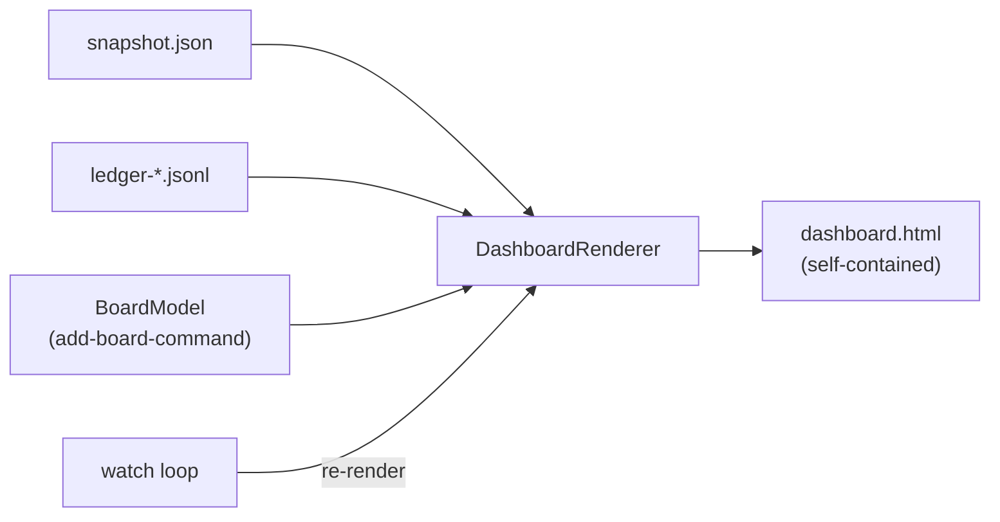

# Design: add-dashboard-page

## Context

The dashboard is a pure reader composing three existing surfaces: the
snapshot and ledger files (add-serve-observability D1–D12) and the tracker
board composition (add-board-command D2–D6). Driven by FR1–FR10, NFR-P1,
NFR-R1/R2, NFR-O1 of the proposal. Standing constraints: no inbound HTTP
(add-factory-serve NG3), no web stack (ADR 0001), tracker read budget must
not scale with viewing time. Key environmental fact: a page opened from
`file://` cannot `fetch()` local files (browser CORS/origin rules), which
forces the data to be baked into the page at render time.

## Goals / Non-Goals

**Goals:**
- One render path producing a fully inlined page from the three sources
  (FR2, FR3); live behavior without any server (FR7–FR9).
- Honest staleness at both layers — data and view (FR4, FR8, UX3).

**Non-Goals:**
- Charts beyond CSS bars, fleet aggregation, any interactivity or daemon
  involvement (proposal NG1–NG6).

## Decisions

**D1 — Self-contained HTML file, all data baked at render time.** The
renderer inlines data, CSS, and JS into one document; the page performs
zero requests. *Rationale:* `file://` cannot fetch sibling files, and any
served alternative violates NG1/NG3; baking also makes the one-shot file
portable (G4, FR2, M4). *Rejected:* a tiny local HTTP server (an inbound
endpoint, however local — exactly what NG3 exists to forbid); a page
fetching `snapshot.json` alongside it (blocked on `file://`, and ties the
page to the directory).

**D2 — Live view = re-render + `<meta http-equiv="refresh">`; the browser
re-reads the file itself.** `--watch` regenerates the file on a cadence
and bakes a matching meta-refresh; the tab reloads from disk. *Rationale:*
`file://` reload is the one browser mechanism that needs no server and no
JS network access (FR7, G2). *Rejected:* JS polling/SSE/websocket (all
need a server); filesystem-watch APIs (not available to `file://` pages).

**D3 — Two independent staleness layers, each visible.** Layer 1: the
daemon section computes snapshot staleness from `writtenAt` +
`intervalSeconds` and flags the operator-guide alert conditions
observable from a single snapshot — rules 1–5 of the guide's six, with
rule 1 generalized to any non-`stopped` lifecycle state (a daemon dead
mid-`draining` or mid-`stopping` is as dead as one at `running`). Rule 6
(`heldClaims` vs slot-count desync on two consecutive checks) needs
check-to-check history and stays with the external dead-man's-switch
monitor (add-serve-observability D9), keeping the section computable
from one file read (FR4). Layer 2 — `--watch` pages only: the page bakes
`generatedAt` plus its refresh cadence, and an inline script compares
against the browser clock — when the page age exceeds `k ×` the render
cadence, a full-page banner declares the view stale (FR8). A one-shot
page has no cadence and never banners; it shows its `generatedAt` age as
plain information, so a ticket snapshot stays reviewable long after
capture (U2, UX4). *Rationale:* meta-refresh keeps reloading a file that
a dead renderer no longer updates — without layer 2 the wall silently
lies (UX3). *Rejected:* relying on meta-refresh alone (detects nothing);
mtime-based checks (a `file://` page cannot stat itself); bannering
one-shot pages (would cover exactly the data the snapshot exists to
preserve).

**D4 — Three cadences (closes Q1, Q2).** Render/refresh cadence 10 s;
board refresh cadence 60 s with the last `BoardModel` cached between board
refreshes; page-staleness multiple `k = 3` (banner at ~30 s of no
regeneration). Snapshot and ledger are re-read every render cycle — local
files, effectively free (FR9). All three are constants of this command,
not new config surface; the operator guide documents them alongside the
7-day history window. *Rationale:* 10 s is glance-fresh without disk
churn; 60 s keeps an all-day tab within the GitHub budget (NFR-P1, M2);
`k = 3` mirrors the snapshot monitor convention (add-serve-observability
D10). *Rejected:* per-cadence CLI flags (config surface without an
operator need — revisit on demand); fetching the board every cycle (rate
limit scales with viewing time).

**D5 — History window: last 7 days of ledger files (closes Q2), aggregated
in-process.** The aggregator reads `ledger-YYYY-MM-DD.jsonl` files for the
last 7 UTC days (bounded by what retention left), sums `taskOutcome` lines
into outcomes-per-day and tokens-by-model, skips torn or unparseable lines
(the NFR-R2 reader contract), and renders tables with CSS bars.
*Rationale:* 7 days covers "the week at a glance" while parsing at most 7
small files per cycle (FR6). *Rejected:* charting libraries or canvas
graphs (external assets violate NG2; wanting them is the documented signal
to move to a collector + Grafana); unbounded window (unbounded parse cost
for no glance value).

**D6 — Renderer is a string-template sibling of the existing text
renderers.** A `DashboardHtmlRenderer` builds the document from Java text
blocks with escaped interpolation, next to `StatusTextRenderer` /
`TaskListRenderer` in style; static CSS/JS live as constants in the
renderer (or a resource it inlines). *Rationale:* one small page does not
justify a template engine; ADR 0001 adds no view stack (FR2).
*Rejected:* Thymeleaf/Freemarker (a dependency for one page); building
DOM via a library (same).

**D7 — Board data comes from the board composition in-process (closes
Q3).** The landed `add-board-command` shape: the two tracker list calls
live inside `BoardCommand.run`, while model assembly is already a
reusable pure factory — `BoardModel.build(...)` plus `EligibilityPolicy`
(which wraps `BackoffPolicy`). This change extracts the fetch+build
composition — the two list calls, the parameter resolution
(`abortBackoffBase`/`abortBackoffCap`, `wipLimit`), and the
`BoardModel.build` invocation — into a component both `BoardCommand` and
the dashboard call; a refactor with behavior pinned by the existing
board specs. *Rationale:* the board section must show what `gnomish
board` would show — same code, same config resolution via the same
`--dir` argument (FR5); shelling out would re-parse JSON the process can
have as objects and double the process-management surface. *Rejected:*
shell-out to `gnomish board --json`; reimplementing the two-call
composition (drift risk — the eligibility annotation exists precisely to
match feed behavior).

**D8 — Output: instance directory default, atomic replace.** Default
output is `dashboard.html` in `~/.gnomish/serve/<instance-name>/`
(add-serve-observability D2 path resolution), `--out` overrides. Every
render writes temp + rename in the target directory. *Rationale:* the
instance directory is the natural home beside the files the page renders
(FR1); atomic replace means a browser mid-refresh never reads a torn page
(NFR-R2) — same discipline as the snapshot writer (add-serve-observability
D4). *Rejected:* current working directory default (moves with the shell,
breaks the wall-display bookmark).

**D9 — Sections degrade independently; the watch loop never exits on data
failure.** Each section renders from whatever its source yields: missing
snapshot → "daemon has not run here"; unreadable ledger → empty history;
tracker failure → the board section keeps the last cached board model,
marked with its fetch time and a refresh-failure notice, or renders
"unavailable" with the failure summarized when no fetch has succeeded
(one-shot, or the first watch cycle). A degraded section never
aborts the render; in `--watch`, source failures degrade sections and the
loop continues (FR3, NFR-R1). One-shot exits zero with degraded sections —
the page itself is the report. *Rationale:* the wall must stay up through
exactly the outages it exists to show (U1). *Rejected:* fail-fast on
tracker error like `gnomish board` (correct for a query command, wrong
for a monitor surface).

## Risks / Trade-offs

- [Meta-refresh resets scroll position on every reload] → single-screen
  design goal (FR10); detail stays behind pointers to the canon, so there
  is nothing to scroll to.
- [Browser clock skew could false-trigger the layer-2 banner] → `k = 3`
  gives a 20 s margin at the 10 s cadence; skew beyond that is a host
  problem worth surfacing anyway.
- [Baked board data means the page can show a queue up to 60 s old] →
  the board section carries its fetch time (NFR-O1); accepted as the
  price of a flat read budget.
- [The board fetch (two list calls, parameter resolution) lives inside
  `BoardCommand` today] → D7 extracts the fetch+build composition as part
  of this change's apply; behavior is pinned by the existing board specs
  and the contract is the `BoardModel`, which exists either way.
- [Two watch renderers pointed at the same output file would fight] →
  same stance as the observability writer: documented misconfiguration,
  no locking (add-serve-observability D2).

## Migration Plan

Additive: one new subcommand, no config keys, no file-format changes.
Rollback = do not run the command; nothing else references its output.
The page consumes snapshot/ledger under their pre-release amendment policy
(in-repo consumers move together).

## Open Questions

None — Q1/Q2 closed by D4/D5, Q3 closed by D7.
