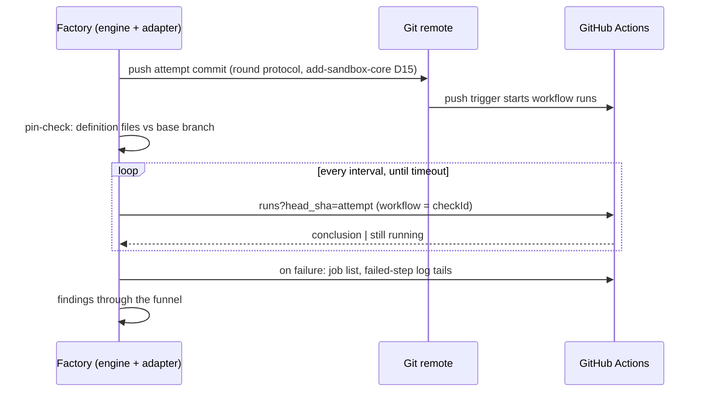

# Design: add-external-check-github-actions

## Context

The stage QC contract needs its first real third-party verifier. The trust
frame comes from add-sandbox-core: every check has a trust envelope —
definition, environment, subject, verdict — and the gnome must control none
of its elements. For a CI check the platform supplies environment and
verdict, the pin-check guard (add-sandbox-core FR16, D10) protects the
definition, and the attempt commit (add-sandbox-core FR21/D15) fixes the
subject. Driven by FR1–FR9 and NFR-R1–R2 of this change's proposal.

## Decisions

**D1 — Workflow-run conclusions are the only verdict source.** The adapter
reads the runs listing filtered by head SHA, narrows to the `checkId`
workflow and consumes the run's `conclusion`; non-`success` or unknown
conclusions map to Fail (fail-closed). *Rationale:* conclusions are computed
by the platform and cannot be written with a repo-scoped token — the verdict
element of the trust envelope (FR3, G2). *Alternative rejected:* check-run /
commit-status APIs — creatable by any token holder, i.e. forgeable by a
gnome with push credentials.

**D2 — Runs are keyed by the attempt SHA; latest attempt wins.** Matching is
`head_sha == attempt commit AND workflow == checkId`; among matches the
newest run attempt is authoritative (FR1, FR5). No event-type filter: any
run of the pinned definition at the pinned SHA executes identical content,
so its conclusion is equally trustworthy. *Rationale:* the attempt SHA is
immutable, which makes polling stateless and takeover-idempotent (NFR-R2) —
the same key that blocks subject substitution gives resume for free.
*Alternative rejected:* matching by branch head or check name — ambiguous
under mid-round pushes; exactly the blur add-sandbox-core FR21/D15
eliminated.

**D3 — Narrow pin envelope: the adapter contributes only the `checkId`
workflow file.** User-declared paths from the stage law are unioned in by
the guard; no directory-wide pin (FR4, NG5, NG6). *Rationale:* a repo holds
many workflows while a stage's check uses one; a directory pin would
permanently fail every task whose job is editing unrelated CI. Verdict
integrity survives the narrow pin because the guard compares against the
base branch at the point of use — a stage-1 substitution of a stage-3
definition is caught at stage 3. The residual (a modified non-pinned
workflow still executes with the repo CI token on push) belongs to the
repository-hygiene layer and is documented for operators. *Alternatives
rejected:* pinning `.github/workflows/**` wholesale (blocks legitimate
CI-editing tasks); auto-parsing the local `uses:` closure (YAML edge cases,
nested composite actions — deferred hardening, NG5).

**D4 — Shared GitHub plumbing package.** `GithubHttpClient`, retry config,
the conditional-request cache and auth handling move from the tracker
adapter's internals into a package both adapters use (FR7). *Rationale:* the
module-boundary rule forbids sibling-internal imports, and duplicating
retry/ETag/auth means duplicating their tests. *Alternatives rejected:*
placing the check client inside the tracker package (the package stops being
about the tracker); an independent minimal client (duplication).

**D5 — Findings are failed jobs plus capped log tails.** On Fail the adapter
lists failed jobs/steps and fetches each failed job's log tail within the
funnel caps (FR6, NFR-C1, UX1). *Rationale:* job names alone leave the gnome
retrying blind; full log archives are mostly cut away by the cap anyway,
while the tail of a failed job carries the error. *Alternative rejected:*
full-archive download (wasted transfer; a head-trimming cap cuts where the
cause often is).

**D6 — Live E2E on Gitea Actions, gated by a parity spike.** The E2E layer
runs Testcontainers Gitea with an Actions runner as the platform; the first
task is a spike proving the API surface the adapter needs (runs by head SHA,
conclusions, job logs). *Rationale:* WireMock proves the adapter honors its
contract; only a live platform proves the contract matches reality (M1), and
Gitea is already the E2E remote of testing.md. *Alternatives rejected:*
WireMock-only (no reality check); manual smoke on real GitHub (a manual
step, against testing.md). On insufficient parity: fall back per Q1 and
record the gap.

**D7 — Per-check timeout class, classified by the engine.** The external
check declaration gains an optional timeout-class field — `quality`
(default) or `infrastructure`; at the poll deadline the engine resolves a
still-Running check as a quality Fail with a timeout finding (unchanged
default) or as CannotVerify naming the elapsed timeout (no attempt burned,
"cannot verify" escalation). The adapter is untouched — it keeps answering
Running; `PollStatus` gains no fifth variant (FR9). *Rationale:*
stage-description.md §7 promises "configurable per check";
add-stage-engine NG6 deferred it "until a consumer exists" — the CI check
is that consumer: a starved runner queue would otherwise burn quality
attempts on runs that carry no feedback for the gnome. Classification
stays with the engine because only the engine owns the deadline
(add-stage-engine FR3). *Alternatives rejected:* adapter-side
classification (the adapter has no deadline and would duplicate engine
timing); a global factory setting (wrong granularity — a fast lint
workflow and a heavy E2E suite in one pipeline legitimately differ).

## Risks / Trade-offs

- Gitea Actions API may not expose runs-by-head-SHA or job logs the way
  GitHub does → spike first (task 1.1); fallback: scripted WireMock
  platform for the E2E, live E2E deferred with the gap recorded in Q1.
- Polling pressure on API rate limits → conditional requests (ETag) via the
  shared cache, interval discipline from the check declaration (NFR-C1).
- Residual: gnome-modified non-pinned workflows execute with the repo CI
  token on push → operator documentation (minimal CI token permissions, no
  privileged secrets reachable from gnome branches), linked to the
  add-sandbox-core task 9.5 guidance (NG6).
- An `infrastructure`-classed timeout escalates to a human instead of
  retrying the stage → deliberate operator trade-off (attempts preserved
  at the cost of an escalation); the default stays `quality`, so checks
  that declare nothing behave exactly as before (D7).
