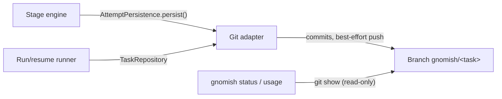

# Design: add-git-workflow

## Context

The engine already treats persistence as a strict port (`AttemptPersistence`,
add-stage-engine D7): persist throws → task Aborted. Manual run keeps state
in memory only. This change adds the git realization of "state lives in the
task branch" plus resume and external readers. Driven by FR1–FR15,
NFR-R1–R3, NFR-S1–S2 of the proposal.

## Decisions

**D1 — Two seams on one branch.** The engine port `AttemptPersistence` stays
untouched (git realization: round = commit). The task lifecycle is owned by
the runner through a separate application-layer port `TaskRepository`
(package `app/port`): create branch + write task context at start, append
`Decision` on resume, write `TaskOutcome`/escalation on finish/parking. The
git adapter implements both ports over the same branch (FR1, FR2).
*Rationale:* the engine stays pure; lifecycle events (start, decision,
outcome) are runner concerns, not stage-loop concerns. *Alternative
rejected:* one fat persistence port owned by the engine — drags task
lifecycle into the domain and breaks the existing port contract.
*Consequence:* a crash between the last persist and the outcome write leaves
"rounds present, no outcome"; `status` honestly reports it as
interrupted/in-progress (NFR-R2).

**D2 — Round commit = whole working tree.** Gnome changes + `state.json` +
trace land in one commit; no separate service commit for state (FR2).
*Rationale:* the stage-description rule already mandates "every attempt is
committed"; one commit keeps round atomicity trivial. *Alternative
rejected:* separate state-only commit — two commits per round that can
diverge, no gain.

**D3 — `.gnomish-task/` at the worktree root, files split by writer.**
`task.json` — written only by `TaskRepository`; `state.json` and
`attempts/<stage>/<round>/trace.jsonl` — written only by the git
`AttemptPersistence` (FR3). *Rationale:* one writer per file removes write
races and merge ambiguity between the two seams of D1. *Alternative
rejected:* inside `.gnomish/` — task data would mix with the target repo's
checked-in pipeline config and pollute PR diffs.

**D4 — State files live in the branch until the end; Completed triggers a
cleanup commit** removing `.gnomish-task/` from the tip; history keeps them
as the audit trail (FR15). *Alternatives rejected:* a paired ref for state
(two commits per round that cannot be kept consistent, non-standard refs in
push); "state rides into the PR" (litter in the target repo).

**D5 — State files are a separate contract, not reused status-report DTOs.**
Same JSON conventions as status-report v1 (camelCase, ISO-8601 UTC, ms
durations, sealed types via `"type"`), own `"version": 1` in `task.json` and
`state.json`; additive changes without bump, breaking with bump; unknown
fields ignored, unknown version refuses resume and the `status`/`usage`
readers alike; `trace.jsonl` carries no
version — resume never reads it (FR4). *Rationale:* persistence = source of
truth, status = view; they evolve differently (factory loop will add
claim/heartbeat to state without touching the view). The equivalence
contract test keeps them aligned by content; shared DTOs would degrade that
test into a tautology. *Alternative rejected:* reuse `StatusReportDto`.

**D6 — Worktrees in `~/.gnomish/worktrees/<project-name>/<task-dir>/`**,
where task-dir = the sanitized taskId (no `gnomish/` prefix) and
project-name = repository directory name (FR6). Cleanup by outcome:
Completed → `git worktree remove`; Escalated/Paused → keep (fast resume,
operator inspects code); Aborted → always keep (may hold the only copy of
unsaved work). `git worktree prune` at runner start. *Rationale:* outside
the clone and its surroundings — one instance may serve several projects;
never litter the target repo. *Alternative rejected:* worktrees next to the
clone — pollutes the project's neighborhood.

**D7 — Branch base = current clone state; `--base` overrides.** The runner
never fetches/pulls the base — updating the clone is the human's job (later
the factory loop's). The base commit is recorded in `task.json` (audit +
resume check) (FR7). *Alternative rejected:* auto-fetch of origin default
branch — silent network mutation of the operator's clone.

**D8 — CLI: `--mode git|in-place`, default `git`.** Git mode never mutates
`--dir`; in-place is the preserved add-manual-run behavior, explicitly
chosen (FR7). *Rationale:* (a) the default is the safer mode for the given
directory; (b) the factory's mainline path must be the short one; (c) the
restricted mode is opted into explicitly. Git-only flags (`--base`,
`--resume`, `--discard-work`) with in-place = usage error, exit 2.
*Alternative rejected:* default in-place for backward compatibility — the
legacy mode would stay the mainline forever.

**D9 — Resume is outcome-driven** (FR8): read `task.json` from the branch
(local → remote-tracking → narrow fetch of exactly `gnomish/<task>`), then
switch on outcome: escalated → decision dialog; paused → confirmation;
null → continue at recorded position; completed → report and exit. Outcome
is reset to null in the commit that carries the resume decision (FR5) —
otherwise "parked" and "died mid-flight" are indistinguishable.
Divergence (FR9): equal → continue; behind → fast-forward and auto-discard
uncommitted leftovers (they belong to an outdated history line); ahead →
continue from local, push catches up; diverged → stop with a clear error
(auto-resolution of two workers = claim protocol = factory loop).

**D10 — Salvage by default, `--discard-work` to replay.** Uncommitted
leftovers of an interrupted round are committed as-is in a service commit
(not a round in `state.json`) and work continues: the next round's gnome
sees the half-done work, verify judges the result — the QC loop absorbs
work of unknown quality (FR10). `--discard-work` resets to the last
recorded round — replays the interrupted round, never restarts the task.
*Rationale:* process death is usually accidental, not a verdict on the
work. *Alternative rejected:* discard by default — silently throws away
possibly good work.

**D11 — Push policy is factory Java logic, never LLM rules** (FR11,
NFR-S1): best-effort push after every round; the agent-cli live loop
notices a moved branch tip after tool events (gnome committed) and pushes
best-effort mid-round. Hard rules: push exactly `origin gnomish/<task>`;
NEVER `--force` (non-fast-forward → WARN, no retries with force);
mid-round push only after "HEAD on task branch, old tip is ancestor"
checks — otherwise skip with WARN; the authoritative verdict (Aborted)
belongs to the round-boundary check at persist. Credentials are never
exposed to the gnome; prompts contain nothing about push. *Alternatives
rejected:* signal-file push protocol (explicit gnome participation for no
benefit); timer-based push (checkpoints meaningless by time).

**D12 — Gnome commits inside a round are allowed and encouraged** via stage
instructions — plain git through Bash tools, no special mechanism (FR12).
Invariant: the adapter's commit closes the round; gnome commits are a finer
slicing of the same diff ("every round is a commit, not every commit is a
round"). Round-boundary protocol checks: still on the task branch; old tip
is an ancestor of HEAD (no history rewrite); `.gnomish-task/` untouched.
Violation → persist throws → Aborted. Enforcement without a sandbox is
impossible (accepted risk, NG3); detection always is.

**D13 — `status`/`usage` read the branch, never a working copy** (FR13,
FR14): `git show <branch>:.gnomish-task/...`; branch lookup local →
remote-tracking → narrow fetch (no local branches created). `usage` is a
separate subcommand, not a `status` flag — different questions and sources
(`status` reads the tip, `usage` walks history; status-report v1 stays
untouched). For a live task both show the last recorded round boundary —
status via shared state, by design (NFR-O1).

**D14 — Usage reconstruction walks `state.json` history, not commit
messages.** Chronological (oldest→newest) walk of commits touching
`.gnomish-task/state.json` on the task branch; a commit is a round record
when its `state.json` contains a new `AttemptRecord` (attempts list grew,
or position changed starting a new stage visit). Salvage/cleanup/task.json
commits fall out naturally (no new record). Commit messages get a
machine-recognizable prefix anyway — `gnomish: round <stage>#<n>`,
`gnomish: task <event>`, `gnomish: salvage`, `gnomish: cleanup` — but as a
human/audit aid, not the parser's input. *Alternative rejected:* parsing
messages — fragile against gnome commits and free-form text.

**D15 — Branch death after PR merge is normal.** `status`/`usage` answer
"task not found" once the branch is gone; the only artifact that must
outlive the task is code in main. The long-lived record (final summary with
usage totals posted to the ticket) is the tracker/factory-loop's future
duty; manual mode: `gnomish usage --json > file` before merging. No
factory-side journal archive — a third store with no consumer.
Documentation recommends squash-merge for gnome PRs so the journal never
leaks into main history.

**D16 — taskId sanitization: deterministic, lossy, unguarded.** Branch/dir
name = taskId with every char outside `[A-Za-z0-9._-]` replaced by `-`,
consecutive `-` collapsed, leading/trailing `.`/`-` stripped, `.lock`
suffix and empty result rejected as invalid taskId. The authoritative id
lives inside `task.json`; resume finds tasks by branch, never parses ids
from ref names. Sanitization collisions are a known limit (real tracker ids
are ref-safe); no collision defense (FR2).

## Risks / Trade-offs

- [Gnome breaks git discipline (leaves branch, rewrites history)] →
  round-boundary checks turn it into Aborted; worktree kept for forensics
- [Salvage commits garbage the gnome half-wrote] → QC loop verifies the
  next round; `--discard-work` for deliberate kills
- [Diverged local/origin needs a human] → explicit stop with error; proper
  arbitration arrives with the factory-loop claim protocol
- [Two writers, one directory] → single-writer-per-file split (D3) plus
  round-boundary ownership checks
- [Mid-round push races the gnome's next commit] → push is best-effort and
  ancestry-checked; a lost push is caught by the next round push

## Open Questions

None — Q1/Q2 of the proposal are settled by D14 (commit scheme and parser
independence) and the manual-run delta spec (flag disposition).
