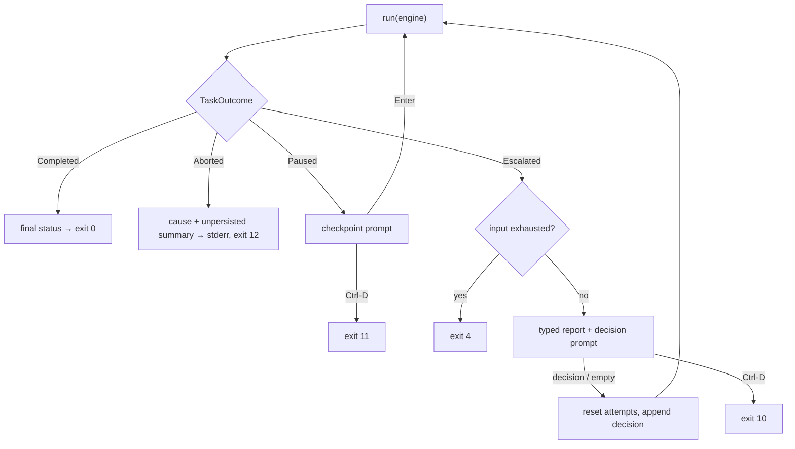

# Design: add-manual-run

## Context

The engine (add-stage-engine) is a pure library: `run(definition, context, state, workspace, ports) → TaskOutcome`, everything real behind the nine `EnginePorts` members (seven behavioral ports plus the `Clock`/`Sleeper` environment ports). This change wraps it in an interactive CLI where a human plays the gnome, and lands the first non-fake adapters. The central design problems: one terminal shared by many interactive adapters, EOF semantics that stay honest under scripted stdin, wire-level contracts for the command runner, and a status JSON contract that must survive into the git-workflow change where no live process exists. Driven by FR1–FR14, NFR-R/O/S/C from proposal.md; decisions settled in an explore session with the operator.

## Goals / Non-Goals

**Goals:** validate port shapes with real/interactive adapters (G1); a dry-run tool that needs nothing but a prepared directory (G2); a status contract other changes can be tested against (G3).

**Non-Goals:** everything in proposal NG1–NG7 — notably persistence, tracker, AI, sandboxing, and any pipeline-config schema change.

## Decisions

**D1 — Single input choke point: `ConsoleIO` + `DialogConsole`.** A dumb `ConsoleIO` (readLine → line or `ConsoleClosedException` on EOF; print) wrapped by `DialogConsole`, which intercepts meta-commands (`status`, `status --json` — render, print, re-prompt) and latches an input-exhausted flag (FR10, FR13). All interactive adapters and runner dialogs read through it; none knows about `status`. *Rationale:* "status at any prompt" (FR10) forces one interception point; a scripted `ConsoleIO` fake makes every dialog a data-driven Spock spec. *Rejected:* per-adapter `System.in` access (status logic duplicated N times, untestable without stream swapping).

**D2 — EOF flows through the engine as an ordinary infrastructure failure.** The human is the adapter; the human leaving is the adapter failing. `ConsoleClosedException` from an interactive adapter is caught by the engine's existing rules (`CannotVerify`/`CannotExecute` — no engine change); the runner then consults the `DialogConsole` flag: exhausted input skips the resume dialog and exits with code 4, while EOF at a runner prompt (resume/checkpoint) is a deliberate exit with the outcome's code (FR9, FR12, FR13, NFR-R1). *Rationale:* zero special control flow through the engine; scripted E2E distinguishes "input script too short" (4) from "task legitimately escalated" (10). *Rejected:* requiring a TTY (kills piped-stdin E2E for nothing — exhausted pipes EOF instantly, they don't hang); custom exceptions tunneled past the engine (second failure semantics on one seam).

**D3 — `--project` is the workspace, and the definition is read from it.** One flag maps to the engine's `workspace`; `.gnomish/` is loaded from inside it, once, at startup (FR1). This is an invariant, not a coincidence: the pipeline is versioned with the code and stays true when git-workflow puts both in a task worktree — only the preparer changes. The runner writes zero bytes into the workspace: findings temp files and logs live outside (NFR-S1). No git awareness, no writability checks, no lock file. *Rejected:* separate `--pipeline-dir` (splits an invariant into two flags); dirty-workspace warnings via git (the runner is git-free by decision); a concurrent-run lock (machinery for a scenario where the operator is sitting in both dialogs).

**D4 — `--from-stage`, minimal form.** Validated against the loaded definition (typo → usage error listing stage names, not a `PipelineMismatch` escalation); input artifacts of the target stage are the operator's documented responsibility; no `--until-stage`/`--only-stage` — Ctrl-D at any point is a clean stop (D2) (FR1, FR2). *Rationale:* earlier stages carry real command checks (minutes per replay); the author debugging stage N pays that on every iteration without this flag. *Rejected:* deferring the flag (the "just press Enter through stages 1–3" argument fails exactly when the manifest has real checks — the primary dry-run audience).

**D5 — Argument parsing via Spring's `ApplicationArguments`.** Operator decision: a tested, standard mechanism over hand-rolled code. `ApplicationArguments` is already on the classpath (spring-boot-starter) and parses `--key=value` options; consequence: values attach with `=` (`--task="fix the flaky spec"`), and usage errors state that form (FR1, UX1). *Rejected:* hand-rolled parser (vetoed — untested bespoke code for a solved problem); picocli / commons-cli (a new dependency for five flags on a minimal-classpath project).

**D6 — Command runner wire contract.** `sh -c <command>` (manifest carries one string), cwd = workspace, inherited environment, `redirectErrorStream(true)` for one chronological stream, tail ≈ 200 lines / 10 KB kept (FR7). Exit 126/127 map to `CannotVerify` — the shell wrapper turns "binary not found / not executable" into those codes, so the engine's classification table row is honored at the adapter level. Structured findings ride a temp file passed as `GNOMISH_FINDINGS_FILE`, wrapper object `{"findings":[…]}` (FR8). The exit code is the primary verdict: a valid file replaces the synthetic tail-finding; a malformed file degrades to the synthetic finding plus a warning — never `CannotVerify` (NFR-R2). *Rationale:* channels stay separated — exit code = verdict, stdout/stderr = human log, file = structure (precedent: `GITHUB_OUTPUT`, SARIF). *Rejected:* sniffing stdout for JSON (build tools pollute stdout; fragile heuristics); `CannotVerify` on a broken findings file (a broken reporter would mask a red check as infrastructure).

**D7 — One `StatusReport` model, two renders, contract split by derivability.** Pure function `(TaskContext, TaskState, live activity) → StatusReport`; text and JSON are renders of the same object (FR11). Live activity comes from a snapshot holder maintained by an event-listener adapter (`AttemptFinished` carries the new state; `CheckStarted`/`ExecutionFinished` set activity). Contract fields are partitioned: state-derivable (required) vs live-only (nullable) — the future external CLI builds reports from a state file with no live process; equivalence is asserted at the attempt boundary, the engine's quiescent point. Anchor: `status-report-v1.reference.json` — serialization must be byte-identical to the committed reference file (M3). *Rejected:* independent text and JSON renderers (they drift, and the cross-change contract test loses its subject); per-poll engine events for finer activity (engine change for cosmetics).

**D8 — Uniform escalation resume; distinct pause resume.** Every `Escalated` resume: render typed report → prompt → reset `attemptsUsed`, append optional `Decision(author=operator)` → run again; empty input resumes without a decision (infrastructure fixes need no message). `Paused` resume: confirmation only — position is already advanced, nothing to reset (FR9). *Rationale:* human intervention grants a fresh attempt budget; one protocol here = the same protocol in the factory loop, contract-tested once. *Rejected:* per-escalation-type reset rules (subtle divergence between manual mode and the future loop for no observed benefit).

**D9 — Logging: one rolling file, listener-maintained MDC.** Single `~/.gnomish/logs/gnomish.log`, daily/size roll, ~7 days history, total size cap; `taskId`/`stage`/`attempt` in the pattern via MDC. The runner sets `taskId`; an event-listener adapter maintains `stage`/`attempt` — listeners run synchronously on the engine thread, so the domain stays MDC-free (NFR-O1). Console appender at WARN+, ERROR duplicated to stderr; stdout belongs to the dialog (NFR-O2). *Rationale:* the log's only reader is the factory developer doing a days-horizon post-mortem — retention by time+size, greppable by MDC. *Rejected:* SiftingAppender file-per-task (Logback has no cleanup for sifted files — a junk drawer needing custom GC); JSON log format and `--verbose` (no consumer; Logback env config suffices); committing logs to git (instance diagnostics, not task data; secrets risk — NFR-S2).

**D10 — Wiring and layout.** One `@Configuration` assembles `EnginePorts`: interactive executor/external/judge + real builtin/command runners + in-memory persistence + listeners (MDC, logging, status snapshot). Packages: `adapter.console` (ConsoleIO, DialogConsole, interactive adapters, dialogs), `adapter.check` (files_exist, command runner), `status` (StatusReport model, renders, serializer), `app` (runner loop, args, exit codes). Exit codes delivered through Boot's `ExitCodeGenerator` / `ExitCodeExceptionMapper`; the task runs on the ApplicationRunner thread (virtual threads arrive with the factory loop's N tasks). No args → untouched factory-bootstrap behavior (FR12, proposal "no modified capabilities"). *Rejected:* a separate Gradle module (module boundaries are package-level until a second consumer exists); running the task on a dedicated thread (nothing to gain single-task).

**D11 — `startedAt` becomes engine state, not live decoration.** The status contract requires `attempts[].startedAt`, but `AttemptRecord` carries no timestamps — the moment a round began existed only in the `AttemptStarted` event. The engine (already holding a `Clock` port) stamps `startedAt` when it records the round; add-stage-engine is archived, so the delta rides this change as a MODIFIED `stage-engine` requirement (FR15, forced by FR11's derivability partition). *Rationale:* only state-carried fields survive into the git-workflow state file — a live-only `startedAt` breaks the attempt-boundary byte-equivalence D7 relies on and would leave the future external `gnomish status` unable to show when attempts ran. *Rejected:* classifying the field live-only/nullable (event-built and state-built reports diverge exactly where the contract asserts equality); dropping it from v1 (loses the operator's primary post-mortem signal — "hung for hours or failed instantly?" — and forces a version bump later).

## Runner outcome loop (D2, D8)

## Risks / Trade-offs

- [Interactive adapters cannot produce some port-contract variants (e.g. an unparseable human verdict — re-prompting parses everything)] → treat as findings about port shapes and record them; do not fake pathological inputs just to pass a suite row.
- [`--key=value`-only syntax surprises operators expecting `--task "..."`] → usage text and error messages always show the `=` form; E2E covers the failure message.
- [Reference-JSON test is brittle to field order/time] → injected `Clock`, one explicitly configured `ObjectMapper`, deterministic sample builder.
- [Same human votes N times for an N-vote judge check] → accepted deliberately: exercising the engine's voting/short-circuit live is a goal, and silently forcing votes=1 would diverge from the manifest.
- [Command checks mutate the operator's own repo] → accepted for manual mode (NG5); the runner itself stays read-only (NFR-S1), sandboxing is a pre-autonomy gate tracked outside this change.
