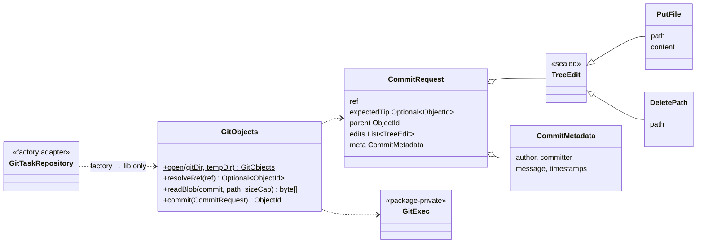
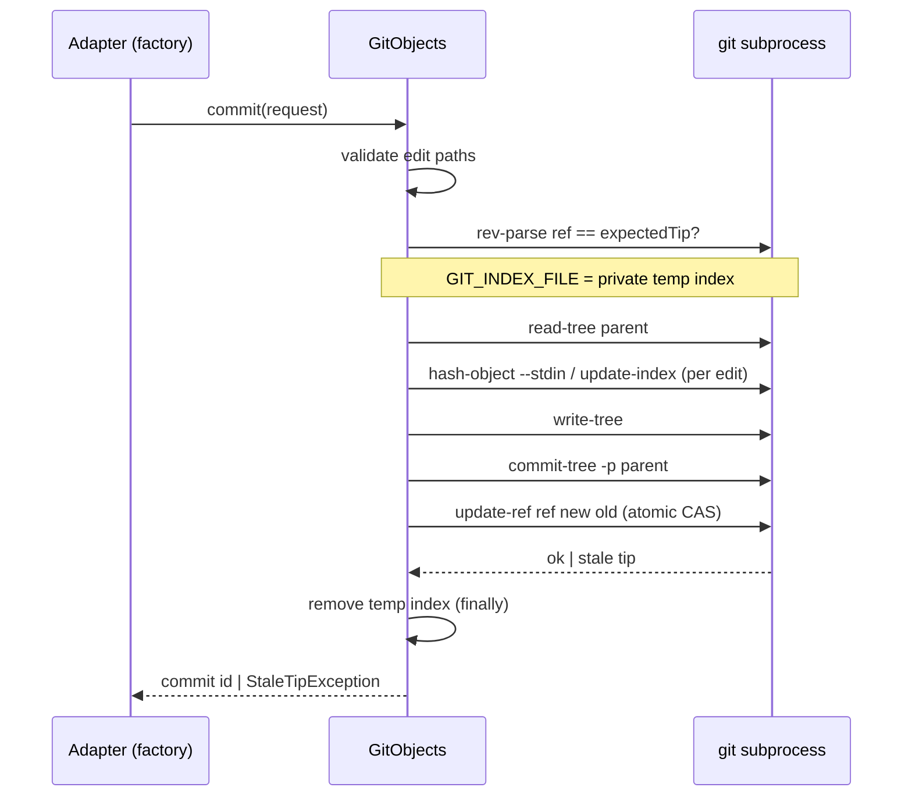
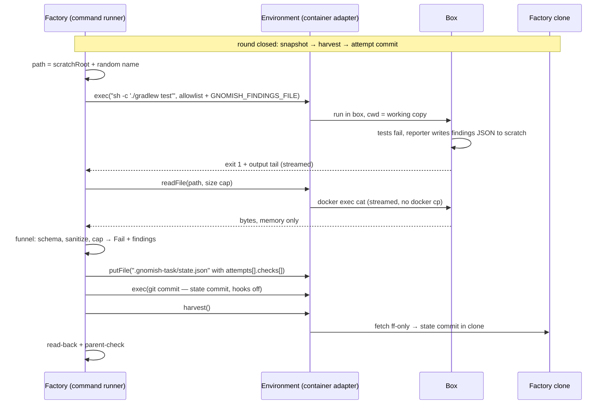
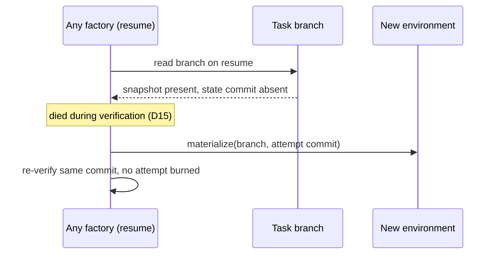

# Design: add-sandbox-core

## Context

Driven by FR1–FR25, NFR-S1–S3 from the proposal. Exploration
(2026-07-20…31) closed every research question against industry precedent
(Anthropic srt/Claude Code web, Codex, Copilot agent, Docker Sandboxes,
Dagger container-use); the threat registry marks items #1–7, 9, 12–14,
18–23, 32–39, 42–44 as closed by this change. Current execution surface:
`AgentProcessLauncher` and `CommandProcessRunner` spawn host processes with
full env inheritance; the working copy is a git worktree sharing the
factory clone's `.git`.

## Goals / Non-Goals

Design-level goals: one opaque port that both a host and a container
adapter implement today and VM/k8s adapters implement later without
contract change; security by construction over security by policy.
Non-goals: TLS interception, virtual keys, setup scripts, snapshot cache
(change B); non-Docker adapters (C/D/E); neighbor-service stacks
(Docker-ladder step 1 — change D owns both the k8s and the local form).

## Decisions

### D1. One opaque environment port, not per-concern ports
`TaskExecutionEnvironment`: `materialize(branch, commit?)`, `exec(cmd,
env)` → streamed output + exit code, `harvest()`, `dispose()`. The
optional commit pin (factory-chosen, default: branch tip) prepares the
working copy at that commit of the task branch — the single operation
behind fresh-box verification and judge boxes (D8/D9) and
`--discard-work`; no separate "materialize at commit" API. Isolation glues
working-copy materialization to process launch (a worktree bind-mounted
into a container would share the clone's `.git` — a tunnel out of the
box), so one port owns both. Contract is host-agnostic: it speaks git
transport and streams; "volume path on disk" is a private detail of the
local adapter (operator decision 2026-07-23: factory must run locally and
in k8s). The port has **no snapshot operation** — an image of a
gnome-touched box must be impossible by construction. The channel is
completed by `exec` stdin and two file operations — `putFile`/`readFile`
at factory-chosen paths, size-capped, valid only between rounds (a
GHA-class adapter has no mid-round channel; all factory writes are
boundary-time anyway) — everything else crosses as git transport.
File paths resolve under one of two environment-owned roots: the
working copy, or a per-environment **scratch area** the adapter
allocates at materialize (host: a factory-private temp dir outside the
worktree; container: a dir in the box outside the clone) and exposes on
the handle. Protocol files like findings must not dirty the working
copy — they would enter snapshot commits — yet must sit inside the
environment boundary so the host adapter's path-escape check has an
anchor; scratch is never harvested and dies with dispose.
Alternative rejected: separate workspace and process ports — every
adapter would have to coordinate them pairwise; exec-with-stdin-only
channel — shell quoting at every call site and unimplementable for GHA.
<!-- implements FR1 of add-sandbox-core -->

### D2. Container adapter = Docker CLI as subprocess, runtime knob
Docker via `ProcessBuilder` (like git; no docker-java dependency, no
socket libraries): `network create --internal`, `volume create`,
`run` with limits, `exec` per round, `rm -f` on dispose. Rootless
Docker/Podman recommended in docs, not enforced.
`factory.sandbox.runtime` knob (default `runc`) passes `--runtime=` so a
Linux operator can enable sysbox/gVisor without adapter changes.
Rejected: gVisor as default (syscall-heavy builds 2–6× slower), microVM
tools (Matchlock et al. — young, one-shot-shaped; the opaque port keeps
them as future adapters). <!-- implements FR3 of add-sandbox-core -->

### D3. Clone-instead-of-worktree + harvest
Materialize = `git clone --no-hardlinks` from the factory's local clone
into the task volume (no network, no keys, no remote address inside;
`gc.auto 0`; agent identity only). Harvest = factory-side
`git fetch <env> <task-branch>:<task-branch>` with a factory-fixed
refspec (never names from the box), fast-forward-only (no `+` prefix —
rewritten history is refused by git itself), `--no-recurse-submodules`.
Push stays outside, factory-owned — the push monopoly gets structurally
stronger. Mid-round branch-tip observation polls the environment
(harvest of an unchanged tip ≈ no-op), rate-limited on the factory side
so the box cannot cause a fetch storm. If event-driven tip detection is
ever enabled, it watches `.git/logs/HEAD` — never `refs/heads/*`, which
git may silently pack into `packed-refs` — and may only *wake* the
rate-limited poll, never command a fetch.
<!-- implements FR5, FR6 of add-sandbox-core -->

### D4. Egress: internal-only network + mitmdump from day one
Layer 2: the task network is `--internal`; the guard container joins it
and a normal bridge — the only route out. Layer 1: **mitmproxy
(`mitmdump`) in non-intercepting SNI/CONNECT mode** with a static
allowlist from factory config; DNS is answered only via the guard.
Choosing mitmproxy now (over tinyproxy) means change B's TLS opening is
a mode switch, not a tool swap; structured JSON deny logs come free.
The factory's own CA certificate is baked into the image at build time
(cheap seam for B; avoids rebuilding all images later). Guard config
lives outside the box and is not mounted anywhere gnome-readable.
<!-- implements FR7 of add-sandbox-core -->

### D5. Mandatory self-check, fail-closed
Before the first `exec()` in every materialized sandboxed environment —
round boxes and fresh-box verification/judge boxes alike (a judge box with
silently broken isolation would grade in the open) — the factory runs
inside the box: (1) direct egress bypassing the proxy — must fail;
(2) proxied request to a non-allowlisted host — must be denied;
(3) proxied request to an allowlisted host — must pass;
(4) isolation-mechanism assertion (the container runs with the expected
runtime/limits — the "vz silently fell back to QEMU" class). Any
mismatch = infrastructure failure; no process executes in the
environment: at task start the task does not start, at verification
time the affected check/vote classifies as cannot-verify. The probes
are seconds against round duration, so per-environment repetition stays
within NFR-P1. Denials during the task are collected as findings into
the task report. <!-- implements FR8 of add-sandbox-core -->

### D6. Layered env allowlist: adapter base + passthrough by name
Child env = adapter base set ∪ operator passthrough ∪ factory-set
protocol vars; nothing inherited implicitly — one formula, both
adapters. Container: base is empty, only explicit `--env` entries exist;
the image's own `ENV` supplies `PATH`, `HOME`, and toolchains. Host:
`ProcessBuilder.environment().clear()` + explicit puts — this replaces
the current inherit-everything-minus-scrub behaviour documented in
`AgentProcessLauncher`'s javadoc, landing at the single
`ProcessBuilder` start seam that class already keeps — with a fixed
built-in base
(`PATH`, `HOME`, `TMPDIR`, locale, `TERM`, `USER`, `SHELL`) — a typical
project needs zero env config, since `PATH` alone resolves most
toolchains. Passthrough is exact names only; values are read live from
the factory env at exec time (config stores no values, never goes
stale). No glob patterns: one `AWS_*` would drag keys in wholesale,
silently. A credential name in passthrough is a startup `ConfigError` —
the validation-time twin of today's scrub-last guarantee. Applied names
(never values) are logged at debug per exec, so a missing-variable
diagnosis is one log read. `SSH_AUTH_SOCK` stays deliberately outside
the base: on-disk keys are already exposed by host mode's absent FS
isolation, but the agent socket is the only route to locked or
hardware-backed keys — excluding it protects exactly the operator whose
other channels are closed; projects with private SSH dependencies add
it as one passthrough line (documented recipe). AI access enters
through the existing `ANTHROPIC_BASE_URL`/`ANTHROPIC_AUTH_TOKEN` seam
(same one E2E uses for Ollama) — the change-B virtual-key gateway plugs
in with zero code change here. *Alternatives rejected:* host
inherit-minus-scrub (today's behavior legalized) — silently leaks every
unrelated cloud key into gnome processes and forks the port contract
per adapter; glob passthrough — reopens the silent-leak channel the
layer exists to close. <!-- implements FR9 of add-sandbox-core -->

### D7. Image is operator-supplied; registry addresses parameterized
`factory.sandbox.image` in installation config; docs ship a reference
Dockerfile (JDK, git, agent CLI, baked CA, JVM/Gradle proxy settings —
JVM ignores proxy env vars, so `gradle.properties` + `GRADLE_OPTS` +
`settings.xml` are baked). Registry endpoints in baked configs are build
parameters, not hardcoded — the future artifact depot is a config
change. Injection-persistence surfaces are read-only for the gnome
inside the box: agent-CLI config, shell rc files, and the baked
proxy/CA/build configs are root-owned or `:ro`-mounted (Codex precedent:
`.codex/` read-only even inside writable roots) — the gnome cannot
change the rules of its own cage even within the container. The gnome's
own clone hooks stay writable: they execute only inside the box and
never cross the harvest boundary (D3). No setup.sh, no `docker commit`
anywhere in this change.
<!-- implements FR3, FR20, UX4 of add-sandbox-core -->

### D8. Stage binding, segment lifecycle, freshness knobs
Sandbox binding is resolved per stage: the repo declares needs in the
stage `Mechanism` (tighten-only), the operator binds adapters in factory
config, the factory reconciles needs against the adapter's
machine-readable passport (egress control, task↔task boundary, docker
support, isolation level) and refuses fail-closed on mismatch. An
environment lives for a contiguous segment of equally-bound stages;
crossing a boundary = harvest → dispose → materialize — the same
mechanics as resume, nothing new. `requires-fresh` (stage) and
`verify-in: fresh-box` (command check; materializes from the attempt
commit, proving branch self-sufficiency) reset everything outside the
branch — poisoning invisible in diffs. Host binding cannot be requested
by the repo. <!-- implements FR12, FR13, FR14 of add-sandbox-core -->

### D9. Findings funnel is adapter-side; engine unchanged
The engine already branches only on verdicts and treats findings as
opaque data. One new component in the adapter layer normalizes all three
findings sources (judge/external/command): strict verdict schema (parse
failure = infrastructure failure of the check), size caps at read/poll
time, ANSI/control sanitization before logging, fenced
"untrusted machine output" blocks with escaped mentions for tracker
publication. Retry-prompt sink needs no filter: injection lands inside
the cage by construction. Judge hardening: concrete criteria; artifact
content handed to the judge is wrapped in hard delimiters as data.
Vote counts and majority aggregation already live in the engine
(add-stage-engine) and are untouched. In sandboxed mode judge votes run
in a fresh environment materialized from the attempt commit (the
`fresh-box` mechanics of D8): a gnome-poisoned round box — PATH shims,
planted binaries outside the working copy — must not grade itself;
votes of one attempt may share the fresh box, since judges are
read-only. *Alternative rejected:* judging in the round box with
read-only tools — the tool set is enforced by the CLI running inside
the very environment under suspicion.
<!-- implements FR15 of add-sandbox-core -->

### D10. External-check integrity: pin-check guard + adapter contract
Pin-check is a guard component wrapping any `ExternalCheckClient` — one
implementation for all adapters, applied before the check's first poll;
the engine's manifest-order chain stays untouched (same philosophy as
D9). The pin set is the union of pin paths declared in the stage law
(the user knows their process: analyzer configs, local actions) and
paths the adapter contributes (a platform adapter adds its own
definition file; the interactive client contributes none — with nothing
declared the pin passes vacuously, a human oracle has no repo-borne
definition). Comparison is byte-wise against the base branch, reading
the gnome branch as bare git objects (D11) at the attempt commit (D15);
any difference = Fail with the diff as findings, the adapter is never
invoked. Comparing against the base — not the previous round — catches
a substitution made at any earlier stage at the check's point of use.
The pin is deliberately narrow: non-definition files stay editable
(tasks legitimately change CI), and the residual — a modified
non-pinned workflow still executing on the platform — belongs to
repository CI hygiene (task 9.5), not to this guard. Polling only
platform-authored verdicts (e.g. workflow-run conclusions), never
statuses creatable with a repo-scoped token, is the contract every
external-check adapter must honor — first realized by
add-external-check-github-actions; this change ships no platform
adapter (NG8). <!-- implements FR16 of add-sandbox-core -->

### D11. Factory-side git hardening
The factory never materializes untrusted branch content in its own FS
namespace: gnome branches are read as bare git objects (`git show`,
`cat-file`), checkout happens only inside task environments. Every
factory-managed clone gets `core.hooksPath` pointed at an empty
directory. Any factory-side application of model-output file writes is
confined to the working copy: resolve symlinks before writing, refuse
`.git/**` and paths escaping the root — with a contract test.
<!-- implements FR17 of add-sandbox-core -->

### D12. SecretsProvider port: form fixed now, env adapter only
A small `SecretsProvider` port (get named secret) with the env/file
adapter as sole implementation. Fixing the form now keeps factory
secrets (tracker token, future gateway master key) behind one seam so
Vault-class (OpenBao) and OIDC adapters arrive with changes D/E without
touching consumers. <!-- implements FR18, NFR-S1 of add-sandbox-core -->

### D13. Default binding is container; host is explicit opt-in
With no operator binding configured, stages bind to the container
adapter; if Docker is absent the factory refuses with a clear message
naming the two ways out (install Docker / explicitly bind host).
Silent fallback to host would be a fail-open. Host remains fully
supported for trusted setups, iOS/GPU/licensed toolchains, dogfooding.
<!-- implements G2, G4 of add-sandbox-core -->

### D14. Pipeline law is read only from the factory clone
The two roles of `.gnomish/` files are structurally separated: the *law
of the current task* — stage manifests, stage instructions, judge
acceptance criteria — is loaded from the factory-owned clone of the
base branch, which the gnome cannot write; the copies in the gnome's
working copy are *project content*, editable like any file, and become
law only after a human merges them — for later tasks. Otherwise a stuck
gnome weakens its own acceptance criteria instead of fixing code
(reward hacking), or an injected task rewrites its own verification.
Resume re-reads the law from the base branch at resume time — a
feature: "human fixed the criteria → returned the task" works by
construction. A contract test pins the source: edits to `.gnomish/` in
the gnome branch never affect the running task. Law binds **per
invocation**: read once at invocation start and frozen for its lifetime,
including the in-process outcome loop (matches manual-run's existing
"loaded once at startup"); "resume re-reads law" = each new invocation
re-reads. Today control files and judge criteria are read *lazily from
the workspace root at use time* (`ControlFilePreflight`) — the exact
hole; they move to the law source in all modes. The git-less in-place
mode has no base branch: its law source is the workspace snapshot at
startup — an accepted trade-off for a host-only-by-construction
(no branch to materialize) human-supervised debug mode, documented
honestly; FR14 reconciliation already refuses in-place when a repo
declares sandbox needs. *Alternative rejected:* reading law from the
task working copy — simpler wiring, but hands the caged process the
keys to its cage.
<!-- implements FR19, NFR-S2 of add-sandbox-core -->

### D15. Snapshot-first round protocol: two commits per sandboxed round
Sandboxed rounds close in two steps: a **snapshot commit** of the working
tree inside the box (`add -A`, hooks disabled via argv `-c
core.hooksPath=`; includes the decision file if any) executed as the tail
of the executor adapter's `execute()`, then harvest — verification judges
the harvested **attempt commit**: builtin checks read it as bare objects
in the factory clone (trusted, one implementation for every adapter),
fresh-box checks and judge votes materialize from it (D8/D9 — impossible
without a commit existing at verify time), external checks poll CI runs
of exactly the pushed attempt commit (fixing today's fuzzy
triggered-by-mid-round-pushes semantics). State then persists as a
separate **state commit** via `putFile` + in-box commit. Host mode keeps
today's single round commit (behavior-neutral). The engine is untouched:
the sequence hides in adapters, and the concrete `Workspace` (an empty
marker interface) carries the attempt-commit ref to check runners.
Resume gains one intermediate state: snapshot-without-state = died during
verification → re-verify, no attempt burned. *Alternatives rejected:*
verify the box tree through the channel — untrusted answers, per-adapter
builtin code, and the reordering is forced by fresh-box regardless;
single pre-verify commit with verdicts recorded in the next round's
commit — smears strict attempt persistence across rounds.
<!-- implements FR21 of add-sandbox-core -->

### D16. Harvest-boundary integrity and channel security
In-box FS integrity is unwinnable — a gnome-forked daemon can rewrite
files after the factory writes and before `git add`, invisibly to the
"gnome commits touched `.gnomish-task/`" check. Integrity therefore moves
to the harvest boundary, factory-side and trusted: (1) **read-back** —
harvested state/trace files must be byte-identical to what the factory
wrote (scope: exactly the channel-delivered files, `state.json` and the
trace — `task.json` never crosses the environment channel, its commits
are factory-side, D19); (2) **parent-check** — the harvested state commit's parent must be
the snapshot commit (daemon-inserted commits abort); (3) the boundary
protocol checks (ancestry, `.gnomish-task/` untouched — now with the
`decisions/` carve-out, D17) run on harvested refs in the factory clone;
ff-only harvest itself subsumes the rewrite check. Channel rules:
factory writes run as the gnome user, never root (symlinks cannot
redirect them onto root-owned cage configs); reads stream bytes at
factory-chosen paths with size caps and never materialize as factory
files (`docker exec cat`, never `docker cp` with its host-side tar
extraction CVE class); the host adapter resolves symlinks and refuses
escapes on reads as well as writes. *Alternative rejected:* trusting the
in-box FS between round end and commit — indefensible against a
background process.
<!-- implements FR22, NFR-S3 of add-sandbox-core -->

### D17. Decision file lives in the branch
The decision request moves from a host temp dir (meaningless inside a
box) to `.gnomish-task/decisions/<stage>-a<attempt>.json` in the working
copy — the single gnome-writable path under `.gnomish-task/` ("one
writer per file" holds: this file's writer IS the gnome). It rides the
snapshot/salvage commit, so a pending escalation survives any death and
any instance resumes it from the branch alone; it reaches the factory
over the hardened harvest path and is visible in the PR during
escalation. Stage+attempt naming makes stale files self-excluding. No
eager removal: the Completed cleanup commit already strips
`.gnomish-task/` from the tip. The git-less in-place mode keeps the
temp-file transport. *Alternative rejected:* in-box temp file read via
`readFile` — lost with the environment, forcing a round replay after a
crash between CLI exit and escalation record.
<!-- implements FR23 of add-sandbox-core -->

### D18. Prompts travel via stdin
The round prompt is one argv argument today (`claude -p <prompt>`); Linux
caps a single argument at 128 KB (`MAX_ARG_STRLEN`), and the prompt
accumulates the findings of all prior attempts — late attempts can
realistically fail with `E2BIG`, a latent host-mode bug independent of
the sandbox. Argv is also world-readable via `ps`, leaking fenced
untrusted findings. The CLI reads the prompt from stdin when no argument
is given; all modes switch to stdin. Honest cost: the fake-agent
contract specs read the prompt from argv and must be updated — migration
step 1 is deliberately not 100% behavior-neutral at this one point (the
change-wide host-visible delta is enumerated in D20).
*Alternative rejected:* keeping argv with prompt truncation — silently
drops the feedback that late attempts need most.
<!-- implements FR24 of add-sandbox-core -->

### D19. Lifecycle commits are factory-side bare-object commits
Sandboxed mode leaves four factory-authored write points outside the
snapshot/state protocol of D15: branch creation with `task.json`, the
resume decision, the outcome record, and the Completed cleanup commit.
The in-box channel fails exactly when these writes matter: at creation
no environment exists yet, at abort the box is dead or quarantined, at
cleanup it is already disposed — and FR17 forbids a factory checkout.
All four are therefore created factory-side as plumbing commits over
bare git objects in the factory clone: read the tip tree into a private
temporary index, apply edits, `write-tree` + `commit-tree`, advance the
ref with git's atomic compare-and-swap (`update-ref <ref> <new> <old>`;
a tip moved by a concurrent instance fails the write, never force). No
working copy, no checkout, no hooks — the write-side twin of D11's bare
reads. Consequences: read-back (D16) stays scoped to channel-delivered
files, since `task.json` never crosses the environment channel; the
Completed ordering problem dissolves (the last in-box commit is the
state commit — outcome and cleanup commits follow after dispose); on
resume the decision commit lands between harvest and materialize, so
the fresh box sees it from the start; an aborted outcome commits on the
last harvested tip while the violating box is kept untouched as
evidence.

The mechanism ships as `gitobjects` — a library-shaped top-level
package beside `domain`/`app`/`adapter`, extraction-ready by
construction: JDK + SLF4J API only (no factory, Spring, or Jackson
imports); caller supplies identity, timestamps, and message — commit
ids are deterministic for fixed inputs; the facade and its records are
the public API, plumbing internals stay package-private; ArchUnit pins
the boundary in both directions (this change introduces ArchUnit, per
ADR 0001's plan). Blob content crosses via stdin, edit paths are
validated (no absolute paths, no `..`, no `.git/**`), reads are
size-capped; the only disk artifact is the private temp index, removed
in `finally`.

*Alternatives rejected:* routing lifecycle writes through the box
channel (putFile + in-box commit, like the state commit) — unavailable
at creation, dead or untrusted at abort, disposed at cleanup, and would
force extending read-back to `task.json`; a separate Gradle subproject
for the library — deferred (operator decision 2026-08-06): the same
principles hold inside one source tree via ArchUnit, and extraction
stays a folder move. <!-- implements FR25 of add-sandbox-core -->

### D20. Host neutrality is scoped to isolation mechanics
G4's "host unchanged" spans two axes that must not be conflated. The
*isolation axis* — worktree working copy, local processes,
single-commit rounds, no-op harvest — is genuinely unchanged. The
*process-discipline axis* deliberately applies in every mode, so there
is one code path and one contract suite instead of a hardened sandbox
path beside a drifting legacy path. The full host-visible delta of
this change, in three buckets: **execution-environment changes** —
prompts via stdin (FR24, D18), the layered env allowlist replacing
inherit-minus-scrub (FR9, D6), decision files in the branch (FR23,
D17); **verification-contour changes** — pipeline law bound from the
factory clone (FR19, D14), the findings funnel's report formatting
(FR15, D9), the pin-check's new failure class for external checks
(FR16, D10); **latent-hole fixes** — hooks disabled on factory-managed
copies and model-output write confinement (FR17, D11): a host worktree
shares the factory clone's `.git`, so a build-installed hook (husky
class) that fired yesterday stops firing. Migration-plan step 1 stays
behavior-neutral as stated there (only D18's stdin lands in it); the
rest of the delta arrives with its own task group, and the host base
set of D6 is what keeps existing host specs green through group 7.
*Alternative rejected:* forking the hardening per mode to keep host
literally frozen — two code paths where the untested one rots, and
"trusted environment" silently comes to mean "unhardened process
discipline". <!-- implements G4, FR9 of add-sandbox-core -->

## Worked example: findings across the two file-channel roots

Illustrates D1 (two roots), D15 (round protocol), D16 (integrity) on
one concrete run: container mode, stage "implement", command check
`./gradlew test`. The gnome round is already closed — snapshot commit
harvested as the attempt commit. The factory composes a fresh path
under the scratch root (e.g. `/task-scratch/findings-a3f9.json`); the
failing check's reporter writes
`{"findings":[{"message":"FooSpec: expected 2, got 3","location":"src/test/FooSpec.groovy:42"}]}`.

The two roots split by durability: `readFile` targets scratch (the
transient envelope), `putFile` targets the working copy (durable
state). Both paths are factory-chosen; anything resolving outside the
two roots — including a planted symlink at the findings path — is
refused. The file cannot whitewash a red check: exit 1 fixed the
verdict, the file only replaces the synthetic finding. After harvest
the findings live in `state.json` on the branch; scratch dies with
`dispose()`.

If the box dies after the check but before the state commit is
harvested, only the verification run is lost — never the gnome round:

Host mode is the same picture minus the box: scratch is a
factory-private temp dir outside the worktree, exec is a local
subprocess, harvest is a no-op — so one contract suite covers both
adapters.
<!-- implements FR1, FR21, FR22, NFR-S3 of add-sandbox-core -->

## Risks / Trade-offs

- [Full clone per task costs disk/time vs shared worktree] → acceptable at
  our repo sizes; shallow clone is a documented future option (Q2).
- [Mac: all boxes share one Docker VM — weaker task↔task boundary] →
  accepted residual risk for dev machines (trusted envelope until Д7);
  Apple container / Colima VM are future adapters of the same port.
- [Guard is a single point of failure] → guard down = infrastructure
  failure (retries, no attempt burned); factory restarts the guard.
- [Resource limits can fail legitimate builds] → surfaces as a normal
  quality failure with attempt mechanics; operator tunes limits.
- [Allowlist maintenance friction] → denials are visible findings with
  host+path, distinguishable from outages at a glance (UX3).
- [Certificate-pinning tools break under future TLS opening] → change-B
  concern; CA baked now so only proxy mode changes later.
- [Server-side provider tools (threat #45) let the model fetch arbitrary
  URLs via provider infrastructure, bypassing the guard] → not closable
  without the change-B gateway (NG7); interim: operator docs recommend
  disabling provider-side web tools for factory keys where the provider
  allows; the threat stays honestly open in the threat registry until B.
- [Git-mechanics rework (resume/salvage over transport) is the most
  expensive part] → contract test suite shared by both adapters; land the
  port + host adapter as a behavior-neutral refactor first.
- [Two-commit sandboxed history diverges from host's one-commit shape] →
  `UsageHistoryWalker` is unaffected by design (walks state.json content
  via path-filtered log, never commit messages; snapshot commits don't
  touch state.json); resume treats snapshot-without-state as interrupted
  verification; make the walker tolerant of unparseable state on a
  poisoned (already-aborted) branch.
- [Gnome garbage in `.gnomish-task/decisions/` (wrong names, junk
  content)] → non-matching files ignored by construction; the matching
  file's content is tolerant-parsed and fenced exactly like today's
  decision file.
- [Mixed host/container bindings within one pipeline] → refused
  fail-closed by the integration pass's run-shape selector: the round
  protocol (single round commit vs snapshot-first) is mode-wide, and a
  cross-adapter segment boundary would need per-stage persistence
  switching over one branch. Segment mechanics (reuse, harvest → dispose
  → materialize, `requires-fresh` splits) are fully live *within*
  container mode; a cross-adapter boundary becomes reachable only when a
  second sandboxed adapter exists (changes C/D) and can land then without
  contract change. Tracker-driven `take`/`serve` keep their host worktree
  shape until the serve/lifecycle integration pass adopts the container
  adapter there (task 4.8's wording); binding resolution governs the
  `gnomish run` git modes today.

## Migration Plan

1. Port + host adapter extracted under existing tests (behavior-neutral
   except one deliberate change: prompts move from argv to stdin, D18).
2. Container adapter + git clone/harvest + `gitobjects` lifecycle
   commits (D19) + contract suite (local bare repos).
3. Guard, self-check, layered env allowlist (the host base set of D6
   keeps existing host specs green); findings funnel; pin-check.
4. E2E (Gitea + real container) last; docs + reference image.
   Rollback at any point = operator binds host mode (D13 message).

## Open Questions

- Q1 (proposal): re-verify tool state at implementation start (mitmproxy
  SNI mode flags, Docker Sandboxes, sysbox/kubedock) — explore notes carry
  a mandatory review-before-build note on the Docker ladder.
- Q3 (proposal): funnel placement is decided here (D9, adapter-side);
  remaining detail is which module owns the fenced-publication renderer —
  resolved during task 8.1: the `adapter.findings` package owns both the
  log sanitization and the fenced-publication renderer; app-layer report
  builders call into it.
