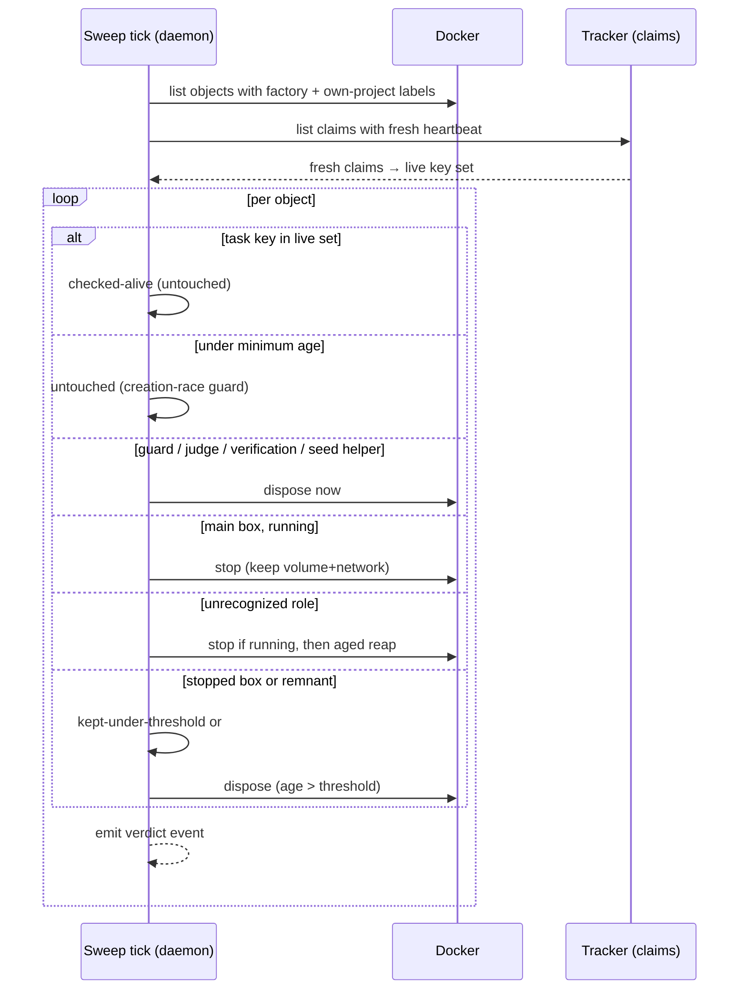
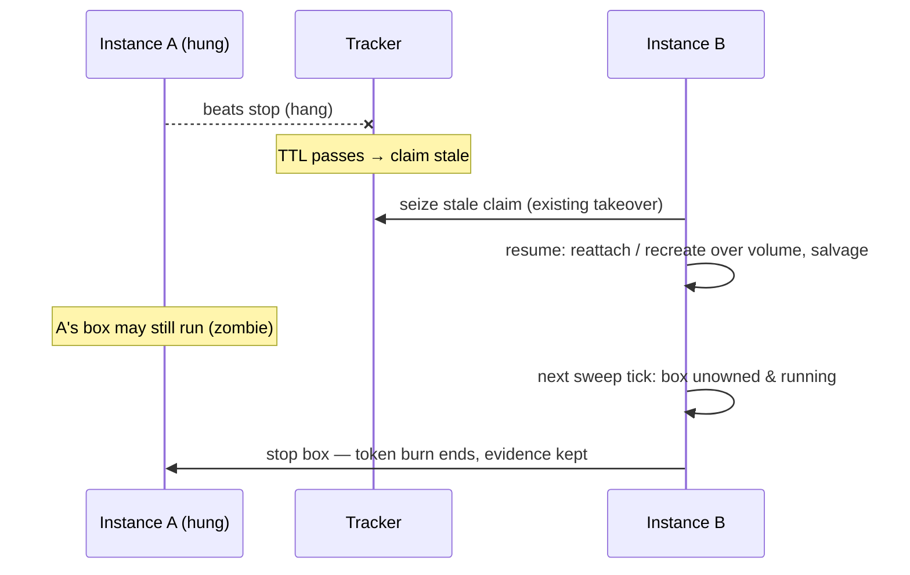

# Design — add-serve-sandbox-lifecycle

## Context

See proposal.md — Why. Current state that shapes the approach:

- The container run path is fully built for `gnomish run` (environments, lease, resume/salvage, keep semantics); `take`/`serve` still dispatch host-only. The deferred wiring points are known from `add-sandbox-core` (its 4.4/4.8/9.2/9.5 notes).
- The existing sweeper removes every factory-labelled object whose *name* is not derivable from a live-key snapshot; correctness rests on "single owner, sweep strictly before create". Objects already carry `factory` and `task=<key>` labels stamped atomically at creation.
- The claim-heartbeat capability already provides a lease per claimed task: beats with `alive-at`, staleness TTL = interval × multiplier, a standing reaper, and a takeover protocol that licenses seizing stale claims.
- The serve daemon already runs an hourly `WorktreeJanitor` (age + fresh held-set) for instance-local worktrees, and publishes snapshot vitals + a rotating JSONL ledger consumed by `gnomish dashboard`.

How orphans arise — the inventory the policy must cover (Docker objects outlive the factory process by construction, so any process death between create and dispose orphans something):

| Source | What remains | Detected by |
|---|---|---|
| Process death mid-task (kill -9, JVM OOM, host reboot) | Running box + guard + volume + network | task label → claim stale |
| Death mid-materialize / mid-dispose / mid-`--discard-work` | Partial set (e.g. volume + network, no container) | same — each object labelled independently |
| Death during judge/verification | Fresh `-j`/`-v` boxes | same label → same task |
| Hang, not death (zombie) | Running box whose task was seized by another instance | claim stale → seized; running-but-unowned |
| Kept environment nobody returns to | Stopped box + volume + network, deliberate | not an orphan: unowned **and stopped** → aged reaper |
| Manual `run` crash | Any of the above, but no claim ever existed | `mode=manual` label → age-only policy |
| Name-derivation drift across versions | Live objects that *names* no longer match | eliminated by classifying on labels, not recomputed names |

## Goals / Non-Goals

**Goals:** one shared sweep-policy component evaluated by all three entry points; liveness read from object labels + tracker claims, no ordering assumptions; every destructive step strictly cheaper-to-be-wrong than the next.

**Non-Goals:** see proposal NG1–NG5. Additionally: no changes to environment materialize/harvest/dispose mechanics; no new module — the policy lives in `sandbox/docker` beside the objects it governs, entry-point wiring in `application`/`bootstrap`.

## Decisions

### D1: Liveness oracle = claim heartbeat, not an instance registry

Chosen: a `tracked` object is alive iff its task's claim heartbeat is fresh (proposal FR3). The live key set is computed forward — list open tasks with their claim facts, sanitize live task ids into environment keys — so no reverse key→task mapping is needed. The key *set* is recomputed per evaluation, but staleness itself is judged by the existing claim-heartbeat policy with its cross-tick observation memory (`StalenessMemory`): a claim version is stale only after TTL since this observer first saw it, so a fresh process grants every claim a full-TTL grace before acting — that memory is claim-heartbeat mechanics reused as-is (NG3), not a sweep cache. On a serve daemon the sweep shares the claim reaper's `listOpen` result for the tick (NFR-C2) rather than issuing a second listing.

Alternatives rejected:
- *Instance-id label + host-local heartbeat files*: assumes every owner of the Docker namespace shares one filesystem; the Colima-VM and cloud-executor directions already break that. Also instance liveness is the wrong grain — a live instance that lost a task must not protect that task's objects.
- *Instance registry in the tracker*: a second liveness mechanism beside claim-heartbeat; two sources of truth that can disagree.

Consequences: stale claim = dead owner, deliberately identical to what the lease already decided logically — the claim reaper removes the stale claim and returns the task to the ready queue (it never claims for itself; direct seizure is the separate interactive takeover) — the sweep only physically enacts that verdict. Tracker dependency degrades per D4.

### D2: Decision matrix with one-way escalation

The matrix (spec `sandbox-lifecycle`) encodes: alive → untouched; unowned running main box → stop; unowned stopped/remnant → aged reap; unowned guard/`-j`/`-v`/seed-helper → dispose now; unrecognized role → fail-safe fallback (stop if running, aged reap); under minimum age → untouched. Escalation is one-way (running → stopped → disposed) so each step's misfire is cheaper than the previous: stopping a live box is healed by resume (and is licensed anyway once the claim is stale); reaping a kept box loses only the un-salvaged tail (fresh-materialize fallback exists). Rationale for the role split: the main box + volume are the only holders of un-harvested work; guard/judge/verification objects are reconstructible by construction (`ensureRunning`, per-attempt fresh boxes), so age protection would only accumulate garbage. The seed-clone helper joins the dispose-now group: it is an anonymous `run --rm` container (labels, no factory name) that survives only when the runtime dies mid-seed before `--rm` fires, holds no durable work (it writes into the separately-governed task volume), and a re-materialize re-runs it. The unrecognized-role fallback is deliberately conservative — a newer build's object shapes seen by an older sweeper must never be insta-disposed. Container-less remnants stay reap-governed, not insta-disposed, because a volume that outlived its container is still resume-usable (materialize recreates over a surviving volume) and mid-dispose garbage is indistinguishable from it.

Alternatives rejected: *disposing unowned running boxes directly* (loses the salvage window the takeover contract promises; stop costs nothing and preserves it); *symmetric age protection for guard/judge/verification objects* (they hold no durable work, so protection would only accumulate garbage between reap thresholds).

### D3: Mid-launch and takeover safety come from label atomicity, not ordering

`docker create --label ...` makes birth and ownership one operation: a concurrently launching slot's objects are classifiable the instant they are listable (label keys follow the existing fully-qualified scheme, `com.github.oinsio.gnomish.*`). The residual window — object listable before the claim's *first* beat is observable — is covered by the minimum-age guard (spec), not by any create-after-sweep ordering. Rejected alternatives: *sweep-strictly-before-create ordering* (the current sweeper's assumption — exactly what breaks under concurrent slots and siblings) and *a host-global creation lock* (assumes one filesystem/process space; the VM and cloud directions break it, and it serializes slot launches for nothing). The zombie case falls out of the same rule:

### D4: Fail-closed verdicts; error ≠ empty

A claims-listing error yields *no verdict*: nothing tracked is touched, the tick reports skipped-no-verdict and retries next cadence (mirror of the existing `DockerUnavailableException` no-op). An *empty successful* answer is a real verdict. The three outage geometries and their worst costs:

| Geometry | Behavior | Worst cost |
|---|---|---|
| Tracker unreachable from the sweeper | tick skipped, WARN | orphans/zombies live one more tick |
| Beats fail, a sibling still reads the tracker | objects stopped after TTL | one interrupted round; salvage recovers the volume — already the takeover contract |
| Tracker unreachable from everyone | nobody acts | as row 1, longer |

The destructive path requires a *positive* "stale" verdict, so a total outage can never delete anything.

### D5: Manual mode = age-only; project identity label

`gnomish run` must keep working with no tracker at all, so its objects are labelled `mode=manual` and policed purely by age (running: stop after `started-at` age > threshold, default 24 h; stopped/remnant: the same 7-day reaper). Acceptable because a dead manual zombie finishes its current agent turn and then only idles — bounded token cost — while a live session is protected by the threshold. Rejected: forcing run to claim (breaks its tracker-less purpose), pid liveness (same shared-filesystem assumption as D1's rejects).

Project identity: a fourth label scoping all listing — chosen derivation is a stable digest of the configured origin remote URL with an explicit config-key override (`factory.sandbox.project-id`). Without it, project A's tracker honestly answers "no claim" for project B's keys and A would stop B's live boxes.

### D6: One policy component, listener-shaped sinks

The matrix is evaluated by a single component in `sandbox/docker`, emitting one verdict event per object (category, object, role, ownership mode, task key, reason, age) through a listener seam; the mode field lets sinks separate a routine manual age-stop from a dead-instance symptom (dashboard alerts key on `tracked` stopped-orphans only). Sinks: serve → sweeper vitals + ledger lines; run/take → structured SLF4J lines with identical category/field names, plus take's finish-report summary. This kills the "serve is safe, run still snapshot-sweeps" divergence structurally (proposal FR9), and makes the policy unit-testable as an event stream. Snapshot/ledger stay daemon-only (proposal NG4): the ledger is single-writer by design and a one-shot process's snapshot is stale at exit. Known gap, accepted: a zombie stopped by a one-shot `take` is absent from the daemon ledger; the kept inventory reflects the *effect* on the next tick, authorship stays in take's log (proposal Q3).

### D7: Scheduling and the worktree janitor boundary

Serve runs the sweep+reap tick on its own virtual thread (immediate startup tick, then a fixed cadence, `WorktreeJanitor` pattern); run/take run one startup pass. The janitor keeps host worktrees only (they are instance-local; the delta spec narrows it) — container objects belong to this policy exclusively, so no object has two cleaners. Slot end calls stop-keep through the existing reaper mechanics (`stopKeeping`), completing deferred task 4.8. Rejected alternative: *extending `WorktreeJanitor` to also sweep containers* — it would fold a host-global, tracker-dependent policy into an instance-local, tracker-free cleaner and give container objects two decision paths; the two populations differ in exactly the properties that make the policies safe.

## Risks / Trade-offs

- [Stopping a live box during an asymmetric tracker partition] → licensed by lease semantics; stop-not-dispose + salvage bounds the cost to one round; TTL is the grace window.
- [Reaped kept environment loses the un-salvaged tail] → conservative 7-day default, configurable; resume always survives via fresh materialize; kept inventory + time-to-reap on the dashboard warns first.
- [Tracker rate cost of the oracle] → one claims listing per tick (NFR-C2), same order as the feed's existing polling.
- [Manual threshold mis-set: 24 h too short for a marathon session] → configurable; a stopped manual box is restartable with volume intact (reattach), so even a misfire loses nothing durable.
- [Label schema becomes a compatibility surface] → labels are versioned by presence: objects lacking the new labels (created by older builds) match no mode and are treated as `tracked` with age protection; documented in the operator guide.
- [Two cleaners racing on one object] → structurally impossible: janitor = worktrees only, sweep/reaper = Docker objects only; within Docker, actions are idempotent by name.

## Migration Plan

1. Land labels + policy component + entry-point wiring behind the same release; the sweep understands old-format objects (no mode/project label) conservatively (age-only, own-factory label required).
2. First daemon start after upgrade: startup tick classifies pre-existing objects; nothing running is disposed, so a mixed-version host degrades safely.
3. Rollback: the old snapshot sweep is removed, but labels are additive — an older build's sweep still recognizes `factory`/`task` labels; rollback only loses the new protections, it does not strand objects.

## Open Questions

- Q1 (proposal): manual running-stop default — 24 h vs longer; tune after first dogfooding, config key exists either way.
- Q3 (proposal): daemon-ledger authorship for one-shot take actions; revisit on operational demand.
