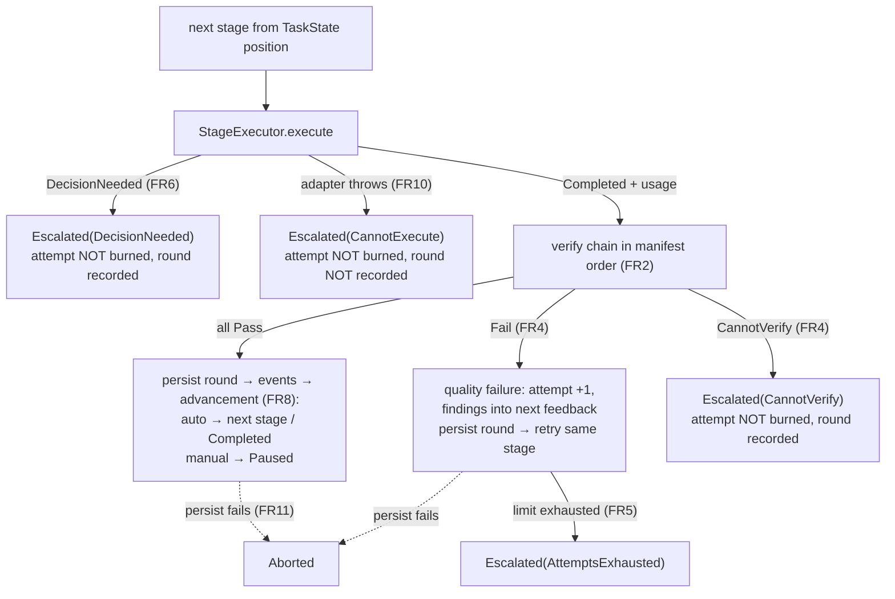
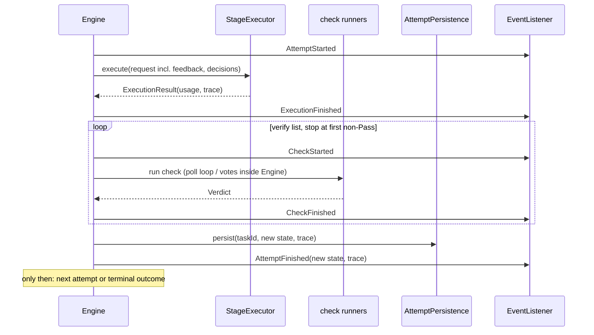

# Design: add-stage-engine

## Context

The engine turns a validated `PipelineDefinition` into executed stages. Everything real (tracker, git, AI, processes) is out of scope (NG1–NG3), so the central design problem is carving port boundaries and failure semantics that survive the arrival of real adapters. Driven by FR1–FR14 and NFR-R1–R4; decisions were settled in an explore session with the operator.

## Decisions

**D1 — Pure orchestrator; escalation as a value.** `run(definition, context, state, workspace, ports) → TaskOutcome` (FR1, FR10). The engine never calls a tracker: `Escalated`/`Paused`/`Aborted` are returned values the caller acts on. *Rationale:* shrinks scope, keeps the engine a library any wrapper (manual runner, factory loop) can reuse; port shapes emerge from the consumer side (G2). *Rejected:* engine-owned tracker interaction — would force the tracker port shape before a consumer exists.

**D2 — Five narrow execution ports, not one fat `CheckRunner`.** `StageExecutor`, `BuiltinCheckRunner`, `CommandCheckRunner`, `ExternalCheckClient` (single poll → `PollStatus`), `JudgeVoter` (single vote) (FR3). The exhaustive `switch` over sealed `VerifyCheck` lives in the engine, as does the interesting orchestration: the poll loop and majority voting. *Rationale:* future implementations live in unrelated adapters (filesystem, ProcessBuilder, SCM, ai-provider); dumb ports keep the risky semantics in unit-testable core. *Rejected:* one `CheckRunner` port — every adapter would have to dispatch types it cannot serve.

**D3 — Verdict triad with a fixed classification table.** `Pass | Fail(findings) | CannotVerify(reason, details)` (FR4). The Fail/CannotVerify boundary is a normative table (spec scenario, M4): exit≠0=Fail, binary-not-found=CannotVerify, poll timeout=Fail, unknown external check=CannotVerify, unparseable judge verdict=CannotVerify, adapter exception=CannotVerify. Check identity = verify-list index + derived label (`command:./gradlew…`); no config schema change (NG6). *Rejected:* explicit check ids in manifests — no consumer needs stable cross-attempt identity yet.

**D4 — TaskState: stage-name position, attempt-boundary resume, current-stage history.** Immutable; a new state per round (FR9, FR13, FR14). `attempts` (all executed rounds, with metrics — including `CannotVerify` rounds) diverges deliberately from `attemptsUsed` (quality failures only): cost analytics must see rounds that burned tokens but no attempt. History resets on advancement — git history of persisted states is the archive. *Rejected:* index-based position (silently wrong when `.gnomish/` changes mid-task); whole-task history (duplicates what git keeps better).

**D5 — Two-level telemetry joined by the attempt key.** Aggregate per tool name inside `AttemptRecord`; raw chronological `ToolTrace` outside `TaskState`, correlated by `(taskId, stage, attempt)` (FR13, NFR-C1). Usage fields optional — an interactive executor knows only wall time. *Rejected:* trace inside the state file (bloats the resume contract); path-based links (the domain must not know file layout).

**D6 — Human decisions are context, never commands.** `TaskContext.decisions` passes through to executor and judge verbatim (FR7). Control actions (attempt reset, position moves) are caller-side state manipulation before `run`. Gnome-initiated escalation is `ExecutionResult.DecisionNeeded` — no attempt burned (FR6). *Rejected:* parsing directives out of comment text — an unbounded control language with no grammar.

**D7 — Strict persistence port, observability listener.** `AttemptPersistence.persist` is called synchronously after every round, before the `AttemptFinished` event and any next attempt (FR11); failure → `Aborted` — the only outcome for "durability guarantee broken". All other infrastructure failures escalate (`CannotVerify`, `CannotExecute`): state is persisted, the task parks, a human fixes the environment. `EngineEventListener` failures are logged and swallowed (FR12). *Rejected:* persistence as a privileged listener (two failure semantics on one seam); `Aborted` as an exception (wrappers must handle it programmatically — a sealed variant forces exhaustive handling).

**D8 — Injected `Clock` and `Sleeper`.** Poll loops and timestamps run on injected time (NFR-R3). *Rationale:* deterministic Spock specs for interval/timeout semantics; virtual threads make the production sleeper a plain blocking sleep. *Rejected:* real time + test tolerances — flaky and slow.

**D9 — Package layout: `domain.engine`, ports in `domain.engine.port` (resolves proposal Q1).** Model records and orchestration in `domain.engine`, the seven port interfaces in `domain.engine.port`; no split `domain.task` package. The existing ArchUnit domain-purity rule extends to the new packages with an explicit note that `org.slf4j` is permitted (NFR-O1). *Rejected:* separate `domain.task` — TaskState/TaskContext have no consumer besides the engine; a second package adds boundary without benefit.

## Engine model at a glance

| Type                      | Content                                                                                                  | Governing decision |
|---------------------------|----------------------------------------------------------------------------------------------------------|--------------------|
| `TaskContext`             | taskId (opaque), title, body, `decisions[]` (chronological free text, optional stage/author/time)        | D6                 |
| `TaskState`               | position (stage name), `attemptsUsed` (burned only), `attempts[]` (all rounds, current stage only)       | D4                 |
| `AttemptRecord`           | round no, `CheckResult[]`, executor usage, judge per-vote tokens                                         | D4, D5             |
| usage fields              | wall time, per-tool aggregate (name, calls, total duration), tokens in/out — all optional                | D5                 |
| `ToolTrace`               | chronological calls (seq, tool, start, duration); outside `TaskState`; keyed by (taskId, stage, attempt) | D5                 |
| `Verdict`                 | `Pass` \| `Fail(findings, may be empty)` \| `CannotVerify(reason, details)`                              | D3                 |
| `Finding` / `CheckResult` | message + optional location/details / checkRef (index + label), verdict, duration                        | D3                 |
| `ExecutionResult`         | `Completed(usage)` \| `DecisionNeeded(question, options[], usage)`                                       | D6                 |
| `TaskOutcome`             | `Completed` \| `Paused` \| `Escalated(report)` \| `Aborted(failedAt, cause)` — each carries final state  | D1, D7             |
| `EscalationReport`        | `AttemptsExhausted` \| `DecisionNeeded` \| `CannotVerify` \| `PipelineMismatch` \| `CannotExecute`       | D1                 |
| `EngineEvent`             | 7 sealed events, each self-contained with the (taskId, stage, attempt) key                               | D7                 |

## Attempt loop

One round = execute + verify + persist, atomic for resume purposes (D4). FR references in parentheses.

## Per-round port choreography

The ordering invariant (FR11, FR12) that specs assert on recorded fake calls:

## Failure classification (normative, D3)

Verified row-by-row by a data-driven spec (proposal M4):

| Situation                                   | Class                                   |
|---------------------------------------------|-----------------------------------------|
| `command`: exit code ≠ 0                    | Fail (quality)                          |
| `command`: binary not found / cannot start  | CannotVerify                            |
| `external`: poll returns failure            | Fail (quality)                          |
| `external`: poll timeout elapsed            | Fail (quality, hardcoded default)       |
| `external`: check id unknown to the service | CannotVerify                            |
| `judge`: majority of votes negative         | Fail (quality)                          |
| `judge`: model reply unparseable as verdict | CannotVerify                            |
| `judge`: any single vote CannotVerify       | CannotVerify (whole check)              |
| any check adapter throws                    | CannotVerify (caught, stack trace kept) |

## Ports at a glance (D2, D7)

| Port                  | Contract                                         | This change    | Future real adapter           |
|-----------------------|--------------------------------------------------|----------------|-------------------------------|
| `StageExecutor`       | full request → `ExecutionResult`                 | fake           | agent-cli / api / interactive |
| `BuiltinCheckRunner`  | name + params + workspace → `Verdict`            | fake           | filesystem checks             |
| `CommandCheckRunner`  | command + workspace → `Verdict`                  | fake           | ProcessBuilder                |
| `ExternalCheckClient` | single poll: checkId → `PollStatus`              | fake           | tracker/SCM CI poller         |
| `JudgeVoter`          | single vote → `Verdict` (+ tokens)               | fake           | ai-provider                   |
| `EngineEventListener` | `onEvent`; errors swallowed + logged             | recording fake | console/log, tracker progress |
| `AttemptPersistence`  | `persist` after every round; failure → `Aborted` | in-memory      | git commit to task branch     |

## Events at a glance (D7)

| Event                            | Payload beyond the key                     | Primary consumer                 |
|----------------------------------|--------------------------------------------|----------------------------------|
| `RunStarted`                     | position, attemptsUsed                     | resume visibility in logs        |
| `AttemptStarted`                 | —                                          | live progress                    |
| `ExecutionFinished`              | usage                                      | "gnome done, verifying"          |
| `CheckStarted` / `CheckFinished` | checkRef / + verdict, duration             | live verify chain, log analytics |
| `AttemptFinished`                | new `TaskState`, `ToolTrace`, round result | status reconstruction (NFR-O2)   |
| `TaskFinished`                   | `TaskOutcome`                              | wrapper reaction                 |

## Risks / Trade-offs

- [Port shapes guessed wrong without real adapters] → change 2 (interactive + real command/builtin runners) exercises every port within days of this change; contract-style specs make reshaping cheap
- [Fakes may drift from future adapter behavior] → the Fail/CannotVerify table and port contracts are spec scenarios, not test incidentals; real adapters must pass the same port-level suites (testing rule)
- [Attempt-boundary resume re-executes work lost mid-round] → accepted: idempotency at round granularity is what makes `Aborted` and instance death safe (NFR-R4)
- [Synchronous listener/persist calls sit on the task's critical path] → documented contract; slow consumers must offload internally; persistence being on-path is intentional (the invariant *is* the ordering)
- [`attempts` list unbounded if a stage oscillates] → bounded by the resolved attempt limit plus non-burned rounds; escalation caps growth structurally

## Migration Plan

New code only; no existing classes change behavior. `PipelineDefinition` is consumed read-only. Rollback = drop the new packages.
