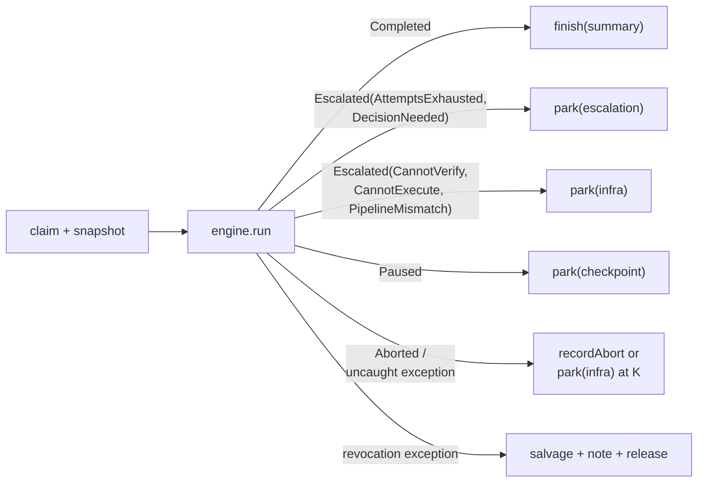

# Design: add-tracker-port

## Context

The change introduces the `Tracker` port, its in-memory reference and GitHub adapters,
and the single-task `gnomish take` CLI (proposal FR1–FR19). The explore phase settled
the model (state dictionary, lease claim, snapshot, abort protocol); this design
resolves the questions explicitly deferred to it (proposal Q1–Q9) and fixes the
technical shape: port signatures, runner architecture, config/env names, and the
claim/decision mechanics. Constraints: stage engine stays pure and unchanged
(stage-engine spec), git persistence is reused as-is (git-task-persistence spec),
no inbound HTTP, Java 25 virtual threads.

## Goals / Non-Goals

**Goals:** implementable shape for FR1–FR19 without modifying the stage-engine or
git-task-persistence contracts; every proposal open question answered or explicitly
scheduled.

**Non-Goals:** factory-loop concerns (slots, heartbeat, continuous polling), Jira
mapping, external CI checks (proposal NG1–NG3).

## Decisions

**D1 — Port shape: one `Tracker` interface plus a small value model.** (FR1, FR2)
Application-layer port in `app/port`, beside `TaskRepository`. Signatures (sketch):

```java
public interface Tracker {
  List<ReadyTask> listReady(int limit);            // adapter queue order, with abort facts
  TrackerTask fetchTask(TaskRef ref);              // snapshot + state + holder + abort facts
  List<Decision> collectDecisions(TaskRef ref);    // human replies after the last ack
  ClaimResult claim(TaskRef ref, InstanceId id);   // Acquired | Held(otherInstance)
  void release(TaskRef ref);                       // drop claim, state untouched
  void park(TaskRef ref, ParkReason reason, String report);   // -> AwaitingHuman
  void finish(TaskRef ref, String summary);        // -> Finished + final report
  void recordAbort(TaskRef ref, AbortRecord rec);  // abort marker + back to Ready
  void acknowledgeDecision(TaskRef ref, String decisionText);
  void postNote(TaskRef ref, String text);
}
```

Value model: `TaskRef` (canonical id string, opaque to core), `TaskSnapshot`
(id/title/body), `AbortFacts` (count since last progress, lastAbortAt),
`TrackerTaskState` = `Ready | Working(holder) | AwaitingHuman(reason) |
Finished | Gone(closedOrMissing)`, `ParkReason` = `ESCALATION | CHECKPOINT | INFRA`.
Report rendering happens in core; the port takes finished text plus structural
fields. *Rationale:* one consumer (core), adapters always implement all roles; one
interface keeps the contract spec and author guide single-piece. *Rejected:*
splitting into feed/coordination/correspondence ports — no independent consumers,
triples the contract-spec surface.

**D2 — Revocation is a runner-level termination, not a `TaskOutcome` variant.**
(Q1; FR15) The round boundary already has a durable hook: the engine's
`AttemptPersistence` port. The take runner wraps it in a decorator that, after each
successful persist, asks the tracker "still ours and alive" (one `fetchTask`); on
revocation it throws a dedicated control exception. The engine propagates internal
exceptions unchanged (stage-engine "Reentrant engine" requirement), so the take
runner catches its own exception around `engine.run(...)` and performs the salvage
protocol. The user-facing result of a take run is a runner-level
`TakeResult` = `Delivered | AwaitingHuman | Aborted | Revoked | Skipped(reason)`.
*Rationale:* the engine knows nothing about trackers and stays untouched; revocation
is an external event of the run, not a pipeline outcome. *Rejected:* new
`TaskOutcome` variant — modifies the frozen stage-engine contract and leaks tracker
semantics into the pure engine.

**D3 — Take runner = claim protocol + engine + outcome mapping.** (FR9, FR10, FR14,
FR18) `take` reuses the manual-run wiring (real stage-engine adapters, git
persistence) and adds a tracker shell around one engine run:



Escalation kinds split by what resume needs: `AttemptsExhausted` and
`DecisionNeeded` require a human decision → `park(ESCALATION)`; `CannotVerify`,
`CannotExecute`, and `PipelineMismatch` require a fix (environment, pipeline)
followed by a retry → `park(INFRA)`, whose resume is the one-bypass-attempt
protocol — no fictitious decision text. An infra park from an escalation does
NOT touch the abort counter — only the abort path below does. Note that
`PipelineMismatch`, unreachable in-process for manual runs, IS reachable here:
a cross-instance resume after a pipeline edit.

The abort path (infrastructure abort) covers two events: the engine `Aborted`
outcome (durable persist failed) and an uncaught exception of the take run
itself (explore Р5: "либо упал сам") — both do best-effort `recordAbort`. The
K fuse decides at abort time: `abortFacts.count + 1 >= K` → `park(INFRA)`
instead of `recordAbort`. *Rationale:* single-task semantics means no scheduler —
the whole tracker mode is a mapping from `TaskOutcome` to port calls; the
kind split keeps infra recoveries decision-free. *Rejected:* mapping all
escalations to `park(ESCALATION)` — forces the operator to invent a decision
after an environment fix; treating a runner crash as a silent process death —
leaves a hanging claim with no stale-claim protocol until the factory loop.

**D4 — No `--from-stage` on `take` in v1.** (Q2) A tracker task always starts at the
pipeline start; resume position comes from the branch state file. *Rationale:* stage
skipping is a debugging affordance for ad-hoc runs; on tracker tasks it would let an
operator silently bypass pipeline stages that the tracker audit trail claims were
run. Escape hatch exists: work the task ad-hoc via `gnomish run --from-stage`, then
deliver manually. *Rejected:* allowing it for Ready starts only — adds a validation
row for a need nobody has demonstrated; add later by pain.

**D5 — Config and env names.** (Q3; FR17, NFR-S1) Token: `GNOMISH_GITHUB_TOKEN`
environment variable, read at adapter construction, never from yaml. Factory-side
properties join the implemented `factory.*` prefix (Spring
`@ConfigurationProperties`, defaults in the factory jar, env-overridable):
`factory.instance-name` (default `gnomish-factory`; renames the existing required
`factory.instance-id` — the configured value is the name half of D6, not the full
id), `factory.tracker.abort-backoff-base` (default `2m`),
`factory.tracker.abort-backoff-cap` (default `1h`). Project-side (`.gnomish/
config.yaml`): `tracker.type`, `tracker.abort-threshold` (default 3), and the
adapter-owned `tracker.github` subsection (`api-url` mandatory, `repo`,
`labels.{ready,working,needs-human,delivered}` as `{name, color}`). *Rationale:*
placement rule from explore — shared-across-instances in `.gnomish/`, instance
identity/tempo in factory config, secrets only in env; one property prefix, and a
neutral name default because the instance name lands in public issue comments.
*Rejected:* a new `gnomish.*` prefix (D5 as first drafted) — two prefixes or a
rename of working code for taste; hostname as the name default — leaks the
machine name into public issues (the same concern D6 records);
`~/.gnomish/application.yaml` operator file — deferred to the factory loop
(decision recorded there; env layering suffices for v1).

**D6 — instanceId = `<instance-name>-<random per-process suffix>`.** (FR9, UX2)
The name half comes from `factory.instance-name` (D5; default `gnomish-factory`) and is
diagnostic ("whose machine") once the operator sets it; the suffix half — 6 chars
base36 generated at startup — makes copied configs and reused pids safe.
Atomicity does not depend on it (comment id decides races). *Rejected:* hostname+pid (pid reuse,
containers all pid 1, hostname leak into public issues), pure random (no
diagnostics), pure configured name (config copy-paste makes two instances treat each
other's claim as their own).

**D7 — `api-url` default detection = compare normalized URL to
`https://api.github.com`.** (Q5; FR16) Normalization: trim whitespace, lowercase
scheme and host, drop a single trailing slash. Anything else (port, path, different
host) is non-default and puts the host into canonical ids
(`github:ghe.example.com/owner/repo#42`). *Rationale:* the check exists only to keep
the massive github.com case clean of a host prefix; heavier URL canonicalization
buys nothing. *Rejected:* treating any URL containing `api.github.com` as default —
`https://api.github.com:8443` via a proxy is a different endpoint.

**D8 — Foreign-repo check tolerates GitHub renames via redirect verification.**
(Q6; FR9) When a canonical id's `owner/repo` differs from the configured binding,
the adapter resolves the id's repo with one `GET /repos/{owner}/{repo}` and follows
GitHub's rename redirect: if the redirect target equals the configured repo, proceed
with a WARN (id was minted before a rename); otherwise refuse with an error naming
both repos. *Rejected:* blind textual refusal — breaks every task claimed before a
legitimate owner/repo rename; node_id surrogate keys — unreadable branches, GraphQL
round-trip, no analogue in other trackers (documented in the author guide as
considered).

**D9 — Structural marker format: hidden HTML comment carrying one-line JSON,
followed by human-readable text.** (Q7; FR7, NFR-O1) GitHub adapter comment shape:

```
<!-- gnomish {"kind":"claim","instance":"gnomish-factory-x7k2q1","at":"2026-07-20T12:00:00Z","v":1} -->
🤖 gnomish: claimed by gnomish-factory-x7k2q1
```

HTML comments render invisibly on GitHub, so humans see prose while machines parse
the first line. The author guide recommends this shape (marker kind vocabulary:
`claim`, `abort`, `ack`, `note`, `report`) but the contract spec mandates only
round-trip. *Rationale:* one recommended shape keeps the guide concrete and future
adapters mutually readable without freezing a cross-adapter wire format.
*Rejected:* mandating the format in the contract spec — Jira/Redmine comment
renderers differ (HTML comments may be visible or stripped); adapters need freedom.

**D10 — Abort backoff: exponential, computed by core from adapter facts.** (Q8;
FR10, NFR-C1) `delay = base × 2^(count−1)`, capped (`abort-backoff-base`/`-cap`,
D5). A `Ready` task is invisible to the bare-`take` feed while
`now − lastAbortAt < delay`. The counter is "aborts since last durable progress" —
reset by the first persisted round after claim, reconstructed from comments by any
instance. Explicit `take <ref>` ignores backoff (mandate). *Rejected:* fixed delay —
does not distinguish a transient hiccup from a persistently broken environment;
adapter-side filtering — adapters report facts, core applies policy (contract-spec
property).

**D11 — Final report is rendered from the `StatusReport` model.** (Q9; FR18)
`finish(summary)` receives text rendered by core from the existing `StatusReport`
(stages with attempt counts and results, cumulative per-model usage and totals,
task branch name, wall time) plus a link line for the branch. No new aggregation
model. *Rationale:* status-report spec already defines the single source of truth
for progress data; the final report is its terminal render. *Rejected:* a bespoke
report builder — second source of truth, drift risk.

**D12 — No in-run decision wait: an escalation parks the task and exits.** (FR13)
The take run has one return path for every escalation, TTY or not: park, report,
exit. Resume is always tracker-driven — the human replies (when a question is
pending) and moves the task back to ready; the factory claims only ready tasks
and collects the reply at resume claim. A `DecisionNeeded` resume without a
pending reply parks again restating the question; every other recorded outcome
treats the human return itself as the confirmation (matching manual-run's
empty-decision retry). This removes the need for a decision-poll-interval
property. *Rationale:* the human-only exit from `AwaitingHuman` keeps one
visible convention on the board and one code path in the runner. *Rejected:* a
console/tracker decision race (two virtual threads, first answer wins) —
complexity plus an uninterruptible console read for a flow the tracker already
covers; holding the claim while a console dialog waits — hides the escalation
from the board, which must show that the ball is with humans.

**D13 — Lease-claim sequence and edge cases.** (FR6, NFR-R1) Sequence: (1) point-add
`working` label / remove `ready`; (2) post-structural claim comment; (3) list claim
comments since the last boundary marker (release/park/abort/finish — whichever is
newest); (4) earliest comment id wins (GitHub's server-side total order). Loser:
delete own claim comment, leave labels as they stand (the winner owns them), report
`Held(winner)`. Post-succeeded-but-verify-fails: infra retry of the read
(Resilience4j); if the read stays down, best-effort delete of own marker and the
claim attempt fails as infrastructure. A stale claim comment from a dead instance
is out of scope (heartbeat/stale-claim lands with the factory loop); the operator
escape hatch is a manual label flip, documented in the operator guide.

**D14 — Instructions live in `docs/`.** (Q4; FR19) `docs/operator-guide.md`,
`docs/adapter-author-guide.md`, reference bridge workflow at
`docs/examples/board-bridge.yml` (a cron GitHub Action mapping "board column X →
ready label" with `gh` CLI). *Rationale:* the guides document the factory product,
not a specific change or a target project's `.gnomish/`; `docs/` is where ADRs
already live. *Rejected:* shipping inside a `.gnomish/` template — the template
does not exist yet as an artifact; revisit when one appears.

**D15 — Package layout.** (FR1, FR5, FR9) Port and value model in
`app/port/tracker`; adapters in `adapter/tracker/inmemory` and
`adapter/tracker/github` (GitHub adapter split by concern to respect the 200-line
cap: api client, label ops, claim lease, markers, feed, config validation); CLI
command in the existing CLI package as `TakeCommand` beside the run command;
contract spec suite as an abstract Spock base class extended per adapter
(testing.md contract-test rule).

**D16 — take exit codes extend the manual-run families.** (FR9, FR10, FR15)
Codes shared with `run` keep their meaning: 0 success (Delivered; a bare-take
empty queue is a clean no-op — the normal steady state of a cron factory, U4),
1 failure outside a claimed run (tracker unreachable at startup, label
provisioning), 2 usage error, 3 pipeline load failure, 10 parked-escalation,
11 parked-checkpoint, 12 infrastructure abort below the fuse. New codes:
13 parked-infra (fuse trip or infra escalation), 14 revoked, 15 refused/skipped
(held by another instance, already done, closed/missing, foreign repo). An
uncaught exception runs the abort protocol (D3) and exits 12 or 13, never a
bare 1. *Rationale:* cron/wrapper scripts react per outcome family without
parsing output; existing `run` scripting keeps its meaning of 0/2/3/10/11/12.
*Rejected:* one coarse code for every `AwaitingHuman` — forces output parsing
to tell "needs an answer" from "fix the environment"; a distinct empty-queue
code — an empty queue is not a signal worth a branch in every cron wrapper.

**D17 — Tracker credential scrubbing at the launcher, driven by adapter
declaration.** (NFR-S1) Each tracker adapter declares the names of its
credential environment variables (GitHub: `GNOMISH_GITHUB_TOKEN`) on its
registration seam — the same adapter-owned object that declares and validates
the config subsection, keeping the `Tracker` runtime port at its exact ten
operations (FR1). The wiring hands the active adapter's list to the agent
process launcher, which removes those variables from the child environment at
the documented isolation seam — regardless of the
`factory.agent-cli-env-passthrough` setting. A MODIFIED delta records this on
the agent-executor spec (the launcher is its component), and the author guide
makes the declaration mandatory for new adapters. *Rationale:* explicit and
extensible — a future Jira/Redmine adapter declares its own names without
touching executor code. *Rejected:* hardcoding `GNOMISH_GITHUB_TOKEN` in the
launcher — every new adapter edits executor code; a `GNOMISH_*_TOKEN` name
pattern — an implicit convention a third-party adapter can silently miss.

## Risks / Trade-offs

- [Revocation latency equals one round; a long agent round keeps burning tokens
  after a human closes the issue] → accepted for v1 (explore Р6); mid-round cancel
  needs an executor cancel seam, scheduled for when long rounds hurt.
- [Human edits labels concurrently with the adapter] → point add/remove label calls
  only (never whole-set PATCH), so concurrent edits are not lost; contract tests
  cover the observable outcome.
- [Comment history grows; abort facts and ack scanning page through comments] →
  `since` parameter + last-boundary anchoring keep reads to one page in practice;
  ETag/304 makes steady-state polling free (NFR-P1).
- [K fuse counts from comments — a human deleting factory comments resets history]
  → documented in the operator guide; comments are the agreed source of
  coordination truth (stateless instances have nowhere else).
- [WireMock cannot prove GitHub's real comment-id ordering] → contract race test
  runs on the in-memory reference (which simulates interleavings) plus a
  WireMock-scripted interleaving for the GitHub adapter; real-GitHub behavior rests
  on the documented server-side id order (explore Р13 API research).

## Migration Plan

Purely additive: no existing spec behavior changes except the `pipeline-config`
tracker section, which is optional — absent section means `take` is unavailable and
`run` behaves exactly as before. No data migration; first startup against an
existing repo provisions labels idempotently.

## Open Questions

None — Q1–Q9 from the proposal are resolved above (Q1→D2, Q2→D4, Q3→D5, Q4→D14,
Q5→D7, Q6→D8, Q7→D9, Q8→D10, Q9→D11). The `~/.gnomish/application.yaml` operator
file is explicitly deferred to the factory-loop change (D5).
