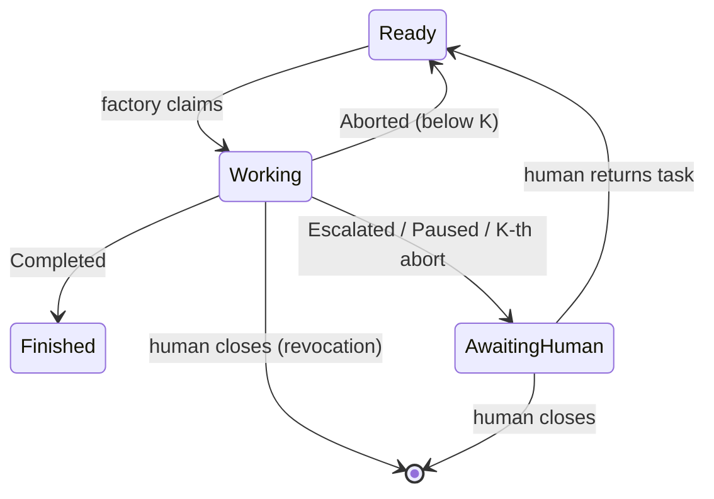

# tracker-port

## Purpose

The `Tracker` port: the factory's abstraction over any task tracker — operations,
the logical task-state dictionary and transition matrix, snapshot/decision/abort
semantics, the in-memory reference adapter, the port contract spec every adapter
must pass, and the adapter author guide.

## ADDED Requirements

### Requirement: Single Tracker port speaking the factory's language
The application layer SHALL expose one `Tracker` port with exactly the v1
operations `listReady`, `fetchTask`, `collectDecisions`, `claim`, `release`,
`park`, `finish`, `recordAbort`, `acknowledgeDecision`, `postNote`. The port
vocabulary SHALL be the factory's (tasks, states, decisions, abort facts); all
tracker-specific mapping SHALL be confined to adapters. Report rendering (domain
report → text) SHALL happen in core: the port accepts finished text plus
structural fields, never engine domain models.
<!-- implements FR1 of add-tracker-port -->

#### Scenario: Core compiles against the port alone
- **WHEN** the take runner drives a full task lifecycle
- **THEN** every tracker interaction goes through the `Tracker` port, and no core
  class references an adapter type or a tracker-specific concept (label, issue,
  transition id)

#### Scenario: Adapter receives rendered text
- **WHEN** the factory parks a task with an escalation report
- **THEN** the adapter receives the report as finished text plus structural fields,
  not an engine report object

### Requirement: Logical task-state dictionary and transition matrix
Task coordination SHALL follow the state dictionary `Ready`, `Working(holder)`,
`AwaitingHuman(escalation | checkpoint | infra)`, `Finished`, with tasks failing
the readiness criterion or closed being outside the factory's world (`Gone`).
Transitions SHALL be initiated only by the factory or a human — never by the
gnome. The scheduler-slot state of an instance SHALL never be written to the
tracker. The engine outcome (`Completed`/`Paused`/`Escalated`/`Aborted`) is the
event driving factory-initiated transitions; `Paused` SHALL appear in the tracker
as `AwaitingHuman(checkpoint)`, not as a distinct state.
<!-- implements FR2 of add-tracker-port -->

#### Scenario: Outcome-to-transition mapping
- **WHEN** an engine run ends with each of Completed, Escalated(report),
  Paused(passedStage), and Aborted
- **THEN** the resulting port calls are `finish`, `park(ESCALATION)`,
  `park(CHECKPOINT)`, and `recordAbort` (or `park(INFRA)` at the fuse threshold)
  respectively

#### Scenario: Gnome never transitions
- **WHEN** a gnome round runs to completion
- **THEN** no tracker operation was reachable from the gnome process — every
  transition originated in factory core

### Requirement: Task facts from fetchTask
`fetchTask` SHALL return the task snapshot (id, title, body), the logical state
with its holder (for `Working`) or reason (for `AwaitingHuman`), and the abort
facts (count since last durable progress, last abort time). Closed or nonexistent
tasks SHALL be reported as `Gone`, not as errors.
<!-- implements FR1 of add-tracker-port -->

#### Scenario: Full fact set for a working task
- **WHEN** `fetchTask` is called for a task claimed by instance A with two
  recorded aborts
- **THEN** the result carries the snapshot, `Working(A)`, and abort facts
  (count 2 with the last abort time)

#### Scenario: Closed task is Gone
- **WHEN** `fetchTask` is called for a closed or nonexistent task
- **THEN** the result state is `Gone` and no exception is thrown

### Requirement: Decision collection anchored to the last ack
`collectDecisions` SHALL return human reply comments posted after the factory's
last decision ack, in posting order. `acknowledgeDecision` SHALL post an
"acting on decision" marker such that a subsequent `collectDecisions` is empty
until a new human reply arrives. Pairing heuristics (which comments count as
replies) are adapter freedom under this round-trip law.
<!-- implements FR12 of add-tracker-port -->

#### Scenario: Ack consumes decisions
- **WHEN** a human posts a decision, the factory calls `acknowledgeDecision`, and
  `collectDecisions` is called again
- **THEN** the second collection is empty

#### Scenario: Stale replies never resurface
- **WHEN** a new escalation is parked after an earlier decision was acknowledged
- **THEN** `collectDecisions` returns only replies posted after the last ack,
  never the previously consumed decision

### Requirement: Abort facts round-trip across instances
`recordAbort` SHALL, as one operation, persist a structural abort marker (cause,
instance, time) and return the task to `Ready`. Abort facts SHALL be
reconstructable by any instance from the tracker alone: after `recordAbort`, a
`fetchTask` or `listReady` from a different instance SHALL observe the updated
count and last-abort time. The count semantics is "aborts since last durable
progress"; adapters report facts and SHALL NOT apply backoff or fuse policy.
<!-- implements FR14 of add-tracker-port -->

#### Scenario: Fresh instance sees abort history
- **WHEN** instance A records an abort and instance B calls `fetchTask`
- **THEN** B observes abort count incremented and the last abort time from A's
  marker

### Requirement: In-memory reference adapter
An in-memory adapter SHALL implement the full port as the executable reference for
adapter authors, including: configurable ready queues, human actions (reply,
return to ready, close) as test operations, and deterministic simulation of
concurrent claim interleaving for the race contract test. It SHALL require no
configuration subsection (the minimal case of the config seam).
<!-- implements FR3 of add-tracker-port -->

#### Scenario: Reference passes the contract suite
- **WHEN** the shared contract spec suite runs against the in-memory adapter
- **THEN** every contract property passes without adapter-specific exemptions

#### Scenario: Race simulation
- **WHEN** the test harness schedules two claims with an adversarial interleaving
- **THEN** exactly one claim returns Acquired and the other names the winner

### Requirement: Port contract spec suite binds every adapter
A single contract spec suite (abstract Spock base class instantiated per adapter)
SHALL verify at minimum: `listReady` returns only ready tasks (never
`Working`/`AwaitingHuman`/`Finished`/`Gone`, never non-task artifacts, no
readiness-criterion failures) in adapter queue order with abort facts, and does
NOT filter by backoff; observable claim atomicity (two concurrent claims → exactly
one `Acquired`); and structural-marker round-trip (abort facts and ack semantics
as specified above). Every shipped adapter SHALL pass the identical suite.
<!-- implements FR4 of add-tracker-port -->
<!-- implements NFR-R1 of add-tracker-port -->

#### Scenario: Feed filtering property
- **WHEN** the tracker holds tasks in every logical state plus a non-task artifact
- **THEN** `listReady` returns only the `Ready` tasks, including one with
  unexpired backoff (backoff filtering is core policy, not the adapter's)

#### Scenario: Claim atomicity property
- **WHEN** the contract race test runs repeatedly for an adapter
- **THEN** every run yields exactly one winner — no run yields zero or two

### Requirement: Adapter author guide
The change SHALL ship an adapter author guide (`docs/adapter-author-guide.md`)
covering: the state dictionary and transition matrix with the three-level
distinction (tracker state / run outcome / scheduler slot); per-operation port
semantics; the contract suite as law with the in-memory adapter as the worked
reference; physical state mapping by example (GitHub labels as-built, Redmine
statuses as a thought-through sketch); snapshot, decision, and abort-fact
obligations; config-subsection ownership (adapter declares and validates its own
subsection, never touches core keys); and known limitations (branch-name sanitize
collisions, polling economy with the GitHub analysis as the model, the considered
and rejected surrogate-id approach).
<!-- implements FR19 of add-tracker-port -->

#### Scenario: Guide is self-sufficient
- **WHEN** a developer follows the guide to build a new adapter
- **THEN** every obligation the contract suite checks is stated in the guide,
  without reading factory core code
