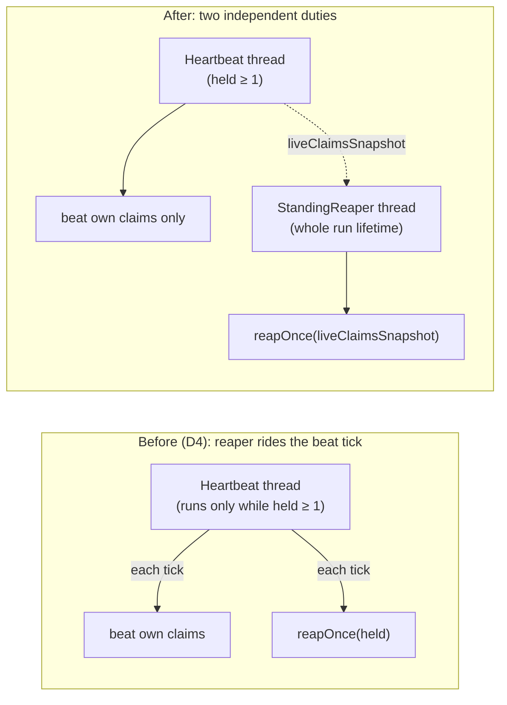

## Context

Driven by FR1–FR5 and NFR-R1/R2 of `fix-reaper-idle-liveness`.

`claim-heartbeat`'s design D4 made the reaper a passenger of the beat thread:
`InstanceHeartbeat.tick()` beats every held claim and then calls
`reaper.reapOnce(heldSnapshot)`. The beat thread auto-starts on the first
`register()` and self-stops after any tick whose held set is empty. That was
economical for a single-shot `take` — it always holds its one claim — but wrong
for the `serve` daemon: an instance holding zero claims runs no beat thread, so
the reaper never ticks. A restart lands exactly there, and the WIP limit plus
the absence of returned tasks make it a permanent idle (see proposal Why).

The reaper machinery (`Reaper`, `StalenessMemory`, `ReaperDuty`) and the beat
thread live in `app.lease`; both `take` and `serve` assemble them through
`TakeHeartbeat.forRun`. `serve` additionally runs standing threads already —
`WorktreeJanitor` is the precedent for a daemon-lifetime virtual thread.

## Goals / Non-Goals

**Goals:**
- Reaping runs for the whole run's lifetime, independent of held claims (FR1).
- One reaper wiring for `take` and `serve`; heartbeat never reaps (FR5, G2).
- The reaper thread cannot be permanently killed by one abnormal fault (FR3/FR4).

**Non-Goals:**
- No change to beat physics, staleness math, TTL, takeover, or fencing (NG1).
- No distributed/cross-instance reaping beyond the existing convergent removal.

## Decisions

### D1 — Reaper is a standing duty for the run's lifetime, not a beat passenger
A new `StandingReaper` in `app.lease` owns its own virtual thread and calls
`reaper.reapOnce(...)` every interval, from run start to run stop, whatever the
held count (FR1). This **supersedes `claim-heartbeat` D4**. `InstanceHeartbeat`
loses its `ReaperDuty` field and the `reapOnce` call in `tick()`, becoming a
pure "beat my own claims" thread; `ReaperDuty` now belongs to `StandingReaper`.

*Alternatives:* (a) keep the reaper on the beat thread but keep that thread
alive with zero claims in `serve` only — rejected: revives per-mode divergence,
muddies the heartbeat's clean self-stopping lifecycle. (b) drive reaping from
the `FeedAutomaton` cycle — rejected: `Full` deliberately blocks before polling
(FR5 of `add-factory-serve`), so it cannot reap while saturated, the very case
that must work.

### D2 — Unified wiring; run scope is the only difference
`TakeHeartbeat.forRun` builds `HeartbeatProgress` + `ClaimLossFlag` +
`StalenessMemory`/`Reaper` + a beat-only `InstanceHeartbeat` + a
`StandingReaper(reaper, sleeper, interval, heartbeat::liveClaimsSnapshot)`, and
returns the standing reaper alongside the existing views (FR5). The reaper
ticks on the beat interval; interval and TTL come from the factory's clone of
`.gnomish/config.yaml` as before (NFR-S1). `TakeCommand`
starts it at the run start and `stop()`s it in a `finally`; `ServeCommand`
starts it beside `WorktreeJanitor` and `ServeShutdown` `stop()`s it. Same class,
same contract; `take`'s scope is one invocation, `serve`'s is the daemon.

*Alternative:* leave `take` on the old path — rejected by the user: divergent
per-mode behavior is the defect class we are removing.

### D3 — Own-claim exclusion reads a beat-liveness snapshot
`StandingReaper` gets its "own live claims" from
`InstanceHeartbeat.liveClaimsSnapshot()` = `running ? copyOf(held) : emptySet()`
(FR2). While the heartbeat beats, its claims are excluded (belt-and-suspenders;
they are not stale anyway). If the heartbeat dies abnormally
(`onWorkerDeath` sets `running=false`), the snapshot goes empty, so the reaper
stops shielding the now-unbeaten claims and returns them after TTL — a slot
still working one then hits the existing claim-loss / fence path (D3 of
`claim-heartbeat`). The same instance's feed, however, never re-claims a
self-reaped task while the old slot still runs it — see D6. `held` semantics
and `unregister` are untouched.

*Alternative:* clear `held` in `onWorkerDeath` — rejected: mutates the beat
lifecycle's state for a reader's benefit; the running-gated snapshot is local
and reversible when a new claim restarts the heartbeat.

### D4 — Un-killable loop plus supervision
`StandingReaper.loop()` wraps **both** the reap tick and the interval wait in
`catch (Throwable)` (WARN + continue), so an `Error` from an adapter or a
throwing sleeper never ends the loop (FR3) — unlike today's `catch
(RuntimeException)` with `sleeper.sleep` outside the guard. Only an intentional
stop (a `volatile stopping` flag + interrupt) breaks the loop. As a second
rung, the thread carries an `uncaughtExceptionHandler` that respawns it unless
`stopping` is set (FR4), on the backoff policy of D5. `stop()` sets `stopping`
and interrupts, so shutdown never races a respawn.

*Alternative:* supervision only, no in-loop `Throwable` catch — rejected:
respawn churn on every transient adapter `Error`; the in-loop catch keeps the
common case cheap and makes respawn a true backstop.

### D5 — Supervised-restart policy: exponential backoff, unbounded, loud
When the supervisor respawns (D4/FR4), it waits an exponential backoff capped at
**10 minutes** (start at the beat interval, double each consecutive failure,
clamp at 10 min; a respawned reaper that completes one full tick without dying
resets the backoff — that is the "clean run"). Restarts are **unbounded** — the
reaper never gives up, because a silently-off reaper is exactly the deadlock this
change removes. Instead of quitting, each restart is made **loud**: an ERROR log
per respawn whose line carries a monotonically increasing restart count — logs
are the factory's only observability surface, there is no metrics endpoint —
so a persistent fault is visible (NFR-O1). The daemon is **never** killed on
reaper failure — a reaper problem must not take down running slots.

*Alternatives:* (a) bounded restarts then fail-fast the daemon — rejected: a
reaper fault killing healthy slots is a worse outcome than a degraded-but-loud
reaper. (b) fixed small delay — rejected: a permanently-failing cause would
busy-loop restart/log; the cap-10-min backoff bounds the churn while keeping
recovery bounded too.

### D6 — The feed skips its own occupied refs; no claim-epoch fence
A self-reaped task (heartbeat dead, own standing reaper returned it after TTL —
the D3 path) can reappear as `Ready` while the old slot still runs it. The
entire zombie fence rests on one question — "is this task `Working` under MY
`InstanceId`?" — which cannot tell the old slot from a new same-instance claim,
and `SlotLedger.assign` would throw on the already-occupied ref, killing the
feed thread. So the feed prevents the situation instead of fencing it:
`FeedCycle.attemptClaim` skips any claim candidate whose ref is still in
`SlotLedger.occupiedRefs()`, logging the skip at WARN (it is a symptom of an
abnormal heartbeat death, and logs are the only exposure surface). The old slot
is neutralized by the ordinary round-boundary revocation check — its task is no
longer `Working` under this instance — and its `release` frees the ref, after
which this instance may claim the task again as an ordinary fresh claim. A
foreign instance may claim it at any time; that is the ordinary foreign
re-claim the fence already arbitrates. The cost: in a single-instance run the
task waits in `Ready` until the zombie slot's next round boundary — bounded by
one round, and strictly better than either pre-change permanent `Working` or a
crashed feed. `assign`'s throw stays as the last-resort invariant guard.

*Alternatives:* (a) a claim epoch/token distinguishing claim incarnations, so a
same-instance re-claim trips the fence exactly like a foreign one — rejected:
reworks the claim-marker protocol across the tracker port and every adapter to
legalize two slots of one process racing on one task branch, a situation with
no operational value that skipping avoids outright. (b) catch the
`IllegalStateException` from `assign` and release the tracker claim — rejected:
claims-then-unclaims churns tracker state on every poll cycle and demotes the
ledger's invariant guard to control flow.

## Risks / Trade-offs

- [A supervised respawn could loop tightly on a permanent fault] → bounded
  backoff and ERROR logging per restart (NFR-O1); D5 fixes the exact policy.
- [Reaper on its own cadence, no longer lock-stepped with beats] → correctness
  rests only on TTL between observations; a slightly stale liveClaimsSnapshot
  can at worst *fail to exclude* a just-registered own claim, which is fresh and
  so not stale — never a false reap (aligns with `claim-heartbeat` FR2/FR9).
- [`take` gains a second short-lived thread] → negligible (virtual thread);
  buys one mechanism and kills per-mode divergence (G2).
- [`factory-serve` FR13/FR12 phrasing referenced "the reaper duty on that
  thread"] → this change's `factory-serve` delta retargets both requirements to
  the standing reaper, so the spec and code stay in step.
- [A self-reaped task waits in `Ready` until its zombie slot's next round
  boundary in a single-instance run (D6)] → bounded by one round; other tasks
  and foreign instances are never blocked, and the skip is WARN-logged.

## Migration Plan

Pure in-process behavior change, no data/state/schema migration. Land code +
specs + repointed tests together. Rollback = revert the change; the reaper
returns to the beat-tick coupling. No operator action, no config change.

## Open Questions

- None outstanding.
