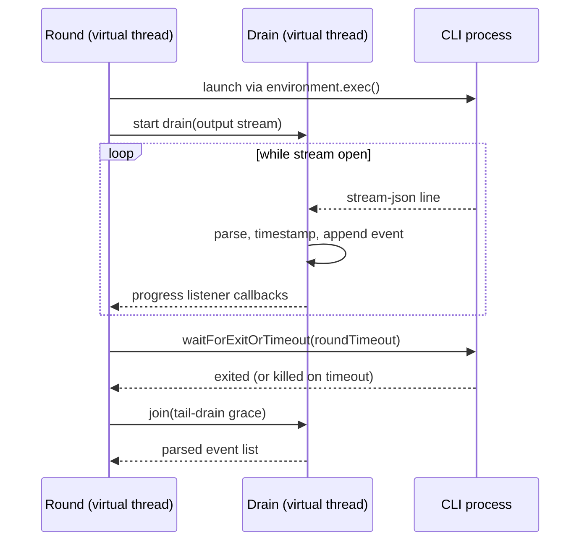

# Design: fix-round-stdout-drain

## Context

See proposal.md — Why. Both round executions read stdout only after `waitForExitOrTimeout`, violating the `java.lang.Process` contract ("failure to promptly read the output stream … may cause the process to block, or even deadlock") and losing any stream tail beyond the ~64 KB OS pipe buffer when a Node-based CLI exits via `process.exit()` (pending async stdout writes are discarded — nodejs/node#6456). The industry-standard remedy is the stream-gobbler pattern (concurrent pumping threads started before the wait, joined after exit — the shape Apache Commons Exec's `PumpStreamHandler` codifies). Constraints: Java 25 virtual threads are free; the `ExecHandle` port must not change (NG2); events must keep being parsed on the fly with bounded memory (NG4); listener emission order and swallowing semantics are spec'd (agent-executor "Live progress listener SPI").

## Goals / Non-Goals

**Goals:**
- One shared drain component used by both executions (FR6), preserving each execution's failure classification exactly (NFR-R2).
- Deterministic thread lifecycle: no drain thread or open stream survives the round by any exit path (NFR-R1).

**Non-Goals:**
- No streaming redesign of `StreamJsonParser`'s event model or of result extraction (proposal NG1).
- No sandbox/port changes (NG2); no child-side workaround (NG3).

## Decisions

**D1 — Drain on a dedicated virtual thread started at launch, not async I/O.** A `StreamDrain` component wraps `launched.output()` in the same `BufferedReader`/`StreamJsonParser` pipeline used today, but runs it on a virtual thread started immediately after `exec()`; parsed `TimestampedEvent`s are appended to a thread-safe list the round thread collects after the join. *Rationale:* it is the canonical gobbler fix (FR1), reuses the existing single-pass parser unchanged (NFR-P1, NG4), and virtual threads make the extra thread free on Java 25. *Alternative rejected:* NIO/reactive async reading — needless machinery for one pipe; `ProcessBuilder.redirectOutput(File)` then read — trades the pipe ceiling for unbounded disk writes, loses live progress (UX1), and would require an `ExecHandle` port change (NG2).

**D2 — The round waits for process exit first, then joins the drain within a configurable tail grace (installation property, default 5 s).** `waitForExitOrTimeout(roundTimeout)` keeps sole ownership of the round budget and the kill; afterwards the round joins the drain thread for at most the tail grace to absorb the already-piped tail (resolves proposal Q1, FR7). The grace is `factory.agent-cli-tail-drain-grace`, a Spring `Duration` on `FactoryProperties` next to `agent-cli-binary` — installation-level because it characterizes the host (its load, its pipe behavior), not the repo's pipeline; a non-positive or malformed value fails startup before any dialog, matching the existing settings-validation stance. The default of 5 s needs no tuning in practice: after exit (or a `destroyForcibly` kill, which closes the pipe) the remaining bytes are already in the pipe buffer and draining them is bounded by memory bandwidth. A join that expires interrupts the drain, closes the stream, and throws the round's infrastructure failure (FR2). The property is documented in the installation-properties table of `docs/guides/operator-guide-run.md` (UX3). *Alternative rejected:* a manifest `settings` key — the grace is a property of the machine, not of the portable pipeline definition, and the manifest surface is deliberately closed to exactly four keys; folding the join into `roundTimeout` — conflates "agent too slow" with "adapter too slow", muddying the timeout's meaning (spec: "Round timeout and control-file preflight"); a fixed constant — costs an operator on a pathologically loaded host a code change instead of a config line.

**D3 — Kill-induced stream close is a normal drain ending, not an error.** The drain treats `IOException`/EOF after the process was killed as end-of-stream: it finishes, returning the events parsed so far. The round thread then classifies exactly as today — `TimedOut` → `RoundTimeoutException` / `CannotVerify` before events are even consulted (FR3). *Rationale:* the repro showed `destroyForcibly` closes the stream mid-read ("Stream closed"); surfacing that as `UncheckedIOException` would mask the real cause (timeout) with a secondary symptom. A drain `IOException` while the process is still alive remains a real infrastructure failure and propagates.

**D4 — Listener callbacks move to the drain thread; shipped listeners are made trivially thread-confined.** `StreamJsonParser` keeps invoking the composite listener synchronously per line (spec'd order preserved), now from the drain thread while the round runs (FR4). One drain thread per round means callbacks stay single-threaded per round; the two shipped listeners (SLF4J renderer, status enricher) are reviewed for cross-thread visibility — MDC keys, which are thread-local, are applied inside the drain thread from values captured at round start. *Rationale:* keeps the "synchronously, exceptions swallowed" contract intact while making progress live (UX1). *Alternative rejected:* handing events back to the round thread through a queue for emission — reintroduces post-hoc delivery for a thread-safety problem that one-writer confinement already solves.

**D5 — Truncation diagnostics live in the drain's byte accounting.** The drain counts raw bytes read (a `CountingInputStream`-style wrapper under the reader); `MissingResultEventException` gains the bytes-read and event-count figures, and when bytes-read falls within one buffered line of a 64 KiB multiple, the message appends a probable-truncation hint (FR5, UX2). *Rationale:* after D1 truncation should be impossible, so the hint is a tripwire for regressions and exotic environments, not a control path; counting at the stream layer costs nothing (NFR-P1). *Alternative rejected:* detecting truncation by trailing partial JSON line — a stream can be cut exactly at a line boundary (the repro read 65 528 bytes, ending mid-line only by luck), so byte-volume proximity is the more honest heuristic.

## Risks / Trade-offs

- [Drain thread leaks if the round thread dies between `exec()` and its `try` block] → start the drain inside the same `try` that owns the handle; the `catch-all` path interrupts and joins the drain before rethrowing (NFR-R1, covered by a spec).
- [Listeners now run concurrently with the round thread's own work] → per-round confinement to one drain thread plus a review of both shipped listeners; the listener SPI spec now states the threading expectation for third parties.
- [Default tail grace (5 s) too small on a pathologically loaded host] → the failure is loud (infrastructure, bytes-read reported), never a silent partial parse, and the operator raises `factory.agent-cli-tail-drain-grace` without a code change.
- [PIT: thread-join and interrupt windows are timing races] → keep the racy fragments minimal and isolated (same `@DoNotMutate`-with-rationale discipline as `HostExecHandle.waitForAtMost`), with both outcomes covered by specs.
