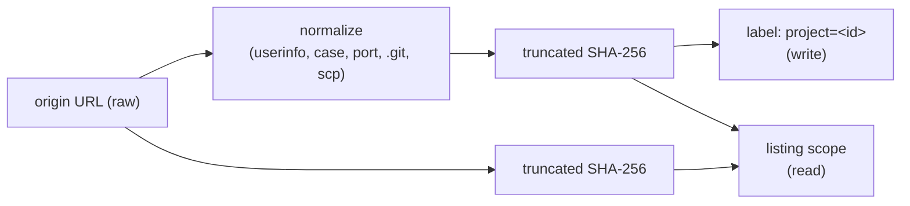

# Design: normalize-project-identity-url

## Context

Driven by FR1–FR4, NFR-R1, NFR-R2, NFR-O1, NFR-S1, NFR-C1 of proposal.md; see proposal.md — Why for the motivation.

Current state: `ProjectIdentity.resolve(override, originUrl, cloneDir)` (`application/.../app/git/ProjectIdentity.java`) digests whatever string `OriginRemote.url(...)` returned. Two composition-root sites call it — `SandboxLifecyclePassFactory` (the sweep) and `ContainerRunSupportFactory` (the run) — and the resulting identity is stamped as a Docker label at object creation and used as a `--filter label=` predicate at listing (`FactoryDockerLabels`, `DockerLifecycleCommands`, `SandboxLifecycleSweep`). Docker labels are immutable for a live object: relabelling means recreating it.

## Goals / Non-Goals

- Design goal: the read side of the sweep tolerates exactly one historical identity, and the write side stays single-valued — no object ever carries two project labels, no object is relabelled.
- Design goal: normalization is a pure, total function of a string, testable by table without a daemon or a network.
- Design non-goal: a general-purpose URL library or a canonical-URL type used elsewhere in the codebase. Two call sites do not warrant one.
- Design non-goal: any change to how labels are rendered, parsed, or filtered.

## Decisions

**D1 — Normalize inside `ProjectIdentity`, not inside `OriginRemote`.** The normalization is a property of *identity derivation*, not of "what is this clone's remote". `OriginRemote.url(...)` keeps answering with the configured URL verbatim, because that is what an operator-facing reader must do and what any future caller (a diagnostic, a report) would expect. *Rationale:* narrowing the change to the one consumer that needs stability keeps every other reading of `origin` truthful. *Alternative rejected:* normalize at the reader — silently changes what every present and future caller sees, and makes the raw URL unobtainable without a second reader.

**D2 — A lexical normalizer with a raw-string fallback, not `java.net.URI`.** The normalizer is a small, total function over the string: strip `scheme://userinfo@` down to `scheme://`, lower-case scheme and host, drop an explicitly written default port of the scheme (`http` 80, `https` 443, `ssh` 22, `git` 9418 — the same fold git's own `urlmatch` and libgit2 apply; a non-default port stays identity-bearing, FR2), drop one trailing `/`, drop a trailing `.git`, and rewrite the scp-style `[user@]host:path` into the shape of `ssh://host/path`. Anything it does not recognize is returned unchanged and digested as-is (NFR-R1). *Rationale:* the scp-style form is not a URI at all and `URI.create` rejects real remotes; a parser that throws would turn an unusual remote into a failed run — the opposite of what an identity helper should risk. *Alternative rejected:* parse-and-rebuild through `java.net.URI`, with a try/catch fallback — same fallback, more surface, and still wrong for scp-style.

The scp rewrite is deliberately lossy: to git, `host:path` names a path relative to the remote login's home directory while `ssh://host/path` names the absolute `/path`, so the fold can conflate two technically distinct remotes. This errs in the U2 direction only — a wider shared sweep scope, never a lost object — and the operator guide states it alongside the other conflation rules (UX2); an operator who needs the two isolated sets `factory.sandbox.project-id`.

**D3 — Reuse the *rule*, not the *code*, of `CredentialScrub`.** `adapters/git`'s `CredentialScrub` (fix-lifecycle-push NFR-S2) strips the same `scheme://userinfo@` construct, but from free-text stderr, replacing it with a visible mask across arbitrarily many occurrences. The normalizer removes it from exactly one URL, leaving nothing in its place. They also sit on opposite sides of the module boundary: `adapters/git` depends on `application`, never the reverse. *Rationale:* two different jobs at two different layers; sharing would force one regex to carry a mask parameter and a hoisted home. *Alternative rejected:* hoist a shared text utility into `domain` or `gnomish-plugin-api` — puts a text-scrubbing concern into the domain model for two small call sites.

**D4 — The legacy identity is a read-side *scope*, carried as a value.** Identity resolution returns the stamped identity plus an optional legacy alias (present only when the identity derives from the `origin` URL and the raw digest differs from the normalized one; an override or an origin-less clone yields no alias). The sweep's listing takes that scope and issues its existing per-kind listing once per identity in it, merging results by object name. Creation takes the stamped identity alone. *Rationale:* Docker's `--filter` conjoins predicates and offers no OR across two values of one label key, so "one listing, two identities" is not expressible; iterating the scope keeps the existing command builders untouched and the extra cost visible and bounded (NFR-C1). *Alternative rejected:* relabel discovered legacy objects — impossible in place; recreating a live box to change a label would destroy the very work the sweep exists to protect.

**D5 — Fail-closed applies per listing, not per scope.** A failure of *either* listing aborts the pass with no verdicts, reusing the existing rule rather than treating the legacy listing as best-effort. *Rationale:* a legacy listing that silently returned nothing is indistinguishable from "no legacy objects", which is exactly the false-empty the fail-closed rule exists to forbid (NFR-R2). *Alternative rejected:* treat legacy as best-effort and log a WARN — reintroduces the partial-object-set failure mode for the objects most at risk.

## Risks / Trade-offs

- Two checkouts of one repository cloned over different URL forms (https vs scp-style) now share one sweep scope, where before they were isolated by accident → this is the intended behavior (U2); an operator who wants them isolated sets `factory.sandbox.project-id` explicitly, which still wins over everything.
- The scp→ssh fold conflates a home-relative `host:path` with the absolute `ssh://host/path` (see D2) → accepted: the error direction is a wider shared scope, and the guide names the fold so an operator can predict it (UX2).
- Nearly every existing installation's identity changes on upgrade (a `.git` suffix alone is enough) → that is precisely what the legacy alias (D4) covers; M2 gates it with an integration spec rather than trusting the reasoning.
- Objects orphaned by a rotation that happened *before* this change stay orphaned (NG4) → the sandbox operator guide gets the one-time `docker ... --filter label=<factory-ownership>` cleanup command (UX3).
- A revert of this change makes objects stamped with the normalized identity invisible, mirroring the problem in reverse → rollback is safe only in the same window the legacy alias covers; state it in the guide rather than pretending the change is freely reversible.
- The extra listing doubles the daemon calls of a pass during transition → bounded by NFR-C1, and skipped entirely when the two identities agree.

## Migration Plan

No data migration and no relabelling: the legacy alias *is* the migration, and it is entirely read-side. Deploy is a normal upgrade; the first sweep after it logs the INFO of NFR-O1 while legacy objects remain. Objects created after the upgrade carry the normalized identity, so the legacy population drains naturally as tasks finish and boxes are reclaimed. Rollback: revert the change within the transition window (see Risks) — nothing on disk or on the daemon has to be undone.

## Open Questions

- Q1 (proposal): whether the legacy alias is permanent or retires later. Deferrable — retiring it is a one-line removal that changes no spec written here beyond the scope requirement's transition clause.
