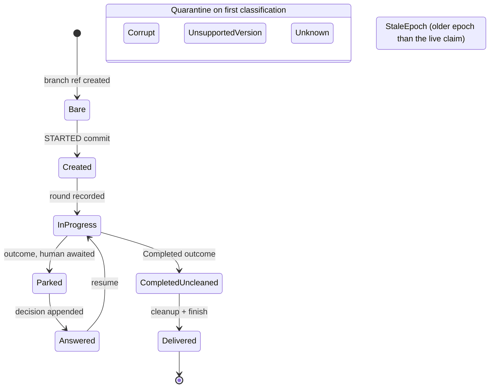
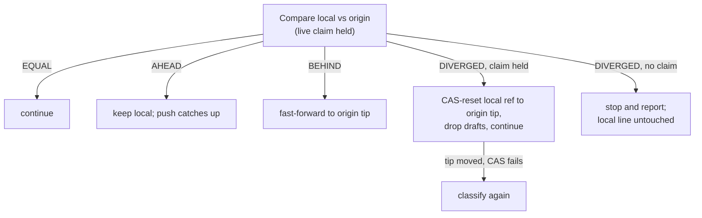

# task-branch-contract

## Purpose

Define the contract every task branch obeys between factory transitions: a total classification of the branch tip into named shapes, exactly one recovery owner per shape, claim-epoch fencing of every write, replica-pair reconciliation rules between the local clone and origin, and a budgeted recovery loop that quarantines instead of crash-looping. The contract exists so that any frozen intermediate state left by a crash is a classified, recoverable shape — never a surprise for the next pickup.

## ADDED Requirements

### Requirement: Total branch-shape classification
<!-- implements FR1, FR3, FR15, NFR-R2 of harden-task-branch-contract -->
A classifier SHALL map any task branch tip — its file set, envelope versions, and claim epoch — to exactly one named shape from this closed set of eleven, which is the canonical vocabulary every other artifact of this change refers to rather than restates:

| Shape                | Meaning                                                                                                                          |
|----------------------|----------------------------------------------------------------------------------------------------------------------------------|
| `Bare`               | the branch ref exists but carries no STARTED commit                                                                              |
| `Created`            | the STARTED commit is present and no round has completed, including a pre-contract tip carrying `task.json` without `state.json` |
| `InProgress`         | a run is underway; rounds recorded, no outcome                                                                                   |
| `Parked`             | an outcome is recorded and a human is awaited; the pending-write marker is a sub-state, not a separate shape                     |
| `Answered`           | the human's decision is appended and the outcome cleared, so the branch is resumable                                             |
| `CompletedUncleaned` | an outcome is recorded and cleanup is still pending                                                                              |
| `Delivered`          | cleanup completed, found by searching history for the cleanup commit and tolerating post-cleanup commits                         |
| `StaleEpoch`         | the tip's artifacts carry a claim epoch older than the live claim                                                                |
| `UnsupportedVersion` | an envelope declares a version this factory does not support                                                                     |
| `Corrupt(reason)`    | content is unreadable or self-contradictory; the reason names the offending file and the observed versus expected content        |
| `Unknown`            | a legal-but-unrecognized combination                                                                                             |

The happy-path progression of the shapes, with the two groups that leave it — quarantine on first classification and the stale-epoch fence:

`StaleEpoch` is orthogonal to the progression: any artifact stamped with an epoch older than the live claim classifies as `StaleEpoch` regardless of its content. The set SHALL be modelled as a sealed hierarchy so readers switch without a default branch. An unsupported envelope version SHALL classify as `UnsupportedVersion`, never as `Corrupt`, `Unknown`, or a closest legal match — the distinct shape is what lets a version diagnosis name the version rather than a parse failure. No shape name SHALL collide with an existing domain type: the branch shape for "awaiting a human" is `Parked` (never `Escalated`, which names a `TaskOutcome` variant) and the shape for "decision landed" is `Answered` (never `Decision`, which names the human's answer record). The classifier SHALL never throw on content: only environment unavailability (git or daemon unreachable) may surface as an infrastructure error, and that error retries under existing policy without burning quality attempts.

#### Scenario: Every generated tip classifies to exactly one shape
- **WHEN** property-generated branch tips (arbitrary file subsets, envelope versions, and epochs) are classified
- **THEN** each input yields exactly one named shape and no input throws

#### Scenario: Pre-contract tip is a legal initial shape
- **WHEN** the tip carries `task.json` but no `state.json`
- **THEN** the shape is `Created` and resume starts the first stage from scratch

#### Scenario: Unsupported envelope version is its own shape, not a parse failure
- **WHEN** a state file at the tip declares an envelope version the factory does not support
- **THEN** the tip classifies as `UnsupportedVersion` with a diagnosis naming the file, the observed version, and the supported range — on every reading path including take and serve — and never as `Corrupt` or `Unknown`

### Requirement: Classifier is the single entry to branch state
<!-- implements FR2 of harden-task-branch-contract -->
Every reader of task-branch state — take routing, resume, reconciliation, status, usage, denial-cursor restore — SHALL obtain the shape only through the classifier, and per-shape handling SHALL be exhaustive by construction: adding a shape SHALL force every reader to handle it, with no default or catch-all branch.

#### Scenario: No reader bypasses the classifier
- **WHEN** any reading path inspects a task branch tip
- **THEN** the shape it acts on is the classifier's verdict, never an ad-hoc file-presence check

#### Scenario: New shape cannot be silently ignored
- **WHEN** a new shape is added to the closed set
- **THEN** every per-shape handler fails to build until it names the new shape explicitly

### Requirement: One recovery owner per shape
<!-- implements G1, G2, NFR-R1 of harden-task-branch-contract -->
Each named shape SHALL have exactly one recovery owner — the component responsible for converging that shape to a clean expected state. Recovery SHALL be idempotent and convergent: running a recovery on an already-recovered state changes nothing, running any recovery twice equals running it once, and a kill during recovery lands in a shape whose own recovery completes the remaining work.

#### Scenario: Recovering a recovered state is a no-op
- **WHEN** a shape's recovery runs and then runs again on the resulting state
- **THEN** the second run changes no branch content, no tracker state, and reports nothing to repair

#### Scenario: Kill mid-recovery converges on the next pickup
- **WHEN** a recovery is killed after any of its durable steps
- **THEN** the next pickup classifies the frozen state to a named shape whose recovery completes the work

### Requirement: Claim-epoch fencing
<!-- implements FR13, NFR-S1 of harden-task-branch-contract -->
Each (re)claim SHALL be issued a monotonically increasing epoch, recorded with the claim and stamped into every commit and tracker write of that tenure. Readers SHALL classify artifacts carrying an epoch older than the current claim as the distinct `StaleEpoch` shape. A holder whose heartbeat cannot be confirmed SHALL stop writing at the next boundary until it re-verifies its claim. Epoch stamps SHALL carry only task identity and counters — no paths, hostnames, or credential material.

#### Scenario: Reclaim increases the epoch
- **WHEN** a task is reclaimed after its previous holder died
- **THEN** the new claim's epoch is strictly greater than the previous claim's

#### Scenario: Stale-epoch artifact is its own shape
- **WHEN** a reader encounters a commit or tracker write stamped with an epoch older than the live claim
- **THEN** the artifact classifies as `StaleEpoch`, not as the shape its content would otherwise suggest

#### Scenario: Unconfirmed heartbeat self-fences
- **WHEN** a holder cannot confirm its own heartbeat
- **THEN** it writes nothing past the next boundary until the claim is re-verified

### Requirement: Replica-pair reconciliation
<!-- implements FR8, NFR-R3 of harden-task-branch-contract -->
Per repository, one task SHALL be one ref and one logical transition one commit; movement across repositories is reconciled, never transactional. Origin is the sole inter-instance source of truth, and the durability point of any transition is its successful push, never the local commit. When the local branch and origin differ and the instance holds a live claim: local ahead of origin keeps local; local behind fast-forwards to origin; true divergence discards local (reset to the origin tip, dropping drafts) and continues automatically, with the reset applied as an explicit compare-and-swap against the tip the decision was made on. The discard SHALL be gated on that claim: where no claim is held, a diverged pair SHALL stop with an operator-facing report instead, while the ungated relations (equal, ahead, behind) reconcile the same way with or without one. No automatic path SHALL force-push or rewrite origin history.

#### Scenario: Divergence resolves automatically under the lease
- **WHEN** the local branch and origin have truly diverged and the instance holds a live claim
- **THEN** the local branch resets to the origin tip via compare-and-swap, drafts are dropped, and the take continues without an operator flag

#### Scenario: A diverged pair with no live claim is not discarded
- **WHEN** the local branch and origin have truly diverged and the instance holds no claim on the task — the claimless `gnomish run --resume` paths, which run no claim protocol at all
- **THEN** the local line is left intact and the run stops with an operator-facing report naming both tips, since the automatic discard's justification is the claim protocol and nothing arbitrated this pair

#### Scenario: Local-ahead is kept, local-behind fast-forwards
- **WHEN** the local branch is strictly ahead of origin, or strictly behind it
- **THEN** ahead keeps the local commits for pushing, behind fast-forwards to the origin tip, and neither case discards work

#### Scenario: Origin history is never rewritten
- **WHEN** any automatic recovery or reconciliation path runs
- **THEN** origin history is unchanged except by fast-forward pushes

### Requirement: Budgeted recovery with quarantine
<!-- implements FR14, FR15, NFR-O1, NFR-O2 of harden-task-branch-contract -->
Automatic recovery SHALL be budgeted by a persisted per-task counter of recovery attempts with backoff; this budget and the existing crash fuse SHALL be one accounting — one counter model, one quarantine outcome — while quality attempts stay separate. On exhaustion the task quarantines to the needs-human status with its failure history. The three non-recoverable shapes — `Corrupt`, `UnsupportedVersion`, and `Unknown` — SHALL quarantine on first classification, without consuming budget cycles, with a diagnosis naming the offending file and the observed and expected shape (for `UnsupportedVersion`, the observed and supported versions). Every non-trivial repair SHALL emit one structured log line naming the shape, task, epoch, and action taken; repeated repair of the same task within a window SHALL surface as a warning. A quarantine report SHALL name the shape, the diagnosis, and the recovery attempts consumed, readable without factory logs.

#### Scenario: Non-recoverable shape parks once with a diagnosis
- **WHEN** a tip first classifies as `Corrupt`, `UnsupportedVersion`, or `Unknown`
- **THEN** the task quarantines immediately with a diagnosis naming the offending file and the expected shape, and no crash-fuse cycle is consumed

#### Scenario: Exhausted budget quarantines with history
- **WHEN** recovery of the same task fails until the persisted budget is exhausted
- **THEN** the task moves to the needs-human status with a report naming the shape, the diagnosis, and every recovery attempt consumed

#### Scenario: Repairs are observable
- **WHEN** any classified shape other than the clean expected one is repaired
- **THEN** one structured log line records the shape, task, epoch, and action, and a repeated repair of the same task within the window logs a warning
