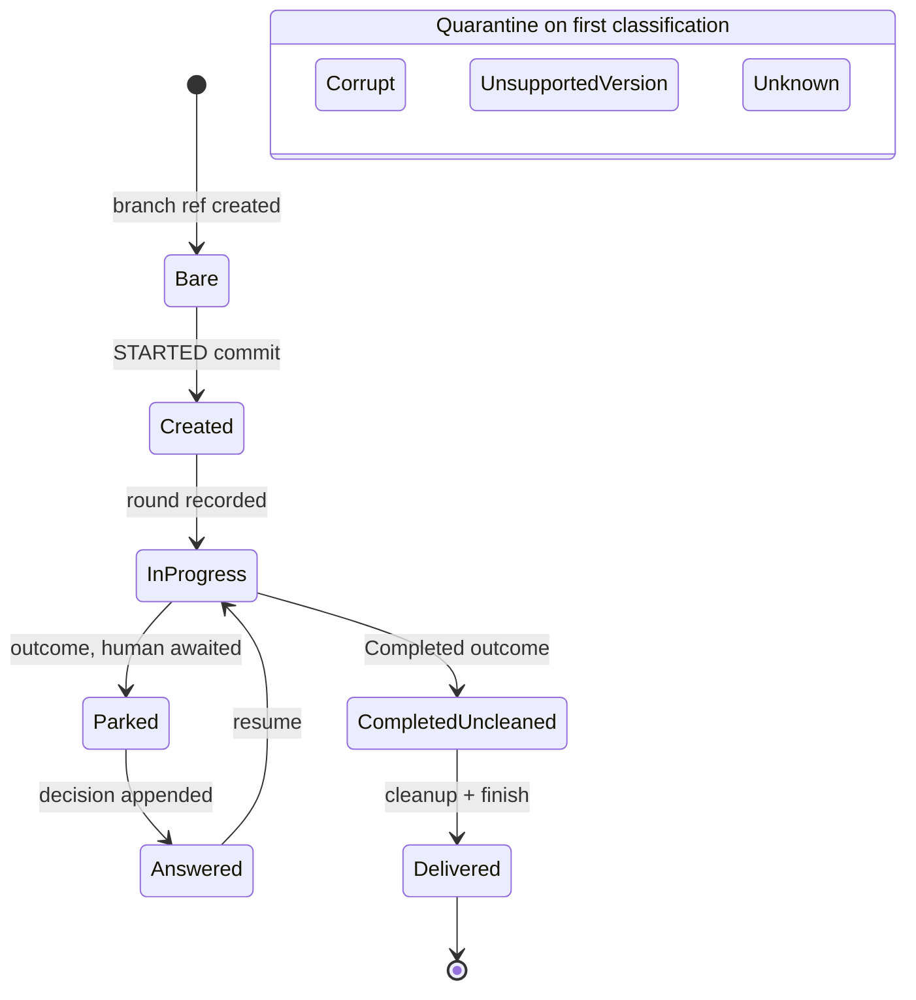

## MODIFIED Requirements

### Requirement: Total branch-shape classification
<!-- implements FR1, FR3, FR15, NFR-R2 of harden-task-branch-contract; FR1, FR2 of fix-claim-epoch-fence -->
<!-- implements FR14, NFR-R4 of fix-operator-blockers -->
A classifier SHALL map any task branch tip — its file set and envelope versions — to exactly one named shape from this closed set of ten, which is the canonical vocabulary every other artifact of this contract refers to rather than restates:

| Shape                | Meaning                                                                                                                          |
|----------------------|----------------------------------------------------------------------------------------------------------------------------------|
| `Bare`               | the branch ref exists but carries no STARTED commit                                                                              |
| `Created`            | the STARTED commit is present and no round has completed, including a pre-contract tip carrying `task.json` without `state.json` |
| `InProgress`         | a run is underway; rounds recorded, no outcome                                                                                   |
| `Parked`             | an outcome is recorded and a human is awaited; the pending-write marker is a sub-state, not a separate shape                     |
| `Answered`           | the human's decision is appended and the outcome cleared, so the branch is resumable                                             |
| `CompletedUncleaned` | an outcome is recorded and cleanup is still pending                                                                              |
| `Delivered`          | cleanup completed, found by searching the task's own history for the cleanup commit and tolerating post-cleanup commits           |
| `UnsupportedVersion` | an envelope declares a version this factory does not support                                                                     |
| `Corrupt(reason)`    | content is unreadable or self-contradictory; the reason names the offending file and the observed versus expected content        |
| `Unknown`            | a legal-but-unrecognized combination                                                                                             |

The happy-path progression of the shapes, with the one group that leaves it — quarantine on first classification:

The claim epoch stamped on the tip commit SHALL NOT be a classification input: a tip stamped by an earlier tenure classifies exactly as the same tip unstamped would (see "Claim epoch is provenance, not a read-side fence"). A task's own history SHALL be the commits after its STARTED commit on the branch's first-parent line: a cleanup commit reachable only through the base the branch forked from, or through a base merged into the branch, SHALL NOT make the branch `Delivered`, and a branch with no STARTED commit of its own has no delivery. The set SHALL be modelled as a sealed hierarchy so readers switch without a default branch. An unsupported envelope version SHALL classify as `UnsupportedVersion`, never as `Corrupt`, `Unknown`, or a closest legal match — the distinct shape is what lets a version diagnosis name the version rather than a parse failure. No shape name SHALL collide with an existing domain type: the branch shape for "awaiting a human" is `Parked` (never `Escalated`, which names a `TaskOutcome` variant) and the shape for "decision landed" is `Answered` (never `Decision`, which names the human's answer record). The classifier SHALL never throw on content: only environment unavailability (git or daemon unreachable) may surface as an infrastructure error, and that error retries under existing policy without burning quality attempts.

#### Scenario: Every generated tip classifies to exactly one shape
- **WHEN** property-generated branch tips (arbitrary file subsets and envelope versions) are classified
- **THEN** each input yields exactly one named shape and no input throws

#### Scenario: Pre-contract tip is a legal initial shape
- **WHEN** the tip carries `task.json` but no `state.json`
- **THEN** the shape is `Created` and resume starts the first stage from scratch

#### Scenario: Unsupported envelope version is its own shape, not a parse failure
- **WHEN** a state file at the tip declares an envelope version the factory does not support
- **THEN** the tip classifies as `UnsupportedVersion` with a diagnosis naming the file, the observed version, and the supported range — on every reading path including take and serve — and never as `Corrupt` or `Unknown`

#### Scenario: A tip stamped by an earlier tenure classifies by its content
- **WHEN** a task is reclaimed and its tip commit carries a claim epoch older than the new claim's
- **THEN** the shape is the one the tip's files and envelopes describe — `Parked`, `Answered`, `InProgress`, `CompletedUncleaned`, `Created`, or `Delivered` — and the reclaim routes on that shape

#### Scenario: A cleanup commit inherited from the base does not deliver a live task
- **WHEN** an earlier task's delivered branch was merged into the base with its history, and a new task forked from that base is parked, in progress or freshly created
- **THEN** the new task classifies by its own content — `Parked`, `InProgress` or `Created` — and never as `Delivered`, on every reading path including `status`, take and serve

#### Scenario: A base merged into a live task after it started does not deliver it
- **WHEN** a base holding an earlier task's cleanup commit is merged into a live task branch after the task started
- **THEN** the live task does not classify as `Delivered`
