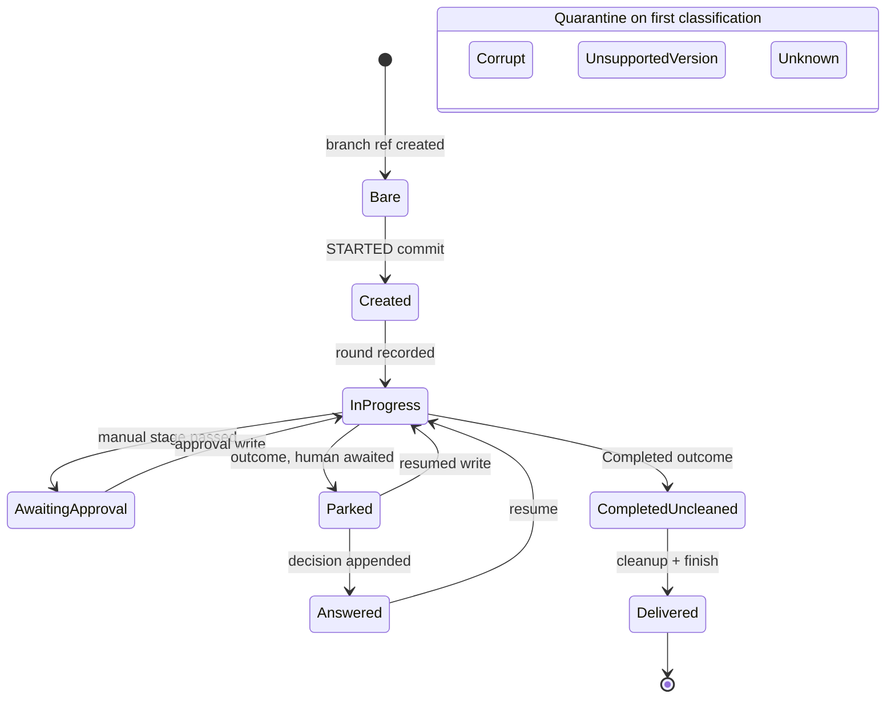

# Spec Delta: lifecycle/task-branch-contract

## MODIFIED Requirements

### Requirement: Total branch-shape classification
<!-- implements FR11 of make-checkpoint-gate-durable -->
<!-- implements FR1, FR3, FR15, NFR-R2 of harden-task-branch-contract; FR1, FR2 of fix-claim-epoch-fence; FR14, NFR-R4 of fix-operator-blockers -->
A classifier SHALL map any task branch tip — its file set, envelope versions and recorded position — to exactly one named shape from this closed set of eleven, which is the canonical vocabulary every other artifact of this contract refers to rather than restates:

| Shape                | Meaning                                                                                                                          |
|----------------------|----------------------------------------------------------------------------------------------------------------------------------|
| `Bare`               | the branch ref exists but carries no STARTED commit                                                                              |
| `Created`            | the STARTED commit is present and no round has completed, including a pre-contract tip carrying `task.json` without `state.json` |
| `InProgress`         | a run is underway; rounds recorded, no outcome, position at a stage or the pipeline end                                          |
| `AwaitingApproval`   | a `manual` stage passed and the gate is not opened: the recorded position is `AwaitingApproval(stage)`; whether a park outcome is also recorded is a sub-state, not a separate shape |
| `Parked`             | an outcome is recorded at a non-gate position and a human is awaited; the pending-write marker is a sub-state, not a separate shape |
| `Answered`           | the human's decision is appended and the outcome cleared, so the branch is resumable                                             |
| `CompletedUncleaned` | an outcome is recorded and cleanup is still pending                                                                              |
| `Delivered`          | cleanup completed, found by searching the task's own history for the cleanup commit and tolerating post-cleanup commits           |
| `UnsupportedVersion` | an envelope declares a version this factory does not support                                                                     |
| `Corrupt(reason)`    | content is unreadable or self-contradictory; the reason names the offending file and the observed versus expected content        |
| `Unknown`            | a legal-but-unrecognized combination                                                                                             |

The happy-path progression of the shapes, with the one group that leaves it — quarantine on first classification:

The classifier's facts SHALL include the recorded position, so that a tip at a gate classifies as `AwaitingApproval` whatever `task.json`'s `outcome` says: a null outcome (the park was never recorded), a `paused` outcome (the park landed) and a stale earlier outcome all name the same owed step. The claim epoch stamped on the tip commit SHALL NOT be a classification input: a tip stamped by an earlier tenure classifies exactly as the same tip unstamped would (see "Claim epoch is provenance, not a read-side fence"). A task's own history SHALL be the commits after its STARTED commit on the branch's first-parent line: a cleanup commit reachable only through the base the branch forked from, or through a base merged into the branch, SHALL NOT make the branch `Delivered`, and a branch with no STARTED commit of its own has no delivery. The set SHALL be modelled as a sealed hierarchy so readers switch without a default branch. An unsupported envelope version SHALL classify as `UnsupportedVersion`, never as `Corrupt`, `Unknown`, or a closest legal match — the distinct shape is what lets a version diagnosis name the version rather than a parse failure. No shape name SHALL collide with an existing domain type: the branch shape for "awaiting a human" is `Parked` (never `Escalated`, which names a `TaskOutcome` variant), the shape for a closed gate is `AwaitingApproval` (the same word the position carries, since the shape *is* the position), and the shape for "decision landed" is `Answered` (never `Decision`, which names the human's answer record). The classifier SHALL never throw on content: only environment unavailability (git or daemon unreachable) may surface as an infrastructure error, and that error retries under existing policy without burning quality attempts.

#### Scenario: Every generated tip classifies to exactly one shape
- **WHEN** property-generated branch tips (arbitrary file subsets, envelope versions and positions) are classified
- **THEN** each input yields exactly one named shape and no input throws

#### Scenario: A gate classifies by its position, not by the park
- **WHEN** a tip's `state.json` position is `AwaitingApproval(stage)` and its `task.json` outcome is null, `paused`, or a stale earlier outcome
- **THEN** the shape is `AwaitingApproval` in all three cases, and never `InProgress` or `Parked`

#### Scenario: Pre-contract tip is a legal initial shape
- **WHEN** the tip carries `task.json` but no `state.json`
- **THEN** the shape is `Created` and resume starts the first stage from scratch

#### Scenario: Unsupported envelope version is its own shape, not a parse failure
- **WHEN** a state file at the tip declares an envelope version the factory does not support
- **THEN** the tip classifies as `UnsupportedVersion` with a diagnosis naming the file, the observed version, and the supported range — on every reading path including take and serve — and never as `Corrupt` or `Unknown`

#### Scenario: A tip stamped by an earlier tenure classifies by its content
- **WHEN** a task is reclaimed and its tip commit carries a claim epoch older than the new claim's
- **THEN** the shape is the one the tip's files and envelopes describe — `Parked`, `AwaitingApproval`, `Answered`, `InProgress`, `CompletedUncleaned`, `Created`, or `Delivered` — and the reclaim routes on that shape

#### Scenario: A cleanup commit inherited from the base does not deliver a live task
- **WHEN** an earlier task's delivered branch was merged into the base with its history, and a new task forked from that base is parked, in progress or freshly created
- **THEN** the new task classifies by its own content — `Parked`, `InProgress` or `Created` — and never as `Delivered`, on every reading path including `status`, take and serve

#### Scenario: A base merged into a live task after it started does not deliver it
- **WHEN** a base holding an earlier task's cleanup commit is merged into a live task branch after the task started
- **THEN** the live task does not classify as `Delivered`

### Requirement: One recovery owner per shape
<!-- implements FR11, NFR-R1, NFR-R2 of make-checkpoint-gate-durable -->
<!-- implements G1, G2, NFR-R1 of harden-task-branch-contract; FR3, FR5, FR8, NFR-R1 of fix-envelope-medium -->
Each named shape SHALL have exactly one recovery owner — the component responsible for converging that shape to a clean expected state. The owner of `AwaitingApproval` is the stage engine's run entry: its recovery is to re-deliver the park (record the `paused` outcome if `task.json` lacks it, park on the tracker where one exists, print the stop where none does) and never to run a stage; the gate opens only through the approval write, which a human's return or `--resume` performs. Recovery SHALL be idempotent and convergent: running a recovery on an already-recovered state changes nothing, running any recovery twice equals running it once, and a kill during recovery lands in a shape whose own recovery completes the remaining work. The approval write and the resumed write SHALL refuse — writing nothing — when the tip no longer matches the state they were asked to move from. Convergence SHALL NOT depend on which instance picks the task up: a recovery owner decides from the durable medium — the branch tip and the tracker — never from a local working copy, so the instance whose own working copy froze the state converges it exactly as any other instance does. A working copy the factory keeps between pickups is a staging area for the next write, not an input to any recovery decision, and the build SHALL reject a recovery-path read of a factory-owned envelope file from the working copy.

#### Scenario: Recovering a recovered state is a no-op
- **WHEN** a shape's recovery runs and then runs again on the resulting state
- **THEN** the second run changes no branch content, no tracker state, and reports nothing to repair

#### Scenario: A gate with a lost park is re-delivered, never run
- **WHEN** a tip classifies as `AwaitingApproval` with `outcome` null and any instance picks the task up
- **THEN** the pickup records the `paused` outcome, delivers the park, runs no stage, and a second pickup of the resulting tip changes nothing

#### Scenario: A stale approval refuses
- **WHEN** the approval write is asked to open a gate whose stage differs from the tip's recorded `AwaitingApproval(stage)`, or the tip is no longer at a gate
- **THEN** the write refuses with a diagnosis naming the tip's actual position and lands no commit

#### Scenario: Kill mid-recovery converges on the next pickup
- **WHEN** a recovery is killed after any of its durable steps
- **THEN** the next pickup classifies the frozen state to a named shape whose recovery completes the work

#### Scenario: The instance that froze the state converges it
- **WHEN** an instance dies with its working copy ahead of or behind the branch tip and the same
  instance picks the task up again with that working copy still in place
- **THEN** classification and recovery read the tip, the working copy's state does not change the
  route taken, and the branch converges to the same shape another instance would have produced

#### Scenario: A working-copy read on a recovery path fails the build
- **WHEN** a recovery-path component reads a factory-owned envelope file from the working copy
  instead of through the tip reader
- **THEN** the architecture gate fails the build naming the file and the owner to route through

## ADDED Requirements

### Requirement: A recorded position never implies an authorisation not yet recorded
<!-- implements FR1, FR3, FR7, FR8 of make-checkpoint-gate-durable -->
No durable write on the task branch SHALL encode a state a reader interprets as "proceed", "done" or "consumed" before the write that grants it has landed. In particular: a passing round of a `manual` stage records the gate, not the position past it; the approval that opens a gate and the position it advances to land in one commit; a stop the engine will escalate rides the round record that produced it; and a continuation that consumes a recorded outcome clears that outcome in the same commit as the attempt reset it implies. `outcome: null` SHALL have exactly three writers — the decision commit, the approval write and the resumed write — and no component SHALL reset the attempt history in memory without one of them having landed first.

#### Scenario: No tip says continue before the approval
- **WHEN** every commit a `manual` stage's pass and approval produce is inspected in order
- **THEN** no tip carries a position past the stage without the approval commit being that very tip or an ancestor of it

#### Scenario: A consumed outcome does not survive its consumption
- **WHEN** a parked task is continued by any path — decision, approval, or resumed write — and the process is killed at any later point before the next terminal write
- **THEN** the tip's `task.json` shows `outcome: null` and the attempt counter the continuation granted, and the next pickup does not walk the decision path again
