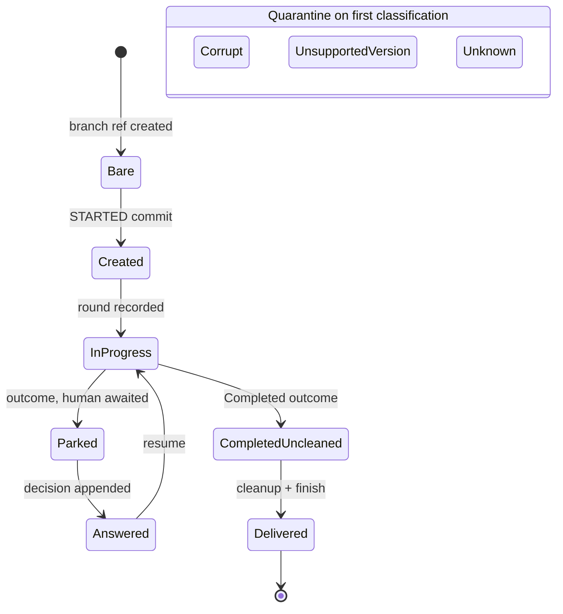

## MODIFIED Requirements

### Requirement: Total branch-shape classification
<!-- implements FR1, FR3, FR15, NFR-R2 of harden-task-branch-contract; FR1, FR2 of fix-claim-epoch-fence -->
A classifier SHALL map any task branch tip — its file set and envelope versions — to exactly one named shape from this closed set of ten, which is the canonical vocabulary every other artifact of this contract refers to rather than restates:

| Shape                | Meaning                                                                                                                          |
|----------------------|----------------------------------------------------------------------------------------------------------------------------------|
| `Bare`               | the branch ref exists but carries no STARTED commit                                                                              |
| `Created`            | the STARTED commit is present and no round has completed, including a pre-contract tip carrying `task.json` without `state.json` |
| `InProgress`         | a run is underway; rounds recorded, no outcome                                                                                   |
| `Parked`             | an outcome is recorded and a human is awaited; the pending-write marker is a sub-state, not a separate shape                     |
| `Answered`           | the human's decision is appended and the outcome cleared, so the branch is resumable                                             |
| `CompletedUncleaned` | an outcome is recorded and cleanup is still pending                                                                              |
| `Delivered`          | cleanup completed, found by searching history for the cleanup commit and tolerating post-cleanup commits                         |
| `UnsupportedVersion` | an envelope declares a version this factory does not support                                                                     |
| `Corrupt(reason)`    | content is unreadable or self-contradictory; the reason names the offending file and the observed versus expected content        |
| `Unknown`            | a legal-but-unrecognized combination                                                                                             |

The happy-path progression of the shapes, with the one group that leaves it — quarantine on first classification:

The claim epoch stamped on the tip commit SHALL NOT be a classification input: a tip stamped by an earlier tenure classifies exactly as the same tip unstamped would (see "Claim epoch is provenance, not a read-side fence"). The set SHALL be modelled as a sealed hierarchy so readers switch without a default branch. An unsupported envelope version SHALL classify as `UnsupportedVersion`, never as `Corrupt`, `Unknown`, or a closest legal match — the distinct shape is what lets a version diagnosis name the version rather than a parse failure. No shape name SHALL collide with an existing domain type: the branch shape for "awaiting a human" is `Parked` (never `Escalated`, which names a `TaskOutcome` variant) and the shape for "decision landed" is `Answered` (never `Decision`, which names the human's answer record). The classifier SHALL never throw on content: only environment unavailability (git or daemon unreachable) may surface as an infrastructure error, and that error retries under existing policy without burning quality attempts.

#### Scenario: Every generated tip classifies to exactly one shape
- **WHEN** property-generated branch tips (arbitrary file subsets and envelope versions) are classified
- **THEN** each input yields exactly one named shape and no input throws

#### Scenario: Pre-contract tip is a legal initial shape
- **WHEN** the tip carries `task.json` but no `state.json`
- **THEN** the shape is `Created` and resume starts the first stage from scratch

#### Scenario: Unsupported envelope version is its own shape, not a parse failure
- **WHEN** a state file at the tip declares an envelope version the factory does not support
- **THEN** the shape is `UnsupportedVersion` carrying the file name, the observed version, and the supported version, and the diagnosis names the version rather than a parse failure

#### Scenario: A tip stamped by an earlier tenure classifies by its content
- **WHEN** a task is reclaimed and its tip commit carries a claim epoch older than the new claim's
- **THEN** the shape is the one the tip's files and envelopes describe — `Parked`, `Answered`, `InProgress`, `CompletedUncleaned`, `Created`, or `Delivered` — and the reclaim routes on that shape

### Requirement: Claim-epoch fencing
<!-- implements FR13, NFR-S1 of harden-task-branch-contract; FR2, FR3 of fix-claim-epoch-fence -->
Each (re)claim SHALL be issued a monotonically increasing epoch, recorded with the claim and stamped into every commit and tracker write of that tenure. On the branch the stamp is provenance — it names the tenure that made a commit — and at the tracker it is the identity a fenced claim operation compares against. A reader SHALL NOT treat an artifact of an earlier tenure as stale: artifacts stamped with older epochs are the branch's history, and a reclaim resumes from them. The branch's fence against a holder whose lease lapsed is the fast-forward-only push — the task branch is never force-pushed, so a late push from a superseded tenure is rejected by the remote — and the tracker's fence is the round-boundary revocation check, which stops a holder whose claim is no longer its own. A holder whose heartbeat cannot be confirmed SHALL stop writing at the next boundary until it re-verifies its claim. Epoch stamps SHALL carry only task identity and counters — no paths, hostnames, or credential material.

#### Scenario: Reclaim increases the epoch
- **WHEN** a task is reclaimed after its previous holder died
- **THEN** the new claim's epoch is strictly greater than the previous claim's

#### Scenario: Every commit of a tenure carries its epoch
- **WHEN** a holder commits a round, an outcome, a salvage, a decision acknowledgement, or a cleanup under a live claim
- **THEN** the commit message carries that claim's epoch trailer, and a reclaiming tenure's commits carry the new epoch

#### Scenario: Stale-epoch artifact is its own shape
- **WHEN** a reader encounters a commit or tracker write stamped with an epoch older than the live claim
- **THEN** no distinct shape is produced for it: the artifact is history of an earlier tenure, and the tip classifies to the shape its content describes (this scenario is kept under its historical name so the archive records the reversal of the former rule; the former rule fired on every legitimate reclaim)

#### Scenario: Older-epoch history is resumed, not rejected
- **WHEN** a reclaiming instance reads a tip whose epoch is older than its own claim's
- **THEN** it resumes from that tip by content shape, writes nothing to repair it, and no quarantine or discard is raised on account of the epoch

#### Scenario: A superseded tenure's late push is rejected by the remote
- **WHEN** a holder whose lease lapsed pushes after a newer tenure has pushed
- **THEN** the push is refused as non-fast-forward, origin keeps the newer tenure's tip, and the lapsed holder's round follows the aborted path

#### Scenario: Unconfirmed heartbeat self-fences
- **WHEN** a holder cannot confirm its own heartbeat
- **THEN** it writes nothing past the next boundary until the claim is re-verified

## ADDED Requirements

### Requirement: The tenure record has one owner
<!-- implements FR4, FR5, FR6 of fix-claim-epoch-fence -->
Within one factory process, the record of which epoch it holds on each task SHALL have exactly one owner, and both halves of a tenure — the tracker that records the epoch a claim was issued, and the git writers that stamp it — SHALL be served by that one record. An assembly in which the writers stamp from one record while the tracker fills another SHALL NOT be constructible. A git layer that holds no tenure record at all SHALL exist only in the commands that never claim (`status`, `usage`, `board`, plain `run`); every assembly that claims — the production commands and every end-to-end test of them — SHALL be built through the owner, so a test observes stamped commits and recorded epochs exactly as production does.

#### Scenario: A test assembly stamps like production
- **WHEN** two independently assembled instances drive claim, work, tenure end, and reclaim against one real origin and one shared tracker
- **THEN** the first tenure's commits carry the first epoch and the second tenure's commits carry the second, with no epoch wiring done by the test beyond assembling the instances

#### Scenario: Escalated, returned, reclaimed
- **WHEN** one instance escalates a task, a human replies and returns it to ready, and a different instance claims it
- **THEN** the second instance resumes the branch as `Answered`, acknowledges the decision under its own epoch, and delivers the task

#### Scenario: Crashed, reaped, reclaimed
- **WHEN** one instance dies mid-round leaving a salvaged tip stamped with its epoch, the claim is reaped, and a different instance claims the task
- **THEN** the second instance resumes the branch as `InProgress` at the recorded position, and a second pickup of the same branch changes nothing

#### Scenario: A claimless git layer stays in the claimless commands
- **WHEN** the source tree is scanned for assemblies built with no tenure record
- **THEN** every hit is one of the claimless commands or a fixture of one, and any other hit fails the build
