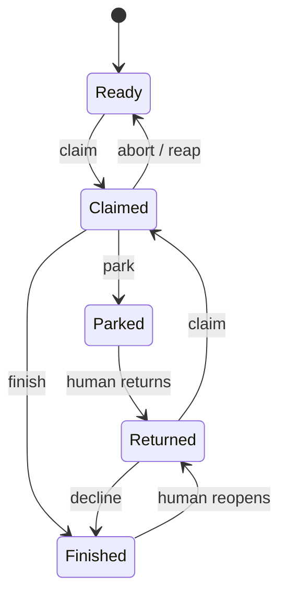
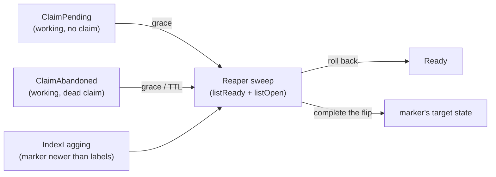

# claim-heartbeat — delta for harden-task-branch-contract

## MODIFIED Requirements

### Requirement: Beat failures are classified, not counted
A failed beat SHALL be handled by cause: network errors and 5xx are logged as
WARN and work continues — the next round boundary resolves the situation; a
"claim marker gone" answer means the claim is lost — at the nearest round
boundary the run SHALL stop, salvage-push best-effort (the fence arbitrates),
free the slot, and write no tracker state for the task that is no longer ours.
A holder that cannot confirm its own heartbeat — its beats have failed long
enough that it no longer knows its claim is live — SHALL stop writing at the
next boundary: no push and no tracker write until it re-verifies the claim.
Re-verification confirming the claim resumes writing; a gone claim follows the
lost-claim path above (self-fencing).
<!-- implements FR8 of add-claim-heartbeat -->
<!-- implements FR13 of harden-task-branch-contract -->

#### Scenario: Transient outage does not stop work
- **WHEN** three consecutive beats fail with 5xx while the gnome works
- **THEN** the run continues, each failure logged as WARN, and beats resume
  when the tracker recovers

#### Scenario: Lost claim ends the run at the boundary
- **WHEN** a beat reports the claim marker gone (task reaped or taken over)
- **THEN** at the next round boundary the run stops, pushes best-effort, and
  performs no tracker transition for the lost task

#### Scenario: Unconfirmed heartbeat freezes writes at the boundary
- **WHEN** every beat has failed for longer than the lost-detection threshold
  and the round reaches its boundary
- **THEN** the holder writes nothing — no push, no tracker write — until a
  re-verification confirms the claim is still its own; a confirmed claim
  resumes the run, a gone claim follows the lost-claim path

## ADDED Requirements

### Requirement: Total tracker-shape classification with one recovery owner
The tracker-side state of a task SHALL classify totally, in core, over
adapter-reported facts — the state labels present, the claim footprint (a live
claim, a dead footprint, or none), and the boundary markers — into this closed
set of named shapes, each with exactly one recovery owner:

| Shape | Observation | Owner → recovery |
|---|---|---|
| `Ready` | ready label, no live claim | queue |
| `Claimed` | working label, live claim | holder beats; reaper reaps on TTL |
| `Parked` | needs-human label, park marker latest | human |
| `Finished` | delivered label, finish marker present | terminal |
| `Returned` | ready label with park/finish history | queue; a finished return routes to decline |
| `Revoked` | issue closed | terminal |
| `ClaimPending` | working label (ready may linger), no claim footprint | reaper: grace, then restore ready |
| `ClaimAbandoned` | working label, claim footprint without a live version | reaper: grace, then stale-claim removal |
| `IndexLagging` | a boundary marker newer than the labels it implies | reaper: complete the label flip toward the marker |
| `Foreign` | any other combination | none — surfaced with a diagnosis, never auto-repaired |

Markers are the truth; labels are the index the listing queries filter on. The
three window shapes — `ClaimPending`, `ClaimAbandoned`, `IndexLagging` — are
exactly the states the FR12 write order can freeze, and each keeps an
open-state label on the issue, so the sweep enumerates it. An adapter SHALL
NOT omit or reinterpret any combination — the classifier decides, and no
factory-reachable shape is ever attributed to human mislabeling. Time
judgments — the staleness TTL and the window grace — stay with core's
observation memory, never re-derived by the classifier or an adapter. The
shape set SHALL be a sealed hierarchy; readers switch without a default
branch.

The steady progression, driven by factory writes and human transitions:

Any open shape may become `Revoked` (issue closed) by a human at any time.
The window shapes and their repair, all inside the sweep universe:

<!-- implements FR19, FR12 of harden-task-branch-contract -->

#### Scenario: Every fact combination yields exactly one shape
- **WHEN** tracker facts are generated over arbitrary label sets, claim
  footprints, and marker histories
- **THEN** each combination classifies to exactly one named shape — `Foreign`
  included — and no combination throws or is silently dropped

#### Scenario: Kill between claim label and claim comment is repaired
- **WHEN** an instance dies after the working-label transition but before its
  claim comment posts
- **THEN** the sweep classifies the frozen state as `ClaimPending` and, after
  the grace period, restores the task to `Ready` — never treating the shape
  as a human mislabel

#### Scenario: A boundary marker completes its own flip
- **WHEN** an instance dies after posting the finish marker but before the
  delivered-label flip
- **THEN** the sweep classifies `IndexLagging`, completes the flip to
  delivered, and no path re-executes the finished task

### Requirement: The sweep universe is the union of both listings
The reaper's standing duty SHALL generalize from stale-claim removal to
tracker-shape repair, and its sweep SHALL enumerate the union of both
listings — every open task carrying any state label, `listReady` plus
`listOpen` — so no kill window's frozen state is filtered out by the very
label its sequence had not written yet. A late claim comment that lands after
its incomplete claim was rolled back to ready (a ready-labeled task with a
live claim footprint) SHALL be enumerated by the same sweep and repaired,
never left to win claim races as a ghost. A killed reap SHALL remain
repairable by any later tick: an interrupted stale-claim removal freezes
`ClaimAbandoned` or `IndexLagging`, both swept.
<!-- implements FR19, FR12 of harden-task-branch-contract -->

#### Scenario: Killed reap leaves a shape the next tick resolves
- **WHEN** a reaper posts the removal boundary or deletes a dead claim comment
  and dies before flipping the working label back to ready
- **THEN** a later tick classifies the frozen state and returns the task to
  `Ready` — the kill costs one grace window, never a stuck task

#### Scenario: Suspension leftover is swept off a ready task
- **WHEN** a delayed claim comment lands on a ready-labeled task after the
  reaper rolled its incomplete claim back
- **THEN** the sweep enumerates the task through the feed's claim facts,
  classifies the mismatch, and repairs it — no permanently race-winning claim
  survives on a ready task

### Requirement: Every (re)claim issues a monotonically increasing epoch
Each successful claim or reclaim of a task SHALL be issued an epoch strictly
greater than every epoch previously issued for that task; the epoch SHALL be
recorded with the claim and SHALL be available to the holder for stamping into
every commit and tracker write of that tenure, so readers can classify
artifacts carrying an older epoch than the current claim as stale-epoch.
<!-- implements FR13 of harden-task-branch-contract -->

#### Scenario: Reclaim after a reap advances the epoch
- **WHEN** a task claimed at epoch N is reaped and later claimed again by any
  instance
- **THEN** the new claim carries an epoch strictly greater than N, and any
  instance reading the claim can obtain that epoch

#### Scenario: Epoch is available for stamping
- **WHEN** a holder performs a commit or tracker write during its tenure
- **THEN** the epoch recorded with its claim is available to stamp into that
  write, unchanged for the whole tenure

### Requirement: Lost-detection strictly precedes reassignment
Reap timing SHALL keep two distinct thresholds: the holder's lost-detection
threshold (after which it self-fences) SHALL be strictly earlier than the
reaper's reassignment threshold, leaving a grace window during which the
original holder may re-verify and reclaim its own claim before the task is
returned to `Ready`. A self-fenced holder therefore stops writing before any
reaper can hand the task to another instance.
<!-- implements FR13 of harden-task-branch-contract -->

#### Scenario: Holder recovers within the grace window
- **WHEN** a holder's beats fail past the lost-detection threshold, it
  self-fences at the boundary, and connectivity returns before the
  reassignment threshold elapses
- **THEN** the holder re-verifies its still-live claim, resumes writing, and
  the task is never reaped

#### Scenario: Fencing wins the race against reassignment
- **WHEN** a holder's heartbeat is unconfirmed and the reassignment threshold
  is approaching
- **THEN** the holder has already stopped writing at its earlier lost-detection
  threshold, so no write of the old tenure lands after the reaper returns the
  task to `Ready`
