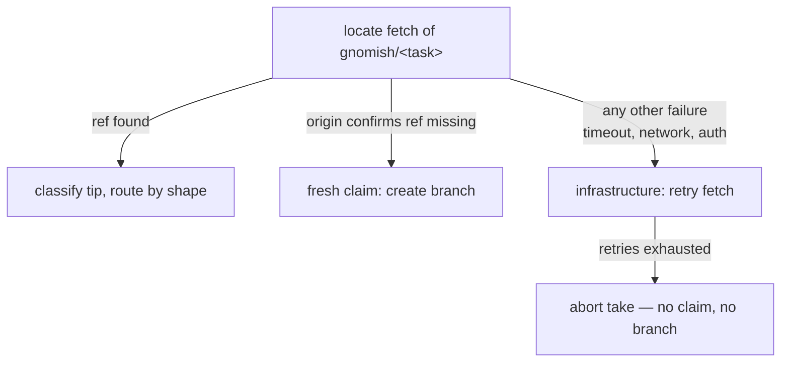

# tracker-take — delta for harden-task-branch-contract

## MODIFIED Requirements

### Requirement: take subcommand surface
`gnomish take` SHALL be a separate subcommand, always in git mode, with three
forms: `take <ref>` (explicit mode), `take <ref> <ref> ...` (batch mode, two
or more refs), and bare `take` (auto mode). Supported flags: `--dir`,
`--interactive[=executor|judge]` (single explicit form only),
`--base` (single explicit-mode start only), `--discard-work` (salvage-only:
reset the working copy to the last recorded round and replay the interrupted
round — see git-task-persistence "Salvage of interrupted rounds"), and the
headless takeover flag. `--discard-work` SHALL play no role in divergence:
divergence between the local branch and origin resolves automatically under
the live claim (see "Divergence resolves automatically under the lease"),
and no operator flag selects that resolution. `take` SHALL have no `--mode`, no ad-hoc source flags
(`--task`, `--task-file`, `--task-id`, `--resume`), and no `--from-stage`;
the bare form SHALL reject start modifiers (`--base`) and the headless
takeover flag (which authorizes an explicit `take <ref>` takeover only); the
batch form SHALL reject `--interactive` and `--base`. The `gnomish run` flag
matrix SHALL remain unchanged. Short refs (`42`, `#42`) expand via the
configured binding; a full canonical id naming a foreign repo is an error
(subject to the adapter's rename tolerance).
<!-- implements FR9 of add-tracker-port -->
<!-- implements FR6 of add-claim-heartbeat -->
<!-- implements FR2, FR3 of add-factory-serve -->
<!-- implements FR8 of harden-task-branch-contract -->

#### Scenario: Flag validation
- **WHEN** `take` is invoked with `--mode`, `--task`, `--resume`, or bare
  `take` with `--base` or `--takeover`
- **THEN** each invocation fails with a validation error before touching the
  tracker

#### Scenario: Batch rejects interactivity
- **WHEN** `take 42 43 --interactive` is invoked
- **THEN** the invocation fails with a validation error before touching the
  tracker

#### Scenario: Short ref expansion
- **WHEN** the operator runs `take 42` with a configured GitHub binding
- **THEN** the run targets the canonical id built from the binding and issue 42

#### Scenario: Foreign canonical id is refused
- **WHEN** `take github:other/repo#7` names a repo that is neither the configured
  binding nor (via the adapter's rename tolerance) a predecessor of it
- **THEN** the run refuses (exit 15) before fetching the task, naming both repos

### Requirement: Abort protocol with a K fuse
An infrastructure abort is either an engine `Aborted` outcome (durable persist
failed) or an uncaught exception of the take run itself. On an infrastructure
abort the factory SHALL log ERROR, then best-effort: post the
structural abort comment, release the claim, and return the task to `Ready` via
`recordAbort` — a dead tracker never blocks the abort itself. The
consecutive-abort count SHALL be the crash-cause category of the unified
recovery accounting ("Recovery attempts share one budgeted accounting with the
crash fuse") — one counter model and one quarantine outcome, replacing the
previous standalone fuse counter while remaining shared across instances via
tracker facts. When that accounting reaches the configured threshold, the
factory SHALL instead park the task as `AwaitingHuman(infra)` with a report
carrying the categorized failure history (crash and recovery causes distinct).
<!-- implements FR14 of add-tracker-port -->
<!-- implements NFR-R2 of add-tracker-port -->
<!-- implements NFR-C1 of add-tracker-port -->
<!-- implements FR14, NFR-O2 of harden-task-branch-contract -->

#### Scenario: Abort below the fuse
- **WHEN** a run aborts with the shared accounting below its threshold
- **THEN** the task returns to `Ready` with a structural abort comment and the
  slot-free process exits

#### Scenario: Fuse trips at K
- **WHEN** a run aborts and the shared accounting reaches its threshold
- **THEN** the task is parked as `AwaitingHuman(infra)` with a report carrying
  the categorized history (crash vs recovery causes, counts, last cause and
  time) pointing to the structural records as the full cross-instance history

#### Scenario: Runner crash is an abort
- **WHEN** the take run dies with an uncaught exception mid-run
- **THEN** the best-effort abort protocol runs: structural abort comment, claim
  released, task back to `Ready` (or parked at the shared threshold)

### Requirement: Reconcile precedes resume
Every claim of a task with an existing branch SHALL begin with the reconcile
check, routed by the `task-branch-contract` shape classifier: when the tip
records a terminal outcome whose tracker counterpart is missing (finish or
park never landed), the run SHALL complete the deferred delivery and end —
executing no stage. For a `Completed` tip whose cleanup commit is also absent,
the delivery is the full finish of "A Completed-without-cleanup tip is
finished, never re-executed" (cleanup commit, push, tracker finish); the two
requirements name one behavior, not two checks. Only when branch and tracker
agree does the ordinary resume (decision collection, engine run) proceed.
<!-- implements FR10 of add-claim-heartbeat -->
<!-- implements NFR-C1 of add-claim-heartbeat -->
<!-- implements FR9 of harden-task-branch-contract -->

#### Scenario: Deferred finish is delivered, not re-run
- **WHEN** a take run claims a task whose branch records `Completed` but whose
  tracker state is still open after its holder died mid-outage
- **THEN** the run posts the final report, transitions the task to `Finished`,
  and exits with the delivery exit code without invoking any executor

## ADDED Requirements

### Requirement: Routing decides only on origin-confirmed state
Fresh-vs-resume routing SHALL rely only on origin-confirmed state: the take
routes to a fresh claim only after origin confirms the task ref is missing. A
locate fetch that fails for any other reason — network error, timeout,
authentication, an interrupted or timed-out subprocess — SHALL classify as an
infrastructure failure: the fetch is retried under the existing
infrastructure-retry policy — a budget of its own, never the bounded
re-attempt that bound-subprocess-commands forbids spending on an interrupted
or timed-out invocation — and on exhaustion the take aborts without claiming;
it SHALL NOT route to a fresh claim or create a new branch.
<!-- implements FR6 of harden-task-branch-contract -->

#### Scenario: Fetch failure never forks a duplicate branch
- **WHEN** the locate fetch of `gnomish/<task>` fails with a network timeout
  while the branch exists on origin
- **THEN** the take retries the fetch and, on exhaustion, aborts without
  creating a branch or starting a round — the existing branch is untouched

#### Scenario: Confirmed-missing ref routes fresh
- **WHEN** origin answers the locate fetch confirming no `gnomish/<task>` ref
  exists
- **THEN** the take routes to a fresh claim and creates the branch

### Requirement: Divergence resolves automatically under the lease
When the instance holds a live claim, the local task branch and the origin
tip SHALL reconcile automatically before resume: local ahead of origin keeps
the local tip; local behind origin fast-forwards to the origin tip; true
divergence discards the local branch — reset to the origin tip, drafts
dropped — and the run continues from origin. No operator flag is consulted
and no divergence terminates the run with an exit demanding git surgery. The
discard's reset SHALL be an explicit local-ref compare-and-swap against the
tip the decision was made on — no push is involved, and origin history is
never rewritten.
<!-- implements FR8 of harden-task-branch-contract -->

#### Scenario: Stale local branch is discarded and work continues
- **WHEN** an instance resumes a task whose work was superseded from another
  host, so local and origin have truly diverged
- **THEN** the local branch is reset to the origin tip, the run continues from
  the origin state in the same invocation, and origin history is untouched

#### Scenario: Local-ahead is kept, not discarded
- **WHEN** the local branch holds commits origin lacks and origin has not moved
- **THEN** the local tip is kept and pushed; nothing is discarded

### Requirement: A Completed-without-cleanup tip is finished, never re-executed
When the branch tip records the `Completed` outcome but the cleanup commit is
absent, the take SHALL finish the delivery — commit the cleanup, push, and
deliver the tracker finish — and SHALL NOT re-enter the engine: zero rounds,
no executor or judge invocation.
<!-- implements FR9 of harden-task-branch-contract -->

#### Scenario: Kill between Completed and cleanup costs no re-run
- **WHEN** a previous run died after committing `Completed` but before its
  cleanup commit, and the task is taken again
- **THEN** the run commits the cleanup, pushes, posts the finish, and exits
  with the delivery exit code without executing any stage

### Requirement: Recovery attempts share one budgeted accounting with the crash fuse
Automatic recovery of a non-clean branch shape SHALL be budgeted: a persisted
per-task counter of recovery attempts with backoff between attempts, and
quarantine to the needs-human status carrying the failure history once the
budget is exhausted. This budget and the existing K crash fuse SHALL be one
accounting — one counter model and one quarantine outcome, not two parallel
fuses. Quality attempts (stage verification failures) SHALL remain a separate
count and never burn recovery budget.
<!-- implements FR14 of harden-task-branch-contract -->

#### Scenario: Exhausted recovery budget quarantines with history
- **WHEN** recovery of the same task fails repeatedly until the shared budget
  is exhausted
- **THEN** the task is parked needs-human with a report carrying the failure
  history of all recovery attempts, and no further automatic recovery runs

#### Scenario: Quality failures never burn the recovery budget
- **WHEN** a task accumulates stage-verification failures within its stage
  attempt limit
- **THEN** the recovery/crash counter is unchanged by those quality attempts

### Requirement: Non-recoverable shapes quarantine on first classification
A branch tip classifying as one of the three non-recoverable shapes of the
`task-branch-contract` closed set — `Corrupt`, `UnsupportedVersion`, or
`Unknown`, on every reading path of take and serve — SHALL quarantine
the task on its first classification with a diagnosis, without burning
crash-fuse or recovery-budget cycles and without a crash loop. The quarantine
report SHALL name the observed shape, the diagnosis (the offending file and
the expected shape), and the recovery attempts consumed, readable without
factory logs.
<!-- implements FR15 of harden-task-branch-contract -->
<!-- implements UX2, NFR-O2 of harden-task-branch-contract -->

#### Scenario: Corrupt branch parks once, not per pickup
- **WHEN** a take claims a task whose `state.json` is unparseable
- **THEN** the task is parked needs-human on that first classification with a
  report naming the file, the observed and expected shape, and attempts
  consumed — and subsequent pickups do not re-run recovery on it

#### Scenario: Unsupported version is a shape, not a crash
- **WHEN** the branch's state envelope carries a version this factory does not
  support
- **THEN** the take classifies it as `UnsupportedVersion` and parks with the
  observed and supported versions named in the diagnosis, burning no crash-fuse
  cycle
