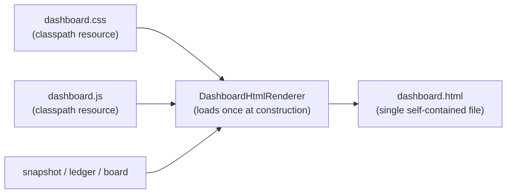

# Design: redesign-dashboard

## Context

See proposal.md — Why. The renderer lives in
`application/src/main/java/com/github/oinsio/gnomish/dashboard/` as a family
of section renderers (`DashboardHtmlRenderer` composing daemon, board,
history, sandbox-hygiene section renderers, plus
`DashboardStalenessBannerRenderer`). Today the whole page — markup, CSS, and
the staleness script — is assembled from Java string constants. The redesign
brief fixes the target design fully: design tokens, complete stylesheet,
complete client script, and the markup skeleton are prescribed, so the design
space here is how to house them in this codebase, not what they look like.

Constraints that shape the approach: output must stay one self-contained
`file://`-viewable HTML file (existing NFR-S1/FR2 of the capability); the
repo gates are Error Prone + NullAway, Spotless, and the 100% PIT mutation
gate; the source design brief is an ephemeral note outside the durable
record, so its content is inlined into this change's artifacts (the
`resources/` files and the delta spec) rather than referenced.

## Goals / Non-Goals

**Goals:**
- House the prescribed CSS/JS as reviewable resource files while keeping the
  single-file output contract (FR10, NFR-R1).
- Keep all display values server-rendered so the no-JS path stays complete
  (NFR-R2), and keep the formatting logic in plain testable methods that can
  clear the mutation gate (M2).

**Non-Goals:**
- Any change to data collection, cadences, CLI flags, or ports (NG5).
- The `dashboard.json` fetch/patch shell (NG2) — but the DOM shape must not
  preclude it.

## Decisions

**D1 — CSS/JS as classpath resources, read once at construction.**
`src/main/resources/dashboard/dashboard.css` and `dashboard.js` are normal
files (IDE support, Spotless, reviewable diffs), loaded in the renderer's
constructor into final fields and inlined into every render (FR10). A
missing resource throws at construction (NFR-R1) — a dashboard that silently
renders unstyled is worse than one that refuses to start. *Rationale:* the
page regenerates every few seconds; re-reading the classpath per render is
pure waste, and string-constant CSS/JS in Java is unreviewable.
*Alternative rejected:* keeping CSS/JS as Java text blocks — no IDE/format
support, noisy diffs; emitting separate files next to the HTML — breaks the
portable single-file contract.

**D2 — Guarded inlining.** A literal `</script>` inside the JS would
terminate the inline block early, so inlining is guarded: a test asserts
neither resource contains `</` followed by `script` (case-insensitive), and
the renderer performs the same check at construction (NFR-R1).
*Rationale:* the failure mode is a half-parsed page that is very confusing
to debug; the check is one line. *Alternative rejected:* escaping at render
time — obscures the resource content and still needs a test.

**D3 — Freshness strip replaces the banner renderer.**
`DashboardStalenessBannerRenderer` (element `#staleness-banner`, its CSS and
inline script) is deleted, not adapted (FR3). The strip's two states are
driven by `data-state` plus a `body.is-stale` class toggled by the shared
1 Hz tick in `dashboard.js`; `GENERATED_AT` comes from
`<body data-generated-at>`, keeping the script a static resource with no
templating inside it. The watch/one-shot split rides the same channel:
`<body data-mode>` gates the stale degradation (a one-shot page shows its
age as plain information), and the meta-refresh is emitted in watch mode
only — matching the current renderer's behavior. *Rationale:* the strip and the banner answer the same
question with opposite philosophies (degrade vs block); keeping both paths
would double the staleness logic. *Alternative rejected:* re-styling the
existing banner — its DOM position and covering semantics are the problem,
not its colors.

**D4 — Server-side value rendering, client-side re-presentation only.**
Every number and timestamp is rendered server-side in final form: compact
counts with exact values in `title` (FR9), absolute times as `<time
datetime data-epoch>` text (FR8). The script only rewrites presentation
(relative ages, strip state) from data attributes and never introduces a
value (NFR-R2). *Rationale:* one rendering path that works without JS; JS
formatting would fork the logic into two languages and break the no-JS
acceptance check. *Alternative rejected:* shipping raw longs and formatting
in JS — explicitly forbidden by the brief for exactly this reason.

**D5 — Formatting helpers as standalone testable classes.** The compact
number formatter and the outcome/token percentage arithmetic live beside the
renderer as plain methods separate from string assembly (a
`DashboardCompactNumberFormatter`-style helper next to the existing
`DashboardDurationFormatter`/`DashboardHtmlFormatter`), with Spock specs
covering the boundaries: exactly 1000, exactly 1M, a dropped `.0`, a zero
total (no division), a single-outcome day at 100% (M2). *Rationale:* the
100% PIT gate makes logic buried in string assembly untestable in practice.
*Alternative rejected:* inlining the math at call sites — duplicates
boundary handling and multiplies mutation targets.

**D6 — DOM stays patchable for the deferred JSON shell (NG2).** Every
mutable value sits in an element with a stable class or id; the script reads
its inputs from data attributes, never from templated literals. A change
that would require re-templating the whole document to update one number is
reconsidered. *Rationale:* the follow-up (`dashboard.json` + fetch/patch)
should be a patch function, not a rewrite. *Alternative rejected:* baking
values into templated literals inside the script or free-form markup —
cheaper to write today, but it would force the future shell to re-render
the whole document to change one number, exactly the retrofit this
constraint exists to avoid.

## Risks / Trade-offs

- [Prescribed CSS/JS drift from the markup the renderers actually emit] →
  the acceptance checks (M1) exercise the rendered page, not the resources
  in isolation; class names in Java markup are checked against the
  stylesheet during review.
- [Escalation-row fields may not all be exposed by the tracker port (Q1)] →
  rows drop unavailable fields by design (FR4); the PR description records
  what was left out.
- [PIT mutation gate on presentation-heavy code] → decision logic is
  isolated in helpers (D5); pure string-assembly renderers follow the
  module's existing exemption policy only where every mutation is
  delegation-shaped, per `.claude/rules/testing.md`.
- [1 Hz DOM rewrite of all `<time>` elements] → the element count is a few
  dozen at typical queue sizes; the walk is a single `querySelectorAll`
  cached at load.

## Open Questions

- Q1 (from proposal): which escalation fields the tracker port exposes —
  resolvable during implementation without changing the approach; rows
  degrade by dropping fields.
