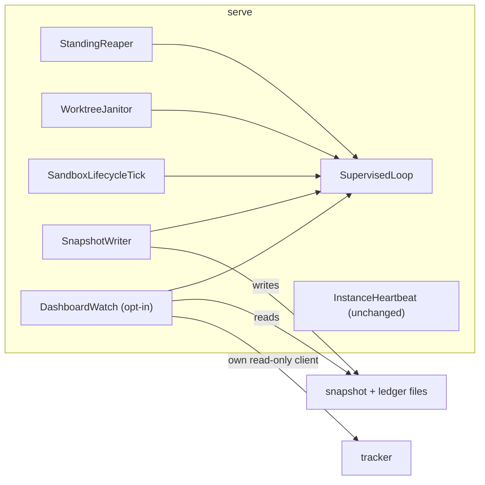

# Design: supervise-daemon-loops-and-embed-dashboard

## Context

See proposal.md (Why) for motivation. The current state that shapes the approach:

- **Four hand-written daemon loops in `:application`**, each starting its own virtual thread:

  | Loop                                       | Order       | Wait                                  | Guard                            | On thread death                         | Stop                               |
  |--------------------------------------------|-------------|---------------------------------------|----------------------------------|-----------------------------------------|------------------------------------|
  | `app/lease/StandingReaper`                 | wait → tick | fixed interval                        | `Throwable`, wait inside         | respawn via `RestartBackoff`, unbounded | yes                                |
  | `app/serve/WorktreeJanitor`                | tick → wait | fixed 1 h                             | `RuntimeException`, wait outside | nothing                                 | none                               |
  | `app/serve/SandboxLifecycleTick`           | tick → wait | fixed interval                        | `RuntimeException`, wait outside | nothing                                 | none                               |
  | `serveobservability/writer/SnapshotWriter` | tick → wait | interval or `markDirty()` (semaphore) | `RuntimeException`               | nothing                                 | `stop()` / `stopAfterFinalWrite()` |

  The janitor and the sweep tick are a declared hand-synchronized pair. `SnapshotWriter.awaitNextWake`
  re-sets the interrupt flag and returns, so an interrupt while `running` spins the loop without
  waiting. `stopAfterFinalWrite` joins the thread captured at `start()`. `ServeShutdown` stops only
  the reaper.
- **`InstanceHeartbeat`** is a fifth long-lived thread whose death is deliberately not resurrected
  (design D3 of `add-claim-heartbeat`). It is out of scope (proposal NG1).
- **The dashboard** (`DashboardCommand`) is the only place that derives the serve directory, the
  default output path (`dashboard.html`), the ready window (`BOARD_READY_LIMIT = 50`) and the board
  fetch (`BoardComposition.compose` over a tracker from `TrackerWiring.resolveReadOnly`, which
  reloads `.gnomish/` from the checkout). `DashboardWatchLoop.run` is a caller-thread `while` loop
  with its own interrupt check.
- **`serve`** binds its tracker configuration from origin's default branch (`BoundTracker`, FR13 of
  `add-base-ref-resolution`). Its live tracker is wrapped in `TrackerHealthTracker`, whose
  `consecutiveFailures` feeds the snapshot and the dashboard's alarm rule 4.
- **The operator-event catalog** demands one code per WARN/ERROR call site and a literal
  `OperatorEvent.X` at the site (`LogContractGateSpec`). The "Repeated failures log edges, not
  floods" requirement names `logtext.RepeatSuppressor` as the owner of repeat suppression.
- **The board** builds `BoardModel` with `EligibilityInputs(…, openFrontCount, wipLimit)`, but the
  model keeps neither. `BoardJsonMapper` re-derives the open-front count and takes `wipLimit` as a
  parameter. Its javadoc records that decision ("pass config explicitly, don't smuggle it into the
  model").

## Goals / Non-Goals

**Goals:** one loop shape (FR1–FR5) under a type every daemon loop holds; the embedded dashboard as
a configuration of existing parts, not a second renderer (FR9); the WIP stat read from the same
value eligibility was judged by (FR12).

**Non-Goals:** a scheduler or executor framework (one virtual thread per loop stays); per-loop
snapshot vitals beyond the reaper's existing `restartCount` (NG6); changing what any tick does.

## Decisions

**D1 — `SupervisedLoop`: one instance per loop, held by composition.** A new final class
`app.daemon.SupervisedLoop` owns the thread, the order, the wait, the guard, the stop and the
restart policy. Each loop class keeps its own `tick()`, `lastRunAt` and policy collaborators. It holds
a `SupervisedLoop` field built in its constructor from a parameter object `LoopShape(DaemonComponent
component, LoopOrder order, LoopWait wait, RestartPolicy policy)`, plus a `Clock`. `LoopWait` is a
sealed interface with two implementations. `FixedInterval(Sleeper, Duration)` is used by the reaper,
janitor, sweep and dashboard. `IntervalOrSignal(Duration)` owns the semaphore and coalesces surplus
permits. It is used by the snapshot writer and exposes `signal()` for `markDirty()`. Every loop
is framed with its `DaemonComponent`, and `DASHBOARD` is added to that enum. Implements FR1, FR6.
*Rationale:* composition keeps each loop's tick and its specs where they are. The shared part is
exactly the shape `fix-reaper-idle-liveness` D4 settled for the reaper. *Alternatives rejected:* an
abstract base class: it couples five unrelated ticks through inheritance, and the base's lifecycle
leaks into each subclass's specs. `ScheduledExecutorService`: a throwing task silently suppresses
all later runs (the exact silent death this change removes), it has no wake-signal wait for the
writer, and it has no thread-death hook to hang a restart policy on.

**D2 — Level-1 guard catches `Throwable` around tick and wait; failures log as edges.** One
`try` spans the tick and the wait (FR2). Failures go through `RepeatSuppressor`, keyed by the loop's
component. The first failure, or a changed reason, logs WARN. Repeats log at DEBUG, with the
suppressor's periodic counted roll-up. The first clean tick after a failure logs one INFO recovery
line. A clean tick also calls `RestartPolicy.markCleanTick()`, which resets the backoff the way
`RestartBackoff` does today. *Rationale:* the reaper's D4 settled `Throwable` for daemon loops, and
the repeat-suppression requirement forbids one WARN per tick. A permanently failing dashboard render
would otherwise log a WARN every 10 s. *Alternative rejected:* keep `catch (RuntimeException)` with
the wait outside the guard. `fix-reaper-idle-liveness` FR3 called that shape a defect, and an `Error`
or a throwing sleeper still kills the thread.

**D3 — Interrupt handling is defined once.** After every tick and every wait the loop checks its
`stopping` flag first: if it is set, the loop returns, with no WARN/ERROR and no respawn. Otherwise a
set interrupt flag is cleared with `Thread.interrupted()`, logged once as an edge (WARN, stray
interrupt), and the loop goes on to its next normal wait. A wait cut short by an interrupt never
turns into a tick-without-wait cycle. `FixedInterval` relies on the injected `Sleeper`, which
restores the flag. `IntervalOrSignal` catches `InterruptedException` and restores the flag, and the
same check handles both. Implements FR5. *Rationale:* both latent busy loops (`SnapshotWriter`, and
`ThreadSleeper` returning early under a set flag) are fixed in one place, and the "interrupt is a
stop" classification of `factory-serve` holds because a real stop always sets `stopping` before it
interrupts. *Alternative rejected:* treating any interrupt as a stop. A stray interrupt would then
end the loop silently, which is the failure this change exists to remove.

**D4 — Stop, join and respawn under one small lock.** `SupervisedLoop` keeps `volatile boolean
stopping` and a `worker` field guarded by a private lock. `stop()` sets `stopping` and interrupts the
current worker. `stopAndJoin()` repeats "read the current worker under the lock, join it outside the
lock" until no worker remains, so a respawn that happened in between is joined too. The death handler
follows the three-phase shape of `lock-scope.md`: decide (`stopping`? give up?) and count under
the lock, then wait the backoff with nothing held, then re-check `stopping` under the lock and
spawn only if it is still clear. Nothing blocking is ever held under the lock. Implements FR4,
NFR-R2, NFR-R3. *Rationale:* this is the reaper's existing race-free shape, extended with the join a
single-writer final write needs (D8). *Alternative rejected:* joining only the thread captured at
`start()` (today's `stopAfterFinalWrite`). It returns while a respawned writer can still write.

**D5 — Restart policies: `Unbounded` and `Bounded`.** `RestartPolicy` is a sealed interface over
the existing `RestartBackoff`, which moves from `app.lease` to `app.daemon`. `RemoteOutageProbeSchedule`
keeps calling `nextJitteredBackoff` unchanged.
- `Unbounded(base, cap)`: respawn after the doubling backoff, logging ERROR with a lifetime restart
  count. It never gives up. The reaper keeps base = its interval, cap = 10 min, so its behavior
  and its `restartCount` vital are unchanged. The janitor and the sweep tick use the same policy:
  their ticks fail mostly on transient external causes (file system, Docker).
- `Bounded(base, cap, maxRestarts, window, Clock)`: the same, but more than `maxRestarts` restarts
  within `window` logs one ERROR that the loop is disabled, and the loop does not respawn. The
  dashboard uses N = 5 within 10 minutes and base = its 10 s render cadence (resolves Q1).
The snapshot writer is `Unbounded` with base = the snapshot interval and the default 10 min cap
(resolves Q2). A single death is then followed by a write within two intervals, inside the dashboard's
`3 × interval` staleness window, so it never shows as a dead daemon. A writer that keeps dying does
go stale, and its ERROR lines name it. Implements FR3, FR6. *Rationale:* restart intensity follows the
OTP supervisor model: a child that dies repeatedly for the same reason is stopped rather than
restarted forever. The dashboard is the only optional loop, and its render is deterministic, so
repeated deaths mean a bug that a restart will not cure. *Alternative rejected:* `Unbounded` for the
dashboard. Its only effect would be an endless ERROR stream for an optional view.

**D6 — Operator events belong to the component; the loop is named by the `component` key.** The
component's sites take new catalog codes: `DAEMON_LOOP_TICK_FAILED`, `DAEMON_LOOP_STRAY_INTERRUPT`,
`DAEMON_LOOP_WORKER_DIED`, `DAEMON_LOOP_GAVE_UP` and `DAEMON_LOOP_BACKOFF_SLEEP_FAILED`. The
per-loop codes the component replaces are retired and never reused: GF067
`STANDING_REAPER_TICK_FAILED`, GF068 `STANDING_REAPER_WORKER_DIED`, GF069
`STANDING_REAPER_BACKOFF_SLEEP_FAILED`, GF073 `SANDBOX_LIFECYCLE_TICK_FAILED`, GF077
`WORKTREE_JANITOR_TICK_FAILED` and GF105 `SNAPSHOT_TICK_FAILED`. Codes raised inside ticks
(janitor scan, sweep actions, `DASHBOARD_RENDER_WRITE_FAILED`, the writer's own write/sweep
failures) stay with their sites. Every line carries the `component` MDC key (`reaper`,
`janitor`, `sweep`, `snapshot`, `dashboard`), so `grep component=janitor` still isolates one
loop (NFR-O1). The operator guide lists the retired codes and their replacements. *Rationale:* the
catalog rule is "one code, one call site", and the call site is now genuinely one. The question of
which loop degraded is answered by the key every line already carries.
*Alternatives rejected:* per-loop codes passed in as parameters. The static gate requires a literal
`OperatorEvent.X` at the site, so this needs five `log-contract-exempt` escapes. Per-loop logging
callbacks: four near-identical log methods per loop, the very copy this change removes.

**D7 — Migration of the four loops.** Each class keeps its public surface for its callers, except
that the janitor and the sweep tick gain `stop()`.

| Loop                   | Order       | Wait                                  | Policy (base / cap / bound)          |
|------------------------|-------------|---------------------------------------|--------------------------------------|
| `StandingReaper`       | wait → tick | `FixedInterval(interval)`             | Unbounded, interval / 10 min         |
| `WorktreeJanitor`      | tick → wait | `FixedInterval(1 h)`                  | Unbounded, 1 h / 10 min              |
| `SandboxLifecycleTick` | tick → wait | `FixedInterval(sweep interval)`       | Unbounded, interval / 10 min         |
| `SnapshotWriter`       | tick → wait | `IntervalOrSignal(snapshot interval)` | Unbounded, interval / 10 min         |
| `DashboardWatch` (D10) | tick → wait | `FixedInterval(10 s)`                 | Bounded, 10 s / 10 min / 5 in 10 min |

`StandingReaper.restartCount()` reads the policy's count, so the `vitals.reaper.restartCount` field
and alarm rule 5 are unchanged. `SnapshotWriter` loses its `log-contract-exempt` outer guard and its
own semaphore loop. Whenever a backoff is capped at 10 min below a 1 h interval, the cap wins: the
first respawn waits `min(base, cap)`.

**D8 — The snapshot writer's final write stays single-writer across respawns.**
`stopAfterFinalWrite()` becomes `loop.stopAndJoin()` followed by `writeCycle.writeOnce()` on the
caller. By D4, no worker exists and none can be spawned once `stopAndJoin` returns, so the final
`stopped` write is the last byte written (FR7, the FR1 invariant of `add-serve-observability`).
Pinned by a real-thread identity spec that kills the worker with an `Error` while the stop races the
backoff, and asserts no write after the final one (M5). *Alternative rejected:* a "final write done"
flag checked inside the tick. That is a second guard of the same invariant, and it cannot stop a
write already in progress.

**D9 — Shutdown stops every supervised loop; the dashboard renders last.** `ServeShutdown` gains a
`DaemonLoops` component (the janitor, the sweep tick and the reaper, as one group). It stops them
where it stops the reaper today, before the grace wait, so no disposal races a draining slot. The
snapshot writer keeps its position inside `ObservabilityWiring.finalizeStopped`. When the dashboard
is enabled, `ServeShutdownWiring` calls `dashboard.stopAndRenderFinal()` after `finalizeStopped`, on
both the drain and the signal paths. That call is `stopAndJoin`, then one synchronous render, so
the page reads the `stopped` snapshot (FR11, UX2). Every stop is idempotent, so the existing "second
pass is a no-op" scenario holds. Crash consistency: the only durable effects are two atomically
replaced files with no reader that decides anything from their order. A kill between the final
snapshot and the final render leaves a page that reads "running" and goes stale, which is today's
standalone behavior. No kill-point matrix entry is needed. *Alternative rejected:* stopping the
janitor and the sweep tick after the grace wait. A disposal could then run against a slot that is
still releasing its environment.

**D10 — One dashboard assembly for both commands.** A new `app.DashboardWatch` (an instance, built
once per command) owns the serve-directory output default (`DEFAULT_FILE_NAME`), the ready window
(`BOARD_READY_LIMIT`), the board fetch (`BoardComposition.compose` over the tracker it is handed),
the render cycle, and the dashboard's `SupervisedLoop` (D7 row). It takes `(ProjectLayout layout,
String instanceName, @Nullable Path outOverride, BoardSource source)`. `BoardSource` is a record of
the read-only `Tracker`, the `TrackerConfig` and the `FactoryProperties.Tracker`, so the two
commands differ only in where the source comes from (D11). `DashboardWatchLoop.renderOnce` becomes
the tick, and its `while` loop and interrupt check are deleted. Standalone `gnomish dashboard
--watch` now starts the same loop and joins it. If the Bounded policy gives up, the standalone
process exits with status 1, because it has nothing else to do. One-shot rendering stays a single
synchronous render through the same assembly. Implements FR9, FR14. *Rationale:* `dashboard-page`
requires the page to come from one composition. A second wiring inside `serve` would be the
undeclared pair `manual-sync-pairs.md` forbids. *Alternative rejected:* `serve` constructs a
`DashboardRenderCycle` itself. It would re-spell the path default, the ready window and the board
fetch.

**D11 — The board client inside `serve` is a separate read-only instance built from the bound
configuration.** `ServeRuntimeAssembly` (the composition site, ADR 0010) builds the embedded
`BoardSource` from the `BoundTracker` it already receives. It calls
`bound.factory().create(secrets, bound.trackerConfig(), bound.instanceId().value())`, a new adapter
instance that is not wrapped in `TrackerHealthTracker` and not epoch-stamped. It never calls
`TrackerWiring.resolveReadOnly`. Implements FR10, NFR-S1, NFR-P1. *Rationale:* this is the bulkhead
pattern. The adapter code is one: the same factory and the same configuration. The instance is
separate, so the dashboard's failures and latency stay out of the daemon's tracker health. The
configuration has one source per process: the law `serve` bound from origin. *Alternatives rejected:*
sharing the daemon's tracker. Board failures would then count in `consecutiveFailures` and in alarm
rule 4. `resolveReadOnly(dir, …)`: it reloads `.gnomish/` from the checkout, which gives a second
configuration source in one process, and the WIP limit shown could differ from the one the feed
enforces. *Note:* `create` provisions labels idempotently, as the standalone dashboard already does
on every start, which costs a few reads at startup.

**D12 — `serve` options.** `ServeArguments` gains `boolean dashboard` and `@Nullable Path
dashboardOut`. `ServeProperties` gains `@Nullable Boolean dashboard` (`factory.serve.dashboard`,
default `false`, `@ConfigLevel(Level.ANY)` like its siblings). The effective switch is `--dashboard
|| factory.serve.dashboard`. `--dashboard-out` with the effective switch off is a `UsageException`
(FR8). `--dashboard-out` is resolved like `gnomish dashboard --out`. The dashboard starts after
`observability().start()`, so its first render already finds a snapshot. It prints `gnomish serve:
dashboard -> <absolute path>` on the human console (UX1), and `AnchorLog.ServeConfig` gains the
enabled flag and the path (NFR-O2). *Alternative rejected:* a flag without a property. U3 needs a
per-machine default, and `--slots` over `factory.serve.slots` is the precedent.

**D13 — `BoardModel` carries the WIP limit it was judged by.** `BoardModel` gains `int wipLimit`
(taken from `EligibilityInputs.wipLimit()` inside `build`, the very value `EligibilityPolicy`
judged WIP-held rows against) and a derived `openFrontCount()` = working rows + awaiting rows.
`BoardJsonMapper.serialize/toDto` drop their `wipLimit` parameter and read the model. The emitted
JSON is unchanged (FR14). `DashboardStatusCardRenderer` takes the `BoardSectionView` too. It
renders the snapshot stats only when a snapshot exists, and the WIP stat whenever a board model
exists (FR12, FR13, UX3), with no `bad` styling. *Rationale:* the counter must show the limit the
held rows were held by. Passing it separately to two renderers creates two paths for one value,
and the escape hatch the BoardJsonMapper javadoc kept open is closed by the signature. This
reverses that javadoc's decision, and the javadoc is rewritten in the same change.
*Alternative rejected:* the dashboard reads `trackerConfig.wipLimit()` beside the model. That is a
second read of the value with no guarantee it equals the one eligibility used, for example a
standalone dashboard's checkout config against a cached model.

**D14 — Sync surfaces.** Scout result:
- *Declared pair touched:* `WorktreeJanitor` ↔ `SandboxLifecycleTick` (the "immediate-then-cadence,
  tick failure logged and retried" loop shape). With the reaper, the writer and the new dashboard
  loop, this would be the fifth implementation of a daemon loop. `manual-sync-pairs.md` requires an
  abstraction from the third onward, so the pair is **dissolved into `SupervisedLoop`** (D1). Both
  `Kept in sync with` markers are removed. Their remaining shared trait (tick plus a volatile
  `lastRunAt`) is each class's own state, not a synchronized rule. The pair has no registry row, so
  the registry is not edited. *Alternative rejected:* keeping the declared pair and adding the
  dashboard as a third end, which the rule of three forbids.
- *Shared helper reused, not forked:* `RestartBackoff` keeps its two users (the policies and
  `RemoteOutageProbeSchedule`). It moves packages, its behavior is unchanged.
- *New parallel implementation avoided:* the embedded and the standalone dashboard share
  `DashboardWatch` (D10). There is no second renderer and no declared pair.
- *Untouched pairs:* `LedgerJsonMapper`/`LedgerAggregator`, `SnapshotJsonMapper`/`SnapshotJsonReader`,
  `FeedState`/`FeedPhase`, `HeartbeatWorkerState`/`HeartbeatState`: no wire token or constant set
  changes, because the WIP stat is read from the board, not the snapshot.

**D15 — The supervised daemon loop is recorded as durable policy, not only in this design.** This
`design.md` archives with the change and governs nothing afterwards (`crash-consistency.md`,
"Referencing"), but every future daemon loop must reuse `SupervisedLoop`. Three durable artifacts
carry that obligation:
- **ADR `docs/adr/0013-supervised-daemon-loop.md`** (0012 is claimed by `define-executor-contract`;
  renumber at archive if that changes). It records the decision and its alternatives (D1, D2, D5,
  D6). It also records the restart-policy choice: Unbounded for a loop the factory's correctness
  or the operator's view depends on, Bounded for an optional loop whose repeated death means a bug,
  and no supervision at all where death is the designed degradation (the heartbeat, which fails
  safe to the lease path).
- **Rule `.claude/rules/daemon-loops.md`** is the checklist loaded into every session, in the shape
  of `lock-scope.md`. It covers when to use the loop: a thread that lives as long as the process or
  daemon and repeats work on a cadence or a signal. It covers when not to: finite threads (a slot, a
  batch, a stream or subprocess pump), the feed thread that owns the daemon's lifetime, shutdown
  hooks, and a worker whose death must not be resurrected. It covers how to choose the order, the
  wait and the policy, and what to name in the `DaemonComponent` enum. It says what the reviewer
  and `/audit-codebase` check, and it names `DaemonLoopOwnerBoundarySpec` as the gate and its
  allowlist as the list of exemptions, each with its reason. The rule is listed in `CLAUDE.md`'s
  "Process Rules" table.
- **Glossary entry "supervised daemon loop"** in `docs/glossary.md` (the term, its two restart
  policies, *Never:* "background worker", "scheduler thread" as synonyms).
`SupervisedLoop`'s class javadoc points to the ADR and the rule. *Rationale:* the gate catches a new
hand-written loop, but only after someone writes it. The rule tells the author before that, and
the ADR is where the reasoning survives the archive. *Alternative rejected:* the javadoc alone. It
is read only by someone who already found the class, which is exactly who does not need telling.

### Single-owner mechanisms

| Owner                                                 | Value (type)                                                                                          | Consumers                                                                                                                                                                                  | Old way removed                                                                                                                                                                                                                                                                                                                                                                                                                                                                                                               | Enforced by                                                                                                                                                                                                                                                                                                           |
|-------------------------------------------------------|-------------------------------------------------------------------------------------------------------|--------------------------------------------------------------------------------------------------------------------------------------------------------------------------------------------|-------------------------------------------------------------------------------------------------------------------------------------------------------------------------------------------------------------------------------------------------------------------------------------------------------------------------------------------------------------------------------------------------------------------------------------------------------------------------------------------------------------------------------|-----------------------------------------------------------------------------------------------------------------------------------------------------------------------------------------------------------------------------------------------------------------------------------------------------------------------|
| `app.daemon.SupervisedLoop` (D1–D5)                   | the long-lived daemon thread, its guard, stop and restart (`SupervisedLoop`, built from `LoopShape`)  | `app/lease/StandingReaper.java`, `app/serve/WorktreeJanitor.java`, `app/serve/SandboxLifecycleTick.java`, `serveobservability/writer/SnapshotWriter.java`, `app/DashboardWatch.java` (new) | each class's own `Thread.ofVirtual().name("gnomish-…").start(…)`, its `while` loop, its catch, `StandingReaper.onWorkerDeath`/`spawnWorker`, `SnapshotWriter.awaitNextWake`, `DashboardWatchLoop.run`. **Exemptions** (not daemon loops): `app/lease/HeldClaims.java` (heartbeat, not resurrected by D3 of `add-claim-heartbeat`); `app/serve/FeedCycle.java` (one finite thread per claim); `app/TakeBatch.java` (finite batch); `app/ServeShutdownWiring.java` (the feed thread owns the daemon's lifetime; shutdown hooks) | `DaemonLoopOwnerBoundarySpec` in `:bootstrap`: a scan of `application/src/main` for `Thread.ofVirtual(`, `Thread.ofPlatform(` and `new Thread(` that fails outside the allowlist (`SupervisedLoop.java` plus the four exempt files) and asserts that it reached every allowlisted file                                |
| `app.daemon.RestartPolicy` over `RestartBackoff` (D5) | backoff and restart count (`RestartPolicy`)                                                           | `SupervisedLoop`; `StandingReaper.restartCount()` (reads it); `app/serve/RemoteOutageProbeSchedule.java` (keeps `nextJitteredBackoff`)                                                     | `new RestartBackoff()` inside `StandingReaper`                                                                                                                                                                                                                                                                                                                                                                                                                                                                                | the same boundary spec: `new RestartBackoff(` allowed only in `RestartPolicy.java` and `RemoteOutageProbeSchedule.java`                                                                                                                                                                                               |
| `app.DashboardWatch` (D10)                            | the page's output path, ready window, board fetch and render loop (`DashboardWatch`)                  | `app/DashboardCommand.java` (one-shot and `--watch`), the serve runtime assembly (`app/ServeRuntimeAssembly.java` / `ServeAssembly.java`)                                                  | `DashboardCommand`'s inline `serveDir.resolve(DEFAULT_FILE_NAME)`, `BOARD_READY_LIMIT`, `BoardComposition.compose` lambda, `new DashboardWatchLoop(…).run`                                                                                                                                                                                                                                                                                                                                                                    | the boundary spec: the literal `"dashboard.html"` and calls to `BoardComposition.compose(` allowed only in `DashboardWatch.java` and `BoardCommand.java`                                                                                                                                                              |
| `BoundTracker` (D11)                                  | the tracker configuration and adapter factory bound from origin's default branch (`BoundTracker`)     | the embedded `BoardSource`, built in the serve runtime assembly                                                                                                                            | inside `serve`, `TrackerWiring.resolveReadOnly(dir, …)`. **Exemptions:** `app/DashboardCommand.java` and `app/BoardCommand.java` (standalone commands with no bound law)                                                                                                                                                                                                                                                                                                                                                      | the type: `DashboardWatch`'s serve-side source is built only from a `BoundTracker`, and no `Path dir` reaches it. Boundary spec: `resolveReadOnly(` called only from the two exempt files. Identity spec: a `serve --dashboard` run whose checkout `wip-limit` differs from origin's renders origin's limit           |
| `BoardModel` (D13)                                    | the WIP limit eligibility was judged by and the open-front count (`int wipLimit`, `openFrontCount()`) | `board/json/BoardJsonMapper.java`, `dashboard/DashboardStatusCardRenderer.java`, `app/BoardCommand.java`                                                                                   | `BoardJsonMapper.serialize(model, wipLimit)` / `toDto(model, wipLimit)` and its inline `workingRows().size() + awaitingHumanRows().size()`                                                                                                                                                                                                                                                                                                                                                                                    | the signature: no `wipLimit` parameter remains on any renderer. Identity spec: one model built with a limit and a WIP-held row; the JSON `wipLimit`, the status card's WIP denominator and the limit eligibility used are the same value. Byte-stability spec: the existing board JSON reference fixture is unchanged |

## Risks / Trade-offs

- [Catching `Throwable` keeps a loop alive through `OutOfMemoryError`] → this matches the reaper's
  D4, which accepted it. The suppressor still logs the first occurrence at WARN, and a JVM that is
  really out of memory fails louder elsewhere.
- [Retired operator codes break an operator's existing alert on GF068/GF105] → the operator guide
  lists retired→new codes. The reaper's `restartCount` vital and alarm rule 5 are unchanged.
- [The embedded dashboard reads files the same process writes, which is slightly wasteful] → it
  costs two small reads every 10 s, and in return the page from `serve` is the page from `dashboard`
  by construction (D10).
- [Repeated label provisioning by the second adapter instance at `serve` start] → it is idempotent,
  bounded and startup-only, and today's standalone dashboard already does the same.
- [Standalone `--watch` changes from "loop forever" to "exit 1 after 5 deaths in 10 min"] → a
  process that can no longer render should say so. Data-source failures are level-1 edges, not
  deaths, so tracker outages never trigger the exit.
- [Two renderers on one output file flicker] → stated in the operator guide (UX5). The atomic
  rename keeps each page whole.

## Migration Plan

No data migration. The snapshot, ledger and board JSON are unchanged. Operators with alerts keyed
on the retired codes switch to the component codes filtered by `component`. `gnomish-up` switches in
the same change. A rollback restores the previous jar and script together.
